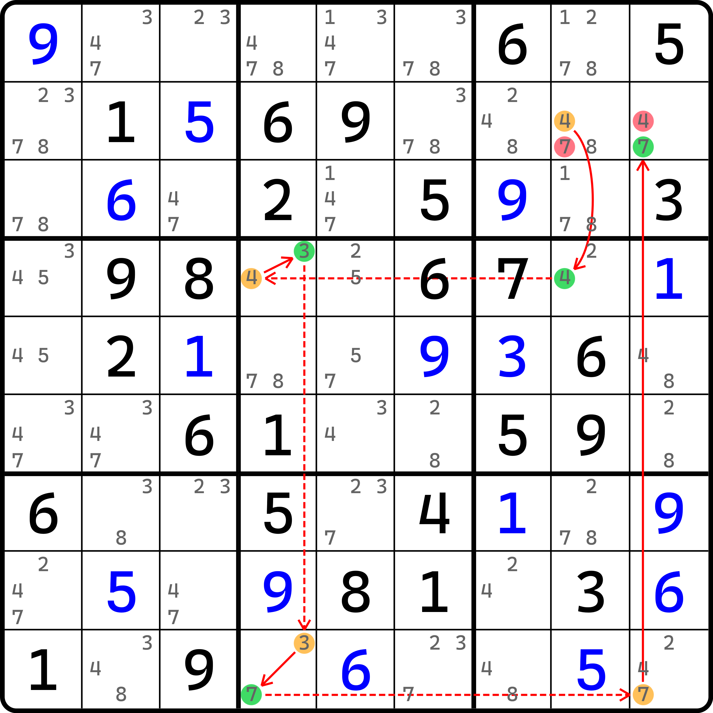
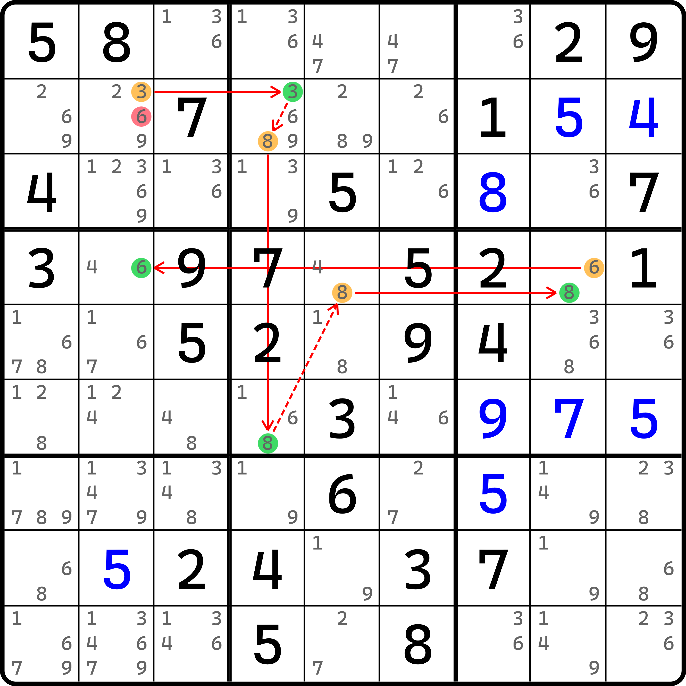

# 头尾异数链的删数规则

前文我们介绍了异数链的定义，下面我们针对于异数链的特殊情况单独作出说明。

## 头尾异数链（XY-X-Chain） <a href="#xy-x-chain" id="xy-x-chain"></a>

<figure><figcaption><p>头尾异数链</p></figcaption></figure>

如图所示，这个链的写法如下（删数部分以后就省略不写了）：

```
4r2c8=4r4c8-(4=3)r4c4-(3=7)r9c4-7r9c9=7r2c9
```

链的推理过程就不多解释了，基本都是一样的。重要的地方是看链的头部和尾部。链头是 `r2c8(4)`，而链尾是 `r2c9(7)`。他们甚至连使用的数字都不相同。

这种链其实也是有删数的。不过这里需要动脑筋想想。我们参考之前链的本质删数逻辑来理解它。链技巧的两种情况最终可以得到两个填数位置至少有一个为真，就是这里的 `r2c8(4)` 和 `r2c9(7)` 有至少一个为真。那么我们不妨看看这个链影响的范畴。

* 如果 `r2c8 = 4`，则所在的行列宫都不能再填 4；**与此同时，`r2c8` 因为填了 4 就不能填别的数了**；
* 如果 `r2c9 = 7`，则所在的行列宫都不能再填 7；**与此同时，`r2c9` 因为填了 7 就不能填别的数了**。

在之前的链里，我们并未补充说明粗体字的这一部分，因为这陈述的是客观事实，也就是废话。但是在头尾都不同数字的异数链里，这个说法会发挥一个特殊作用。首先，`r2c8 = 4` 时，`r2c8` 是不能填 7 的，而这个候选数正好也是 `r2c9` 所在的行列宫的影响范围内。换句话说，当 `r2c9 = 7` 这个情况成立时，`r2c8 <> 7` 这个情况也会成立。

我们把握住这个机会，转去看 `r2c9(4)` 其实也是满足这个规则的：对于 `r2c8 = 4` 时，显然 `r2c9 <> 4`；而对 `r2c9 = 7` 时，`r2c9` 因为填了 7 所以就不能填别的数字了，所以这里照样有 `r2c9 <> 4`。所以，对于这种链，我们的删数仍然是存在的，即 `r2c8 <> 7, r2c9 <> 4`。

我们把这种连链的头尾都使用的不同数字的特殊情况称为**头尾异数链**（XY-X-Chain）。顺着这个思路去思考，头尾异数链是可以最多删两个候选数的。**假设我们使用** $$A(a)$$ **和** $$B(b)$$ **来分别表示单元格** $$A$$ **的候选数** $$a$$ **以及单元格** $$B$$ **的候选数** $$b$$**，那么如果他们俩分别作为链头和链尾的话，那么删数最多可以有两个，一个是** $$A(b)$$**，一个是** $$B(a)$$**。**&#x8FD9;是最正式的表述。

## 不连续环（Discontinuous Nice Loop） <a href="#discontinuous-nice-loop" id="discontinuous-nice-loop"></a>

既然最多能删两个，那自然会有一些情况下只能删除一个候选数。

<figure><figcaption><p>不连续环</p></figcaption></figure>

如图所示。这个链的表述如下：

```
3r2c2=(3-8)r2c4=8r6c4-8r4c5=(6-8)r4c8=6r4c2
```

这个链的删数只有一处，即 `r2c2 <> 6`。还有一个删数位置本来是 `r4c2(3)`，但题目用了这个提示数 3 了，候选数 3 就不存在了。

我们把只能删除一个数的头尾异数链称为**不连续环**（Discontinuous Nice Loop，简称 DNL）。这么说其实是并不严谨的，因为不连续环还有一种类型，那个类型的逻辑需要依赖不连续环推理过程的另一种思路，而跟删数个数没有任何关系。这个我打算单开一篇内容介绍（虽然内容并不多）。
