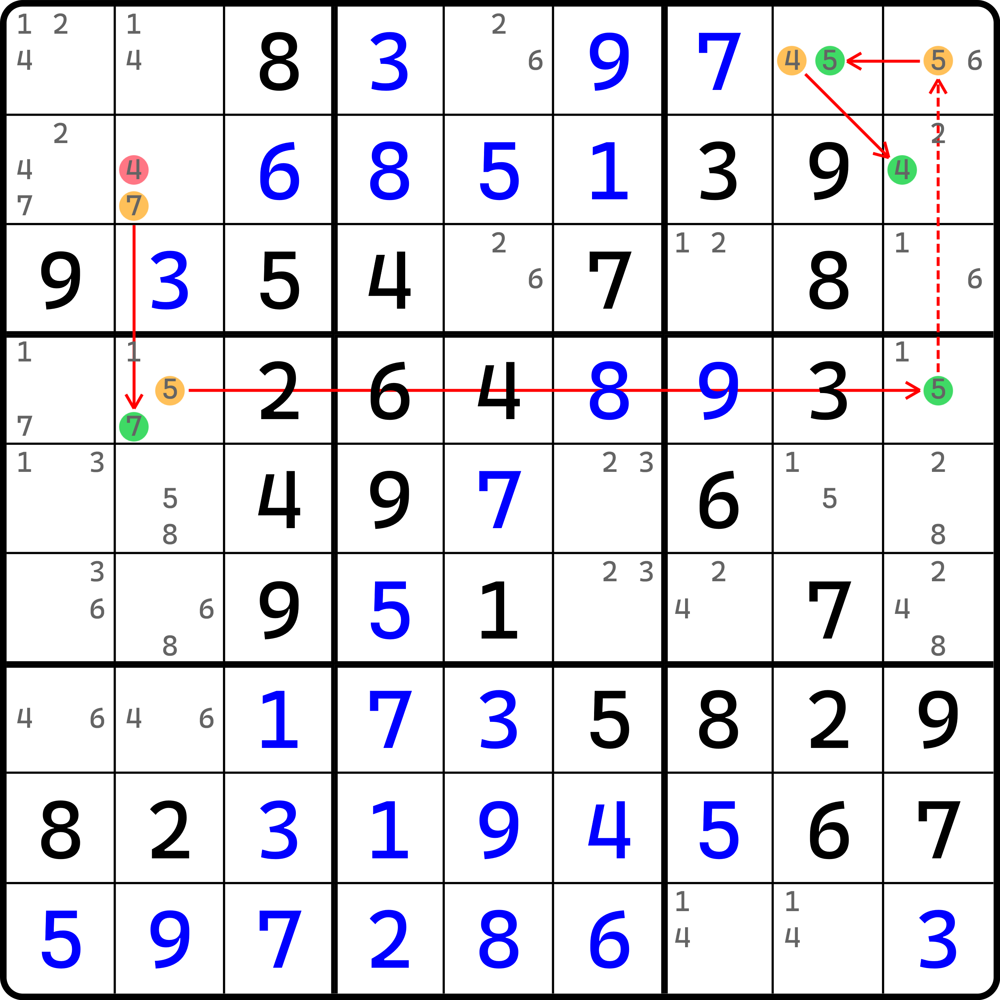
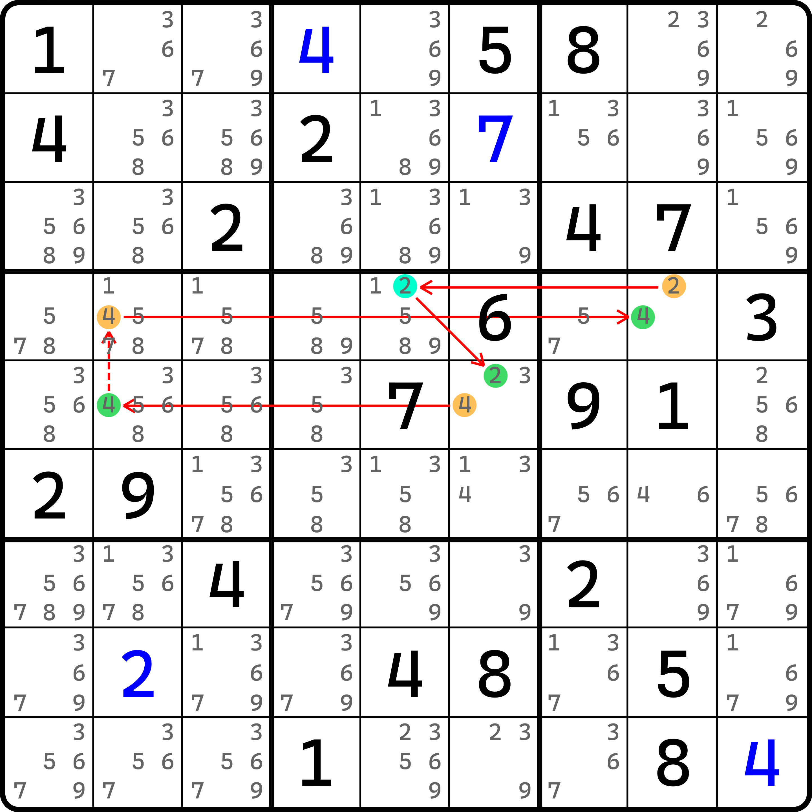
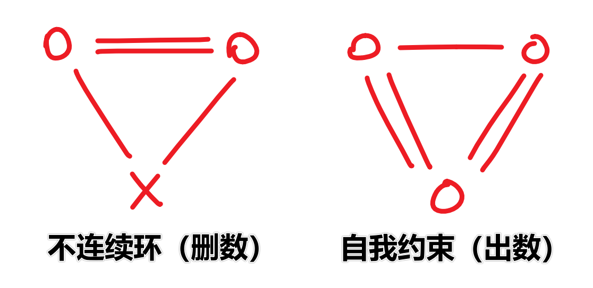

# 不连续环的两种模式

前面的内容我们介绍了不连续环技巧的逻辑。下面我们将单开一篇内容细致讨论不连续环的更多细节。

## 不连续环的本质推理 <a href="#backing-logic" id="backing-logic"></a>

<figure><figcaption><p>不连续环，一个例子</p></figcaption></figure>

如图所示。这个链的写法如下：

```
7r2c2=(7-5)r4c2=5r4c9-5r1c9=(5-4)r1c8=4r2c9
```

乍一看，它其实就是很纯粹的不连续环，头尾不同数字，且只能删一个数。不过，这次我们换一个视角去理解它。

这次我们尝试从删数开始推，用最纯粹的填数证矛盾的方式来看这个技巧。假设我们直接让 `r2c2 = 4`，于是我们顺着链头开始推：因为 `r2c2 = 4`，所以占位可以直接得到 `r2c2 <> 7`。这触发了链头为假的条件，于是链就直接不受影响地可以继续往下推理，直到末尾 `r2c9 = 4` 的结论。

然后我们就会发现问题。因为 `r2c9 = 4`，所以同一行又不能填重复的数字。但是最初我们才假设过 `r2c2 = 4`，这就造成了同一行上出现两个 4。或者换一个不太好理解的方式描述的话就是，因为 `r2c9 = 4`，所以 `r2c2 <> 4`。而 `r2c2 = 4` 是假设条件，所以假设和推导过程出现了矛盾，所以假设不成立。

总之就是，因为初始假设是 `r2c2 = 4`，它引发了矛盾，所以假设不成立。“填 4”（或者“4 为真”）是不成立的，那成立的情况自然就是“不填 4”（或者“4 为假”）这个说法了。所以，`r2c2 <> 4` 就这么被得到了。

为什么我非要强迫各位读者用一个不太好理解的方式来理解它呢？因为这个理解方式是可以“取反”的。刚才我们不是假设某个数为真，然后推矛盾得到为假的结论吗？那么不妨改写此情况，看看是否存在假设某数为假，然后推矛盾得到为真的结论。

## 自我约束（Self Constraint）

<figure><figcaption><p>自我约束</p></figcaption></figure>

如图所示。这个链的写法如下：

```
2r4c5=(2-4)r5c6=4r5c2-4r4c2=(4-2)r4c8=2r4c5
```

可以很清晰地看出，倘若我假设 `r4c5 <> 2` 时，直接有这条链，并最终把我带到 `r4c5 = 2` 上。

这很奇怪。我们刚开始假设的是 `r4c5 <> 2`，却因为链绕了一圈回到了自己，这么不填到填交替使用，最终反倒还得到了 `r4c5 = 2` 的、和初始假设条件相违背的结果。不用怀疑你自己，这个证明逻辑是没错的，链没有问题。

不过这里要说明白一个点。因为假设为假的节点绕了一圈还能回到自己，但结论却反了过来。这其实是和最初那个不连续环的证明方式完全相同，只是真假性给反了一下。当初我们得到的结果是，因为设为真才能矛盾，而这次却是设为假才能矛盾。

既然设为假能矛盾，也就意味着假设的 `r4c5 <> 2` 本质上是错误的。所以呢？所以为假是错的，那么为真才是对的呗。所以，`r4c5 = 2` 便是这条链的结论。

我们把这种，将不连续环的真假性直接取反得到的新鲜逻辑也称为不连续环，但为了和之前的不连续环区分，本教程给这个技巧单独取了个名字叫**自我约束**（Self Constraint），以和之前不连续环的那种删数模式进行对比和区分。

## 两种不连续环的模型 <a href="#models-on-two-types-of-discontinuous-nice-loop" id="models-on-two-types-of-discontinuous-nice-loop"></a>

下面我们用个简图描述出两种不连续环的构造模式。

<figure><figcaption><p>两种模型</p></figcaption></figure>

和之前一样，双实线表示的是强链，单实线是弱链。打叉记号是删数。而“自我约束”这个模式下没有删数结论，和打叉对应的位置上则变为出数结论。

左图的意思是，找到一个链，并在强链两头的这两个候选数对应删除同样的一个数；右图则是需要从出数结论推起，绕一圈回到自己。因为链是固定需要以强链关系开头和结尾的，因此我们不能等同和左图相同的方式将右图简单看成是“以弱链开头和结束并得出自身为真”。这么理解倒也没错，只是不符合本教程最初所给定的链理论的基础规则和定义，会让读者对链的理解有偏差，造成对技巧的理解有歧义，甚至是错误诠释。
