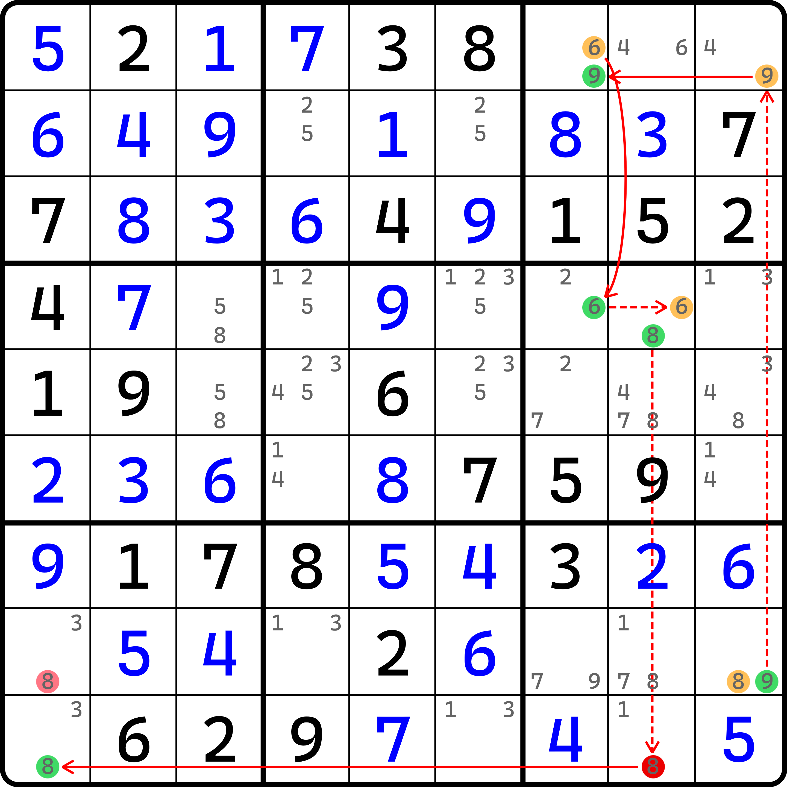
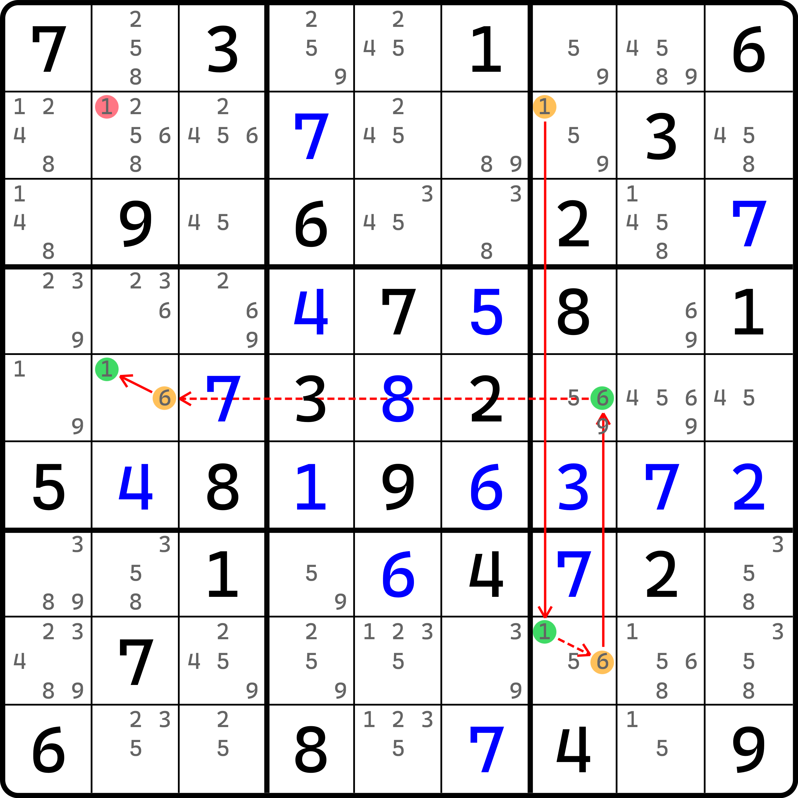
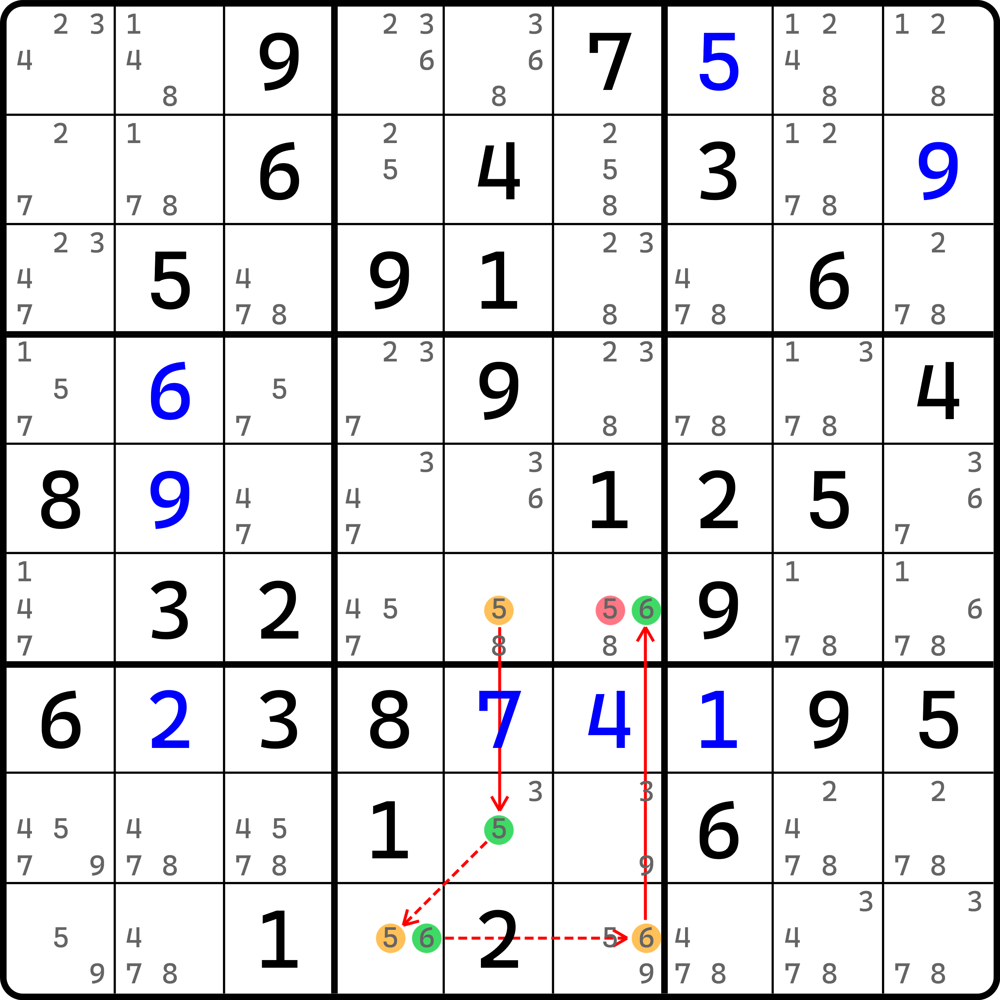
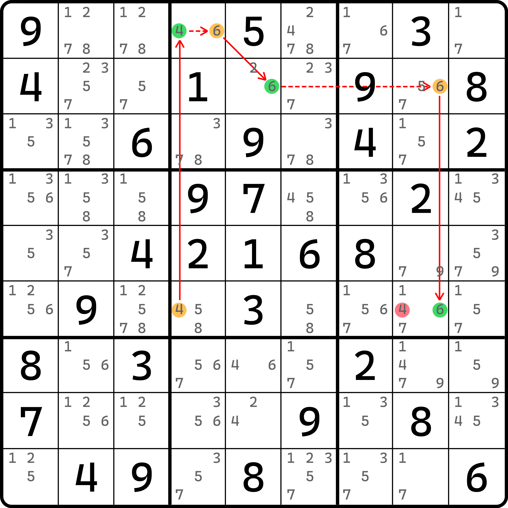
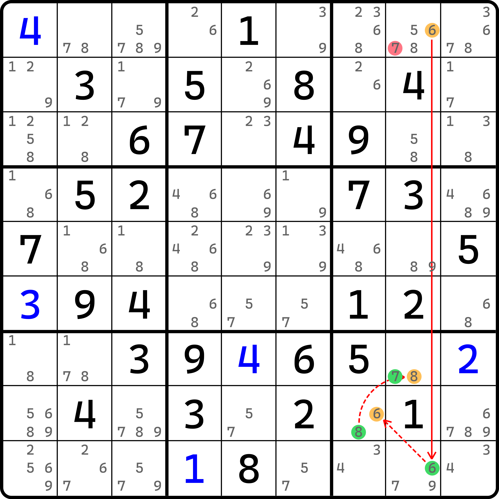
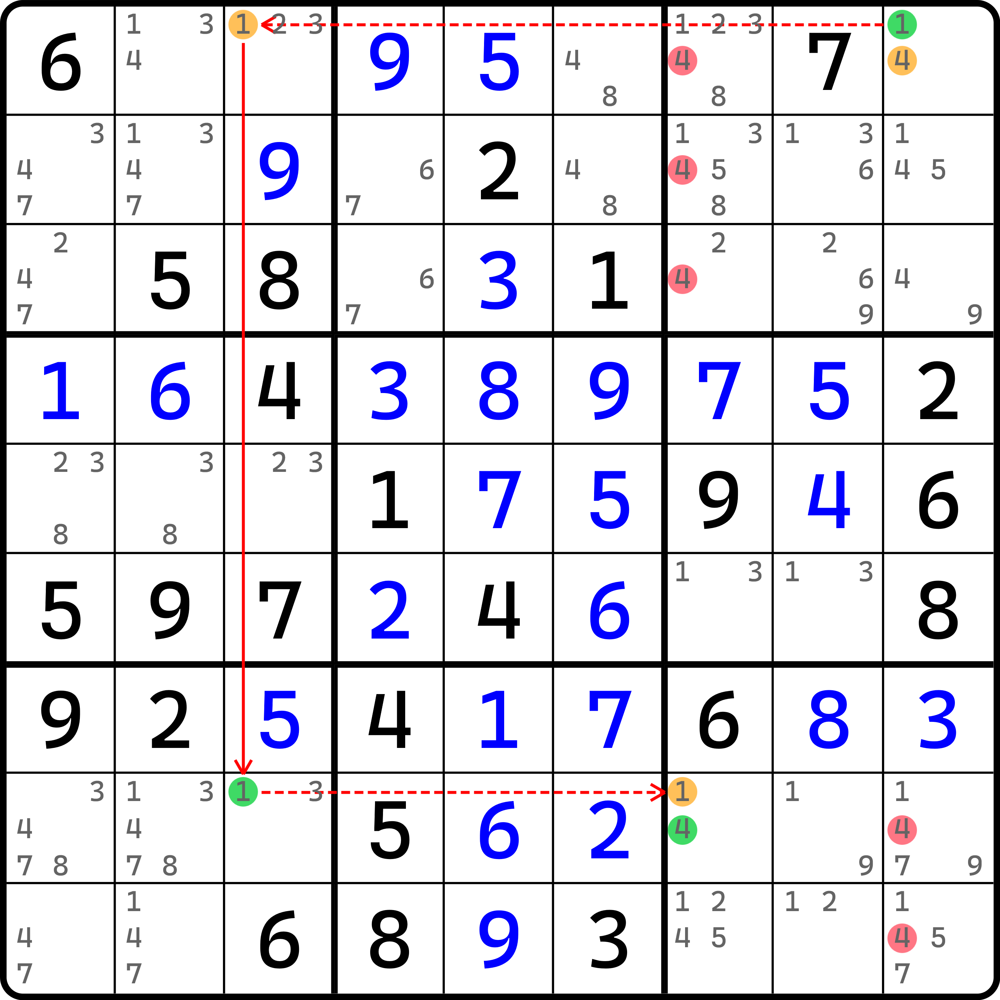
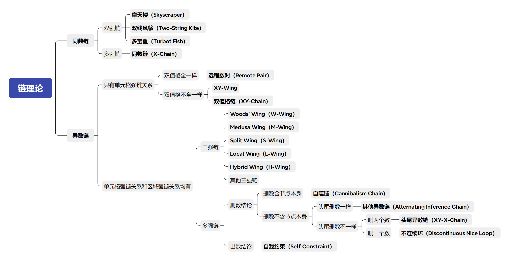

# 有技巧名的异数链

之前我们介绍了一些常见的异数链以及各种情况下的删数，下面我们来对一些常见的、有命名的异数链继续进行介绍。

## 双值格链（XY-Chain） <a href="#xy-chain" id="xy-chain"></a>

<figure><figcaption><p>双值格链</p></figcaption></figure>

如图所示。链表示如下：

```
(3=1)r6c2-(1=5)r6c4-(5=8)r9c4-(8=9)r8c6-(9=3)r8c9
```

可以看到，这是一个非常巧妙的链——它的所有强链关系均落在了单元格里。我们把这种链称为**双值格链**（XY-Chain）。

## 远程数对（Remote Pair） <a href="#remote-pair" id="remote-pair"></a>

### 基本推理 <a href="#reasoning-of-remote-pair" id="reasoning-of-remote-pair"></a>

<figure><figcaption><p>远程数对</p></figcaption></figure>

如图所示。由于这个技巧比较特殊，所以请暂且允许我省略掉所有的强弱链的箭头。链的写法如下：

```
(2=8)r7c8-(8=2)r2c8-(2=8)r2c6-(8=2)r4c6-(2=8)r4c7-(8=2)r5c9-(2=8)r5c4-(8=2)r8c4
```

如果你只看文本表示的话，你会发现它其实就是特殊一些的双值格链。不过这未免也太特殊了点，所有的双值格居然用的是完全相同的两种数字，这使得链的强链永远都是 2 和 8 两种数字在交替进行。

最后，因为头尾都是 2，所以……欸不对啊。怎么图上删数会这么多？不应该只有 `{r7c5, r8c79} <> 2` 吗？

这就要提及这个技巧的一些特殊性质了。

### 特殊性质 <a href="#features-of-remote-pair" id="features-of-remote-pair"></a>

这个技巧叫**远程数对**（Remote Pair）。听名字就可以看出，它其实跟数对这个技巧有一定的关系。由于它只涉及全盘若干完全一样的双值格，所以我们甚至可以采用之前欠一数组和烟花数组那样的字母假设来看这个技巧。于是我们就有了这样的结果：

<figure><figcaption><p>远程数对，但是代数视角</p></figcaption></figure>

我们从起头的单元格 `r7c8` 开始假设字母，并顺着链用到的单元格逐个进行交替字母的填充。其中 $$a$$ 和 $$b$$ 都是 2 和 8 里的数，不过 $$a \ne b$$。

于是我们就会在这若干个单元格里得到几组不同的跨区数对：

* `r2c8` 和 `r4c7` 是跨区数对；
* `r5c9` 和 `r7c8` 是跨区数对；
* `r7c8` 和 `r8c4` 是跨区数对。

这里并未全部列举。比如 `r4c7` 和 `r8c4` 也是跨区数对，之类的。不过，我们拥有这几组跨区数对后，删数自然就能新增不少。

* `r2c8` 和 `r4c7`：掌管 `r13c7 <> 28`；
* `r5c9` 和 `r7c8`：掌管 `r78c9 <> 28`；
* `r7c8` 和 `r8c4`：掌管 `{r7c5, r8c79} <> 28`。

所以把他们全部放一起，就有了图中的这些位置的删数，这就是远程数对的一大非常重要的特征：**按链的次序，以单元格为单位假设其字母** $$a$$ **和** $$b$$ **交替填入，就会产生若干跨区数对。这些跨区数对不一定都有用，但最终全部产生的删数联立起来就是这个技巧的删数了。**

不过，它还有一些其他的结论，例如**远程数对可以拆解为两条同数链**、**远程数对存在两种不同的连接方式**之类的。不过因为没有什么实质性的影响删数和推理的信息，就留给各位自己私下理解了，这里就不细致阐述了。

## 自噬链（Cannibalism Chain） <a href="#cannibalism-chain" id="cannibalism-chain"></a>

前面的内容我们介绍了各种各样的链，下面我们来看一个删数涉及链节点的情况。

<figure><figcaption><p>自噬链</p></figcaption></figure>

如图所示，这个链的写法如下：

```
(8=9)r8c9-9r1c9=(6-9)r1c7=6r4c7-(6=8)r4c8-8r9c8=8r9c1
```

很显然，它的删数应该是头尾的交集。头是 `r8c9(8)`，尾是 `r9c1(8)`。他们的交集自然就是 `r8c1(8)` 和 `r9c8(8)` 了。不过这里要注意一个问题。就是这个 `r9c8(8)` 是链的一部分，它能删除吗？一旦被删除，这个链立马就不完整了，那删数还成立吗？

显然，这个删数也是成立的。因为我们得出删数结论之前，链的其中这个节点 `r9c8(8)` 并未删除，所以链能够作为我们使用和推理的其中一环。其次，就算退一万步讲，它已经被删除且已经不在题目里了，而因为我们知道 `r9c8(8)` 因为题目初始的提示数并不能影响到 `r9c8(8)`，因此它初始情况下就是存在的，自然我们就可以学残缺唯一矩形那样把这个候选数给补回去，那么链仍然是成立的。

不管怎么说，这个候选数都是先作为链的一部分，然后引导链成立，最终删除掉，删除逻辑是在链成立之后出现的，所以可以用作删数。我们把这种链称为**自噬链**（Cannibalism Chain）。“自噬”这个词语之前早在拓展矩形里就出现过，不过因为作为术语还需要等以后才能介绍，所以本质上是属于超前就出现了。

## 其他杂七杂八的 wing <a href="#miscellaneous-wing" id="miscellaneous-wing"></a>

之前我们介绍了一堆 wing 技巧，什么 XYZ-Wing 啊、W-Wing 这些。实际上，wing 作为一个系列取名，还有其他的 wing。只不过，前面介绍的可以直接拿来通过分支进行直接推理；但下面要介绍的内容都不能直接推理，必须依赖链的逻辑。

可能你一头雾水。什么叫“可以直接推理”？实际上，XY-Wing、W-Wing 这两个技巧是可以转为链的视角进行理解的，而 XYZ-Wing 这些虽然本身不能直接转化为链，但因为它隶属于 XY-Wing 的分支逻辑进行推广，所以之前介绍的那部分的 wing 是有自己的独特视角的；本质上来看 XY-Wing 和 W-Wing 这俩仍然属于链。

下面我打算把剩下的几种取名看起来非常“混乱”的 wing 一并放到这里说。名字并不重要，记不住也没关系，只是为了让你能知道它是 wing 系列的内容。

### M-Wing <a href="#m-wing" id="m-wing"></a>

<figure><figcaption><p>M-Wing</p></figcaption></figure>

如图所示。链表述如下：

```
1r2c7=(1-6)r8c7=6r5c7-(1=6)r5c2
```

这个叫 **Medusa Wing**，简称 **M-Wing**。好比是把 W-Wing 里头尾相同的双值格的其中一个从强链关系改成了弱链关系，然后嵌入到链的中间某个位置，然后因为变为弱链关系了所以又允许往这个单元格增加其他候选数。

### S-Wing <a href="#s-wing" id="s-wing"></a>

<figure><figcaption><p>S-Wing</p></figcaption></figure>

如图所示。链的表示如下：

```
5r6c5=5r8c5-(5=6)r9c5-6r9c6=6r5c6
```

这个叫 **Split Wing**，简称 **S-Wing**。用到三个强链关系和 6 个候选数，其中前三个候选数是相同的，后三个候选数是相同的。

### L-Wing <a href="#l-wing" id="l-wing"></a>

<figure><figcaption><p>L-Wing</p></figcaption></figure>

如图所示，表示如下：

```
4r6c4=(4-6)r1c4=6r2c5-6r2c8=6r6c8
```

这个叫 **Local Wing**，简称 **L-Wing**。前面两个候选数是一样的，后面四个候选数是一样的。

### H-Wing <a href="#h-wing" id="h-wing"></a>

<figure><figcaption><p>H-Wing</p></figcaption></figure>

如图所示。链写法如下：

```
6r1c8=6r9c8-(6=8)r8c7-(8=7)r7c8
```

这个叫 **Hybrid Wing**，简称 **H-Wing**。H-Wing 说起来会复杂一些，它虽然只用三个强链关系，但会用到三种不同的候选数。三种候选数还有使用次数的要求。比如你看这个链里，按照链的次序依次出现的候选数数字是 6、6、6、8、8、7，编排数字的出现次数分别是 3 次、2 次和 1 次。H-Wing 对这个编排数字的出现次数有要求，要么出现次数是 1 次、2 次和 3 次，要么是 1 次、3 次和 2 次。总之就是很奇葩。

### XY-Wing 和 W-Wing 的链视角 <a href="#chain-view-of-xy-wing-and-w-wing" id="chain-view-of-xy-wing-and-w-wing"></a>

在早期的内容里，我们对 wing 的各种结构进行了介绍。实际上，XY-Wing 和 W-Wing 这两种技巧都是可以改成链的理解方式来进行理解的。

比如，这是一个 XY-Wing：

<figure><figcaption><p>XY-Wing，但是链画法</p></figcaption></figure>

如图所示。其实就是把拐点 `r4c1` 的两种分支情况，其中一个给反了个方向，并纳入链的假设，就这么简单。

再来看看 W-Wing。

<figure><figcaption><p>W-Wing，但是链画法</p></figcaption></figure>

如图所示。这是 W-Wing 的画法。也是讨论的 `c3` 改造成了强链关系。大体上跟 XY-Wing 的改法差不多。

### 各种 wing 的链的写法 <a href="#conclusion-of-miscellaneous-wing-patterns" id="conclusion-of-miscellaneous-wing-patterns"></a>

我相信你肯定记不住前面列举的这些东西。记不住真没关系，也不需要你记住他们。我这里再列一个表来列举他们的链的文本写法，可以用于对照。

<table><thead><tr><th width="93.33319091796875">技巧</th><th width="292.0001220703125">结构（尤里卡记号）</th><th width="100">单元格数量</th><th>是否对称</th><th>是否头尾异数</th></tr></thead><tbody><tr><td>XY-Wing</td><td><span class="math">(a=b)A-(b=c)B-(c=a)C</span></td><td>3</td><td>❌</td><td>❌</td></tr><tr><td>W-Wing</td><td><span class="math">(a=b)A-bB=bC-(b=a)D</span></td><td>4</td><td>⭕</td><td>❌</td></tr><tr><td>M-Wing</td><td><span class="math">(a=b)A-bB=(b-a)C=aD</span></td><td>4</td><td>❌</td><td>❌</td></tr><tr><td>S-Wing</td><td><span class="math">aA=aB-(a=b)C-bD=bE</span></td><td>5</td><td>⭕</td><td>⭕</td></tr><tr><td>L-Wing</td><td><span class="math">aA=(a-b)B=(b-c)C=cD</span></td><td>4</td><td>❌</td><td>⭕</td></tr><tr><td>H-Wing</td><td><span class="math">(a=b)A-bB=(b-c)C=cD</span><br><span class="math">(a=b)A-(b=c)B-cC=cD</span></td><td>4</td><td>❌</td><td>⭕</td></tr></tbody></table>

看出他们的共性了吗？是的，wing 类型的技巧都只用三个强链。

## 错误翻译导致的误会 <a href="#misinterpretion-on-y-wing" id="misinterpretion-on-y-wing"></a>

在中国，Y-Wing 经常被当成是 W-Wing 的别名；而在外国，Y-Wing 则是被看成 XY-Wing 的别名。这里讲一下为什么中国的 W-Wing 有个别名 Y-Wing。从历史上讲，这其实是误传所致。

先来说 XY-Wing 和 Y-Wing。为什么这俩是简称的关系呢？这里要提一下 X 和 Y 在链里的意思是这样的：

* **X 关系**（X-Rule）：两个数具有强链关系，且位于同一个区域下；
* **Y 关系**（Y-Rule）：两个数具有强链关系，且位于同一个单元格里。

对于链的强链关系只涉及 X 关系的就称为 X 关系链，也就是我们之前看到的 X-Chain（同数链）；而对于强链关系只涉及 Y 关系的链则称为 Y 关系链，也就是之前看到的 XY-Chain（即双值格链）。在双值格链里，因为每一个单元格都只有两个候选数，这一点符合 XY 作为未知数理解下的命名，所以双值格链的英文名 XY-Chain 是这么来的；而对于“Y 关系”的这个 Y，更多是出自于“强链的位置关系位于同一个单元格”这个角度去定义的。虽然 Y 在这两种名称定义下含义是不同的，但他们均对应到了同一个技巧上，所以 XY-Chain 从命名上讲，那它也就是 Y-Chain 了。

同理，因为 XY-Wing 只用到三个双值格，所以它其实是 XY-Chain 的一种特例状态（最少单元格数量的双值格链）。所以，XY-Wing 被称为 Y-Wing 也就显得非常合理了。

接着，在早期，前面提及的这些能用链视角来理解的这些各种 wing 在老外的数独论坛（圈子）里也有被称为是叫 Y-Wing Style 的。也就是说，这些所谓的 wing，他们都跟 Y-Wing 的“三个强链”的规则完全一致，属于同一个体系的技巧，所以就拿最常见的 Y-Wing（也就是 XY-Wing）作为代表，称呼这个系列的技巧。很显然，W-Wing 因为定义上符合三个强链，所以也属于这个分类。不过在国内，因为当初理解和对文字的诠释有问题，并最终导致了这个错误，下意识以为 W-Wing 和 Y-Wing 是一个东西了。

这便是技巧名称误传的根本原因。

> X-Wing 是二阶鱼，看起来似乎跟 XY-Wing 的逻辑也不沾边。但是在之后的内容我们会提到，X-Wing 也是有链的视角的，而 X-Wing 命名从根本上没有取一个鱼的名字（反倒是有个 wing 的名字），它的真正原因还是在于 X-Wing 这个技巧比鱼体系诞生要早，所以它比较特殊。它的链的视角也确实比较特殊，而且现在讲有些超纲，因此我们以后再对这个技巧进行补充说明。

## 总结 <a href="#phased-conclusion" id="phased-conclusion"></a>

至此，同数链和异数链的内容就介绍完了。下面我们对目前我们学到的链总结一下。

<figure><figcaption><p>链的分类（第一阶段结束）</p></figcaption></figure>

图片里整理了前面全部学过的、有技巧名称的链的类型，以及他们划分的分类。这个图以后还会继续往后延伸。链是一个非常庞大的体系，所以我们还不能掉以轻心。
