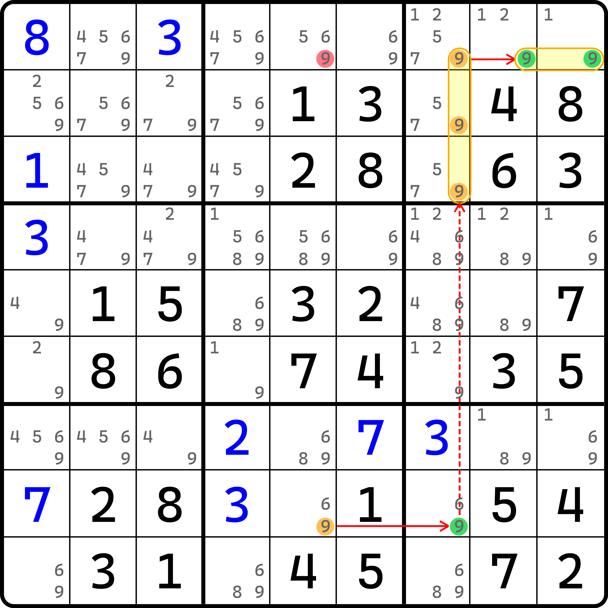
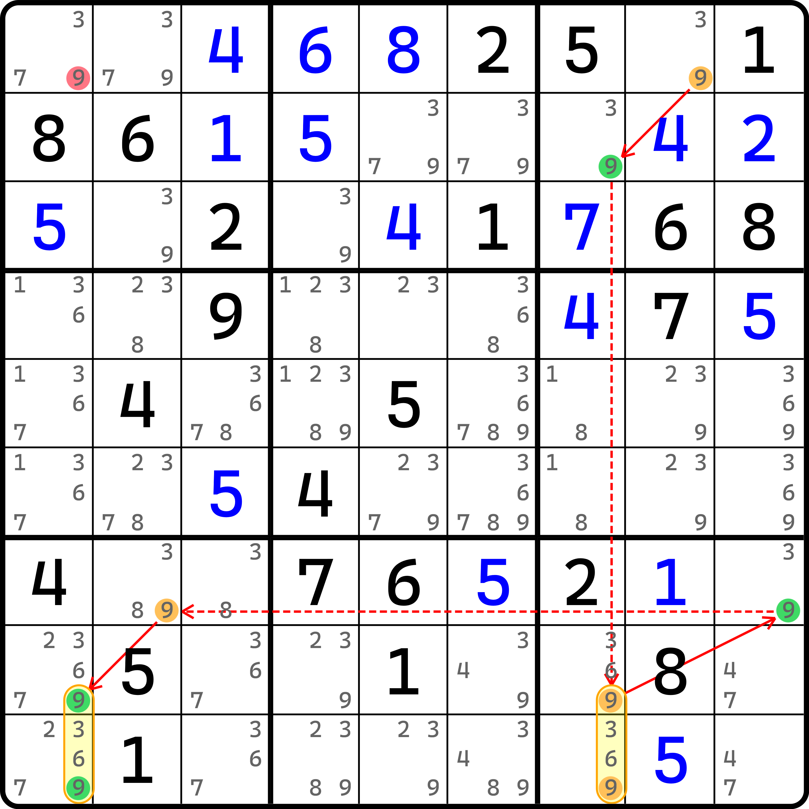
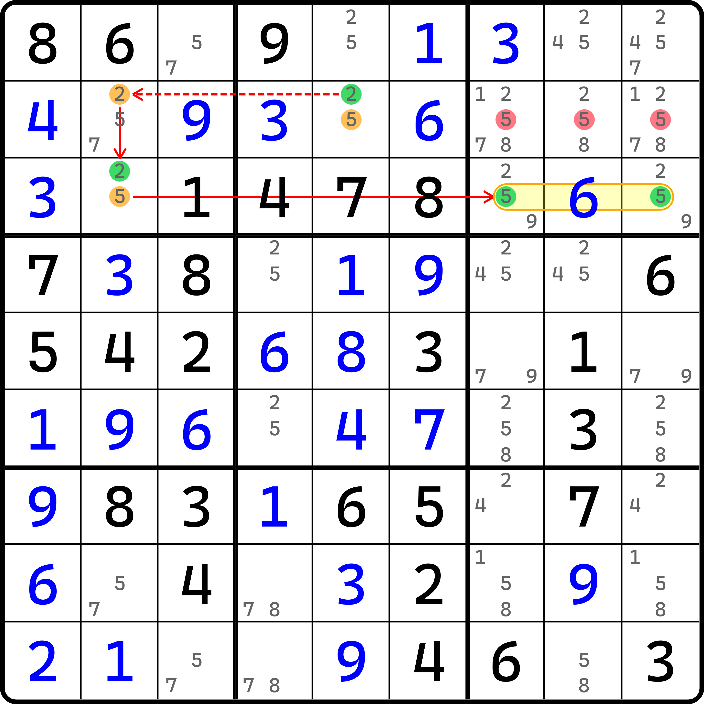
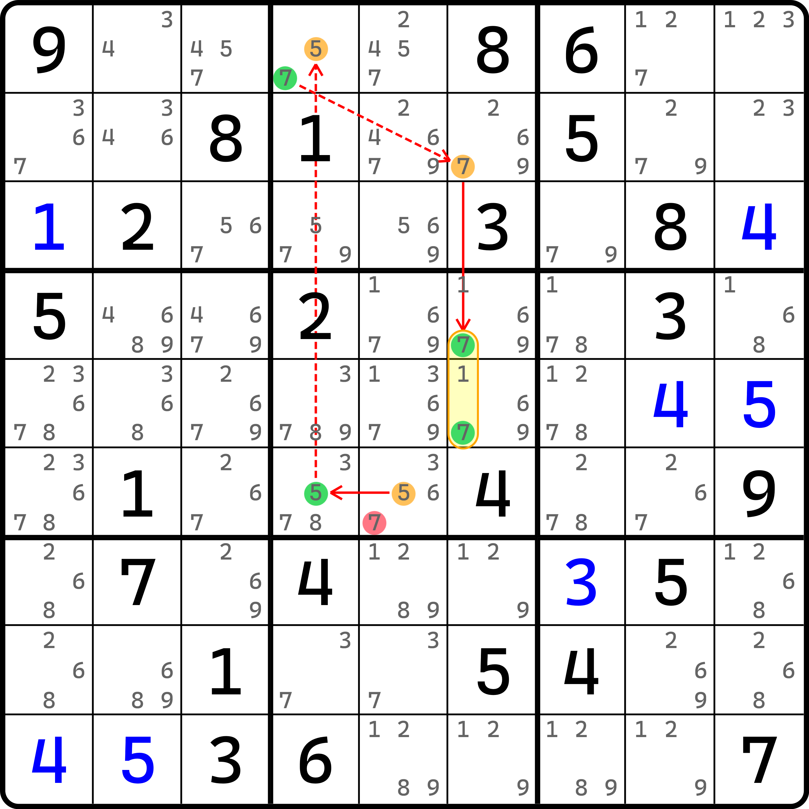
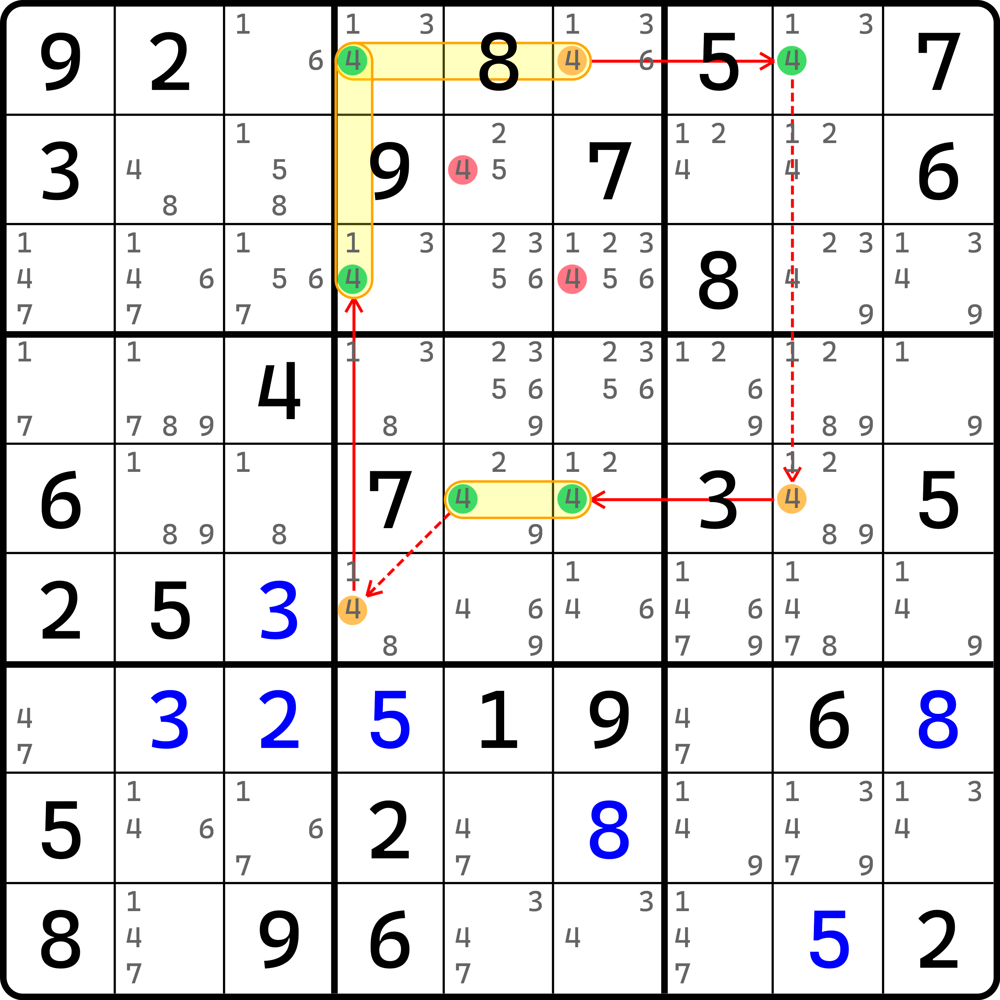

# 区块链

之前的内容我们介绍了基础的强弱链关系的推理过程，以及他们产生的各种链的形式。本文将继续针对链理论进行展开，不过这次我们会把强弱链关系从单个候选数之间的关系推广到一组候选数之间的关系。

## 空矩形（Empty Rectangle） <a href="#empty-rectangle" id="empty-rectangle"></a>

<figure><figcaption><p>空矩形</p></figcaption></figure>

如图所示，这是一个链，只不过这个链的长相比较特殊一些。这要怎么推理呢？

前面的 `r8c5(9)` 和 `r8c7(9)` 的强链关系和之前一样就不多解释了。主要是从 `r8c7(9)` 开始稍微不一样。这里我们暂时可以认为是“逻辑上因为 `r8c7 = 9` 导致了 `r123c7 <> 9` 的结论”，所以 `r8c7(9)` 可以同时跟 `r1c7(9)`、`r2c7(9)` 和 `r3c7(9)` 都成为弱链关系。因为他们均是弱链关系（或者说可以同时得到 `r123c7(9)` 为假的情况），那么我们干脆就拿着这三个删数结论继续往后推。

因为 `b3` 只有 5 个位置可以填 9，而其中的 3 个位置被刚才的结论给排除掉了，所以我们可以认为 `r1c89(9)` 此时是必须有其中一个候选数为真的（也就是这是个区块的意思）。那么我们就可以理解为是因为 `r8c5(9)` 为假时，可以得到 `r1c89(9)` 的区块成立。

因为链还有一个情况是 `r8c5(9)` 为真，所以联立两个情况，最终可以得到一个结论是要么开头这个单元格 `r8c5` 填 9，要么最后这个 `r1c89(9)` 区块为真。

虽然我们还不知道如何表述成链，但是我们得到了类似链应该有的结论，删去头尾的交集。只不过结尾是一个区块。当区块成立时，应按区块的方式删数，所以就是所在行和所在宫的其他单元格的候选数 9；而开头那个就不说了。

那么联立起来可以得到，交集此时只有 `r1c5(9)` 这一个候选数。所以，这个题的结论就是 `r1c5 <> 9`。

我们把这个技巧称为**空矩形**（Empty Rectangle，简称 ER）。下面我们针对于空矩形的结构继续说明一下区块的部分。

## 区块节点的真假性 <a href="#states-on-grouped-node" id="states-on-grouped-node"></a>

前面的空矩形让我们暂且知道了推理的大致逻辑，只不过这里有一些我们还不够“体系化”去整理出来的地方。

先是，怎么用链的形式表示它。要表示成链，那么我们首先需要把这个结构的 `r123c7(9)` 和 `r1c89(9)` 理解一下。这里我们介绍一下**区块节点**（Grouped Node），并且把带有区块节点的链称为**区块链**（Grouped Chain）。

区块节点指的是一个节点并非只用一个候选数，而是一组候选数。比如这里的 `r123c7(9)` 和 `r1c89(9)`。而之所以把他们俩设置为区块节点是有原因的。下面我们来说一下区块节点的真假性和强弱关系的定义。

* **区块节点为真**：区块成立，这一组候选数里至少有一个候选数最终为真；
* **区块节点为假**：区块不成立，这一组候选数的所有候选数均为假。

“区块节点为真”是比较好理解的，这个说法和我刚才说 `r1c89(9)` 的区块成立是一个效果。主要是“区块节点为假”为什么要这么定义。其实稍微思考一下就可以理解，因为它就是为真的反面情况。“至少有一个候选数为真”可以描述为“有 $$\ge 1$$ 个候选数为真”。既然都 $$\ge 1$$ 了，那么反面情况只能是 $$= 0$$ 了，毕竟不能小于 0。

既然有区块节点的真假性定义了，下面强弱链关系就可以把区块节点也纳入进来了。如果我们把这里 `r123c7(9)` 和 `r1c89(9)` 视为链的节点的话，那么这个链就符合了我们前面推导的所有逻辑了。也就是说，前面那条链的写法是这样的：

```
9r8c5=9r8c7-9r123c7=9r1c89
```

其中的 `9r8c7-9r123c7` 是因为 `r8c7(9)` 为真时，可得到 `r123c7(9)` 这个节点里所有候选数全为假，故此时满足“`r123c7(9)` 为区块节点时为假”的定义；与此同时，因为这个区块节点为假，所以可直接得到 `r1c89(9)` 为区块成立的情况，所以又可以得到这个区块符合“区块节点为真”的定义。

所以，这么定义是合适的，逻辑也是无懈可击的，因此结论就可以正常得到。只是说，因为区块节点作为了链尾，所以需要在判断删数交集时要找准位置。

顺带一提，空矩形技巧指的是同数的双强链，且其中有一个强链的两头是同一个宫里的区块节点强链。当这个区块节点的强链都不是区块后，这个技巧会退化为多宝鱼。

## 来看一些真正的例子 <a href="#basic-examples" id="basic-examples"></a>

下面我们来看一些真正的例子。&#x20;

### 同数区块链（Grouped X-Chain） <a href="#grouped-x-chain" id="grouped-x-chain"></a>

<figure><figcaption><p>同数区块链</p></figcaption></figure>

如图所示。这个链的写法如下：

```
9r1c8=9r2c7-9r89c7=9r7c9-9r7c3=9r89c1
```

可以看到，这是一个很普通的链，只不过是同数链。按照删数逻辑来看，就是链的两端的删数的交集。从前面的知识点里我们知道，它的删数肯定是 `r1c1(9)`，所以这个题的结论就是 `r1c1 <> 9` 了。

我们把这个技巧称为**区块同数链**或**同数区块链**（Grouped X-Chain）。当然，前面的空矩形就属于是同数区块链的其中一个特例。

### 异数区块链（Grouped Alternating Inference Chain） <a href="#grouped-alternating-inference-chain" id="grouped-alternating-inference-chain"></a>

下面再给各位看一个普通的例子。

<figure><figcaption><p>异数区块链</p></figcaption></figure>

如图所示。这条链表示如下：

```
(5=2)r2c5-2r2c2=(2-5)r3c2=5r3c79
```

可以从链结构看出，这是一个异数链；而因为它用了区块节点，所以是**异数区块链**（Grouped Alternating Inference Chain，简称 GAIC）。

我觉得这种技巧的基础逻辑已经说够了。下面我们将针对于区块链的特殊删数逻辑进行描述。

## 特殊删数规则 <a href="#special-rule-on-elimination" id="special-rule-on-elimination"></a>

对于区块链而言，因为它的区块节点的特殊性，所以删数有时候会不太好理解。下面我们继续讨论区块链的一些特殊样貌。

### 区块不连续环（Grouped Discontinuous Nice Loop） <a href="#grouped-discontinuous-nice-loop" id="grouped-discontinuous-nice-loop"></a>

<figure><figcaption><p>区块链</p></figcaption></figure>

如图所示。这个链的逻辑如下：

```
5r6c5=5r6c4-(5=7)r1c4-7r2c6=7r45c6
```

可以看出，这是一个头尾异数链；而因为删数只有一个，所以是不连续环；而又因为这里用到了区块节点，所以是**区块不连续环**（Grouped Discontinuous Nice Loop，简称 GDNL）。

先别急。推理过程是很好理解的，这里不好理解的是删数。下面我们针对于删数说明一下，为什么这个头尾异数的时候，删这个候选数。

首先我们可以知道的是，区块链的删数仍然是看头尾的交集。这里我们必须分两种情况讨论：

* 如果 `r6c5 = 5`，则 `r6c5` 因为占位填了数所以其余候选数都可以删除，所在行列宫的其余候选数 5 也可以删数；
* 如果 `r45c6(7)` 区块成立，则所在列和所在宫的其余候选数 7 都可以删除。

在当 `r6c5 = 5` 时，因为占位填了数字，所以 `r6c5(7)` 是满足删除条件的；而对于 `r45c6(7)` 而言，`r6c5(7)` 也属于是可以排除的范围，所以这个删数是可以的；但是，还有其他删数吗？

可能你会问，对于 `r45c6` 这两个单元格而言，假设候选数 5 是存在的，那还能删吗？实际上也是不能的。因为在当 `r45c6(7)` 区块成立的时候，能排除的范围其实压根就没有 5 什么事情，因为它是一个 7 的区块；其次，从更贴近区块本质的理解来看的话，因为这个区块的本质是“至少有一个单元格填 7”，而你并不能确保具体是哪一个位置，所以也就不可能知道 5 的删数是否真正意义上成立。

### 节点重叠（Node Collision） <a href="#node-collision" id="node-collision"></a>

<figure><figcaption><p>节点重叠</p></figcaption></figure>

如图所示。这个链的表述如下：

```
4r1c46=4r1c8-4r5c8=4r5c56-4r6c4=4r13c4
```

这是一个比较特殊的同数区块链——它的头尾的两个区块节点“避无可避”地用上了同一个候选数 `r1c4(4)`。不仅我们无法规避这个情况，而且它的删数也是个问题。

从基础的推理我们可以轻松得到 `{r2c5, r3c6} <> 4` 两个删数。但我们并不打算关心他俩，而是 `r1c4(4)`。试问各位，这个 `r1c4(4)` 能否删除？

答案是不能的。因为我们只能得到 `r1c46(4)` 区块和 `r13c4(4)` 区块的其中至少一个区块成立。而如果我尝试故意让 `r1c4 = 4`，从定义上讲，它同时满足了两个区块成立的情况，这就使得两个区块节点同时为真了。但是，在之前我们就强调过，链的头尾是可以同时为真的，所以“两头的区块节点同时为真”的情况并不应该被我们忽略掉，甚至是视为错误的说法。因此，这个交叉重叠的点位 `r1c4(4)` 并不能被我们删除。

我们把这个链的头尾共用同一个或同几个候选数的链称为**节点重叠**、**区块重叠**或**区块撞车**（Node Collision）。尤其要注意的是，重叠的部分是不能删除的。

不过要注意的是，当且仅当链的头尾才有可能出现这种情况。对于强弱链关系在链的中间某一截的时候，这种重叠现象是可以避免的，或者说可以不看成重叠的状态的。比如说之前的空矩形技巧。

### 节点重叠只会发生在不相邻的节点上 <a href="#node-collision-can-only-be-appeared-in-not-adjacent-nodes" id="node-collision-can-only-be-appeared-in-not-adjacent-nodes"></a>

之前的空矩形我们是将它在 `b3` 的部分看成了两个区块的强链关系。不过我估计也有对推理比较敏感的朋友可能会把这两个区块直接看成 `r123c7(9)` 和 `r1c789(9)` 这两个区块节点之间的强链关系。

这其实也没有问题，甚至可以说也是完全正确的强链关系。因为当 `r123c7(9)` 区块节点为假时，`r1c89(9)` 是为真的。而 `r1c7(9)` 虽然此时隶属于 `r123c7(9)` 这个区块节点，所以它此时是为假的，但是把他也纳入 `r1c89(9)` 构成 `r1c789(9)` 时也不会影响这个区块为真的成立，因为我们说的是 `r1c89(9)` 里有一个 9 是为真的，而 `r1c789(9)` 只是含了一个不相关的单元格而已。它的真假我们并不需要关心，因为我们已经知道，这三个候选数整体肯定会有至少一个 9 为真的状态成立，也就是说三个候选数看成整体后，仍符合区块节点为真的说法。所以，此时我们“强行”视为一起的情况，进而故意构造出重叠的现象也是不影响区块链成立与否的。

不过，与其说不影响成立与否，倒不如说这么做反而会导致链的理解成本变高，所以不建议这么做。真有避无可避的重叠情况出现了，那么它一般也只会出现在两个并未直接通过强弱关系相连的、相邻两个节点上。比如说链的头尾。

至此我们就把区块链的内容全部结束了。下一节我们将进入到更复杂的链理论的学习。
