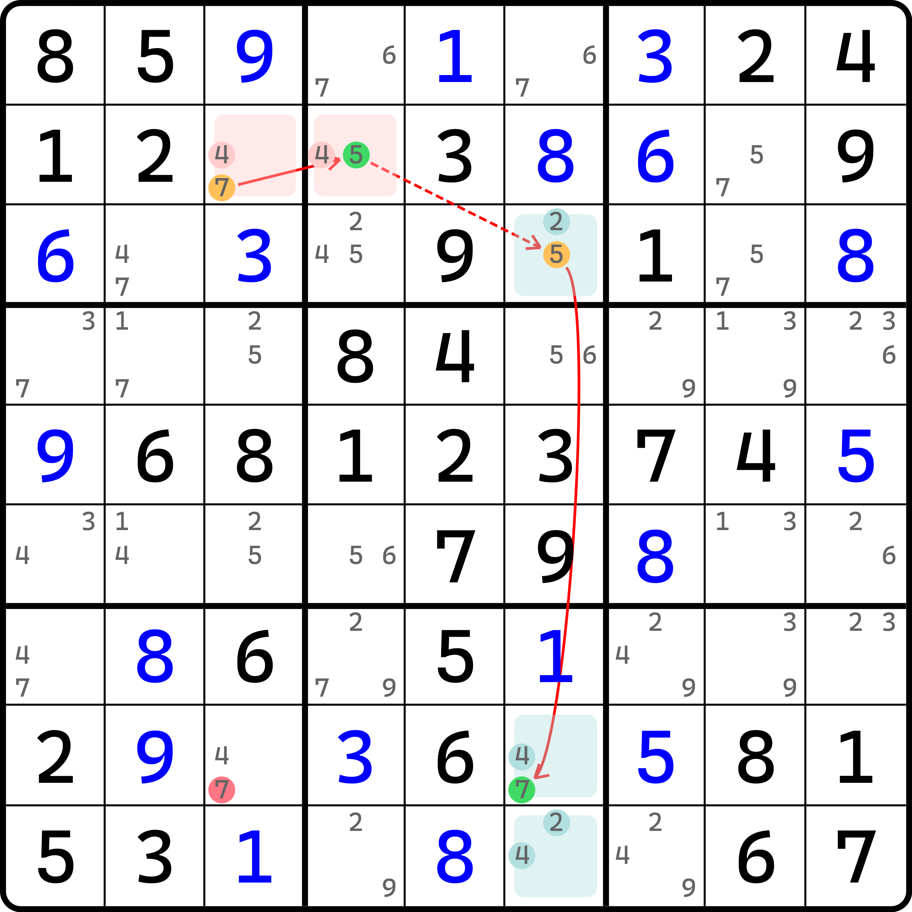
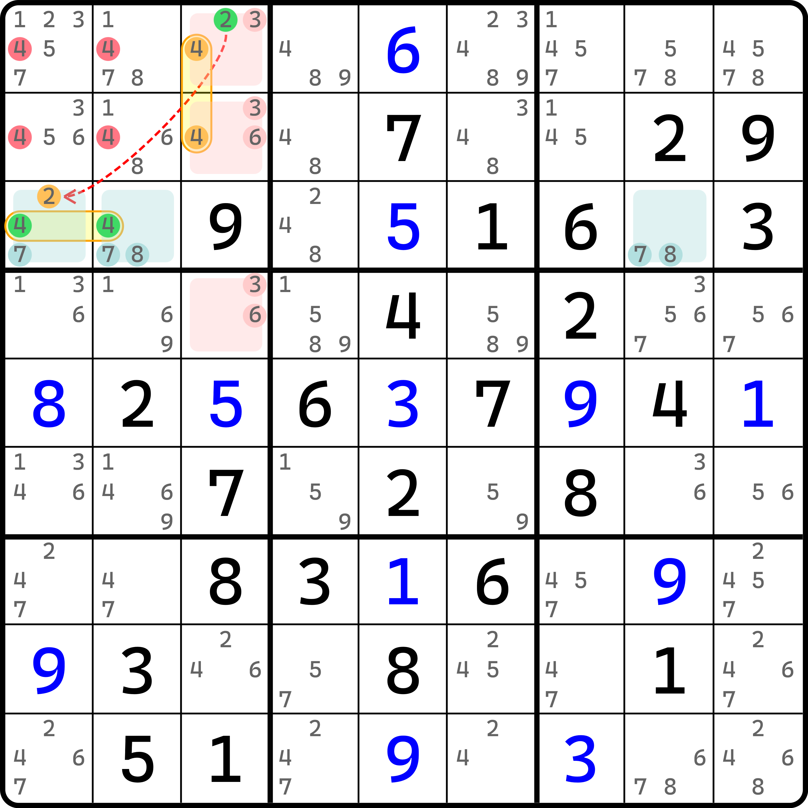
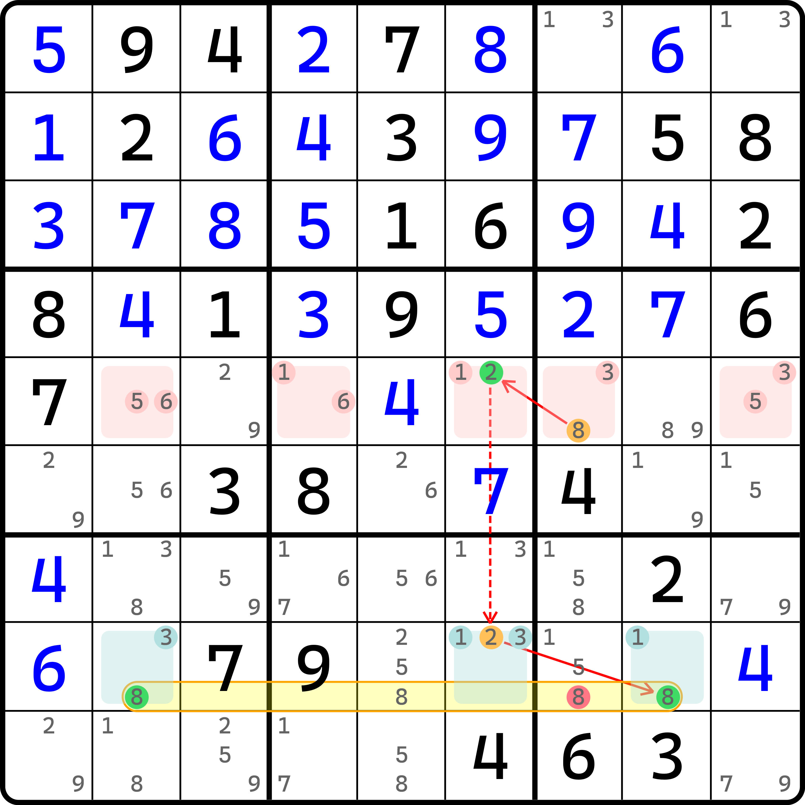
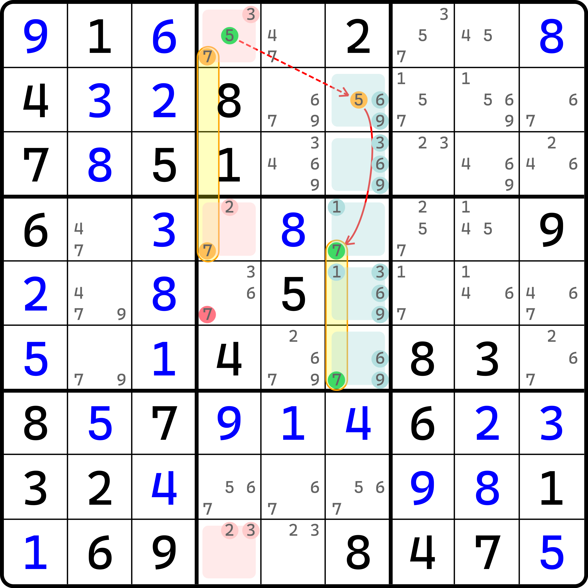
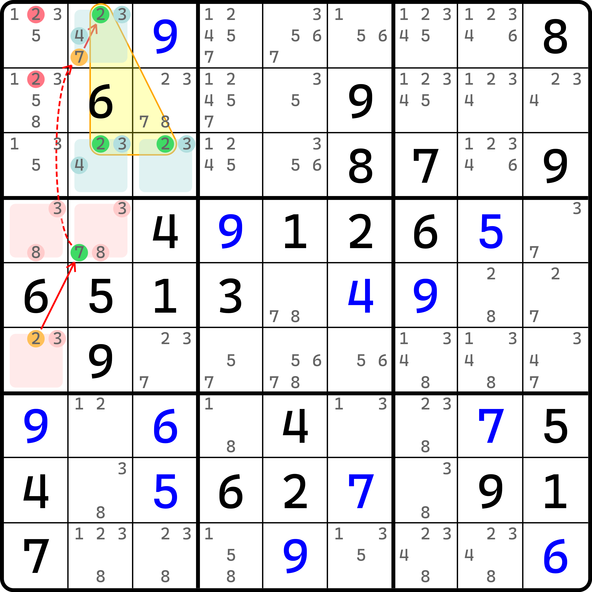

# 链关系的第二定义

这部分的内容将会带领我们将链理论的推理逻辑变得更加灵活。但是，因为内容会进一步推广链理论的内容，所以难度也会增大，所以不要走神。我们娓娓道来。

## 待定数组 XZ 逻辑（Almost Locked Set XZ Rule） <a href="#almost-locked-set-xz-rule" id="almost-locked-set-xz-rule"></a>

### 先从双值格链的视角告诉你链是成立的 <a href="#i-will-tell-you-this-pattern-is-correct" id="i-will-tell-you-this-pattern-is-correct"></a>

<figure><figcaption><p>待定数组 XZ 逻辑</p></figcaption></figure>

如图所示。这条链的表示如下：

```
7r2c3=5r2c4-5r3c6=7r8c6
```

这个链上来就给了我们一个下马威。因为上来的强链关系就已经不寻常了：它居然用的是两个不相同的单元格的异数强链关系。后面 `5r3c6=7r8c6` 也是如此。这是怎么实现的？

我们仍旧利用之前的逻辑来推理。链的逻辑要让我们先假设头部的两种真假性的情况。对于真就不多说了，主要是假设为假的情况。假设 `r2c3(7)` 为假，则我们看粉色的两个单元格 `r2c34`。此时，`r2c3` 只会剩下候选数 4，于是它肯定填的是 4（或者我们可以说 `r2c3(4)` 为真，即 `(7=4)r2c3` 的强链关系）。

然后，因为 `r2c3(4)` 为真后，此时 `r2c4(4)` 会为假。然后又因为 `r2c4` 是双值格，所以 `r2c4(5)` 此时为真，所以这么串起来就有了 `(7=4)r2c3-(4=5)r2c4` 这么个链。然后，有了 `r2c4(5)` 为真的结果后，`r3c6(5)` 自然就为假了。这一步是废话。

然后，和前面一致的逻辑是，我们还要继续借用下所有青色的三个单元格。因为 `r3c6(5)` 为假，所以 `r3c6(2)` 为真，然后 `r9c6(2)` 为假，`r9c6(4)` 为真，`r8c6(4)` 为假，最后得到 `r8c6(7)` 为真。

很显然，按照这么看的话，这是一个非常臃肿的双值格链。但是，这是为了给你介绍链成立才迫不得已这么解释的。下面我们换另外一个视角，把涂色的单元格当成整体，并直接讨论前面文本描述的那般形式。

### 待定数组的视角 <a href="#almost-locked-set-view" id="almost-locked-set-view"></a>

先看粉色的两个单元格。既然我们可以通过双值格链的视角知道 `r2c3(7)` 为假时可以得到 `r2c4(5)` 为真，那么这是否是一种特别的强链关系呢？

看起来是的，好像也挑不出什么毛病。可这似乎太过巧合。因为粉色的两个单元格实在是太过特殊，所以看起来是可以按双值格链的思路顺着这么下去才有的这个结果。所以这并不能说服我们将这个强链也适用于任何普通的情况。更何况，我们都不清楚什么时候才能叫“普通的情况”。

那么我们来看看数组的视角。我们先看粉色的两个单元格。这两个单元格里一共有三个候选数 4、5、7，刚好比单元格数量多一个。因为答案最终是只能填俩数字进去的（毕竟就两个单元格嘛），所以肯定会有一个数是多出来的。

在有这个前置知识点后，我们来看下青色的部分。青色的部分是三个单元格构成，但是里面有 2、4、5、7 一共四种数字出现，也刚好只比单元格数量多一个。

如果我们设 `r2c3(7)` 为假，则此时粉色的两个单元格 `r2c34` 仅剩下两种数字（因为 7 就这一个），于是它变为了一个显性数对（当然，只是少了一个 5 而已，但并不影响数对的形成，毕竟这一点之前老早就说过了）。但是，如果此时我们还让 `r2c4(5)` 为假的话，那么粉色的单元格里 5 和 7 都会消失，此时两个单元格就会只剩下一种数字 4，这显然是违背数独规则的。所以，`r2c4(5)` 此时不得不为真。

同理，对于 `r3c6(5)` 为假而言，如果 `r8c6(7)` 也为假，则青色的四个单元格里 5 和 7 全部会消失，于是只会剩下 2 和 4 这两种数字。可青色一共有三个单元格，这也是放不下的。所以，`r8c6(7)` 此时也是不得不为真的状态。

于是，我们就有了两端强链关系的新的解释：**在“待定”的数组结构里，如果在假设了其中一个数字的全部位置都为假时，数组就会形成；但是如果我们还要强制让其中另外一种数字全部位置都为假的话，那么这个数组就相当于同时少了两种数字。本身这个“待定”的数组结构里数字种类数也就比单元格数量多了一个，但一次少两种数字，**$$n + 1$$ **就会直接变为** $$n - 1$$ **种，进而产生直接的矛盾**。

> 对于粉色的两个单元格而言，因为显然 $$n$$ 值看起来比较小，所以直接矛盾的点看起来并不需要这么解释；不过为了确保这个说法的严谨性，这么写一遍是可以覆盖粉色的这种规格的情况的：$$n = 2$$ 个单元格，一共有 $$n + 1 = 3$$ 种候选数；当同时少掉两种候选数后，变为 $$n - 1 = 1$$ 种数字填写到两个单元格里，所以就矛盾了。

这便是本内容需要告诉大家的核心思路：使用数组整体进行推断的模式，这样可以直接得到强链关系的推导过程，避免中间采用双值格链那样一步一步的推演。

我们把图中粉色的这一块，以及青色的这一块都称为**待定数组**（Almost Locked Set，简称 ALS）。其中 Locked Set 在英语环境下也可以指 Subset，即数组的英文，所以 Almost Locked Set 也可以视为是 Almost Subset 的规范写法，即“差一点的数组”。另外，我们把使用了待定数组的链就称为**待定数组链**（Almost Locked Set Chain 或 ALS Chain）。

现在我们看到的是待定数组里最简单的部分，它只需要两个待定数组就行。我们把这种两头是待定数组的双强链称为**待定数组 XZ 逻辑**（Almost Locked Set XZ Rule，简称 ALS-XZ）。还记得 XZ 吗？在全双值格致死解法里它出现过一次，那个技巧叫 BUG-XZ。这里也是一样的。

## 强弱链关系的第二定义 <a href="#the-second-definition" id="the-second-definition"></a>

前面的内容我们已经充分介绍了待定数组的推演规则。下面我们针对于前面的推演规则，着重说明一下链的强弱链关系的另外一种说法。

### 两种定义 <a href="#two-kinds-of-defintions" id="two-kinds-of-defintions"></a>

之前我们学到的是，强弱链的关系是通过真假性直接推演而得到的。不过我们可以从前面待定数组的思维里看到，似乎它又有一些不一样的地方。

这里我们要介绍的是强弱链关系的第二定义。这里我们方便对比，把两种定义写在一起：

* _**第一定义**_
  * **强链关系**：如果节点 $$A$$ 为假时可得 $$B$$ 为真，则 $$A$$ 和 $$B$$ 为强链关系；
  * **弱链关系**：如果节点 $$A$$ 为真时可得 $$B$$ 为假，则 $$A$$ 和 $$B$$ 为弱链关系。
* _**第二定义**_
  * **强链关系**：如果节点 $$A$$ 和 $$B$$ 不同假，则 $$A$$ 和 $$B$$ 为强链关系；
  * **弱链关系**：如果节点 $$A$$ 和 $$B$$ 不同真，则 $$A$$ 和 $$B$$ 为弱链关系。

这个说法跟前面的比较相似，不过我们似乎因为已经学过了强弱链的定义后，发现这种说法有些奇怪，有点排斥。实际上这个定义方式和原来的真假推演的定义方式在数学上是完全等价的，但是他们带来了不同的解释思维。

这两种定义虽说是等价的，但看起来就不等价。而且，对于这种强弱链关系的定义，我们之前其实还有一些比较不理解的地方，这里我们都可以解释清楚。

### 为什么两种定义是等价的？ <a href="#why-two-definitions-are-equivalent" id="why-two-definitions-are-equivalent"></a>

从定义上看，这俩似乎没有什么直接的关系。要说明两个定义是等价的，我们稍微需要用到一点数学上的知识点。我们这里为了举例说明，就先拿强链关系的定义（第一定义）来简要用文字证明一下。

在高中的课程里，我们学到过一个叫命题与逻辑的内容。对于学的那些内容，我们这里就不多说明了。不过如果你要补学这些内容的话，本教程插入了逻辑学的其中一部分数学知识，方便你衔接他们。详情请参看“ [Broken link](broken-reference "mention")”这一部分的内容。

命题与逻辑里，我们把一个可以判断对错的陈述句称为一个命题。比如这里强链关系的前半句“如果节点 $$A$$ 为假时可得 $$B$$ 为真”就可以称为一个命题。虽然我们不知道普适情况下这个命题的真假性，但我们可以知道的是这个说法确实可以用于判断对错，所以是一个命题。

而我们还知道，**原命题和逆否命题等价**。对于强链关系的前半句“如果节点 $$A$$ 为假时可得 $$B$$ 为真”而言，它的逆否命题其实就是把“$$B$$ 为真”和“$$A$$ 为假”的位置对调一下，并且把对调后的这两个部分的真假性反转一下（“为假”改成“为真”、“为真”改成“为假”）。

改了之后呢？改了之后就成了“如果节点 $$B$$ 为假时可得 $$A$$ 为真”。注意，这里方向已经反过来了（改成了从 $$B$$ 往 $$A$$ 在推理的这个方向），但因为它是原命题的逆否命题，而逆否命题和原命题等价的缘故，所以原命题能推出的结论“$$A$$ 和 $$B$$ 为强链关系”应当也适用于它的逆否命题，所以我们仍然可以得到 $$A$$ 和 $$B$$ 为强链关系。

这就很神奇了。我们联立两个说法：

1. 如果节点 $$A$$ 为假时可得 $$B$$ 为真，则 $$A$$ 和 $$B$$ 为强链关系；
2. 如果节点 $$B$$ 为假时可得 $$A$$ 为真，则 $$A$$ 和 $$B$$ 为强链关系。

对于两个节点 $$A$$ 和 $$B$$ 而言，不论是从哪一个开始到哪一个结束，总会有一个节点会为真，这说明他们就是不同为假的，即不能同时都处于为假的状态。那它俩能同为真吗？我们在设为假才能得到另外一边为真，而从定义上看，似乎并未体现为真的推理状态，所以我们不能断言是否可以同真的性质，即只能认为两个节点可能也可以同为真，不能排除这个情况。

总之就是，我们借用逆否命题把他换一个说辞，然后联立起来得到两端有一个假，另外一个就必为真，因此才知道他俩不同假的这个新的定义方式。而对于弱链关系而言也是一样的证明模式：借用逆否命题，然后联立两个命题，发现只要有一个为真另外一个就一定为假，因此它俩不能同为真，这便得到了弱链关系的新的定义方式。

因此，链关系的第二定义的等价性就被我们拿捏了。

### 链关系的双向性以及链的双向性 <a href="#why-the-definition-is-bidirectional" id="why-the-definition-is-bidirectional"></a>

下面我们要说的是一个之前初学链理论并未涉猎的问题。我们在假设的时候是需要假设头尾的两种状态的（真和假的两种状态）。其中，设为真的这个状态因为不满足链的推导规范（链必须从假开始推），所以它“夭折”在了起始点。但作为删数所必须拥有的判别情况之一，它又必须存在于链的逻辑之中。

候选数为真的情况单独考虑，但又没有考虑得特别深入，又确实跟链本身是独立的状态。这一点真的很别扭。不过，在我们学习了第二定义后，我们将重新认识这个链理论，并可以告诉大家，这个设为真的情况以后都不用再考虑了（实际以前也可以不考虑，但因为前面的定义不足以解释为什么可以不考虑）。

要解释清楚这一点，我们需要知道链是双向的。所谓链是双向的，指的是链的推理过程不分前后顺序。即一共有四个节点的链 `A=B-C=D` 也可以看成 `D=C-B=A`。这两个写法是等价的。只要有其中一个成立，另外一个就会直接成立。

这一点甚至都不需要完整证明。因为它的证明过程在前面证明定义的等价性时已经提到了。因为链的强弱关系是有逆否命题一说的，而逆否命题确保了强弱链关系都可以逆向推导（比如 $$A$$ 假得 $$B$$ 真的逆否命题是 $$B$$ 假得 $$A$$ 真，这就只是单纯换了个方向的强链关系；弱链关系也是一样），所以把链完整换个方向是完全可以的。

所以链是不区分方向的（或者说两种方向均可推演，所以也可以说是链具备双向性）。之所以前面的配图都画了箭头，一来是因为之前没有办法解释清楚这个问题，所以告诉大家需要有方向地进行逻辑推演；二来也确实是因为链需要有一个方向作为前后关系的搭配。虽然链的方向最终并不重要，但它实际上是需要有一个切入点的作为我们下手的开端，所以我们必须用一个箭头来表示推演的完整流程，方便读者阅读。所以箭头不会因为我这里讲解了双向性之后就省略掉了，以后的话箭头还是会画出来的。

与此同时，因为链是双向都可以推导的，所以链头设为真的情况，其实会被链的另一个方向所覆盖到。什么意思呢？就是说，链不是双向的吗？链头到链尾是一个方向，链尾到链头又是一个方向。而链头为真恰好会被“从链尾到链头”这个推演方向所覆盖。因为从链尾到链头的推导过程下，链尾会被假设为假，而链头会得到为真的状态。这一点早已被链的另外一个方向所覆盖到，所以链自身就带有链头的两种真假状态，因此我们以后都不需要单独对链头进行真假性的讨论，而只需要看链是否成立就行。只要链成立了，链头的真假性也就都会出现，此时直接看头尾交集删数就行了。

## 待定数组的特性 <a href="#feature-of-almost-locked-set" id="feature-of-almost-locked-set"></a>

在说完了理论知识后，下面我们要最后介绍一下待定数组本身的特性。

前面待定数组的最后，我们提到了一段非常长的话。它描述的是，在待定数组里，需要有两种数字全部从盘面里消失，才能造成待定数组的矛盾。那么，如果我们把细致看一下这个话，我们就可以发现，其中一个数的所有位置为假，不就是在说这个数所有位置构成的一个整体，然后这个节点为假吗？所以，待定数组有一个非常重要的特性是：

**待定数组里，任意两种数字之间都是强链关系。**

下面我们来看几个题。

第一个题稍微推广一下前面的结构的长相。

<figure><figcaption><p>第一个推广例子</p></figcaption></figure>

如图所示。这个例子也用到了两个待定数组，不过是 2 和 4 之间的关系。比如粉色的这一个待定数组，2 只有一个位置，但 4 有两个位置，所以所有的 2 和所有的 4 构成强链关系（因为它俩不同假，或者说 4 区块节点为假时可得 `r1c3(2)` 节点为真）。另外青色的这一边也是一样的道理。

需要注意的是，因为链的头尾都是 4 的区块节点，他们均处于同一个宫，所以删数就是 `b1` 里其余单元格的候选数 4。

下面我们再来看一个例子。

<figure><figcaption><p>第二个推广例子</p></figcaption></figure>

如图所示。这个例子良好地阐述了前面“同一种数字的全部位置”这个说法。粉色的部分可以先不看，主要是这里的青色的这三个单元格。

青色的单元格一共有四种候选数出现：1、2、3、8。其中 2 只有一个位置，8 倒是出现在了两个位置上，但他俩跨度实在是太大了，一个在 `r8c2`，另一个却在 `r8c8`。

不过这都不重要。就算它俩不是区块节点，我们也可以组合起来看待。当 `r8c6(2)` 为假时，我们可以得到的是 `r8c28(8)` 为真。

在删数时，我们要看的是两头的交集。而此时 `r8c28(8)` 作为整体后，我们知道的是，这个节点为真意味着这个节点的两个单元格里，必须至少有一个位置是填的 8。所以，组合起来其实就是看的 `r5c7`、`r8c2` 和 `r8c8` 链头尾一共三个单元格可以排除到的交集。显然，`r8c7` 是交集上的点位，所以这个题的结论就是 `r8c7 <> 8` 了。

<figure><figcaption><p>第三个推广例子</p></figcaption></figure>

如图所示。这个再一次推广了用到区块节点。不过和前面差不多，所以就不重复说明了。

<figure><figcaption><p>第四个推广例子</p></figcaption></figure>

如图所示。呃……越来越奇怪了。不过也是一样的，把尾巴上三个位置结合链头一个位置，看成是找这四个位置的交集就行。
