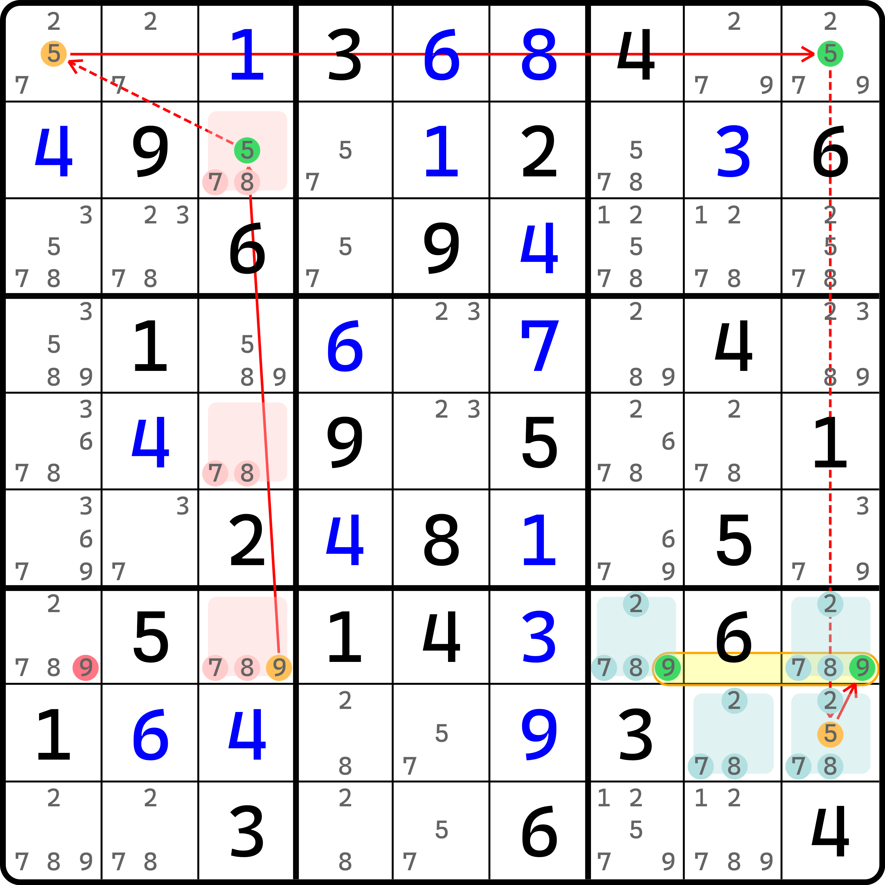
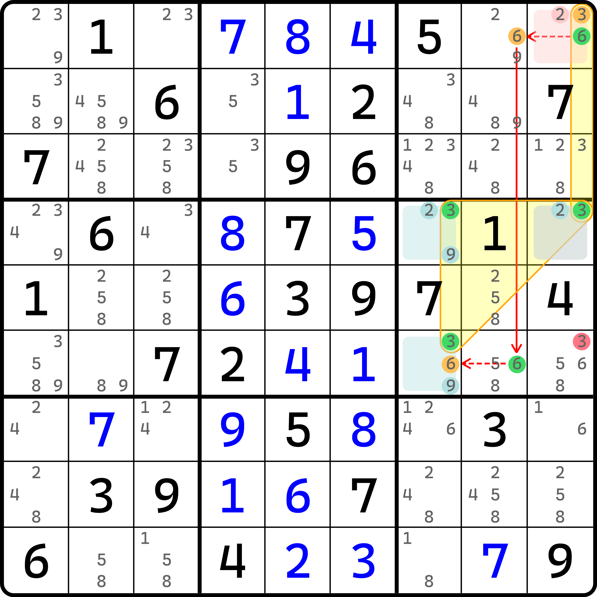

# 有技巧名的待定数组结构

本篇内容将带着大家看一些待定数组的固定结构。这些结构因为长相特殊，所以单独列一篇内容介绍他们。

## 待定数组 XY-Wing（Almost Locked Set XY-Wing） <a href="#almost-locked-set-xy-wing" id="almost-locked-set-xy-wing"></a>

<figure><figcaption><p>待定数组 XY-WIng</p></figcaption></figure>

如图所示。本题用到了三个待定数组结构。链的表示如下：

```
2r6c7=7r6c3-7r3c3=9r1c12-9r1c78=2r1c123|r3c9
```

> 补充一下，尤里卡记号的竖线 `|` 表示类似于之前一组单元格无法简写时，需要用逗号分隔的那个逗号，这只是一个约定俗成。在计算机里竖线也有“或者”的意思，所以这样可以把四个单元格给合并起来。

因为强链关系的推理和之前待定数组需要用到的那些规则完全一样，所以就不重复说明了。总之，结果就是头尾的交集，即 `r3c7 <> 2`。

本题用到了三个强链关系，且三个强链关系全部是从待定数组之中诞生，所以我们把这个结构归纳为待定数组的一种特殊构造。这是今天要学到的第一种，即**待定数组 XY-Wing**（Almost Locked Set XY-Wing，简称 ALS-XY-Wing）。为什么要带一个 XY-Wing 的头衔呢？你把这个链里用到的全部数字排列展开来，你会得到 2、7、7、9、9、2 的序列。在之前 [#chain-view-of-xy-wing-and-w-wing](../02-x-chain-and-multidigit-chain/04-named-multidigit-chain.md#chain-view-of-xy-wing-and-w-wing "mention") 的内容里，我们介绍到 XY-Wing 的链的格式。你可以仔细对比一下，它的排列（尤其是数字的序列）和这里的这个排列模式完全一样，因此我们给这个技巧冠了个 XY-Wing 的名。

下面我们再来看一个例子。

<figure><figcaption><p>另一个待定数组 XY-Wing</p></figcaption></figure>

如图所示。这个稍微有些别扭的是这个尾部的 7 跨度实在是有些大。不过例子还是比较清晰的，所以就自己看了。

下面我们再来看一种构造模式。

## 待定数组 W-Wing（Almost Locked Set W-Wing） <a href="#almost-locked-set-w-wing" id="almost-locked-set-w-wing"></a>

下面我们来看带 W-Wing 的构造模式。

<figure><figcaption><p>待定数组 W-Wing</p></figcaption></figure>

如图所示。这个链的写法如下：

```
9r7c3=5r2c3-5r1c1=5r1c9-5r8c9=9r7c79
```

可以看出，和前面 XY-Wing 类似，它用了两个待定数组，且构造的方式使用了 W-Wing 的模式。所以这个我们把他叫做**待定数组 W-Wing**（Almost Locked Set W-Wing，简称 ALS-W-Wing）。

我们再来看一个抽象一些的例子。

<figure><figcaption><p>另一个待定数组 W-Wing</p></figcaption></figure>

如图所示。这个链的写法如下：

```
3r14c9=6r1c9-6r1c8=6r6c8-6r6c7=3r4c79|r6c7
```

这个例子看着确实抽象了一些，主要问题是它用到了两个地方有些和之前的例子不同。第一个是 `r4c9` 单元格是同时被两个待定数组使用的（属于是叠起来了）；第二个是链的头尾也复用了 `r4c9(3)` 这个候选数。

第一个待定数组可以得到 3 和 6 在 `r14c9` 里的强链关系，第二个待定数组则可以得到 3 和 6 在 `r4c79` 和 `r6c7` 三个单元格内的强链关系。

我们再来看一个例子。

<figure><figcaption><p>区块待定数组 W-Wing</p></figcaption></figure>

如图所示。这个链的写法如下：

```
8r1c1=1r1c8-1r2c89=1r2c4-1r5c4=8r5c78
```

这一次我们仍然是用的 W-Wing，不过 `r2` 数字 1 的强链关系是带区块节点的。

## 待定数组双值格链（Almost Locked Set Chain） <a href="#almost-locked-set-chain" id="almost-locked-set-chain"></a>

下面我们继续推广待定数组的使用次数。不过因为过多使用待定数组会造成结构越来越难在平时做题时遇到，所以看看就行了，不用考虑怎么找的。

当然，因为再次推广了使用待定数组的次数，所以就不太像是 wing 应该有的样子了。只能说是它是从刚才 XY-Wing 的情况再次推广得来的。

<figure><figcaption><p>待定数组双值格链</p></figcaption></figure>

如图所示。它的写法如下：

```
6r7c6=8r7c8-8r46c8=3r5c7-3r5c13=7r4c2-7r7c2=6r8c3
```

本题用了四个待定数组，图中分别使用了粉色、蓝灰色、橘色和黄色四种颜色表示。不过要注意的是，这四个待定数组的头尾两个（粉色和黄色这两个待定数组）是重叠了的，它同时用了 `r7c2` 这个单元格。

我们把这个就称为**待定数组双值格链**（Almost Locked Set XY-Chain）。在 HoDoKu 软件里，这个技巧叫做 ALS Chain（ALS 链、待定数组链），不过容易和教程后期的普通待定数组搭配链的逻辑造成冲突，就不采用这个说法了。

## 待定数组的定义范畴 <a href="#definition-field-of-almost-locked-set" id="definition-field-of-almost-locked-set"></a>

考虑这个例子：

<figure><figcaption><p>待定数组 W-Wing（？）</p></figcaption></figure>

如图所示。它的表示如下：

```
(4=5)r8c1-5r7c3=5r3c3-5r3c79=4r12c8
```

从数字上看，它确实符合 W-Wing 的模式。但是仔细数数，它只用了一个待定数组，即右上角 `r12c8` 和 `r3c79` 四个单元格的这个待定数组。

不过，我们要强行这么看似乎也行。待定数组的定义不是 $$n$$ 个单元格里包含 $$n + 1$$ 种不同的数字吗？如果 $$n = 1$$ 的话，定义就会变为指代一个双值格。那么对于这个链里的 `r8c1` 来说，这一个单元格就应该算一个待定数组。那么这么强行看的话，那么这个例子也符合待定数组 W-Wing 的定义。

是的。这的确有些反直觉，但是它确实是正确的：**双值格是特殊的待定数组**。数组在我们最开始学的时候就要求规格必须至少两个单元格（因为一个没有意义）。但是对于待定数组而言，由于它不能直接用，所以待定数组只能配合其他的内容才能发挥效果。所以，在待定数组的世界里，双值格这种只用一个单元格却符合定义的情况并不少见。双值格因为符合待定数组的定义，所以也确实被算成一种特殊的待定数组（规格最小的情况）。

至此我们就把待定数组的一些常见构造模式（算上之前 ALS-XZ 一起），就全部结束了。下面我们将带着大家看看待定数组在普通的链里的用法。
