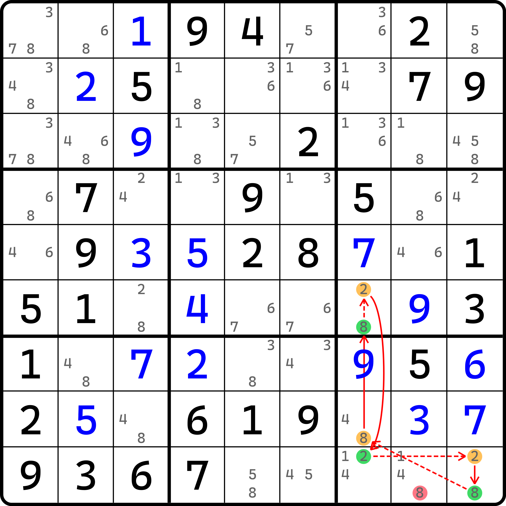

# 在链里的待定数组

下面我们来看一些普通的用法。

## 例子 1 <a href="#example-1" id="example-1"></a>

<figure><figcaption><p>第一个待定数组区块链例子</p></figcaption></figure>

如图所示。这个链的写法如下：

```
2r5c7=3r5c2-3r79c2=2r7c1-2r2c1=2r2c79
```

删数是头尾三个位置 2 的交集。

## 例子 2 <a href="#example-2" id="example-2"></a>

<figure><figcaption><p>第二个待定数组区块链的例子</p></figcaption></figure>

如图所示。这个链的写法如下：

```
7r8c8=7r2c8-(7=8)r2c2-8r9c2=7r7c1|r8c3|r9c2
```

这个题别看就用了一个待定数组，但是它真的很……不好看。左下角的这三个 7 的摆放实属有些过分了。

## 例子 3 <a href="#example-3" id="example-3"></a>

<figure><figcaption><p>第三个待定数组区块链的例子</p></figcaption></figure>

如图所示。这个是节点重叠技巧的例子。写法如下：

```
4r5c2=4r5c5-4r7c5=9r7c45-9r9c4=9r9c3-9r6c3=4r5c2|r6c3
```

这个例子的链头是 `r5c2(4)`，而链尾是 `{r5c2, r6c3}(4)`。有点像克莱因瓶的效果。

因为删数是取头尾的交集，而头尾的交集看的是两组候选数在合并后，每一个位置的交集，而因为链头的候选数完整被链尾所涵盖，所以看起来其实就是在删链尾的交集。所以结论就是 `r4c3 <> 4` 了。

至此我们就把待定数组的内容结束了。下面我们还得继续讲解后面的内容。
