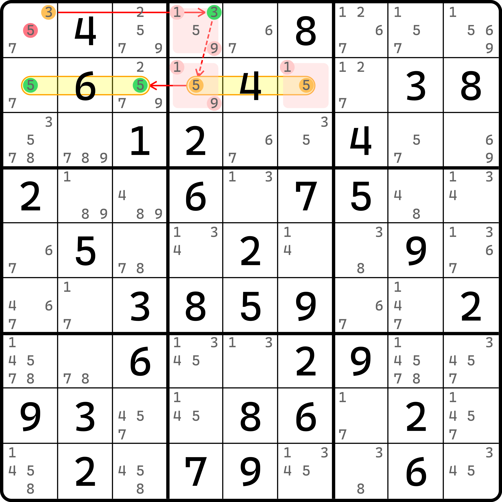
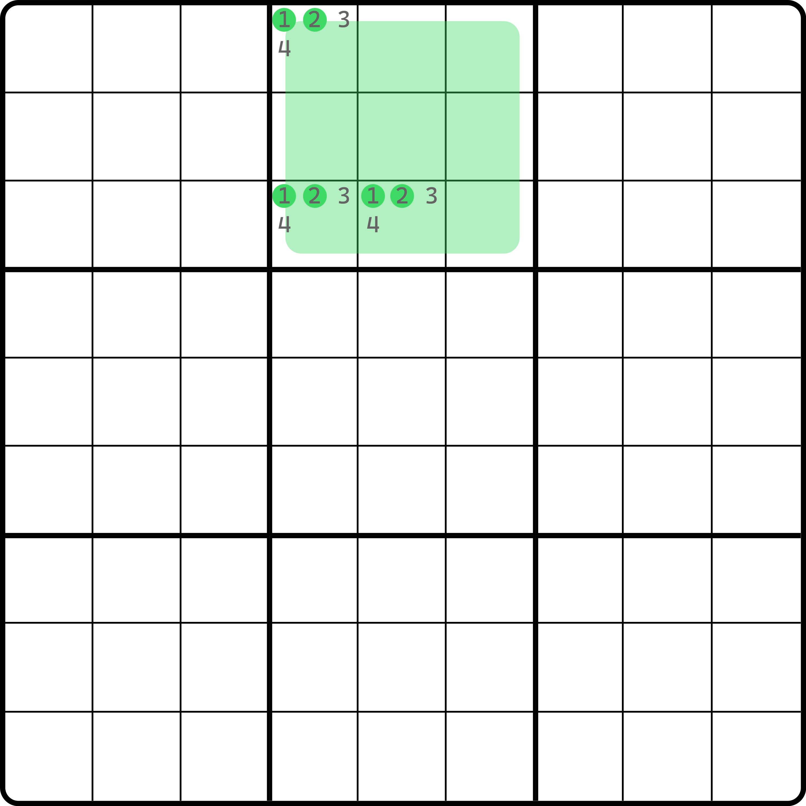
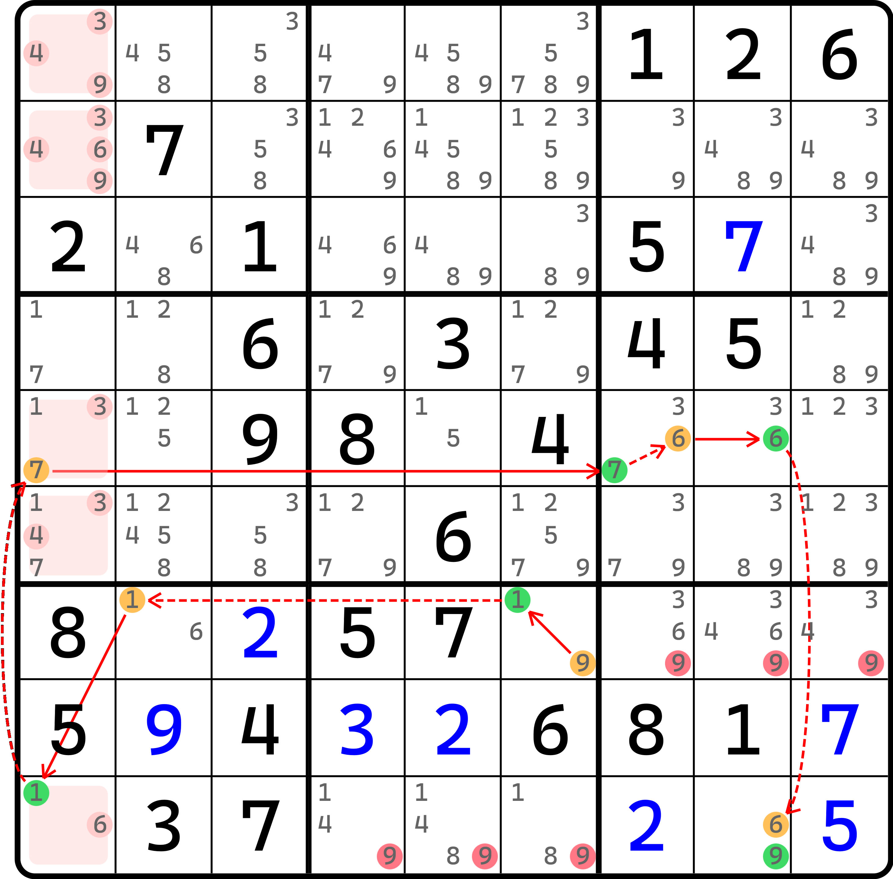

# 隐性待定数组链（AHS 链）

下面我们接着看另外一种待定数组的用法。

## 还是先从例子入手 <a href="#a-simple-example" id="a-simple-example"></a>

<figure><figcaption><p>隐性待定数组链</p></figcaption></figure>

如图所示。这个链的写法如下：

```
3r1c1=3r1c4-5r2c46=5r2c13
```

我们很快就发现了端倪。这里居然有一个弱链关系直接连接了两个不同的数字节点：`3r1c4-5r2c46`。这是怎么得到的呢？

其实很简单：我们仔细观察 `b2`，就可以发现这个宫里，数字 1 和 9 只能填入到 `r1c4` 和 `r2c46` 三个单元格里。

然后回忆一下之前强弱链关系的定义是怎么说的。如果两个节点不同为真，那么这两个节点就可以定义为弱链关系。这个地方它满足吗？显然是满足的。因为如果我们让这两个节点为真，就意味着 `r1c4 = 3` 和 `r2c46(5)` 的区块同时成立。而只要成立，数字 1 和 9 就放不下了，因为 1 和 9 至少需要两个单元格安放。但是一个区块节点和一个候选数节点同时为真，起码至少用到两个单元格。于是，1 和 9 就放不下了。这样就会造成矛盾。所以，这两个节点的弱链关系是成立的。

于是，整个链就连通了。我们就可以得到这个区块不连续环的结论：`r1c1 <> 5`。

这里我们就把 `3r1c4-5r2c46` 这个弱链关系的证明来源称为一个**隐性待定数组**（Almost Hidden Set，简称 AHS）。

## 隐性待定数组的样貌

显然我们不足以通过一个简单的例子解释我们要说的东西。我们来看这个示意图。

<figure><figcaption><p>隐性待定数组示意图</p></figcaption></figure>

如图所示。我们假设这个图里 `b2` 只有这三个高亮出来的单元格 `r1c4`、`r3c45` 能填 3 和 4，剩下的空白位置都不能填 3 也不能填 4（注意是 3 和 4，不是 1 和 2）。

因为整个宫里只有三处位置可以填两种数字 3 和 4，我们就把这三个单元格称为一个隐性待定数组。为什么？因为我们无法确保 3 和 4 最终落入这三个单元格的其中哪两个，这一点和之前待定数组的思路完全一样。

那么，这里可以用到的结论是什么呢？结论用的是在这三个单元格的、不是 3 和 4 的其他数字。比如这个例子里我们故意让它含有候选数 1 和 2。结论就是，只要我们找到两个节点用到至少两个单元格即可。只要这两个节点同时为真的时候用掉三个单元格的其中两个，这样 3 和 4 就一定放不下，于是就会矛盾。

比如这个示意图里，`r1c1(1)` 可以和 `r3c4(2)` 形成弱链关系。同真时，`r1c1 = 1` 和 `r3c4 = 2` 成立，此时 3 和 4 就放不下了。

可以从示意图看出，大多数时候它的结论都是相对待定数组而言更为鸡肋一些的。所以，隐性待定数组的使用比起普通的待定数组而言会少很多。

## 让我们带着前面的内容再看一个例子 <a href="#another-example" id="another-example"></a>

<figure><figcaption><p>第二个隐性待定数组链例子</p></figcaption></figure>

如图所示。这个链的写法如下：

```
(9=1)r7c6-1r7c2=1r9c1-7r5c1=(7-6)r5c7=6r5c8-(6=9)r9c8
```

可以看出，左边 `c1` 里的这个隐性待定数组规格较大，不过也好理解：因为两个候选数 1 和 7 同真时会造成 3、4、6、9 放不下 3 个单元格（本身 5 个单元格，但两个候选数同真会占用掉其中两个，所以只剩下三个位置了）。

至此我们就把隐性待定数组的内容结束了。它的用法确实会少一些。
