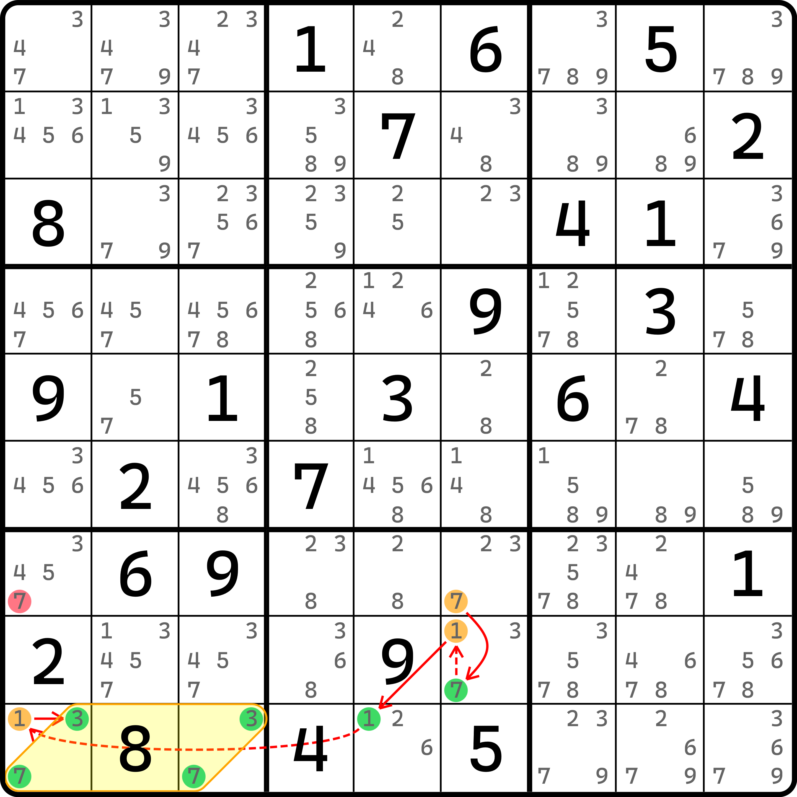
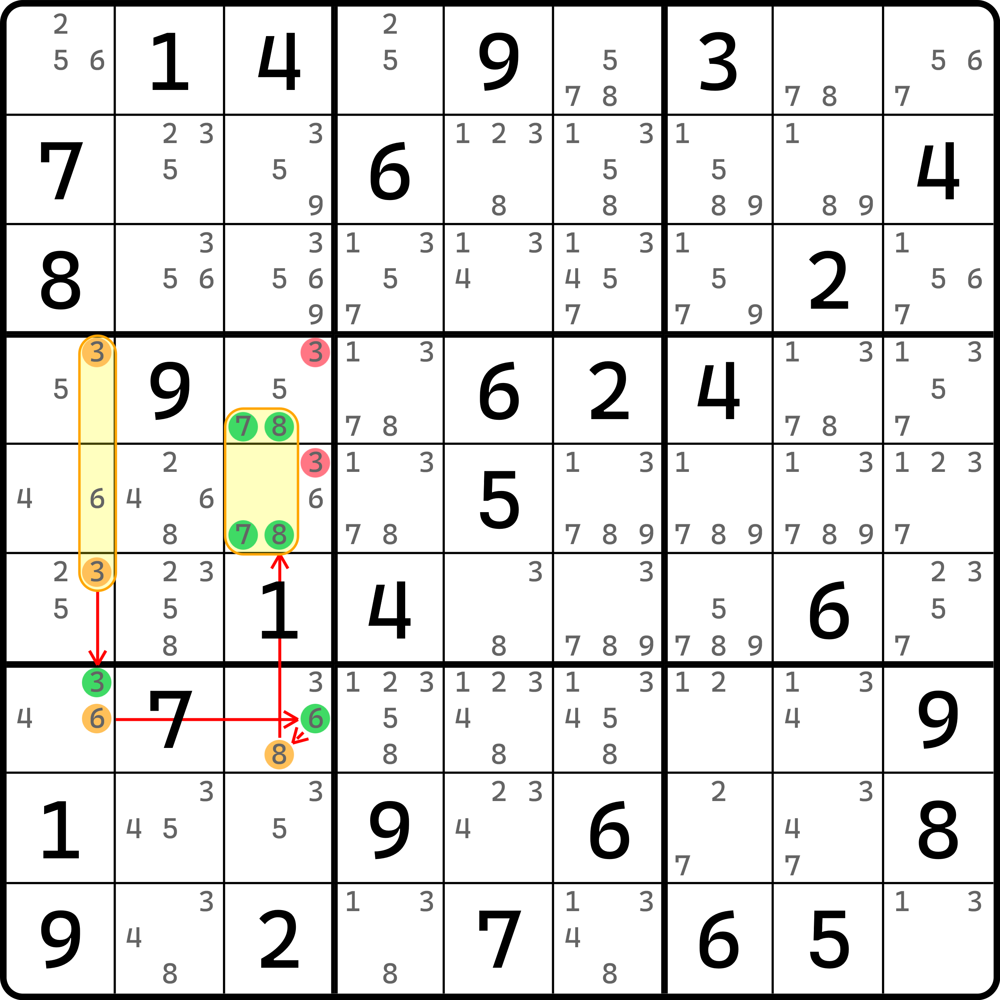
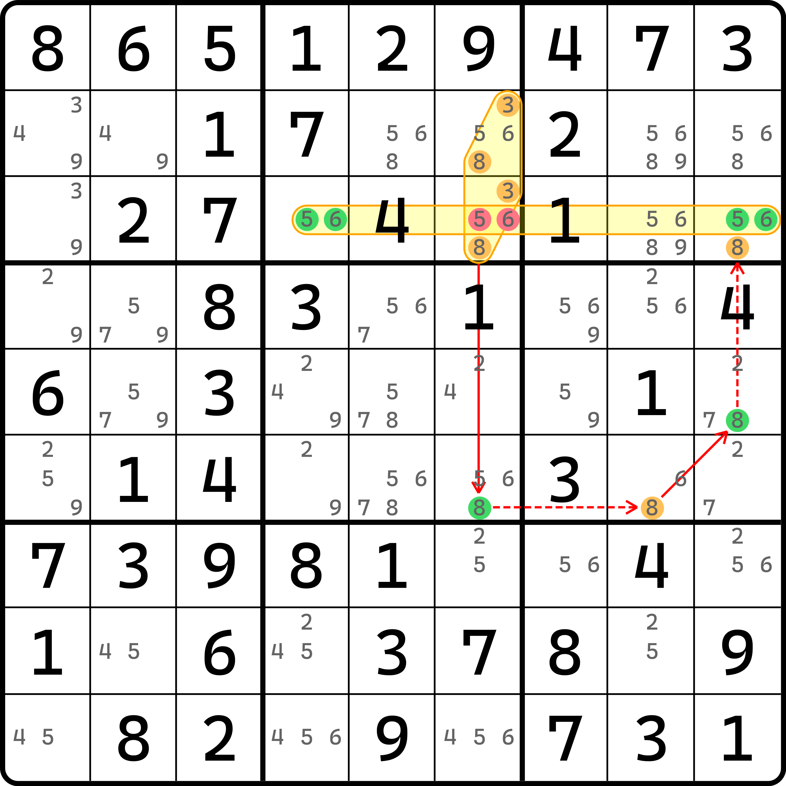

# 毛刺数组链

下面我们继续学习待定数组的内容。不过这次我们将会结束数组链的全部内容。

## 毛刺显性数组 <a href="#burred-naked-subset" id="burred-naked-subset"></a>

我们还是先来看一个例子。

<figure><figcaption><p>毛刺显性数组链</p></figcaption></figure>

如图所示。这个链的写法如下：

```
7r7c6=(7-1)r8c6=1r9c5-1r9c1=37r9c13
```

这个链的特殊之处在于，它有一个节点非常不寻常：`r9c13(37)` 是一整个节点，一共有四个候选数。

从之前待定数组的内容里我们知道，其实链尾这里的强链关系是 `1r9c1=7r9c13` 就行，删数也是 OK 的。不过，这里我们换个视角，方便我们找的视角：显性数组。

我们就强制性把 `r9c13(37)` 看成一个整体（显性数对结构当成一个节点），然后试着让它和 `r9c1(1)` 连起来。不过看起来似乎是可行的。只是从理解上来说，会稍微麻烦一些。数组节点怎么看真假性？

之前我们在解释区块节点的时候，说的是“区块节点的真假性直接看区块是否成立即可”。先从“成立与否”切入，然后再看它底层的一些候选数摆放模式。数组也是一样。如果数组节点为真，我们就认为数组结构成立即可；相反，如果数组节点为假，就认为数组不成立。

直白点说，对于例子里而言，数组节点为真就说明 `r9c13` 这两个单元格一个填 3，另外一个填 7。那么，如何得到这个情况成立呢？只要 `r9c1(1)` 不存在就行。换言之，如果 `r9c1(1)` 为假，则这个数组就直接会成立，于是数组节点为真就有了。

和前面的链的推理过程如出一辙，直接从头连到尾，只不过这次尾巴上吊着的是一个数组而不是区块也不是普通的候选数。

这个链成立，自然就需要我们找删数。那么这次我们要看的是候选数 `r7c6(7)` 和数组 `r9c13(37)` 的交集。那同时假设一下这两头节点为真的情况，看看都能删哪些位置，然后取交集就行了。那么对这个题来说，可用的位置只有 `r7c1(7)`。所以，`r7c1 <> 7` 便是这个例子的结论。

对于 `r9c13(37)` 这种直接看不是数组，但外部挂了个节点连进来的这种数组形态，我们就称为**毛刺数组**（Burred Subset）；而我们把这种用了毛刺数组的链称为**毛刺数组链**（Burred Subset Chain）。这是显性数对，所以毛刺数组又可以称为**毛刺显性数组**或**显性毛刺数组**（Naked Burred Subset 或 Burred Naked Subset）。

## 什么是毛刺？ <a href="#what-is-a-burr" id="what-is-a-burr"></a>

### 毛刺的概念 <a href="#concept-of-burr" id="concept-of-burr"></a>

前面我们提到了毛刺数组。这里我们要说一下什么是**毛刺**（Burr）。

毛刺本质上来说，其实并不是说这个数组本身，而指的是 `r9c1(1)` 这个多出来的部分。这很奇怪，明明是毛刺数组节点，但毛刺的概念指的却是另外一个连进来的节点。

毛刺从根本上讲，指的是影响结构形成的、多出来的那一坨部分。你可以类比于之前学到的鱼技巧。鱼的技巧里我们学到过一个术语，叫做鱼鳍。鱼鳍指的是影响鱼成立的、多出来的那一坨。那么对于链理论而言，毛刺这个概念就可以视为是鱼鳍的超集（或者说鱼鳍是毛刺的其中一种特殊情况，鱼鳍基本等于是在说，用于鱼结构的毛刺）。

### 毛刺和鱼鳍的区别 <a href="#difference-between-fin-and-burr" id="difference-between-fin-and-burr"></a>

之所以说“鱼鳍基本等于‘用在鱼里的毛刺’”，而不是说“鱼鳍就是鱼里的毛刺”，是因为从术语角度来说，他们是有区别的。

鱼鳍更侧重的是鱼鳍本身真假的讨论（鱼鳍的位置填，还是不填），然后取出两种情况均可造成的删数，作为技巧的结论；而毛刺一般不能这么看，它只能放在链里作为链的一部分。鱼鳍可以有多个，毛刺虽然也可以有多个，但是多个鱼鳍是看成整体讨论的；但是毛刺就不一样了。毛刺数组在链里一旦有多个，那么他们各自就是独立的节点信息了。

总之，毛刺这个术语一般只会用在链里。虽然不严谨，但是你可以勉强地认为，它就是鱼鳍，只不过鱼鳍上长了一根链，把它串在了里面。

## 毛刺隐性数组 <a href="#burred-hidden-subset" id="burred-hidden-subset"></a>

<figure><figcaption><p>毛刺隐性数组链</p></figcaption></figure>

如图所示。这个链的写法如下：

```
3r46c1=(3-6)r7c1=(6-8)r7c3=78r45c3
```

可以看到，这里的数组不是显性的了，而是隐性的：整个 `c3` 里可以填 7 和 8 的位置只有 `r457c3` 三个单元格。当 `r7c3(8)` 为假的时候，7 和 8 只能填在 `r45c3` 之中，于是就成了一个隐性数对。就跟前面那个一样，这里我们把 `r45c3(78)` 看成一整个节点，就好比是在说 `r7c3 <> 8` 时，`r45c3(78)` 这个节点为真。

于是，链就成立了。删数也是一样，看两头节点的可删数的范围，取交集即可。这个地方稍微麻烦一些的是，`r45c3(78)` 是隐性数对，所以它的删数是 `r45c3` 里其他的候选数；那么对于链头 `r46c1(3)` 而言，它可以删除 `r45c3(3)`。所以，这个题的结论就是 `r45c3 <> 3` 了。

这次我们用的仍然是毛刺数组，只不过是隐性的，所以我们把这个称为**毛刺隐性数组**或**隐性毛刺数组**（Hidden Burred Subset 或 Burred Hidden Subset）。

## 毛刺数组节点为假的候选数分布情况 <a href="#distribution-of-candidates-in-burred-subset-node-when-false" id="distribution-of-candidates-in-burred-subset-node-when-false"></a>

我们刨根问底一下。

我们都知道，毛刺数组的节点为真时，就意味着数组就是成立的，于是我们就可以保证数组内部一定会填写这些数字。比如对于三数组 1、2、3 而言，数组为真就说的是 1、2、3 能恰当地安排在这三个单元格里，一个位置填一个数。那么，毛刺数组节点为假呢？

因为节点的真假性总是互斥的情况，所以节点为假自然指的就是“不满足成立状态的其他所有情况”。还是拿这个三数组举例的话，三数组为假就意味着里面填不成满足三数组的情况。什么时候可以呢？比如说隐性三数组的话，就是这里三个单元格填的是 1、3、4 或者别的什么，反正少了一些候选数状态、不足以使得 1、2、3 各一个的状态；那对于显性三数组而言，自然就是直接让毛刺的那部分成立，使得这个三数组始终填不成 1、2、3 各一个。别忘了这个时候毛刺三数组可不和显性三数组等价，因为它里面可能会有额外的候选数填入。

## 最后我们再看一个例子 <a href="#another-example" id="another-example"></a>

<figure><figcaption><p>同时用显性和隐性毛刺数组的例子</p></figcaption></figure>

如图所示。链表示如下：

```
38r23c6=8r6c6-8r6c8=8r5c9-8r3c9=56r3c49
```

这是一个链头是毛刺隐性数对，链尾是毛刺显性数对的特殊链，中间只用了数字 8 搭建了桥梁，让这两个毛刺数组能够连起来。

可问题是，这个链要想推理起来，起头就开始犯难了。既然这里是强链关系，那我们凭什么说这个地方，`r23c6(38)` 和 `r6c6(8)` 不同假呢？这个时候我们就得用到前面毛刺数组节点为假的假设模式了。当毛刺节点 `r23c6(38)` 为假时，意味着里面无论如何都不能让 3 和 8 的隐性数对成立，这也就意味着里面肯定不够一个填 3 一个填 8 的状态。

思考一下，3 和 8 的可能摆放。因为这是毛刺隐性数对，所以 3 和 8 对于 `c6` 而言，只能填在 `r346c6` 这三个单元格里。显然，3 只能填在上面，虽然我们说毛刺节点为假，但起码我们至少得保证数独规则要成立吧。这是我们的底线。所以 3 只有两处可填位置，自然需要满足。

那么，有问题的数字就只能是这个 8 了。那 8 能放的位置能让数组节点为假，自然就只能让 8 填在 `r6c6` 里。因为这是唯一一处可以让毛刺隐性数对不成立的位置，毕竟 3 在上面必须得填一个，那么另外一个位置不管是哪一个，只要填 8 就必定是会构成隐性数对的。所以，既要保证数组节点不成立，又要保证数独规则不违反，此时只能有 `r6c6(8)` 这个节点为真才可以。所以，这个强链关系就这么来的。

而后面的推理过程就全部和之前的一样了，这里就省略重复解释了。至于删数的话，反而比前面这个节点为假理解起来要简单。因为 `r3c6(56)` 可以同时被显性数对和隐性数对都删除掉，所以这两个删数是这个题的结论。

这里留一个问题。我们之前学到，链是可以逆向理解的，因为链的正反不影响结论的成立和链的成立。所以，如果我们要让这个毛刺显性数对节点作为链头的话，它为假应该指的是什么意思呢？我希望各位思考一下这个问题。

至此我们就把待定数组的内容全部介绍完了。之后我们将进入到新的内容里来。
