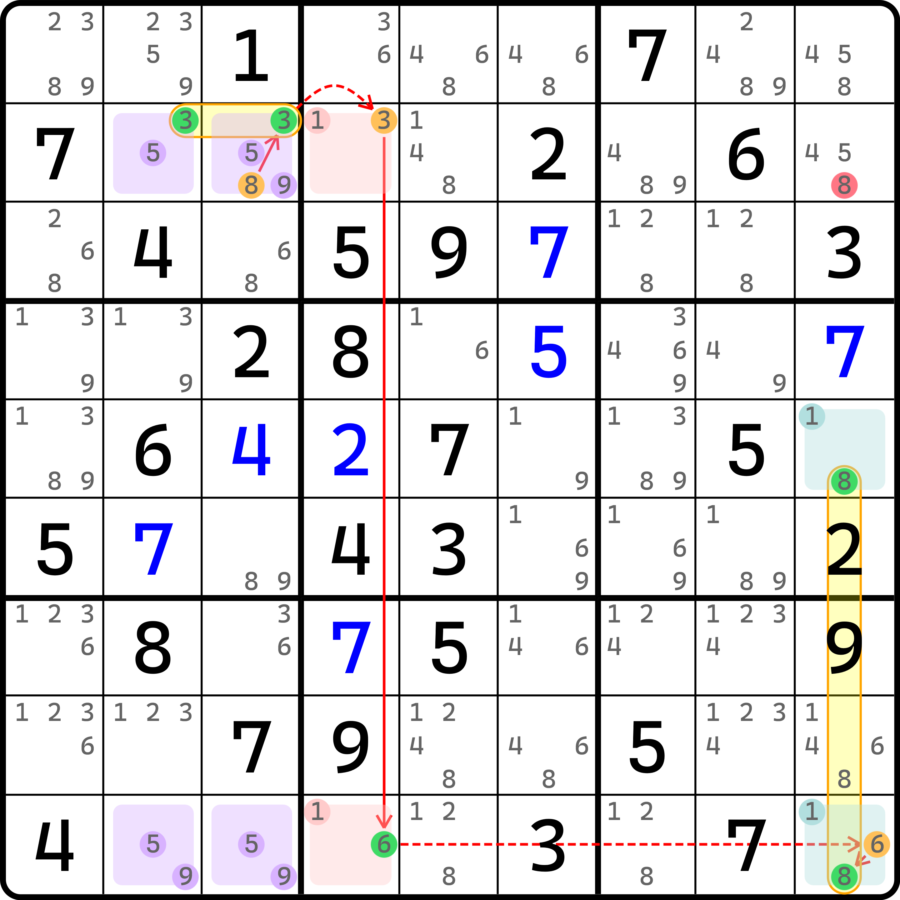
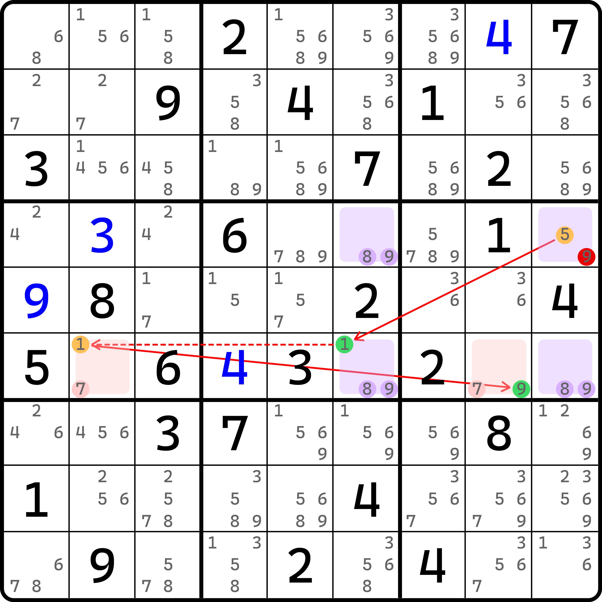
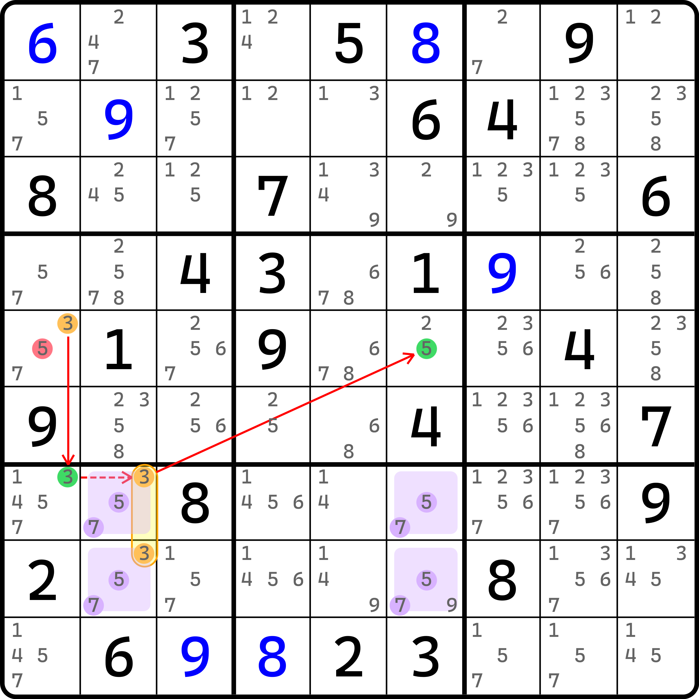
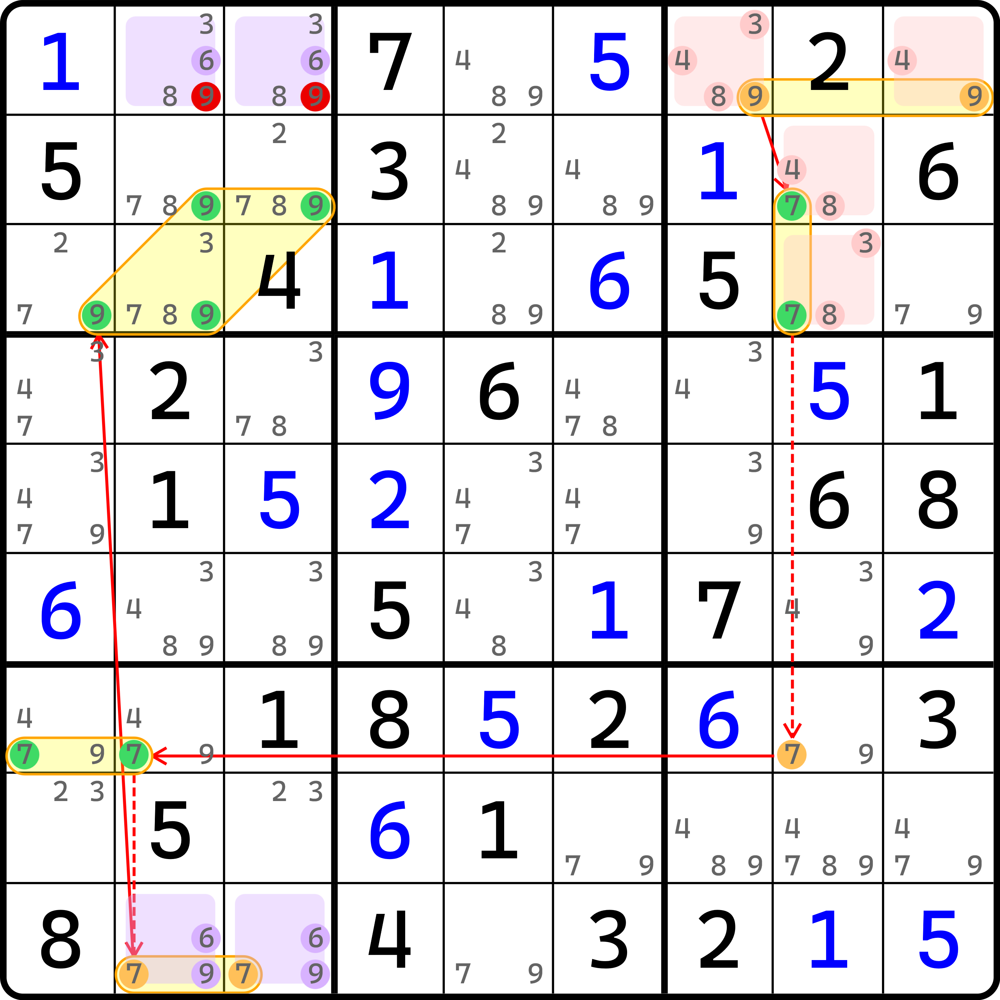
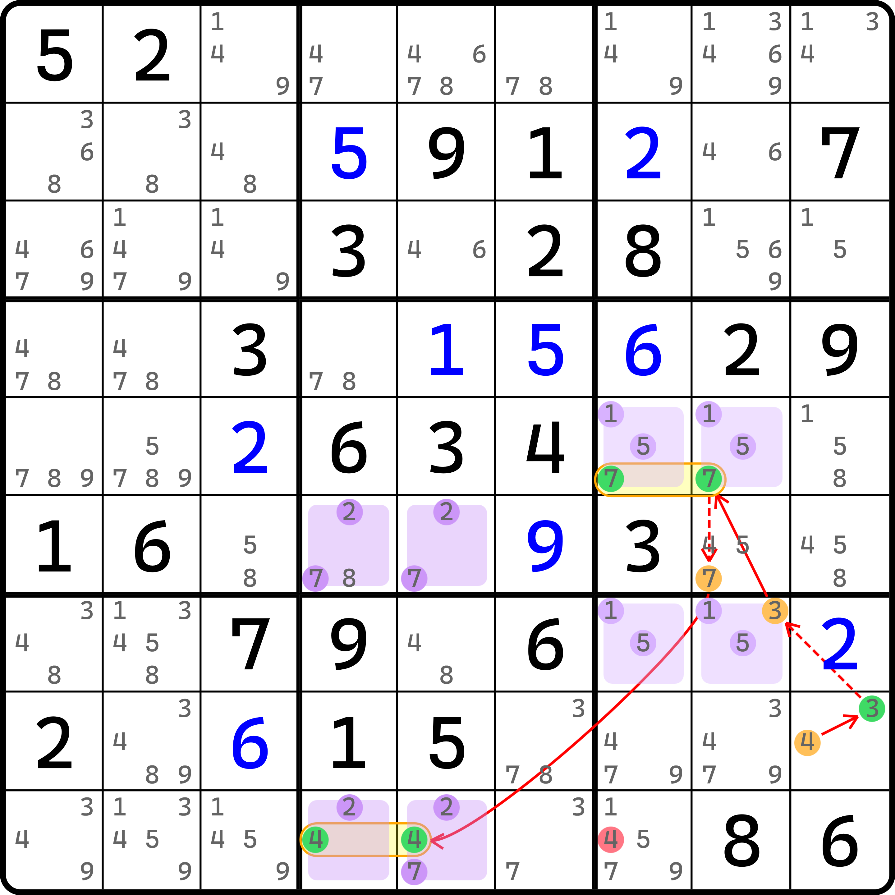
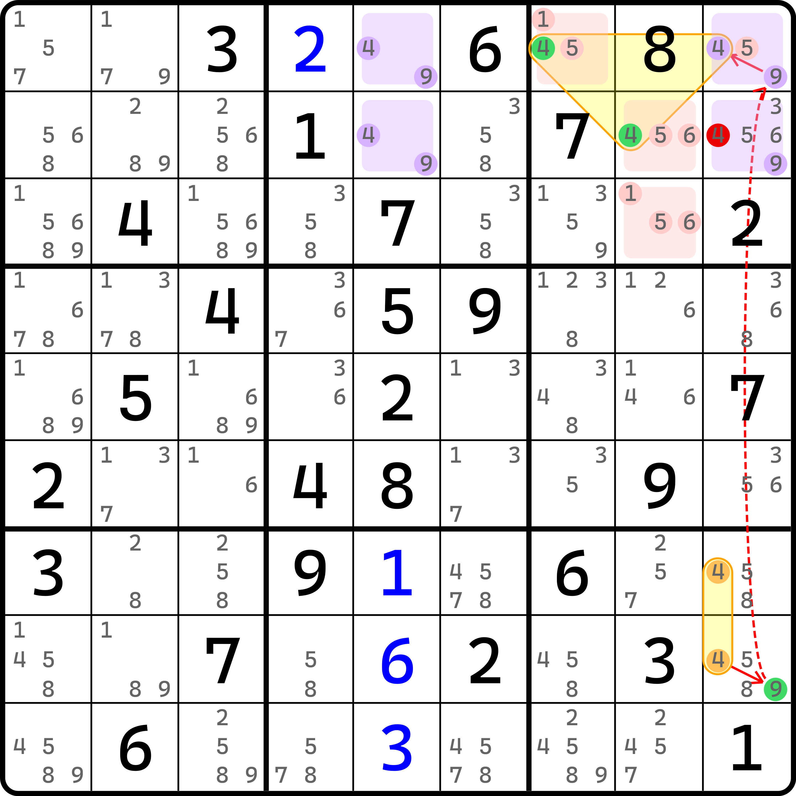
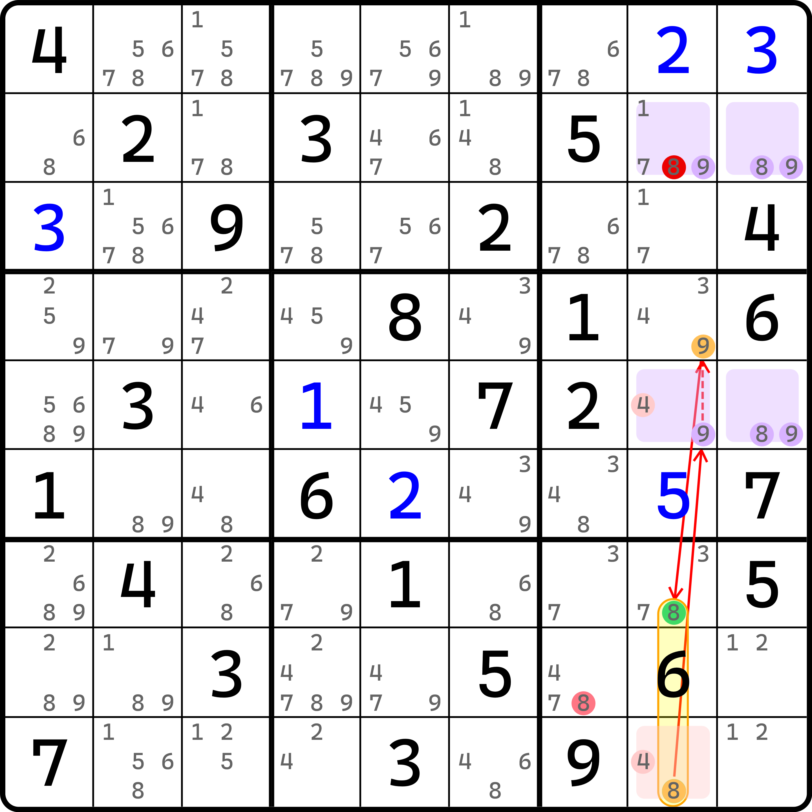
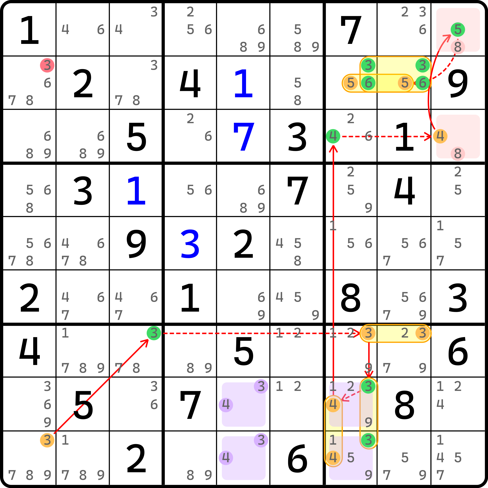
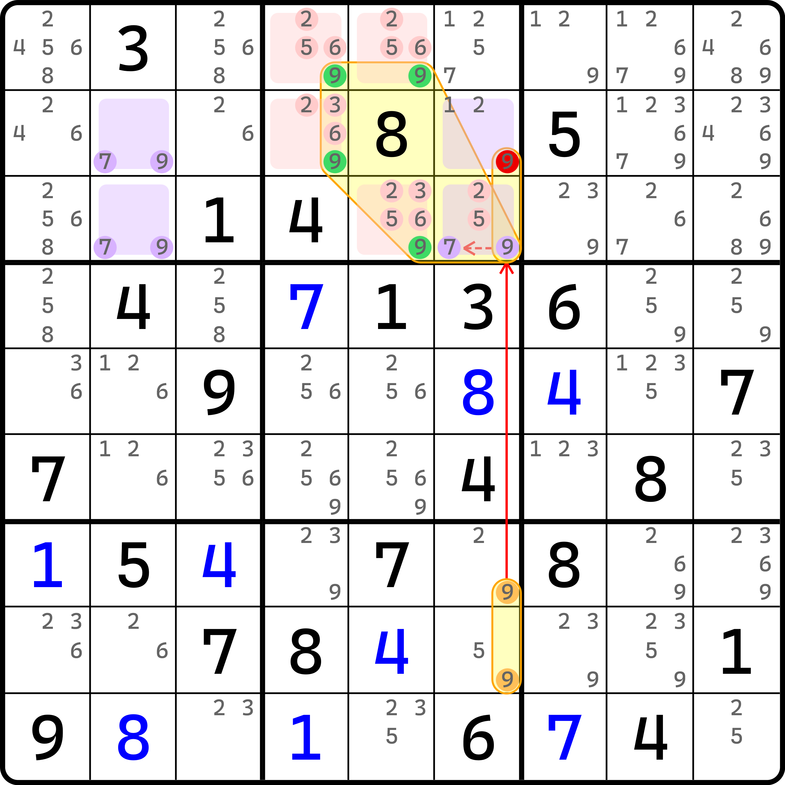

# 待定唯一矩形链（AUR 链）

今天我们继续来学习链理论。前面我们学到了纳入区块和数组作为链推导的一部分的做法，这次我们继续将唯一矩形纳入，看看它还能诞生什么新的推理过程。

## 待定唯一矩形里的强链关系 <a href="#strong-inference-in-almost-unique-rectangle" id="strong-inference-in-almost-unique-rectangle"></a>

<figure><figcaption><p>强链关系例子</p></figcaption></figure>

如图所示。这个链的表示如下：

```
8r2c3=3r2c23-3r2c4=6r9c4-6r9c9=8r59c9
```

我们先看最开始这个强链关系。`8r2c3=3r2c23` 是怎么来的呢？我们可以从图上看到，这是一个用到数字 5 和 9 的唯一矩形，不过 `r2c2` 缺了一个数 9，这并不要紧，因为唯一矩形缺数字是不影响推理的，这一点之前已经说过了。

当 `r2c3(8)` 为假时，唯一矩形必须要求 `r2c23(3)` 至少有一个 3 为真，否则四个单元格仅剩下 5 和 9 引发唯一矩形的矛盾。所以，这个强链是有道理的；当然，你也可以使用第二定义去理解，即证明节点 `r2c3(8)` 和 `r2c23(3)` 不同假。

总之我们得到了 `r2c23(3)` 里必须有一个 3 为真，即 3 在这两个单元格将会形成区块节点，其区块节点为真。于是，`r2c4(3)` 就为假了，因为这个候选数位于区块节点可排除 3 的范围内。后面就和之前待定数组的推理过程一样了，这里就不展开重复说明了。

我们可以看到，这个题里用到了 3 和 8 形成强链关系的用法，而证明这个用法的方式是通过唯一矩形来得到。我们把借用唯一矩形推理的链称为**待定唯一矩形链**（Almost Unique Rectangle Chain，简称 AUR Chain），而把这个题里用到的唯一矩形 `r29c23(59)` 称为**待定唯一矩形**（Almost Unique Rectangle，简称 AUR）。和待定数组一样，待定唯一矩形也是无法单独拿出去推理的，它必须参与到链里作为推理的一部分才可以发挥作用。

下面我们再来看一个例子。

<figure><figcaption><p>另一个强链关系的例子</p></figcaption></figure>

如图所示。这个题就自己看了。不过要注意的是，因为待定唯一矩形的特殊性，强链关系不一定非得发生在同一个区域里。比如这个题它就可以连接两个完全行列宫不相关的地方。

## 还是强链关系，但是线连到外面去了 <a href="#strong-inference-with-one-side-external-link" id="strong-inference-with-one-side-external-link"></a>

<figure><figcaption><p>强链关系，但是一端连出去了</p></figcaption></figure>

如图所示。这个的表示如下：

```
3r5c1=3r7c1-3r78c2=5r5c6
```

可以看到这个例子非常的“异类”。尤其是 `3r78c2=5r5c6` 这个强链关系，突出一个离奇。

实际上这个地方我们要借助一下唯一矩形里共轭对的概念。因为不太方便用第一定义去理解，这里我们还要用第二定义“不同假”来理解这个，会稍微方便一些。

如果我们同时让 `r78c2(3)` 和 `r5c6(5)` 同假，则 `r78c2` 只剩下了 5 和 7（区块节点为假则数字全部消失，这我不用过多重复说明了吧）。那 `r78c6` 呢？此时因为外侧的这个 5 不存在了之后，观察 `c6`，我们可以发现数字 7 原本就是共轭对，而数字 5 因为我们把外部 `r5c6(5)` 设为假了，所以它也没了，此时 5 也变为了共轭对。

两个数都是共轭对意味着什么？隐性数对嘛。这两个数都是共轭对，还都在同样的两个格子里，这不就意味着一个是 5 而另一个一定是 7 么。所以，我们就得到了 5 和 7 只能填进去的效果。结合前面我们假设了 `r78c2(3)` 为假的内容，我们就可以得到，`r78c26` 将只会剩下 5 和 7，导致唯一矩形的矛盾。

因此，这两个节点不能同假，故形成了强链关系。有了这一点后，这个链就连起来了。

这便是强链关系的第二种情况，一边是连在矩形结构的内部（用到矩形四个格子的其中一些格子），一边则是连在矩形外部的。

下面我们再来看两个例子。这个例子也希望你自己看。

<figure><figcaption><p>一头在外面一头在里面的另外一个例子</p></figcaption></figure>

这个例子的链尾非常神奇，它是一个看起来只会出现在待定数组里的、四个候选数在平时做题压根就不会考虑成为节点的节点，但被我们直接拿出来用了。

<figure><figcaption><p>连用两个待定唯一矩形的链</p></figcaption></figure>

再来看一个这个例子。这个例子用了两个待定唯一矩形。这两个待定唯一矩形带来的强链关系均来自于前面这两种情况。可以拿来学习学习。

## 依旧是强链关系，但是线完全在外面 <a href="#strong-inference-with-two-sides-external-link" id="strong-inference-with-two-sides-external-link"></a>

我们再来看一个奇葩的例子。

<figure><figcaption><p>强链两头都在矩形外面的情况</p></figcaption></figure>

如图所示。这个链的写法如下：

```
4r78c9=9r8c9-9r1c9=4r1c79|r2c8
```

这个例子是目前我们链理论里接触过的最离谱的例子。当然，讲完你就明白了，它只是看着离谱。

头部这个强链关系是两个 4 和 9 的强链关系。这看起来非常像是一个待定数组形成的强链关系，但仔细观察可以发现它其实并不是：这两个单元格除了 4 和 9 外还包含了 5 和 8 两个无关的候选数。如果按照纯正的待定数组来看的话，这里最多就只应该有一个多出来的候选数，但这里有两个无关的候选数。或者说，我们要让待定数组形成，我们大不了就去这个列或者宫里找到额外的一个或一组单元格，使得待定数组成立。可怎么找都找不到。所以，使用待定数组的思路是行不通的。那这是怎么形成的呢？

实际上这是待定唯一矩形得来的强链关系。前面我们提到，待定唯一矩形可以让其中一端脱离唯一矩形结构的四个单元格，把节点画在结构的外面去。这个例子则更离谱一些，两头都画在了外面。

原理是这样的。首先，`r12c5` 是一个关于 4 和 9 的显性数对，而要使得 `r12c9` 也只能含 4 和 9，就必须把 `c9` 里其余的 4 和 9 全给干掉。可以发现，除了这两个单元格有 4 和 9 外，就只剩下 `r78c9` 这两个单元格了。假设 `r78c9(4)` 和 `r8c9(9)` 同假，则 4 和 9 在 `c9` 将只能填入到 `r12c9` 里，于是构成了之前说到的 4 和 9 同时都是共轭对在同样单元格的情况。

同样的单元格又是共轭对就意味着这两个单元格是隐性数对。而结合前面说的 `r12c5`，四个单元格就会直接形成唯一矩形的矛盾形式。因此，头部的强链关系就这么得到了。

后面的强链关系则是待定数组得到的，这里就不赘述了。

我们再来看一个例子，也挺抽象的。

<figure><figcaption><p>另一个两头都在结构外面的强链的例子</p></figcaption></figure>

如图所示。这个就自己看了。表达如下：

```
8r9c8=9r5c8-9r4c8=8r79c8
```

看着就挺抽象的。

## 有弱链关系吗？ <a href="#is-there-any-weak-inferences-produced" id="is-there-any-weak-inferences-produced"></a>

待定唯一矩形是否可以构造弱链关系呢？实际上也是可以的，只是不太常见。下面我们就来看一个例子。

<figure><figcaption><p>弱链关系的例子</p></figcaption></figure>

如图所示。这个例子的表示如下：

```
3r9c1=3r7c3-3r7c78=(3-4)r89c7=4r3c7-4r3c9=5r1c9-(5=36)r2c78
```

可以看到，这个题用到的东西还挺多的，一个待定数组，一个毛刺数组，一个待定唯一矩形，以及若干区块节点。虽然绕来绕去只能删一个数，但是它利用到的一个待定唯一矩形的弱链关系就是这里的 `(3-4)r89c7` 了。因为左侧 `r89c5` 两个单元格仅有 3 和 4，所以一定是显性数对；而对于右边这两个区块节点，如果这两个区块节点同为真，则意味着两个单元格必须一个是 3 一个是 4，则一定矛盾。

虽然这个思路非常新颖，但是奈何它用到的是弱链关系，因此出现频率非常低，平时做题之中也很难遇到它。对于这个题来说，它也能用更短且不用待定唯一矩形结构就可以绕过这个删数。总之就是在做题的时候很难遇到。

我们再来看一个例子。

<figure><figcaption><p>另一个用弱链关系的例子</p></figcaption></figure>

如图所示。这个例子稍微看着有点别扭。它的写法如下：

```
9r78c6=9r23c6-7r3c5=9r1c45|r2c4|r3c56
```

中间的 `9r23c6-7r3c5` 用的是这个待定唯一矩形的弱链关系，最后这个强链关系产生自待定数组。因为头尾分别是 `r23c6(9)` 和 `{r1c45, r2c4, r3c56}(9)`，所以交集的删数是 `r2c6 <> 9`。
