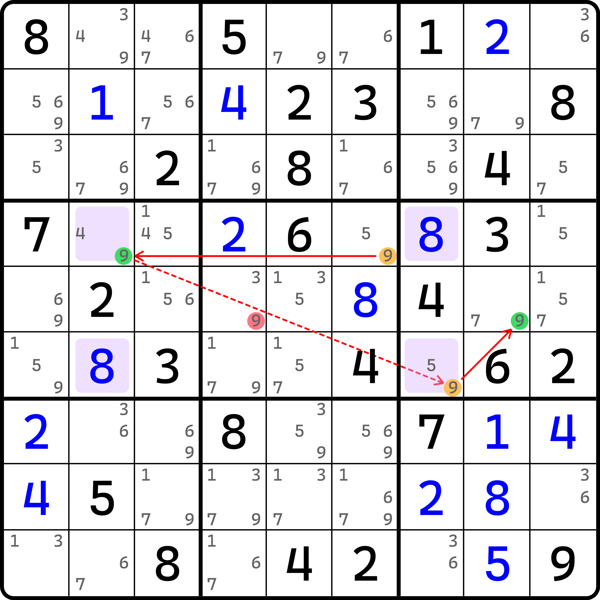
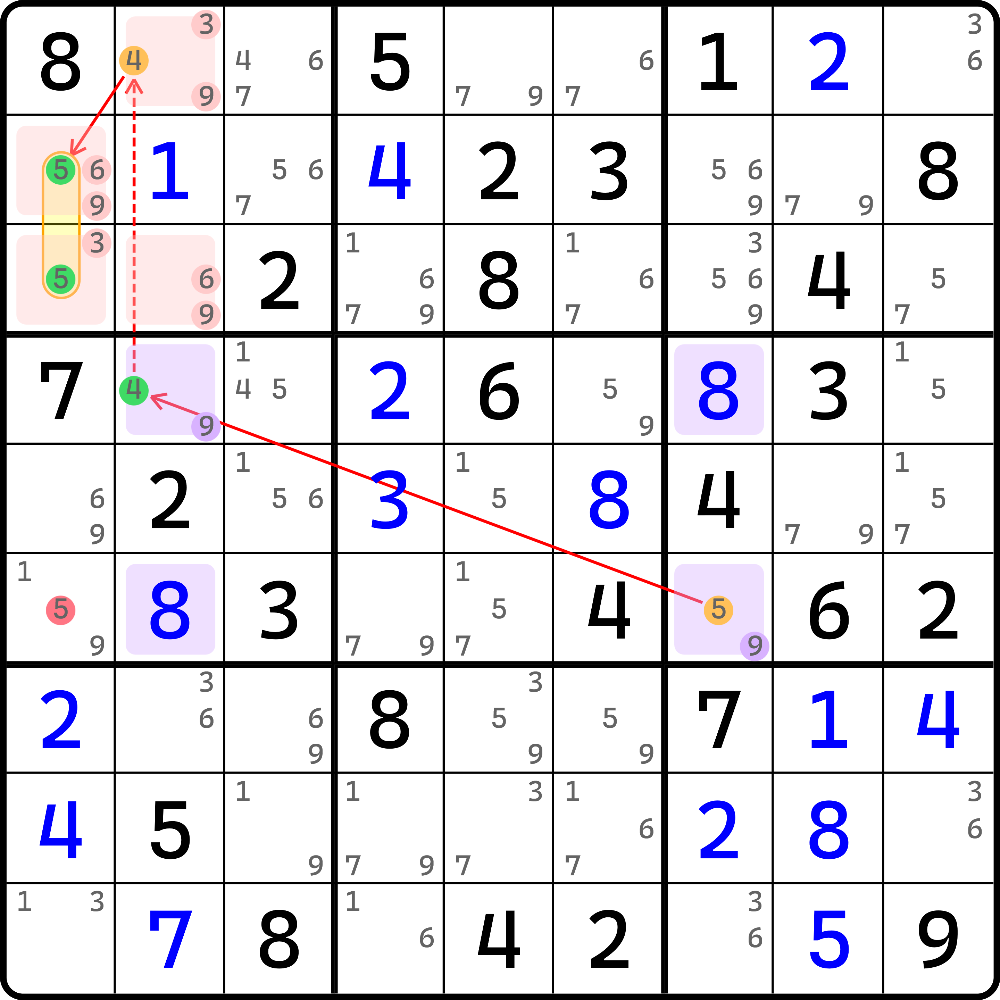
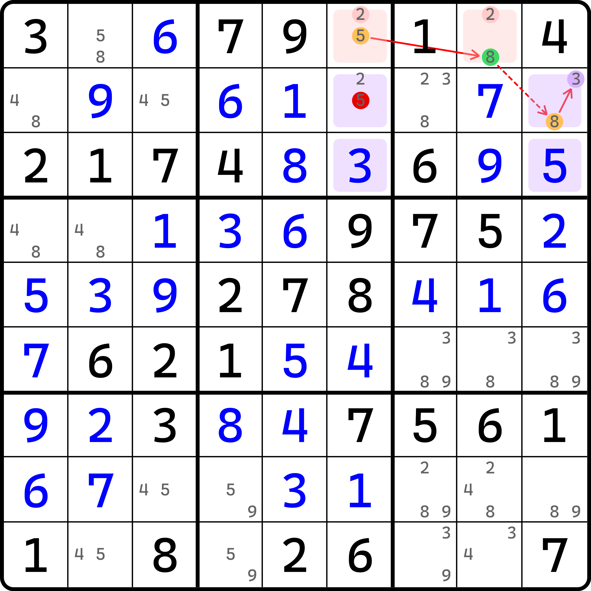

# 待定可规避矩形链（AAR 链）

今天来看一篇短小的内容。因为这种用法并不算多，所以本文只有一个例子。

## 待定可规避矩形的弱链关系 <a href="#weak-inference-in-almost-avoidable-rectangle" id="weak-inference-in-almost-avoidable-rectangle"></a>

<figure><figcaption><p>弱链关系</p></figcaption></figure>

如图所示。链的写法如下：

```
9r4c6=9r4c2-9r6c7=9r5c8
```

其实还算一个比较简单的链，只有两个强链关系。不过这个链里用到的弱链关系是直接连接了完全不相关的候选数 9。这个其实是可规避矩形的功劳：如果 `r4c2` 和 `r6c7` 都填 9，则四个单元格 `r46c27` 将构成关于 8 和 9 的可规避矩形的矛盾情况。所以这两个 9 是不同真的。不同真即为弱链关系，所以我们可以直接串到链里使用。

我们把这个图里 `r46c27` 四个单元格的候选数 8 和 9 这种结构称为**待定可规避矩形**（Almost Avoidable Rectangle，简称 AAR）；而把使用了待定可规避矩形的链就称为**待定可规避矩形链**（Almost Avoidable Rectangle Chain，简称 AAR Chain）。

因为待定可规避矩形出现频次极低，在实战里也较少应用，因此例子并不多。

## 待定可规避矩形的强链关系 <a href="#strong-inference-in-almost-avoidable-rectangle" id="strong-inference-in-almost-avoidable-rectangle"></a>

<figure><figcaption><p>强链关系</p></figcaption></figure>

如图所示。这甚至还是刚才那个题。链的写法如下：

```
5r6c7=4r4c2-4r1c2=5r23c1
```

这次我们用一下里面的强链关系。刚才我们不是用到了弱链关系不同真的逻辑吗？这次我们不看这两个 9 的关系。我们发现，这两个空格上都还包含一个多出来的候选数。显然，这两个候选数是不同假的。同假就意味着两个单元格变为唯一余数，则必须填 9 致使出现矛盾。

然后，我们利用这个强链就可以得到这个题里的删数结论了。

## 拓展删数 <a href="#extended-elimination" id="extended-elimination"></a>

我们继续来看强链关系，不过我们换一个用法。

<figure><figcaption><p>删数方式的拓展</p></figcaption></figure>

如图所示。这个题的写法如下：

```
5r1c6=8r1c8-(8=3)r2c9
```

这个题的链看起来其实倒还好，但是删数选择的单元格却比较奇怪：`r1c6(5)`。

按照链的头尾删数取交集的逻辑来看，链头确实可以删掉这个 5，但链尾不是 3 么？怎么还能删这个 5？本质原因在于这个 5 是可规避矩形这个逻辑才能产生的删数。如果链尾 `r2c9(3)` 为真，则根据可规避矩形的逻辑，我们需要去掉候选数 `r2c6(5)`。否则，让它填入就会直接造成矛盾。

这是我们第一次接触到头尾删数取交集不能直接使用链的方式得到的例子。这种删数方式并不多见，但他们偶尔也会在链里遇到，所以希望你能掌握。
