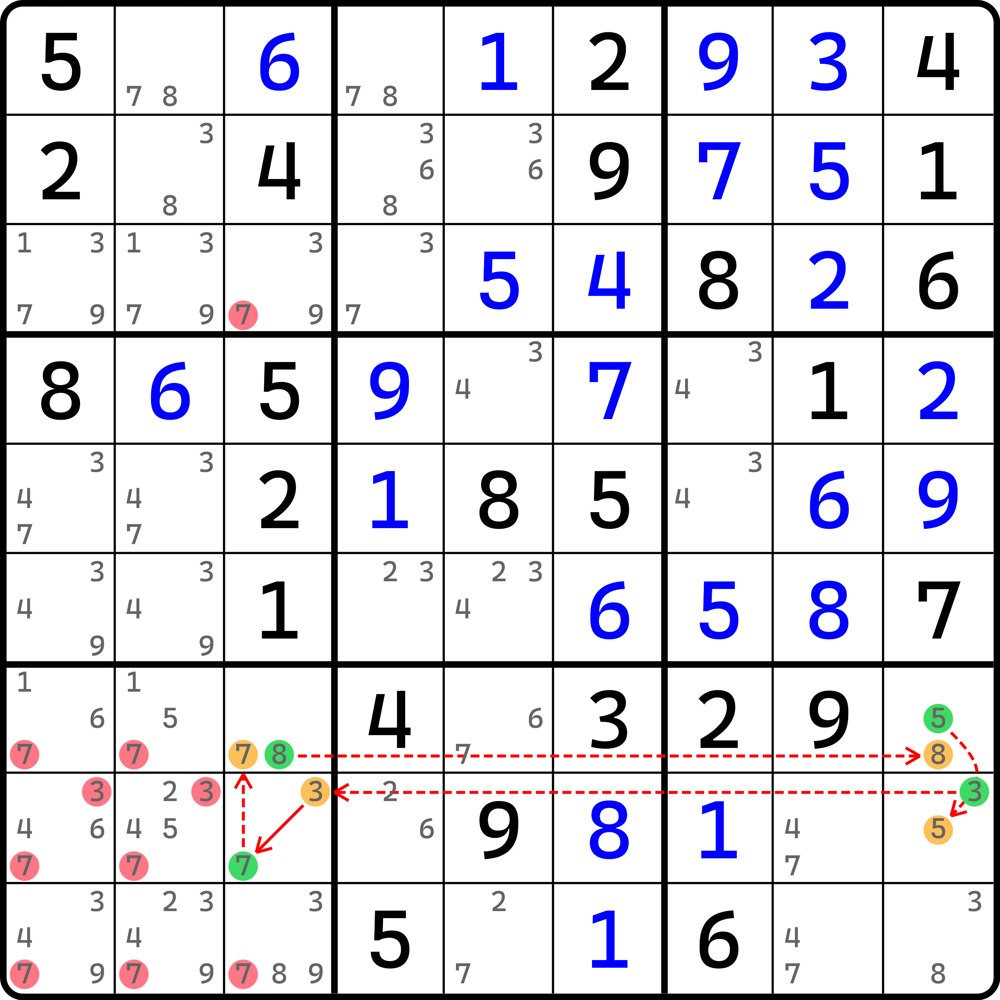

# 环的基本推理

什么是环呢？我们先来看一个例子。

## 连续环（Continuous Nice Loop） <a href="#continuous-nice-loop" id="continuous-nice-loop"></a>

<figure><figcaption><p>连续环</p></figcaption></figure>

如图所示。这是一个普通得不能再普通的环。红色的全是删数（一共有 11 个），不过我们得一点一点来学。这个环的写法如下：

```
(8=7)r1c2-7r3c1=(7-1)r6c1=(1-2)r6c2=2r6c5-(2=3)r5c4-(3=5)r7c4-5r7c6=(5-8)r4c6=8r1c6-8r1c2
```

我们发现，这个链的强弱关系完全交替进行，但我们绕着环看一整圈都未必能发现起点在哪里。既然如此，我们为了强制能看成链，我们任意拆掉其中一个弱链关系，把它断开，因为断开的是弱链关系，所以头尾的强链关系得以保留，链仍然可以成立。

就这么干。我们发现，比如我们断开 `8r1c2-8r1c6` 这个弱链关系，那么这个环就会从 `r1c2(8)` 开始往下走，然后走了一条很长的链回到 `r1c6(8)` 结束。此时，因为链是成立的，所以删数应该看的是头尾的交集。链头是 `r1c2(8)`，而链尾是 `r1c6(8)`。他们同在一个行上（这不废话吗？）。所以，同一行上的其余位置的候选数 8 理应是可以去掉的。这样我们就得到了 `r1c9 <> 8` 的结论。

看起来，这个环路因为强弱是完全交替的，所以看起来似乎断开哪一个弱链关系都不会影响到链的成立。那么我们把所有弱链每一个都断开一下，然后去找删数。我们就可以发现，把他们每一个断开后找到的删数序列全部整理出来，便是这个图里画出来的所有红色的删数。

这里要补充一点：千万别忘了单元格里的删数。比如例子里 `r6c1(3)` 可以删，它删数的由来是断开了 `(7-1)r6c1` 这个弱链关系得到的。而因为链的头尾均在同一个单元格，所以这个单元格里必须填一个 1 或 7，所以别的候选数都填不进去。

我们把这个技巧称为**连续环**（Continuous Nice Loop，简称 CNL），一般也简称为环。

实际上，环的极限远不止这样。下面我们来看一个例子，一共有 17 个删数。

<figure><figcaption><p>删 17 个数的连续环</p></figcaption></figure>

你可以自己看看这个例子。虽然看着挺复杂的，但是好在它其实就是多用了几次强弱链关系的编排方式而已，只要链能看明白，环肯定就能看明白。

## 环的一些特征 <a href="#features-of-loop" id="features-of-loop"></a>

从前面的例子可以看出来，环具有如下的一些特征：

* 任意弱链关系都可以拆掉，剩下的都将构成一个链；
* 环里的所有弱链关系都可以转化为强链关系；
* 环的节点数和强弱链关系个数都一定是偶数；
* 环里任意相邻两个节点的真假性互斥；
* 环只有两种填数状态；
* 任意节点都可以作为整个环的开头。

这第一个说法是废话，因为我们利用的就是这个特征在解释环的删数原理，所以我们就不解释了。不过这里我们可以补充一下。因为环的所有弱链关系均可断开并使用链的删数规则找删数，那么在删数完成后，你再去看这个弱链关系你就会发现，弱链此时会变为强链关系，因为这两个节点不存在其他位置摆放，直接就使得了不同假的状态的成立，这便是第二点“可转化为强链关系”的真正原因。所以，这一句话倒也不完全是废话。

### 长度和节点数为偶数 <a href="#length-of-loop-is-an-even-number" id="length-of-loop-is-an-even-number"></a>

这个稍加思索就可以得到。因为强弱链需要交替成环，那么强弱链的关系数量一定是一样多的。既然是一样多的，假定我们有 $$n$$ 个强链关系和弱链关系，那么总数量就是 $$n + n = 2n$$ 个。这肯定是一个偶数。

而在环里，因为不存在独立的节点，所以一个节点引出一个强链关系或一个弱链关系，自然也得是 $$2n$$ 个。所以节点数也是偶数。

### 相邻节点真假性互斥 <a href="#exclusive-state-in-adjacent-node" id="exclusive-state-in-adjacent-node"></a>

从客观角度来说，一个节点的真假性一共就只有两种：真或假。那么对于两个节点而言，就会有四种情况：真和真、真和假、假和真、假和假。

对于强链关系而言，两个节点必须不同假，因此四个组合里排除掉“假和假”这个情况，还剩下三种满足题意。而它俩能同真吗？看起来可以，但实际上不能。因为节点数量是偶数个，所以只有可能真假性交替出现才能导致环的结构稳定。如果某相邻两个强链关系节点是同真的状态，则这个环就没办法顺次成环状态推导了，毕竟，链理论要求我们按填和不填交替推理，自然在环里就不可能存在相邻节点同真的状态。这一点和普通的链还是不一样的。

所以，两个节点只可能一真一假，即互斥的状态。

### 只有两种填数状态 <a href="#only-two-states-of-loop" id="only-two-states-of-loop"></a>

既然我们知道相邻节点的填数状态必然互斥，那么整个环又要保证真假性交替出现，自然就只有两种填数可能。我们随意选一个节点开始，设它为假，那么真假性交替起来之后，就会得到一个序列：

* 假、真、假、真、假、真、……、真

如果我们再设它为真，就会得到完全相反的序列：

* 真、假、真、假、真、假、……、假

因为是偶数个节点，所以头尾两个节点真假性必然也是相反的，因为它俩客观来说是在环里是相邻的节点。于是，环就只有这两种填法。

### 任意节点都可作为环的头 <a href="#any-node-can-be-head" id="any-node-can-be-head"></a>

然后是最后一条。这一条稍微麻烦一些。它需要链的双向性来得到证明。

我们先来回顾一下链的双向性。由于链使用的强弱链关系在定义上是方向对称的。所谓方向对称，就是说你正向和逆向都可以使用同一个规则进行推导。比如强链关系，能从 $$A$$ 到 $$B$$ 就一定也能从 $$B$$ 到 $$A$$。正是因为这个原因，再加上链自身强弱关系的摆放也是对称的（强 - 弱 - 强 - 弱 - 强等等），所以链自身也具备可以逆向推理的过程，即正向的链可以进行正常推导，则逆向的也可以推导。

那么，对于环而言，所有同一个真假性的节点一组，就会把节点分为两组。环的推理是不知道从哪里开始的，那么我们不妨就让所有真假性为假的这一组节点作为链头。这样我们按照链的正常方向就可以得到一条完整的环。那么对于真假性设为真的这一组节点呢？我们只需要把环给完全反个向，此时设为真的节点就会变为设为假。

我想你估计可以理解它，但我还是把这句话给解释一下。因为按照链的基本规则，我们必须要以强链起头，所以设为真的这一组是没办法按预设的那个方向推导的（它起步就为真，但链的起步必须是假）。那么反向之后，强链关系毕竟不会受到反向的影响，所以强链关系依旧成立。比如说我们有 $$A$$ 和 $$B$$ 两个节点是强链关系。那么原本我们假设的是 $$A$$ 节点为假和 $$B$$ 节点为真，现在我们反向了之后，$$B$$ 节点就会变为强链的开端，而 $$A$$ 节点此时反而放在了 $$B$$ 的后面。而强链关系是开端的一边设为假的，所以变为 $$B$$ 节点开始时，它理应设为假。这就是我刚才说为啥原本设为真的会变为假的原因。当然，这里你也可以使用逆否命题来理解：$$\lnot A \to B$$ 的逆否命题是 $$\lnot B \to A$$，这个更靠近数学说法一些。

随便你怎么理解吧，反正它的真假性会因为反向后变为假，所以理应所有节点都是有假这个状态的，所以他们都可以作为环的开头而存在。

所以，环是没有逻辑上的“链头”的，任意一个节点都可以开头，只是说它最多会取决于你选取的环的方向罢了。

## 鱼环（Fishy Cycle） <a href="#fishy-cycle" id="fishy-cycle"></a>

为了技巧的完整性，这里我们再补充一个技巧。

<figure><figcaption><p>鱼环</p></figcaption></figure>

如图所示。这是一个环，不过环内只用了一种数字。我们把这个称为**鱼环**（Fishy Cycle）或者**同数环**（X-Cycle）。还记得鱼吗？鱼这个技巧就只用同一种数字，所以这个环是想说明它跟鱼一样只用一种数字。

我们再来看一个**区块鱼环**（Grouped Fishy Cycle），或者叫**同数区块环**或**区块同数环**（Grouped X-Cycle）。

<figure><figcaption><p>区块鱼环</p></figcaption></figure>

如图所示。这个就稍微带了个区块罢了。

## 双值格环（XY-Cycle） <a href="#xy-cycle" id="xy-cycle"></a>

下面我们再来看一个例子。

<figure><figcaption><p>双值格环</p></figcaption></figure>

如图所示。这是一个**双值格环**（XY-Cycle），即双值格链的基础上成环，所有强链均发生在同一个单元格内。

## 其他问题 <a href="#other-questions" id="other-questions"></a>

### 英文名里我们应该用 Loop 还是 Cycle？ <a href="#loop-or-cycle" id="loop-or-cycle"></a>

可能你看完了整篇内容会发现一个问题。文章开始那里还在用 loop 来表示环，怎么到这里新补充的两个技巧的技巧名怎么用的是 cycle？这到底应该用哪一个单词？

这个其实说来话长。非要强行概括的话，你可以认为是历史因素。实际上，loop 和 cycle 均可表示环，也都没有问题，甚至还可以用 ring 来表示环。这三个单词在技巧名称上使用均不会造成问题，比如你说 X-Loop 而不是 X-Cycle，也并不会有问题。但是，一般是因为叫某个说法的人多了，所以就约定俗成使用了这个说法。

本来名称这个东西就没有什么对错，你喜欢你叫什么都行。但是，按照学习的角度去看的话，因为更多人叫它 X-Cycle（用 cycle）、XY-Cycle（用 cycle）、Continuous Nice Loop（用 loop），所以我们就采用更多人的叫法。非要说区别的话，你可以认为是不同的人群导致的倾向性。比如三款不同的数独分析软件 HoDoKu、Sudoku Explainer 和 XSudo 里，HoDoKu 用 loop 更多，Sudoku Explainer 用 cycle 更多，而 XSudo 用 ring 更多。

### 环的尤里卡记法

对于环而言，尤里卡记号并未拥有一个严格的限制，因为强弱链交替的缘故，链尾是可以用弱链连回链头的。

本教程从约定俗成的角度出发，仍然按照链头强链关系起步的逻辑进行描述，直到到最后一个节点时，比正常的链多一个弱链关系表示它连回链头的过程，这样的方式用来区分链和环。例如最开始的例子里，开头是 `(8=7)r1c2`，最后是 `8r1c6-8r1c2`，描述了连回链头 `r1c2(8)` 这个节点。
