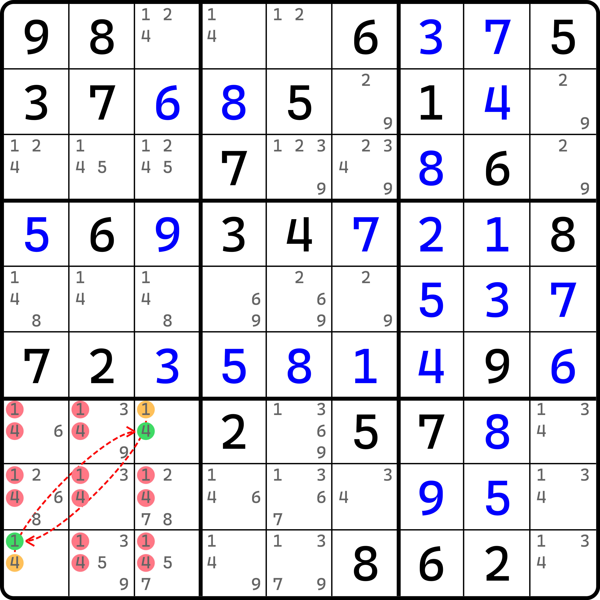
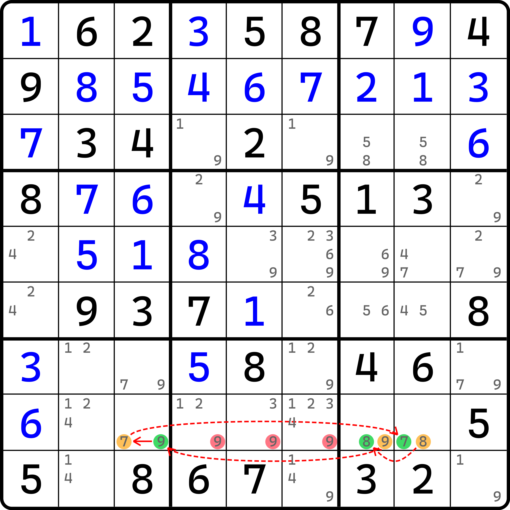
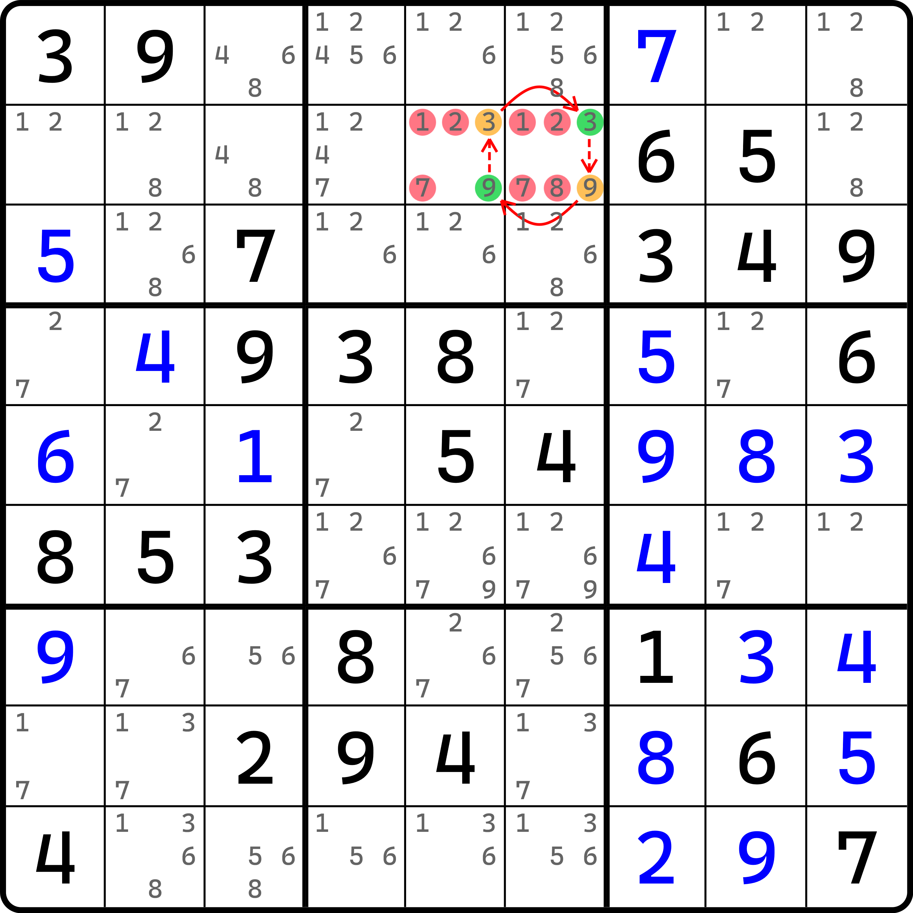
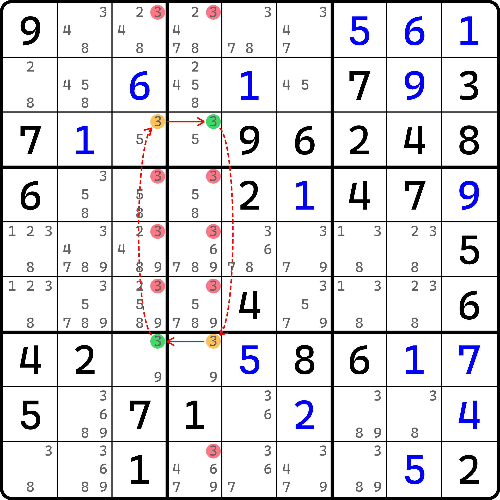
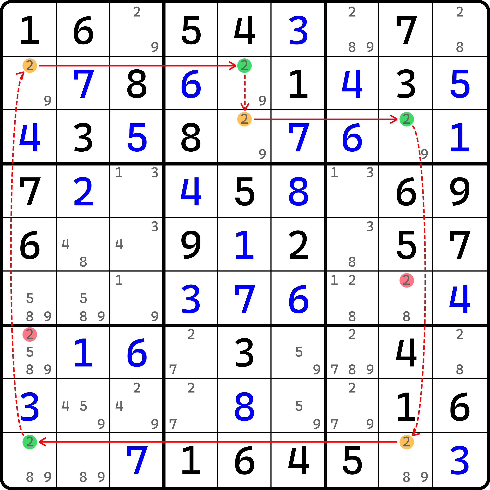
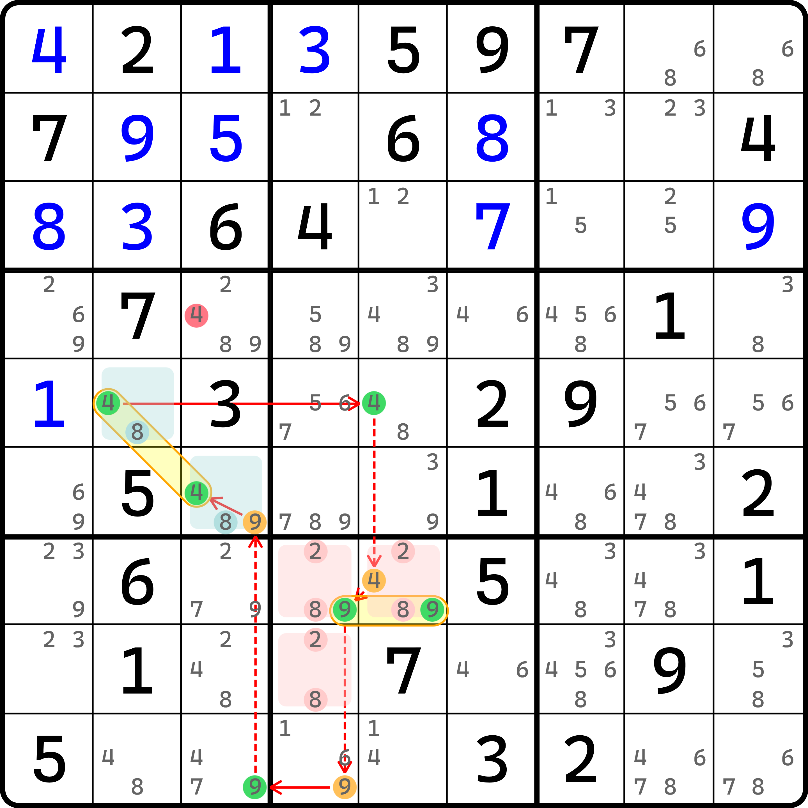

# 各种技巧的环的视角

之前我们学习了环的推理过程，那么接下来我们来看看一些之前学过的数独技巧，它们都有什么样子的环的视角。

本篇的内容不一定非得需要单独学习，因为他们在实战里并不会用到，但为了扩充你对环的理解思维和方式，所以临时添加了这篇内容。

## 数组 

最熟悉的就是数组了。实际上，数组的双值格其实就对应了链的强链关系；而弱链关系则是两个相同数字之间的连接。我们来看一个例子。

<figure><figcaption>
显性数对的环视角
</figcaption></figure>

如图所示。显性数组如果要用环的方式画出来就得这么画。

尤其需要强调的是，环因为强链关系的缘故，数组暂时只有双值格的数组能转化为环的视角。像是三数组那种单元格是三值格而不是双值格的情况，因为有三种数字的存在，所以是不能转换的。

不过，双值格三数组是可以的。比如这个例子。

<figure><figcaption>
双值格显性三数组的环视角
</figcaption></figure>

如图所示。

另外，隐性数组也是可以的，不过我们需要把强链关系从单元格内调到数字之间，就好比是把刚才显性数对里的那个弱链的位置更换为强链关系即可。

<figure><figcaption>
隐性数对的环视角
</figcaption></figure>

## 鱼 

是的。鱼也是有环的视角的。我们先来看二阶鱼。

<figure><figcaption>
二阶鱼的环视角
</figcaption></figure>

如图所示。我们只需要把 `r37` 这两个作为假设排列的区域改造为强链关系、然后用弱链把四个候选数连起来即可。

和前面数组的要求类似，鱼也需要要求假设排列的地方只能有两处才能转换为强链关系。如果可以的话，更高规格的鱼也是可以转的，比如这个三阶鱼的例子。

<figure><figcaption>
三阶鱼的环视角
</figcaption></figure>

如图所示。

## 欠一数对 

还能转为环视角的技巧还有一个，欠一数对。这似乎很意外，但我们来看一个例子就知道了。

<figure><figcaption>
欠一数对的环视角
</figcaption></figure>

如图所示。这是一个欠一数对（的环的画法）。我们刚才大概看出了环视角下强链弱链关系在数组和鱼里的体现，所以对于欠一数对而言，它的体现理应也可以等价改为环里的强弱链关系。比如这个题里，假设我们选取 `r6c7` 是隐性的一边，而 `r9c9` 是显性的一边，那么我们需要依赖 `c7` 上 2 和 8 的位置关系（此时两个数都是共轭对），便会得到这样一个由 6 个节点构成的环。删数是所有弱链的位置可以删的地方，不过不巧的是这个题就只有 `r9c8 <> 8` 这一个删数。

这便是欠一数对的环的画法。

我相信，三个技巧足以阐述我想表达的东西。下一节我们继续探讨环的使用，不过我们想给各位拓展一些技巧构造，一些不方便放在前面一个大板块里的技巧，用环表明它的使用。
