# 区块环

下面我们继续来看一些环里带有区块的情况。

## 区块环的删数逻辑 <a href="#elimination-rule-on-grouped-continuous-nice-loop" id="elimination-rule-on-grouped-continuous-nice-loop"></a>

我们先来学习区块环的形成和删数。

<figure>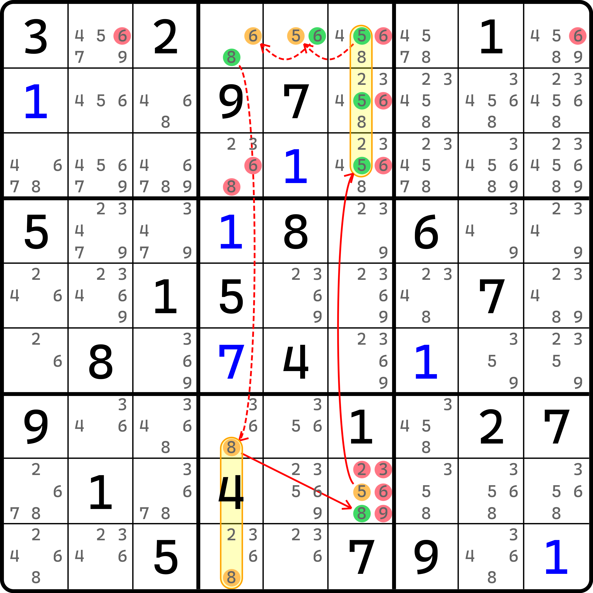<figcaption><p>区块环例子</p></figcaption></figure>

如图所示，这个环的写法如下：

```
(6=8)r1c4-8r79c4=(8-5)r8c6=5r123c6-(5=6)r1c5-6r1c4
```

这是一个很简单的环。而按照区块链的删数逻辑来看的话，我们照样使用环的先拆弱链关系然后找删数的方式来看，这个题的删数就可以完整找出，也不存在特殊情况：

* `6r1c4-6r1c5` 可以删除 `r1` 和 `b2` 里其余位置的 6；
* `8r1c4-8r79c4` 可以删除 `c4` 里其余位置的 8；
* `(8-5)r8c6` 可以删除 `r8c6` 里除了 5 和 8 外的其余候选数；
* `5r123c6-5r1c5` 可以删除 `b2` 里其余位置的 5。

整个环一共有四个弱链关系，把他们的删数全部排列起来，一共有 11 个删数。

我们把带有区块节点的环称为**区块连续环**（Grouped Continuous Nice Loop，简称 GCNL）。可以看出，区块连续环的本质还是和普通的连续环完全一样，按弱链删数即可。只是说因为有区块的存在，删数的区域、位置可能都会受到限制。这似乎还比较容易，下面我们来看一些复杂的情况。

## 待定数组的环 <a href="#almost-locked-set-loop" id="almost-locked-set-loop"></a>

<figure>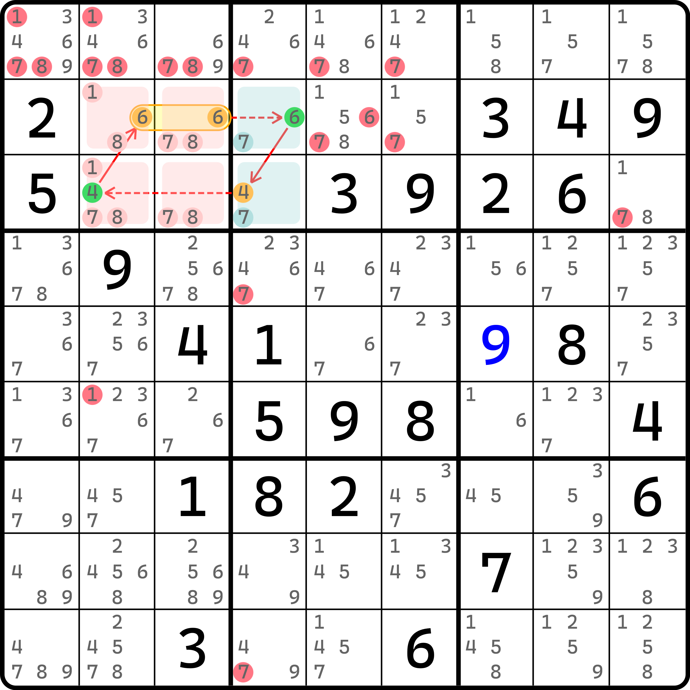<figcaption><p>ALS-XZ 环</p></figcaption></figure>

如图所示。这是一个环，它的写法如下：

```
4r3c2=6r2c23-6r2c4=4r3c4-4r3c2
```

我们随意拆掉一个弱链关系就可以发现，它其实是普通的 ALS-XZ。

> 这技巧名实在是太长了，我实在是不想写它的中文名，还是用英文称呼吧。

但因为弱链关系摆放的特殊性，所以弱链又能连进去，形成区块连续环的模式。

那么删数怎么删呢？如果我们直接按照普通连续环的逻辑进行删数，这个题就只会有一个删数：`r2c5 <> 6`。但很显然，这个题长这么特殊肯定不止删这一个位置。

我们仔细分析一下待定数组在环里的效果。之前我们学到环的时候我们知道，环内相邻两个节点的真假性一定是相反的，这意味着，对于这个环而言，四个节点只有可能有这两种情况：

* `r2c23(6)` 和 `r3c4(4)` 两个节点为真；
* `r2c4(6)` 和 `r3c2(4)` 两个节点为真。

我们之前说过，待定数组的强链关系的形成需要依赖的是两种不同数字。比如这个例子里 `r23c23` 里是所有数字 4 的位置和所有数字 6 的位置，他们两组单元格构成节点，然后他们形成强链关系。因为待定数组的数字种类数是会比单元格数量多一个单位量的，所以我们可以利用这一点来分析这个待定数组。

我们再回到环的这两种填法状态来看下。为了方便描述，我把待定数组的数字分为三组。拿 `r23c23` 这个待定数组举例的话：

* 第一组数字 $$A$$ 里只包含一个数字 6；
* 第二组数字 $$B$$ 里只包含一个数字 4；
* 第三组数字 $$C$$ 则是这个待定数组里的其余数字。

因为环的特征，显然 $$A$$ 和 $$B$$ 的真假性互斥，所以它俩只会有一个是为真的。而按数字分组的话，$$C$$ 这一组里现在只会有 3 种数字（一共有 5 种数字，而 $$A$$ 和 $$B$$ 因为要形成强链关系用掉了俩，所以还剩下 3 种）。而既然 $$A$$ 和 $$B$$ 是互斥的，所以能纳入到待定数组里填入的只有一种新的数字；算上 $$C$$ 这一组 3 种数字，刚好有 4 种数字会参与出现在这个环里；而刚好 `r23c23` 这个待定数组只有 4 个单元格，因此此时在环里，它会退化为一个标准的显性四数组结构，只是此时我们并不知晓 $$A$$ 还是 $$B$$ 究竟是哪一个在其中为真。但是，我们知道的是，肯定 $$C$$ 里的所有数字都是会出现的。

所以，这个题里多出来的很多删数来自于待定数组退化为数组的删数；而删数的数字来源都是从 $$C$$ 这一组里拿出来的。比如这个例子的 `r23c23` 里 $$C$$ 这一组只有 1、7、8 三种数，所以，`r1c123(178)` 的删数全部来自于这个待定数组。哦对，别漏了下面 `r6c2(1)`（因为待定数组里的 1 只出现在 `r23c2` 里，所以当数字 1 一定为真时，数字 1 就变为了区块来删数）。

这是 `r23c23` 这一边。然后还有一个待定数组是 `r23c4` 这里。对于这个待定数组而言 $$C$$ 这一组只有一个数字 7，所以删数就只删数字 7 作为区块的时候的删数。

最后把两组删数放到一起，便构成了这个题的所有删数。数数看，一共有 18 个删数呢！

这里我们补充一个之前没有提及的术语。在 ALS-XZ、ALS-XY-Wing 和 ALS-W-Wing 这种只使用待定数组构成的强链关系的技巧里，我们把其中弱链连接的两种数字称为**严格共享候选数**（Restricted Common Candidate，简称 RCC）。一般而言，对于 ALS-XZ 技巧只会有一个严格共享候选数的，但是对于它的环来说（比如这个例子里就是 ALS-XZ 的环），它就有两个严格共享候选数 4 和 6。

从这个术语角度来说，ALS-XZ 也有两种情况：

* **单严格共享候选数待定数组 XZ 逻辑**（Singly-Linked Almost Locked Set XZ Rule）
* **双严格共享候选数待定数组 XZ 逻辑**（Doubly-Linked Almost Locked Set XZ Rule）

因为术语足够长，所以这促成了这个技巧成为数独技巧体系里名称最长的数独技巧。

> 这个术语早期是在定义待定数组体系架构时才产生的，主要还是在于表示删数规则的时候才可能会派上用场；但现如今待定数组的体系比较庞大，而待定数组链也不再只是纯正的只用待定数组构成强链关系来构成一条完整的链了，所以渐渐地，这个术语就比较少用到了。所以之前教程内容并未单独针对这个术语进行说明。

下面我们再来看一个例子，也是 ALS-XZ 的环。

<figure>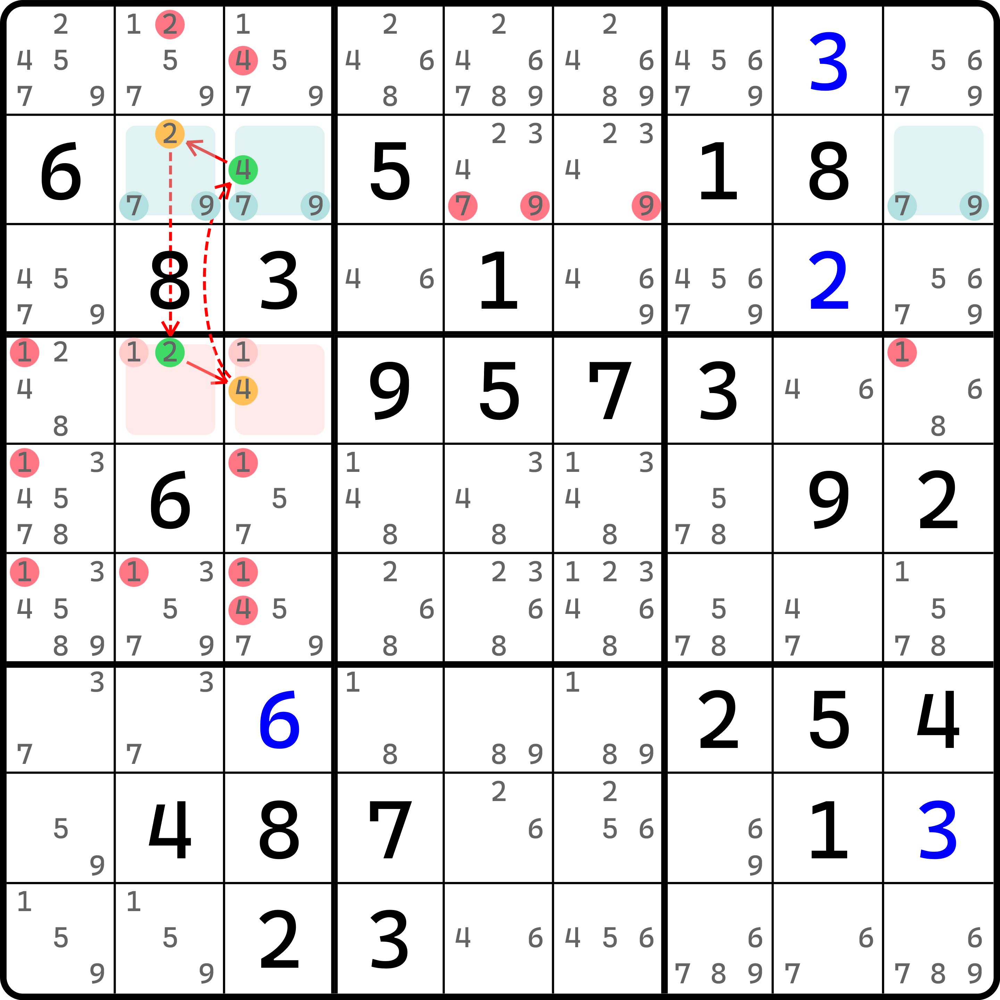<figcaption><p>另一个 ALS-XZ 的环</p></figcaption></figure>

如图所示。这个技巧的删数就自己看了。

下面我们来看一个普通的、带有待定数组的连续环。

<figure>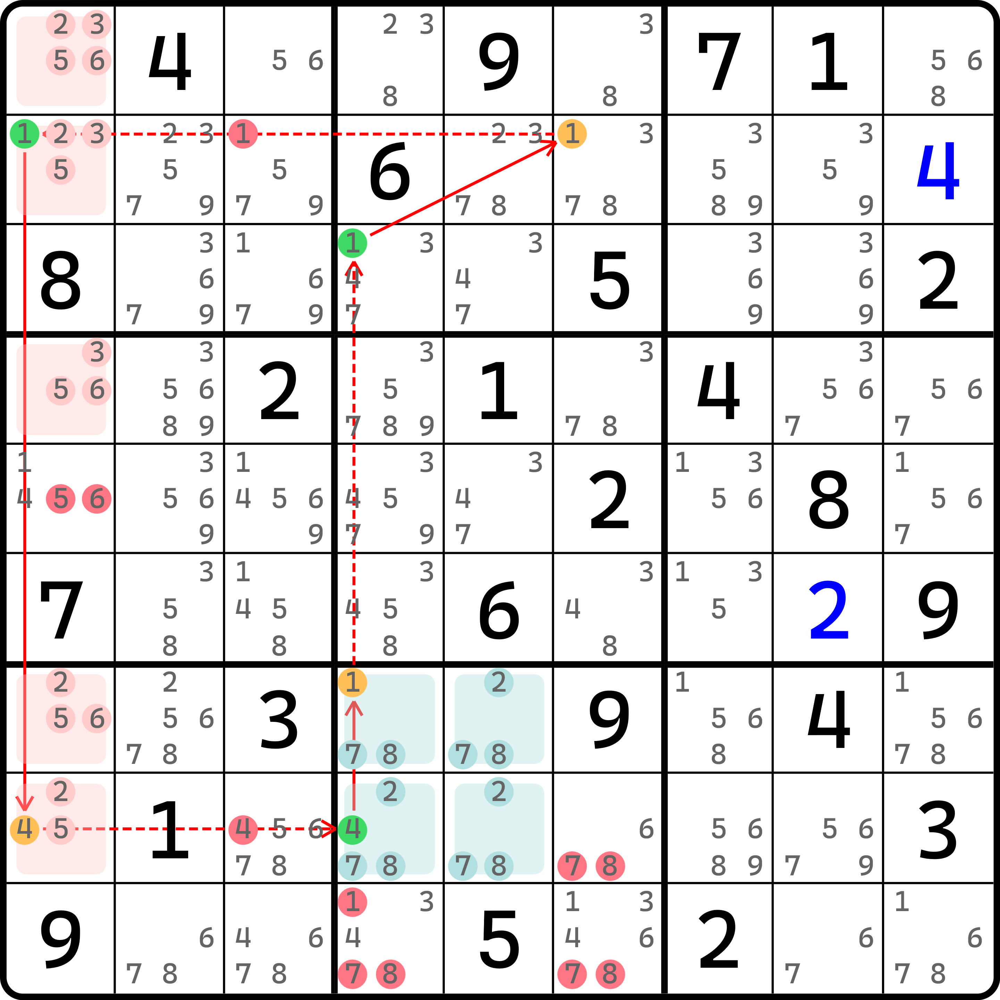<figcaption><p>带待定数组的连续环</p></figcaption></figure>

如图所示。环的写法如下：

```
1r2c1=4r8c1-4r8c4=1r7c4-1r3c4=1r2c6-1r2c1
```

和之前从 ALS-XZ 环里学到的删数方式完全一样，只是这个例子除了用待定数组构成强链关系外，也有普通的强链关系。

我们再来看一个例子，不过就自己看了。

<figure>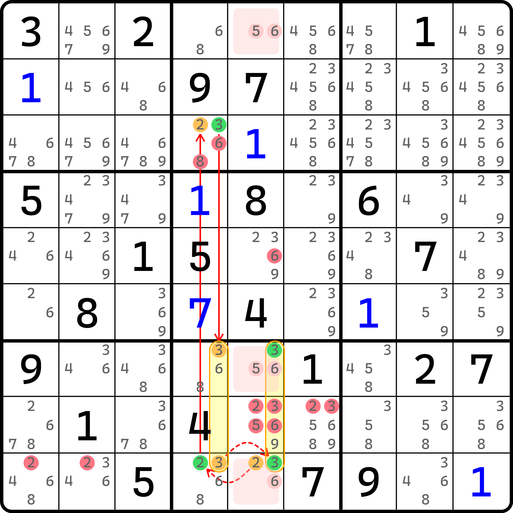<figcaption><p>另外一个待定数组环</p></figcaption></figure>

如图所示。

## 待定唯一矩形的环 <a href="#almost-unique-rectangle-loop" id="almost-unique-rectangle-loop"></a>

我想我已经充分表示了我想说的内容。下面我们来看待定唯一矩形的环。

待定唯一矩形的环，要找它的额外删数就需要一定的穷举了。这和待定数组不同，待定数组虽然证明过程较为复杂，但结论是可以直接背下来，下回照着用的；但待定唯一矩形因为强链弱链关系的类型比较多，所以会麻烦不少。如果纯凭肉眼是看不到这个删数的，它需要一点“技巧”。

### 待定唯一矩形内部的强链关系 <a href="#internal-strong-inference" id="internal-strong-inference"></a>

<figure>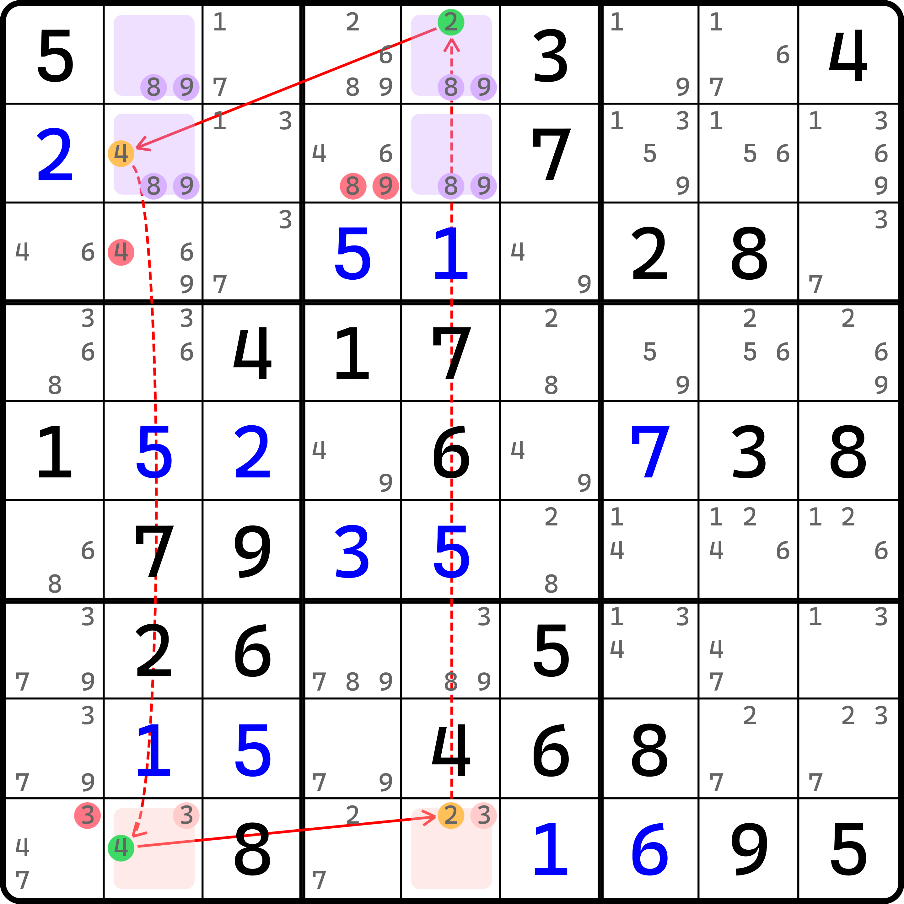<figcaption><p>待定唯一矩形的环</p></figcaption></figure>

如图所示。环的写法如下：

```
2r1c5=4r2c2-4r9c2=2r9c5-2r1c5
```

看起来其实并不难，用了两个强链关系一个产生自待定数组，另外一个就是待定唯一矩形了。这个环的删数有 4 个，其中 `r3c2(4)` 和 `r9c1(3)` 都不难理解，一个是弱链直接删，一个则是用待定数组来删。那么，`r2c4(89)` 是怎么删的呢？

我们穷举一下两个情况。

<figure>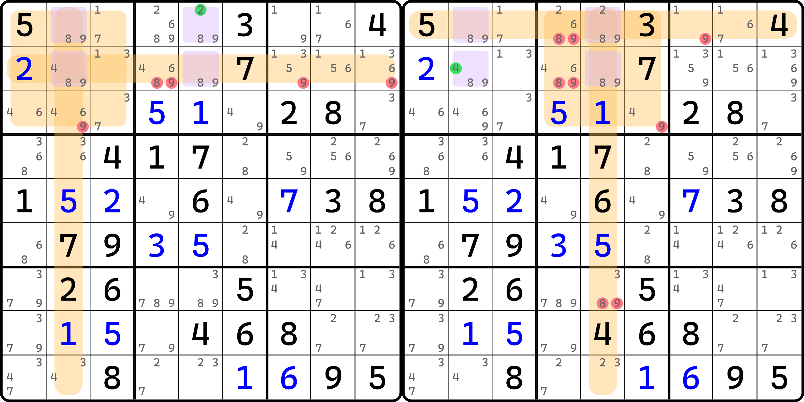<figcaption><p>尝试填充两个节点的两种情况</p></figcaption></figure>

如图所示。因为环内相邻节点一定是互斥的，因此我们干脆就两边都看一下。如果 `r1c5(2)` 为真，则是左边这个图；而如果 `r2c2(4)` 为真，则是右边这个图。说说图是什么意思。对于左图而言，因为 `r1c5(2)` 为真，所以 `r2c2(4)` 就只能为假，于是在这个情况下，`r12c2` 和 `r2c25` 则会形成关于 8 和 9 的显性数对。删数范围则是橙色标记的所有单元格（当然，原本唯一矩形的格子不算哈）；右图也是如此。

可以看到，这两种情况下，都能覆盖的地方有 `r1c3` 和 `r2c4` 两个单元格，所以，这个环包含 `r2c4(89)` 这两个候选数。

所以，唯一矩形的删数模式是看两个情况产生的显性数对所构成的删数交集。

我们再来看一个例子。

<figure>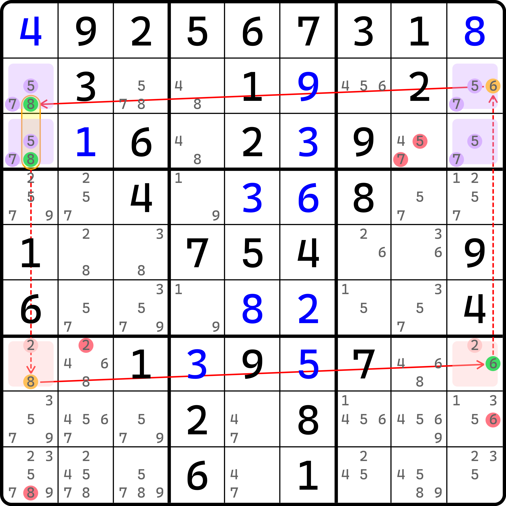<figcaption><p>另外一个例子</p></figcaption></figure>

如图所示。这个仍旧是刚才那种强链关系，不过这次有区块节点纳入，所以就比较难一些了。因为待定唯一矩形的特殊性，即使有两个节点，我们也需要依次细致讨论，一共有三种情况：

* 如果 `r2c9(6)` 节点为真，则 `r23c1(8)` 为假，此时 `b1`、`r3` 和 `c1` 上均有关于 5 和 7 的显性数对；
* 如果 `r23c1(8)` 为真，则 `r2c9(6)` 为假，此时：
  * 如果 `r2c1(8)` 为真，则 `r3c1(8)` 为假，此时 `r3`、`c9` 和 `b3` 上会形成显性数对；
  * 如果 `r3c1(8)` 为真，则 `r2c1(8)` 为假，此时 `r2`、`c9` 和 `b3` 上会形成显性数对。

我们联立起来可以发现，三种情况都能涵盖的删数只有 `r3c8(57)`。所以，这个待定唯一矩形参与环的推理后，删数会多出来 `r3c8(57)` 这两个。

### 有一边在待定唯一矩形外部的强链关系 <a href="#single-side-external-strong-inference" id="single-side-external-strong-inference"></a>

<figure>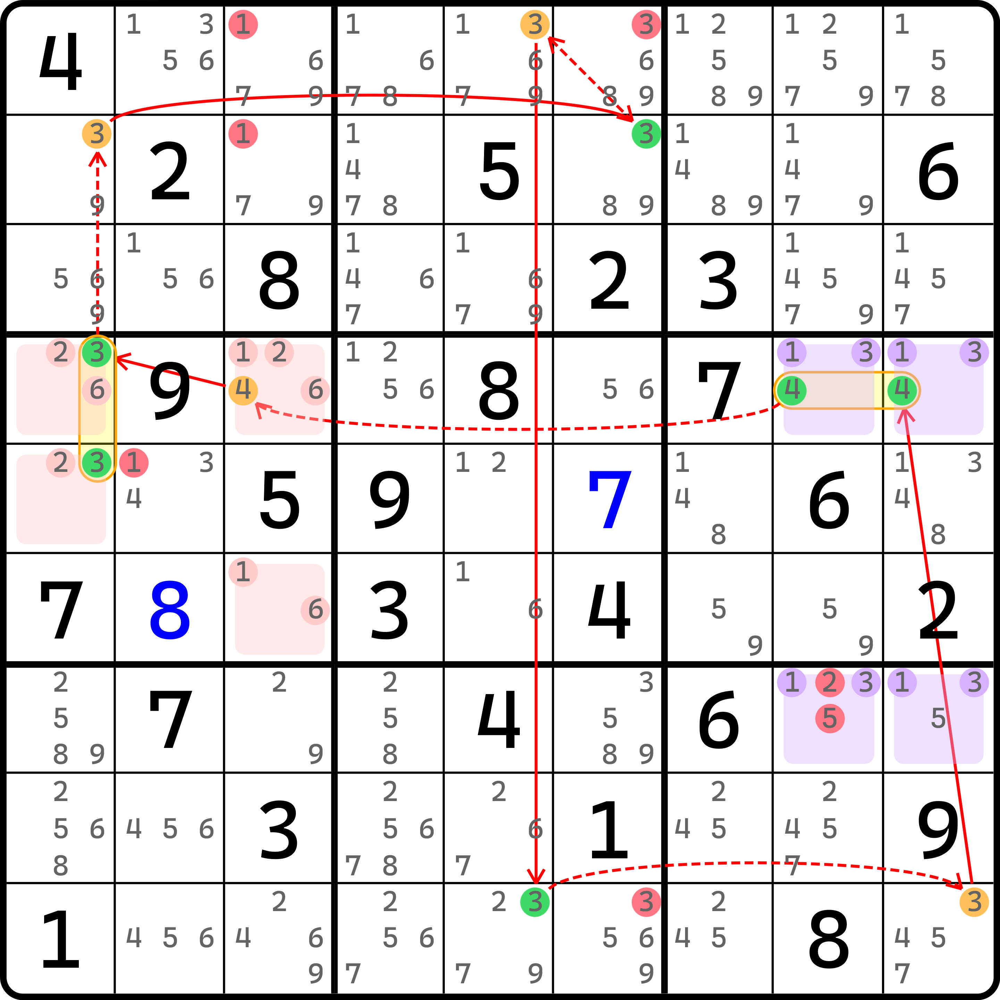<figcaption><p>有点难的例子</p></figcaption></figure>

如图所示。这应该也比较难分析。我们还是先按待定唯一矩形两头的强链关系，分两种情况讨论一下。坐稳了，这里会稍微复杂一些。

因为有两个节点，而其中一个节点 `r4c89(4)` 用两个候选数，所以我们还需要分开算。于是，我们就有这样两个情况：

<figure>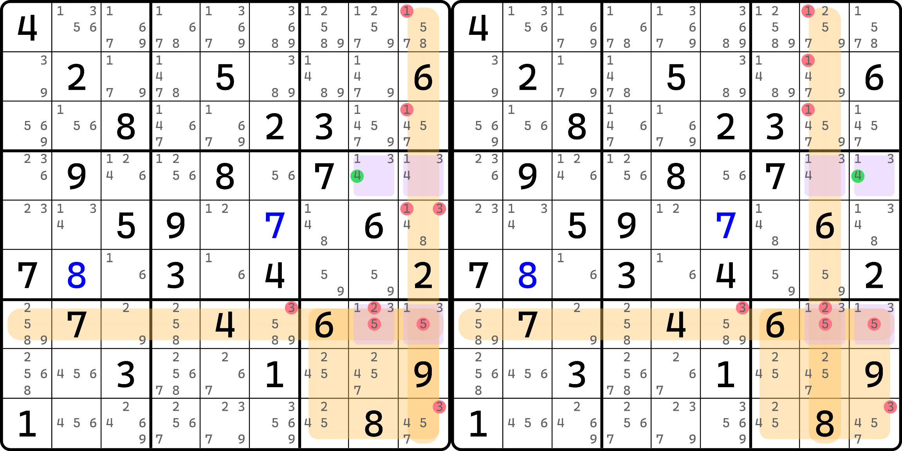<figcaption><p>假设 r4c89(4) 为真的情况</p></figcaption></figure>

如图所示。如果我们让上面这个节点其中一个为真，则显然 `r9c9(3)` 这个节点就必须为假，于是 `r7c89` 会构成关于 1 和 3 的隐性数对。是的，因为我们得来这个强链关系之所以能连到待定唯一矩形的外面来，就是因为它这里用到的是“数字 1 和 3 差一点就隐性数对形成了”这个特征。所以，此时我们大大方方用隐性数对来看删数。哦对，也不完全是。因为删掉了 `r7c89(13)` 外的其他候选数后，这两个单元格又会自动变为显性数对，于是 `r7c6(3)` 这种删数也是可以在这个情况下干掉的。

这是第一个讨论情况。下面我们来看第二个情况：`r9c9(3)` 为真。这里就会麻烦一些了。

<figure>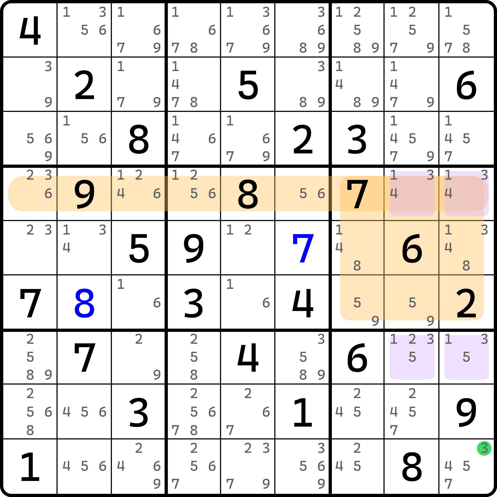<figcaption><p>假设 r9c9(3) 为真的情况（？）</p></figcaption></figure>

如图所示。当假设 `r9c9(3)` 为真时，我们只能得到 `r4c89(4)` 为假，并得到上方的显性数对成立的情况。但是，这并没有帮助，因为前面一种情况的删数压根就没用到这里的显性数对（毕竟刚才那个情况下，这个显性数对根本就不成立）。

这可有些棘手了。那么我们继续深度思考。既然我们得来了这个 3 为真的情况，那么，数字 1 呢？3 虽然填不了了，但是数字 1 不是还能用么？想想看，数字 1 现在是什么？没错，共轭对。数字 1 在这里是单独独立出去的部分，虽然隐性数对被 `r9c9(3)` 拆了个“妻离子散”，但是 1 在客观上是共轭对的这个特征并未被我们挖掘。

不过我们这里不能直接用。先把视角看到 `c9`。我们发现，因为 `r4c89` 此时是不含数字 4 的（因为 `r9c9(3)` 此时已经为真了），所以对于 `r4c9` 而言，它现在只有 1 和 3。于是我们就会发现，这里多出来了一个显性数对：`r47c9`。这个显性数对使得 `r7c9` 不可填 1 和 3。

发现什么问题了吗？是的， `r7c9 <> 1` 之后，因为数字 1 有共轭对的缘故，此时 1 只能填在 `r7c8` 上。这也就是说，共轭对反而帮了我们一个忙。如图所示。

<figure>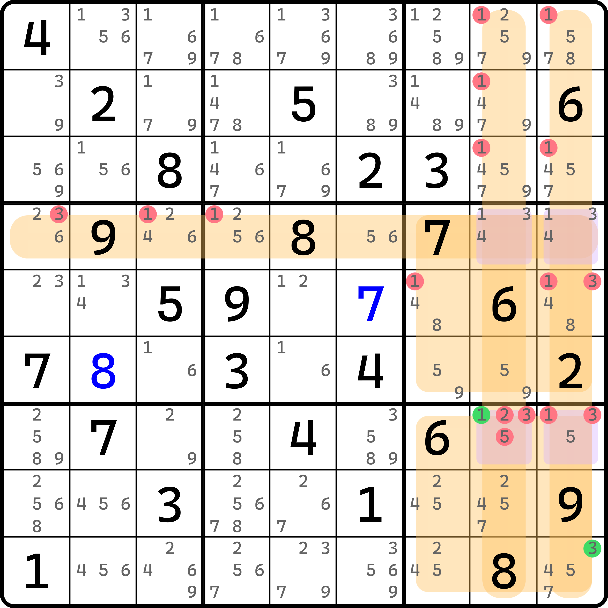<figcaption><p>假设 r9c9(3) 为真的情况（实际）</p></figcaption></figure>

是的，这样我们可以得到，分别在 `r4`、`c8`、`c9`、`b6` 和 `b9` 里都有关于 1 和 3 的数对结构，这样我们就可以发现，取三种情况的删数的交集似乎就有实际的结果了：`r7c8(25)`。

我们最终通过借用共轭对来完成了这个不太能发现的删数的推算。这非常神奇，希望各位对这个例子好好揣摩一下。

> 这里留一个问题。我们发现这个题存在这个共轭对对于删数的影响未免有些巧合。不过，请自行思考一下，对于这种强链关系一端在待定唯一矩形内部而另一边在外部的情况，当它嵌入到环里，是否都会存在类似的删数？以及，把问题推广到两端全都在外部的强链关系，在环里也是否存在删数？

我想，我应该把区块连续环的内容介绍得差不多了。下面我们来看轻松一点的吧。

## 对交空矩形（Empty Rectangle Intersection Pair）

我们来看一个简单点的例子。

<figure>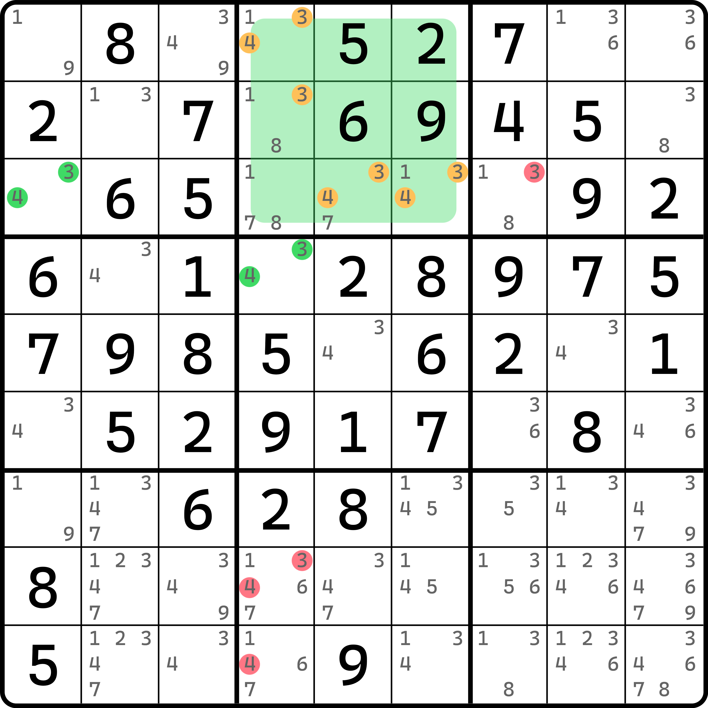<figcaption><p>对交空矩形</p></figcaption></figure>

如图所示。你可以把他当结构看，也可以把他当成环来看。

从结构的视角切入的话，我们需要先尝试看看 `r3c1` 和 `r4c4` 都能填什么。这两个单元格显然只能填 3 或 4，而在 `b2` 里，3 和 4 具有类似空矩形的摆放构造。那么我们大胆一些，假设一下 3 和 4 的填数情况。

如果 `r3c1` 和 `r4c4` 填数相同，则我们会立马发现 `b2` 里，相同的这个填数则填不进去。因为 `b2` 里只有 `r12c4` 以及 `r3c56` 四个单元格可以放入 3 或者 4。不论两个单元格填的都是 3 还是都是 4，都是填不下的。因此，`r3c1` 和 `r4c4` 只能填入不同的数。

既然填的数不同，则我们仍然使用欠一数对的思路去假设字母。如果 `r3c1` 填 $$a$$、则 `r4c4` 假设填 $$b$$。那么我们可以轻松得到，`r12c4` 里肯定有一个单元格是 $$a$$，而 `r3c56` 里肯定也有一个单元格是 $$b$$。于是呢？于是 `r3` 上会出现关于 3 和 4 的显性数对，位于 `r3c156` 的其中两个单元格；而对于 `c3` 而言，也会存在一个显性数对。因此，删数就是 `r3c7 <> 3, r8c4 <> 34, r9c4 <> 4` 这样一些。

这是从结构的视角出发得到的删数。下面我们来看它是否能看成环。

答案肯定是可以的。这便是这个技巧的环的画法。

<figure>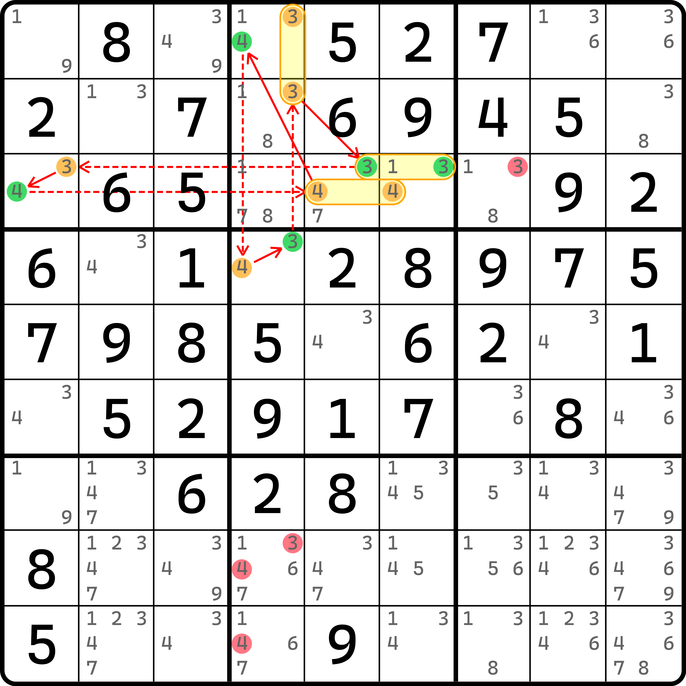<figcaption><p>对交空矩形的环的画法</p></figcaption></figure>

如图所示。这看起来确实有些乱，但是它就是环的画法。我们直接把里面用到的两个空矩形拆成四个节点，然后按照横竖可以连接到 `r3c1` 以及 `r4c4` 的方向确定区块节点的走向。这便是它的环的画法。

我们把这个技巧称为**对交空矩形**（Empty Rectangle Intersection Pair，简称 ERIP）。下面我们再来看一个例子。

<figure>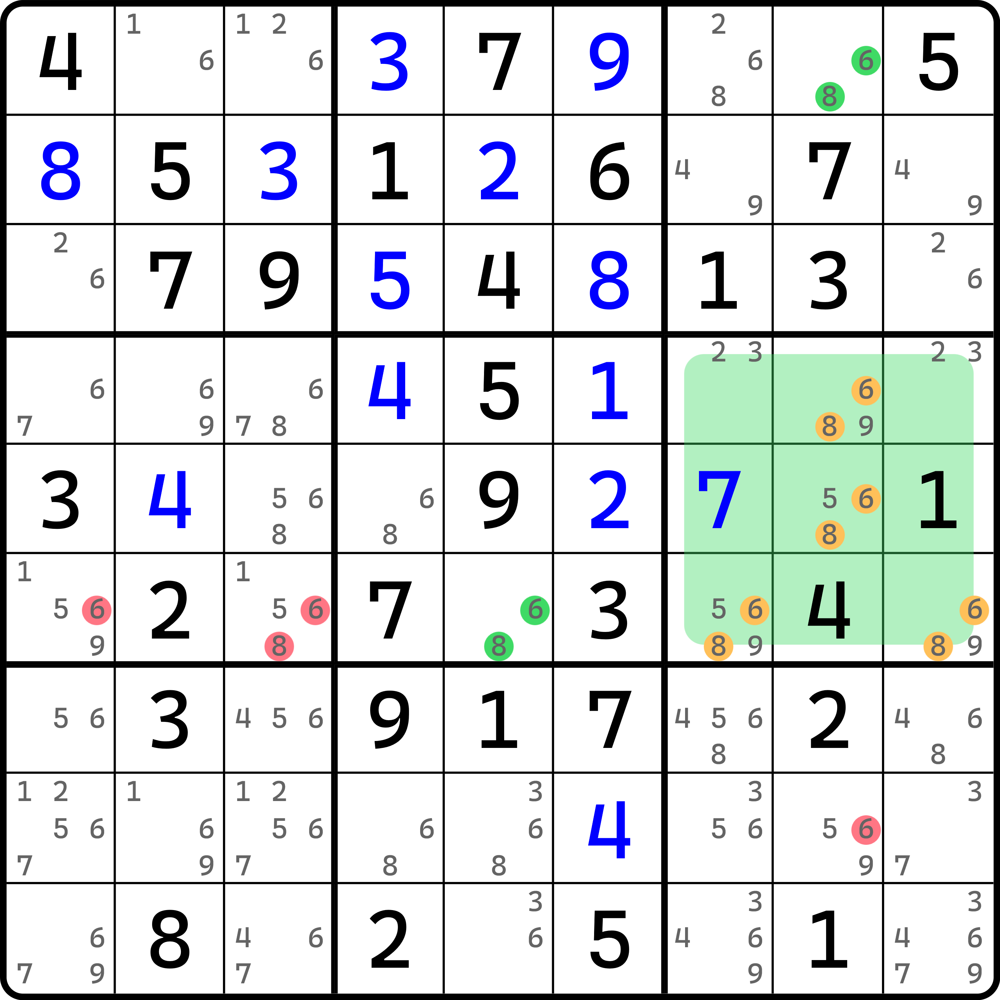<figcaption><p>另外一个对交空矩形的例子</p></figcaption></figure>

如图所示。这个例子也希望你自己看。

好了，至此我们就把区块连续环的内容全部结束了。下面我们将继续讲解后面的内容。
