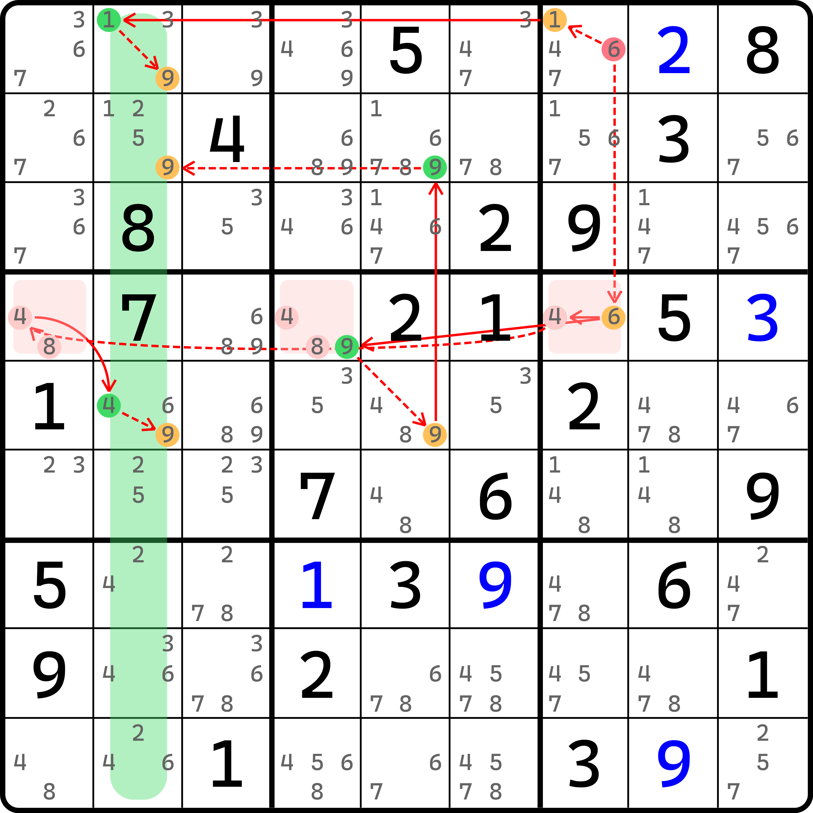
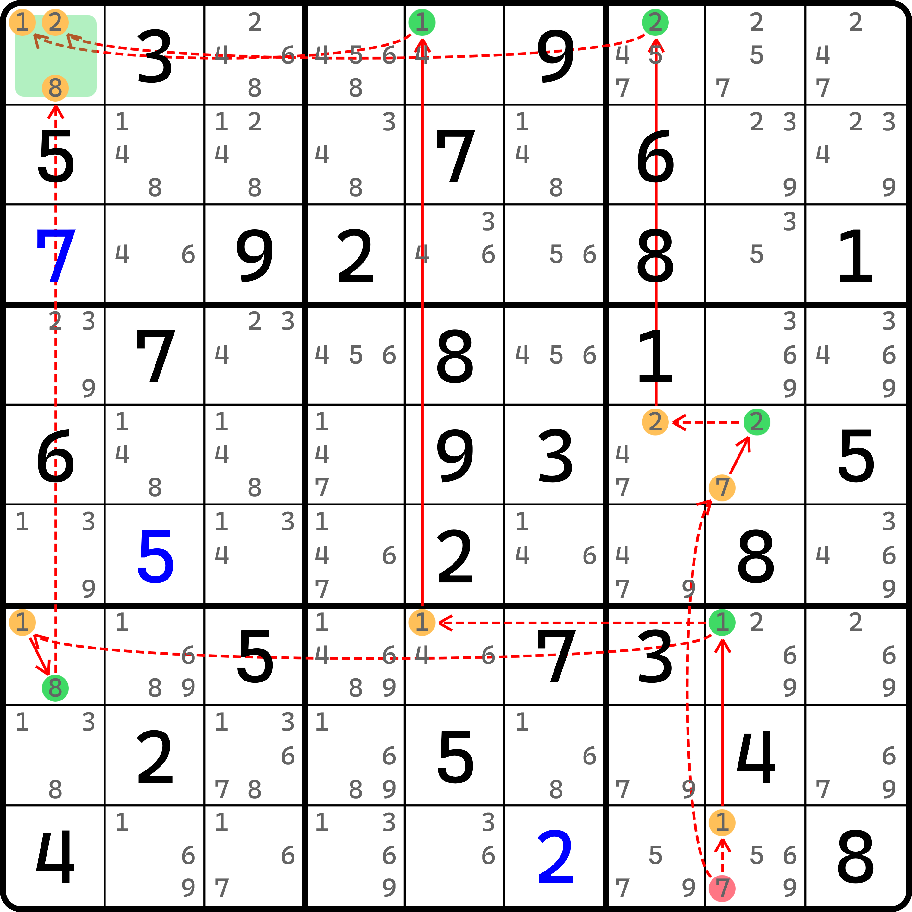
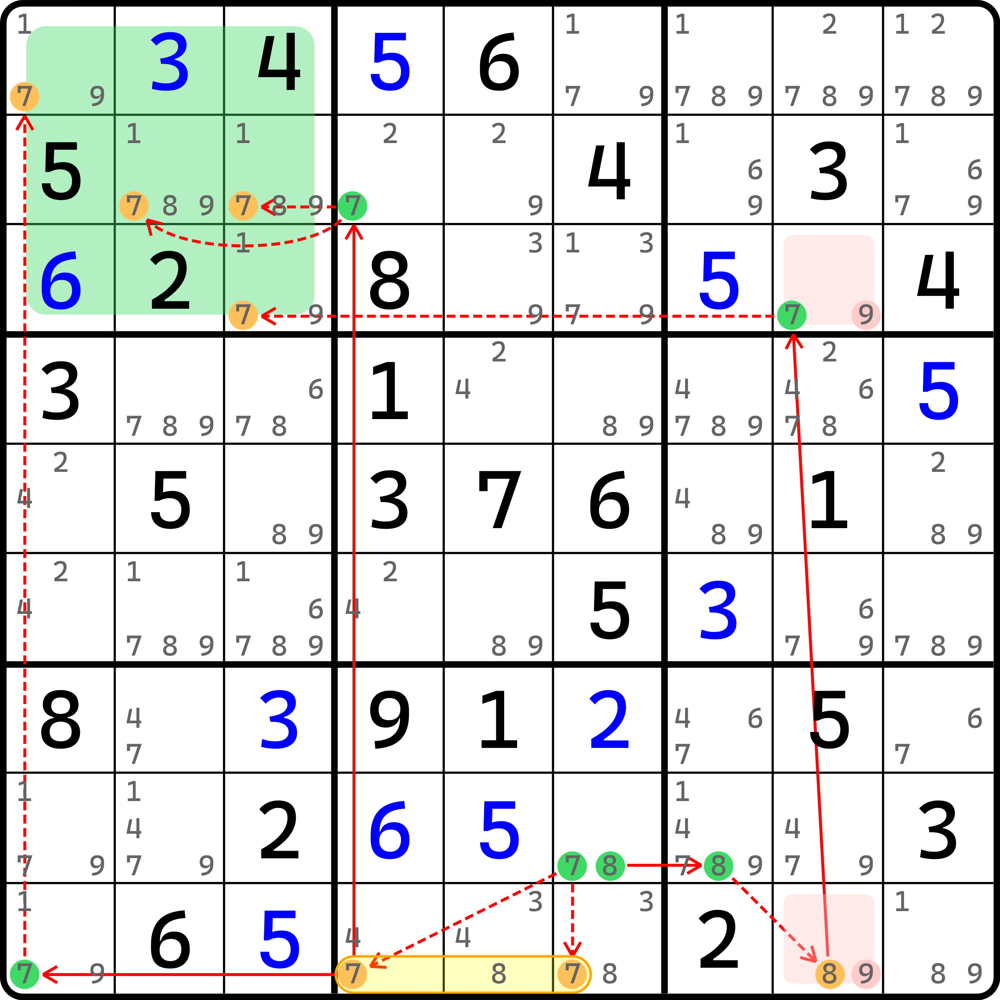
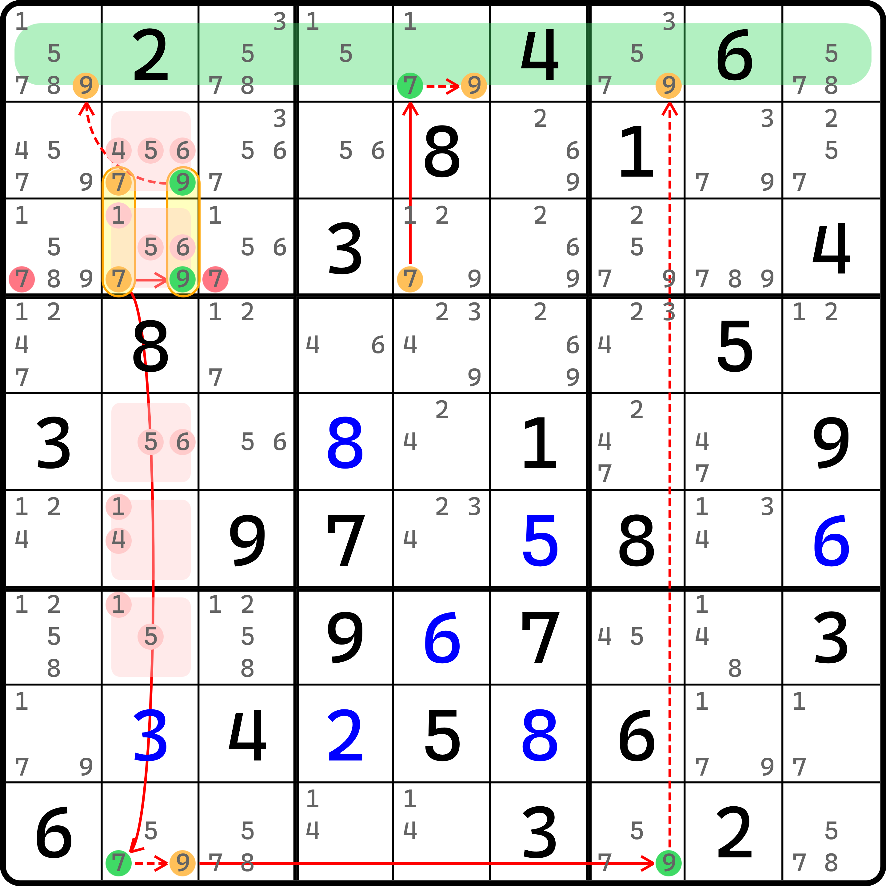
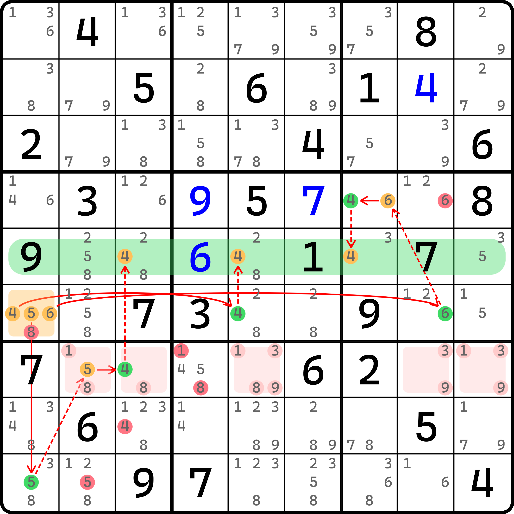

# 强制链

我们继续延伸讨论链理论的内容。之前提到，链理论有多个思想。今天我们来看的是第二个思想。

## 区域强制链（Region Forcing Chains） <a href="#region-forcing-chains" id="region-forcing-chains"></a>

<figure><figcaption><p>区域强制链</p></figcaption></figure>

如图所示。先别急着发飙。这看着是有点难，而且链的画法也发生了变化。

我们使用简易视角去理解它。我们假设 `r1c7 = 6`，就可以发现这个链是可以运作的。因为从 `r1c7(6)` 这里延伸出去的是弱链关系。虽然我们暂时还看不太懂为什么是按两个方向独立延伸出去的，但是至少两端都是弱链出去的，为了方便我们假设，可以尝试用 `r1c7 = 6` 去推导。

当假设了这个条件后，链的推导开始运作起来。三个分支的走向如下：

* `(6-1)r1c7=(1-9)r1c2`，走到 `r1c2(9)` 为假；
* `6r1c7-6r4c7=9r4c4-9r5c5=9r2c5-9r2c2`，走到 `r2c2(9)` 为假；
* `6r1c7-(6=4)r4c7-4r4c1=(4-9)r5c2`，走到 `r5c2(9)` 为假。

虽然看图看起来有些乱，但是理顺了之后发现还是比较清晰的。

我们先别急着提问为什么这次的假设是设节点为真，而不是为假。当我们试着假设初始条件后，这三个分支的走向能带领我们走向三个不同的结局。虽然他们之间是“平行世界”，互不影响对方，但最终的结论是都可以实现的。

由于 `c2` 里所有的数字 9 的填数位置，都能因为同一个假设情况推导得到其为假，这也就是在说，`c2` 里所有 9 的位置都能通过在假设 `r1c7 = 6` 时全部被干掉，此时，`c2` 将不存在任何可以填入 9 的位置。因此造成了矛盾。

既然我们知道，假设 `r1c7 = 6` 会使得矛盾形成，所以初始假设就是错误的。因此，`r1c7 <> 6` 的结论成立。

可以看出，这个推理的过程只是从形式上依赖了链的真假讨论，但最终推导得出矛盾的过程并未使用链的头尾取交集的方式，因此从形式上来看，它并不算一个合格的链结构，我们把这种推理过程称为**强制链**（Forcing Chains，简称 FC），即强制性推导的链。

> 因为强制链推导的时候一般会依赖多个分支得到不同的走向，因此技巧的英文名自身会带有复数后缀 -s，即 Forcing Chains 而非 Forcing Chain，这并不是打错，也并非是技巧名的复数形式，而是这个技巧自身就带复数后缀 -s。

证明某个节点假设为假时，整个列里的某个数全为假。我们把这个论证用到行列宫的形式称为**区域强制链**（Region Forcing Chains）；这里是得到列上无位置可填的矛盾，因此也可以精确称呼为**列强制链**（Column Forcing Chains）；不过本教程就不再细分宫、行、列强制链了，因为逻辑都是一样的。

> 区域强制链的区域是用的 region 一词而不是 house。在整个教程里，区域一般会用 house 来指代一个行、列、宫。这个技巧名的区域的含义其实和一般我们认为的区域是完全一样的，之所以用的另外一个单词，仅仅是因为这个技巧的体系制定是一款叫 Sudoku Explainer 的数独分析软件所定义的。这个软件将所有的链都称为强制链（包括我们前面学到的一些链），以便难度定级等行为；而 region 是这款软件给的叫法，他们没有使用 house 来表示区域，所有的区域都用的是 region，因此这个技巧名称的英文名用的也是 region。
>
> 是的，所有的链都可以转换为强制链。不过这显然有悖于我们教程对链理论的教学主旨，所以我不打算针对这种“细枝末节”进行单独的介绍。
>
> 总之，区域强制链的区域一词是这款软件的取名，所以本教程沿用这个叫法。

## 强制链与尤里卡记号 <a href="#eureka-notation-on-forcing-chains" id="eureka-notation-on-forcing-chains"></a>

强制链也可以使用尤里卡记号表示，但这也没有一个严格的标准。本教程暂时将其定义为使用分支的书写格式。具体方式仍然参考前面例子里使用分支的表达，不过要整理到一起，所以这个例子的写法是这样的：

```
6r1c7:
  1r1c7=(1-9)r1c2
  6r4c7=9r4c4-9r5c5=9r2c5-9r2c2
  (6=4)r4c7-4r4c1=(4-9)r5c2
```

我们使用空两格的方式（**缩进**，Indenting）来控制分支的表示；然后在最上方给予起点 `r1c7(6)` 的标识，在每一个分支里就不用再书写一次。

另外，如果强制链的分支并不是严格意义独立的（如之前的例子里，`r4c7(6)` 这个节点是其中两个分支重复使用的节点），那么你也可以继续将分支抽取出来，并再次用缩进的行为来列举他们。比如前面的例子还可以继续写成这样：

```
6r1c7:
  1r1c7:
    (1-9)r1c2
  6r4c7:
    9r4c4-9r5c5=9r2c5-9r2c2
    4r4c7-4r4c1=(4-9)r5c2
```

这表示的意思是，从 `r1c7(6)` 开始有两个走向（`r1c7(1)` 和 `r4c7(6)`）。然后根据两个走向，继续往后延伸链的走向。大概是这个感觉。

因为强弱链关系是交替使用的，所以我们可以通过分支上开头文本的 `-` 和 `=` 记号反推得来前面 `r1c7(6)` 到下面两个分支 `r1c7(1)` 和到 `r4c7(6)` 都是什么记号，所以符号可以省略不写。要写的话是写在分支的开头上，比如这样：

```
6r1c7:
  -1r1c7:
    =(1-9)r1c2
  -6r4c7:
    =9r4c4-9r5c5=9r2c5-9r2c2
    =4r4c7-4r4c1=(4-9)r5c2
```

这样就是一个相对完备的表示方式了。注意 `6r1c7` 这里因为是起头，所以它的左边肯定不会有强弱链的记号，不要画蛇添足。

## 单元格强制链（Cell Forcing Chains） <a href="#cell-forcing-chains" id="cell-forcing-chains"></a>

看完了区域强制链，我们再来看单元格强制链的例子。

<figure><figcaption><p>单元格强制链</p></figcaption></figure>

如图所示。这个链的表示如下：

```
7r9c8:
  1r9c8=1r7c8-1r7c5=1r1c5-1r1c1
  (7=2)r5c8-2r5c7=2r1c7-2r1c1
  1r9c8=1r7c8-(1=8)r7c1-8r1c1
```

这个题和刚才非常类似，只不过把区域调为了单元格。证明方法完全一样：假设 `r9c8(7)` 为真，则我们会有三个不同的分支走向并得到三个不同的候选数为假的结论。但是，这三个候选数均在同一个单元格 `r1c1`，而 `r1c1` 也就只有这三个候选数。既然最初的假设为真会使得这三个候选数全都为假，那么 `r1c1` 必然会形成矛盾。所以最开始假设就是有问题的。因此，`r9c8 <> 7`。

## 设为假引发矛盾的强制链 <a href="#multiple-forcing-chains-with-false-assumption" id="multiple-forcing-chains-with-false-assumption"></a>

刚才我们都是通过假设为真得到矛盾的形态。那么假设为假是否也可以呢？答案肯定是可以的。下面我们就来看一个例子。

<figure><figcaption><p>设为假起头的强制链</p></figcaption></figure>

如图所示。这个链的写法如下：

```
8r8c6:
  7r8c6-7r9c46=7r9c1-7r1c1
  7r8c6-7r9c4=7r2c4-7r2c2
  7r8c6-7r9c4=7r2c4-7r2c3
  8r8c7-8r9c8=7r3c8-7r3c3
```

可以看出，这个链具有四个分支，走向了 `b1` 所有填 7 的四个位置，并全部得到为假的情况。所以，引发了矛盾。

因为最初我们假设的是 `r8c6(8)` 为假才能得到矛盾，所以 `r8c6(8)` 应该为真，因此这个题的结论是 `r8c6 = 8`。

## 归并强制链（Merged Forcing Chains） <a href="#merged-forcing-chains" id="merged-forcing-chains"></a>

可以看到，前面在假设过程之中，我们用到的思路都是在假设某一个节点为真或假时候引发矛盾。下面我们来看强制链在合并后产生的删数效果。

<figure><figcaption><p>归并强制链</p></figcaption></figure>

如图所示。这个链的表示如下：

```
7r23c2:
  9r23c2-9r1c1
  (7-9)r9c2=9r9c7-9r1c7
7r3c5:
  (7-9)r1c5
```

之前我们介绍的强制链都是从一个节点出发的。这次我们从多个不同节点出发看看能不能推理。比如这个题，我们可以看到， 终点三个分支都指向同一个区域的三个同一个数字的摆放位置，这一点保留了下来；但是起点完全不一样。之前的起点还保留了同一个节点作为初始假设，这次倒好，直接都不一样了。

这是否能推理呢？答案是可以的。这里干脆我们把删数也作为节点纳入到链里，但是分开看。比如这个题，我们先看 `r3c1(7)` 这个候选数。

假设把他视为一个普通节点来看的话，那么它的下一个节点可以是 `r23c2(7)` 或者 `r3c5(7)`。因为之后的推理是强链关系出去的，所以我们这里添加的应该是一条弱链关系。换言之，我们应假设 `r3c1(7)` 纳入时的状态是假设它为真。那么，纳入后，可以看到这个链就退化为了一个很普通的区域强制链，并得到最终 `r1` 所有填 9 的位置全部为假，引发了矛盾。所以，这个假设不成立。

对于 `r3c3(7)` 而言，好像天助我也一般，它也可以纳入到强制链之中，并接入刚才完全相同的这两个节点，并仍然可以得到同样的矛盾。所以，这样一口气强制链就可以删两个数。

明白了吧。这种强制链仍然是普通的区域强制链或者单元格强制链，只不过我们把开始的节点稍微延后了一步：因为强制链的删数一般只有一个，所以我们延后了节点后，每个分支对应的起点发生了变化。那么他们就可以用类似普通链里“头尾删交集”的效果找出除了延后之前的那个节点以外，还可以纳入的节点都有哪些。然后一并删除。我们把这个过程称为**归并强制链**（Merged Forcing Chains），即把分支延后后归并得到多个删数的强制链逻辑。它提供了一个找多个删数的强制链的视角。

我们再来看一个例子。

<figure><figcaption><p>归并强制链，另一个例子</p></figcaption></figure>

如图所示，这条链的表示如下：

```
7r9c5:
  (7-4)r7c4=(4-6)r1c4
  (7-6)r7c4
6r9c1:
  6r5c1-6r5c4
  6r5c1-6r5c456=9r5c45-9r5c7=9r1c7-(9=2)r2c8-2r3c8=(2-6)r3c4
```

这个题有四个分支，并归并为两个部分。

## 其他有名字的强制链类型 <a href="#named-forcing-chains-techniques" id="named-forcing-chains-techniques"></a>

### 鳍链（Finned Chain） <a href="#finned-chain" id="finned-chain"></a>

试想一下，如果强制链的分支里有一个分支起步就是夭折的，这种链会有删数吗？

<figure><figcaption><p>鳍链</p></figcaption></figure>

如图所示。假设我们先忽略掉 `r1c5(4)`，我们就可以看到一个完整的链（准确来说，叫区块不连续环）：

```
4r4c6=6r3c6-(6=1)r1c5-1r3c46=1r3c9-1r2c7=(1-3)r6c7=3r6c5
```

然后就有了这样的删数。但是，看起来似乎多出来的 `r1c5(4)` 也并不会影响链的删数，因为这个多出来的数填到格子里，也可以删掉 `r6c5(4)`。所以，按鱼鳍的思路看这个数的话，它具有如下的两个情况：

* 如果 `r1c5(4)` 为假，则链成立，删数是 `r6c5(4)`；
* 如果 `r1c5(4)` 为真，则删除行列宫其余位置的 4，也包含 `r6c5(4)`。

所以，这个题的结论是 `r6c5 <> 4`。

可以看到，这是一个普通的链，外加了一个“鱼鳍”。我们把这种链称为**鳍链**（Finned Chain）。

我们再来看一个例子。

<figure><figcaption><p>鳍链。另一个例子</p></figcaption></figure>

如图所示。这个例子也自己看吧。这个例子用了两个鱼鳍，假设方式是一样的，先假设鱼鳍都不存在，然后引出链；然后假设鱼鳍存在，于是按鱼鳍存在的位置删，最终交集删数。

你可能会问，这是强制链吗？是的，虽然看起来像是鱼鳍和普通链的结合，但如果你把鱼鳍视为一个独立的分支，并把其中任意一个强链关系拆解为一组可以用于删数的分支的话，那它就会变为强制链的视角。比如这个题，对于 `b9` 而言，一共有 4 处可以填 5 的位置。那么按照强制链的视角，讨论 5 的全部填数位置，其中两个分支（鱼鳍）将因为假设为真导致直接构成删数；剩下两个分支，就是图中连接为强链关系的 `r7c8(5)` 和 `r8c7(5)` 了。把它俩拆开，然后形成两个分支最终仍然可以到达 `r1c9(5)` 的地方。因此，它其实是可以转为强制链的视角的（尽管这非常没有必要）。

### 绽放环（Blossom Loop）

有没有想过，当强制链形成回环后，会有什么样的效果呢？

<figure><figcaption></figcaption></figure>

如图所示。本题有三个分支，从 `r1c7` 单元格出发，并回到 `r4` 的所有 6 的位置上。非常巧妙的是，这个题的分支有 3 个，他们完全不同；最终走到 `r4` 上时，每一个分支都会唯一对应到一个 6 的位置上去。所有强链关系引出，并用弱链关系引入。写法如下：

```
6r1c7=6r1c2-6r7c2=6r7c1-6r4c1
7r1c7=(7-1)r1c5=1r9c5-(1=6)r9c4-6r4c4
8r1c7=(8-6)r4c7
```

看起来这个似乎跟前面任何的强制链的思路都没有关联。这是怎么删数的呢？我们思考一个问题哈。本题的强链关系出去，弱链关系收回的逻辑会不会存在一些特殊效果？

我指的是什么效果呢？比如说，我们显然发现，弱链收回的 `r4` 实际上仅存在这三个可以放 6 的位置，不存在其他单元格可以填 6。这说明什么？这说明 6 必须落入其中一个分支上。而我们之前说过，链是可以逆向的，那么对于强弱链关系来说，我们就可以从终点往回看，这样就可以满足三个 6 的位置的其中一个分支起点假设为真的逻辑。

按照这个思路进行，我们最终会回到 `r1c7` 这个单元格。因为回去的三个分支全部是强链关系，所以也就意味着我们最终会得到 `r1c7` 里其中一个候选数为真。既然其中一个候选数为真，那么剩下的两个就会变为假的状态。于是？于是这个链的其余两个分支就可以顺推回到 `r4` 的另外两个 6 的填数位置上去，使得剩下两个分支的 6 为假。

这可能有些绕。我说细致一些。我想说的是，因为我们知道 `r4` 只有三处填 6 的位置。假设填入其中一个位置（假设此时是 $$A$$ 这个位置填），那么剩下的俩 $$B$$ 和 $$C$$ 就为假；但是，我们也可以通过先从 $$A$$ 这个位置反推回单元格 `r1c7` 的三个候选数上（暂且记作 $$A'$$、$$B'$$ 和 $$C'$$）。

在我们假设 $$A$$ 为真的时候会得到 $$A'$$ 为真（因为尾巴这里是强链关系，从假到真的是强链关系）；而 $$A'$$ 为真的同时又可以直接认定 $$B'$$ 和 $$C'$$ 是为假的，于是 $$B$$ 和 $$C$$ 按顺推就会为假（因为这次尾巴这里是弱链关系，从真到假的是弱链关系）。于是就构成了这么个链路关系：

$$
A \text{真} \to A' \text{真} \to B' \text{假} C' \text{假} \to B \text{假} C \text{假}
$$

我们再次假设 $$B$$ 和 $$C$$ 两边时也都可以分别得到类似的结论，且所有强弱链关系均不会造成推断矛盾（比如说“本来设为强链关系的，但是假设了其中一个数为真的时候这里不成立了”之类的问题）。这意味着它形成了完美的思路闭环。这里说的“思路闭环”是说它的推导过程是完全闭环的，不会通过任意的位置走出这个推导线路。总之就是，因为 $$A$$、$$B$$ 和 $$C$$ 的填数状态是互斥的（整个行只有一个可以填 6 的位置，也必须有一个填 6 的位置），所以三者不能共存。而我们任意保留其中一个，都能使得整个链路回环运作起来且不发生矛盾。

而对于我们刚才反推的“中转站”单元格 `r1c7` 而言，因为三个分支均会走这个单元格的其中一个候选数经过且均都是为真的状态经过的，所以 `r1c7` 里的三个候选数 6、7、8 必须有一个为真。当然，这个题的 `r1c7` 不存在其他的候选数；如果有的话，这个单元格的其余候选数是可以删除的；而对于其他分支上而言，我们也可以认为，本题所有用到弱链两端的节点，虽说弱链关系是不同真，但是原本弱链关系是可以同假的，但是这个闭环的话是不存在的，因为思路闭环上并未出现两端同假的状态。换言之，如果任意假设一个弱链关系的两端同为假的话，则一定会推得矛盾。为什么呢？因为能安排如此排布的数字都是一真一假这么交替摆放的（除了 `r1c7` 和 `r4` 这里开头和收尾的两个地方）；当你一旦设其中一个弱链关系两端为假的时候，这里就没办法正常推导，所以导致的矛盾就必然会是诸如 `r4` 三处 6 均无法填数这样的矛盾。

所以，这种思路闭环的删数分为两部分：

1. `r1c7` 这个中转站如果存在除了 6、7、8 外的别的候选数，就都可以删除；
2. 所有弱链关系必定一真一假（不可能同假），因此可以按环的类似形式删数。

因为这个删数逻辑（尤其是第二点）非常类似于环的效果，所以这种强制链回环的技巧被我们称为**绽放环**（Blossom Loop）。

我们再来看一个例子。

<figure><figcaption><p>绽放环，另一个例子</p></figcaption></figure>

如图所示。这个题也希望你自己推理。

那么至此我们就把强制链的内容介绍完了。
