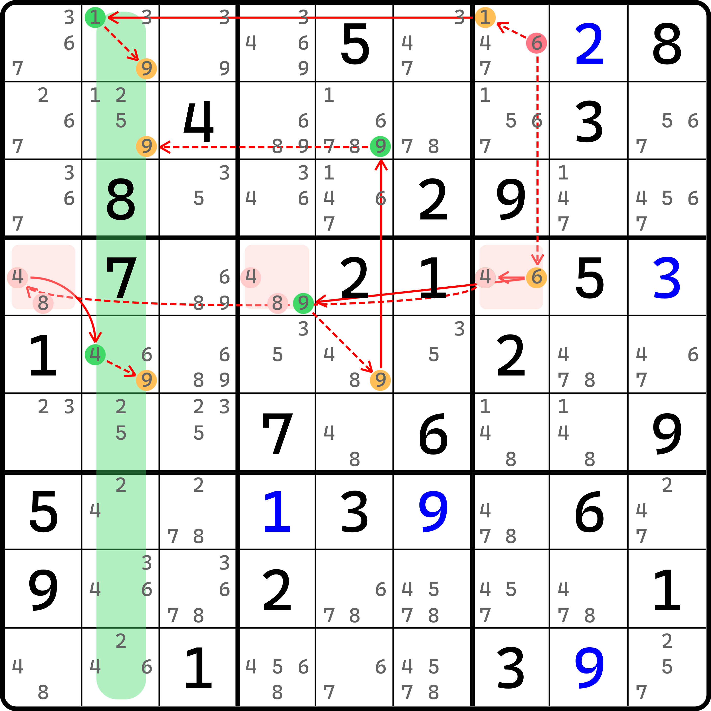
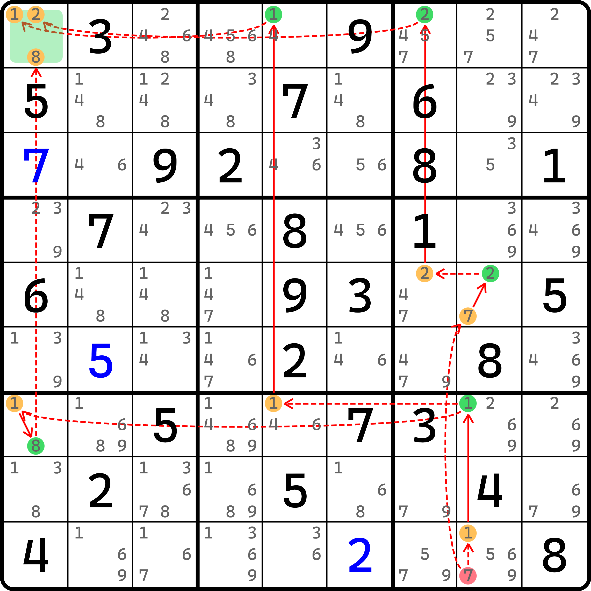
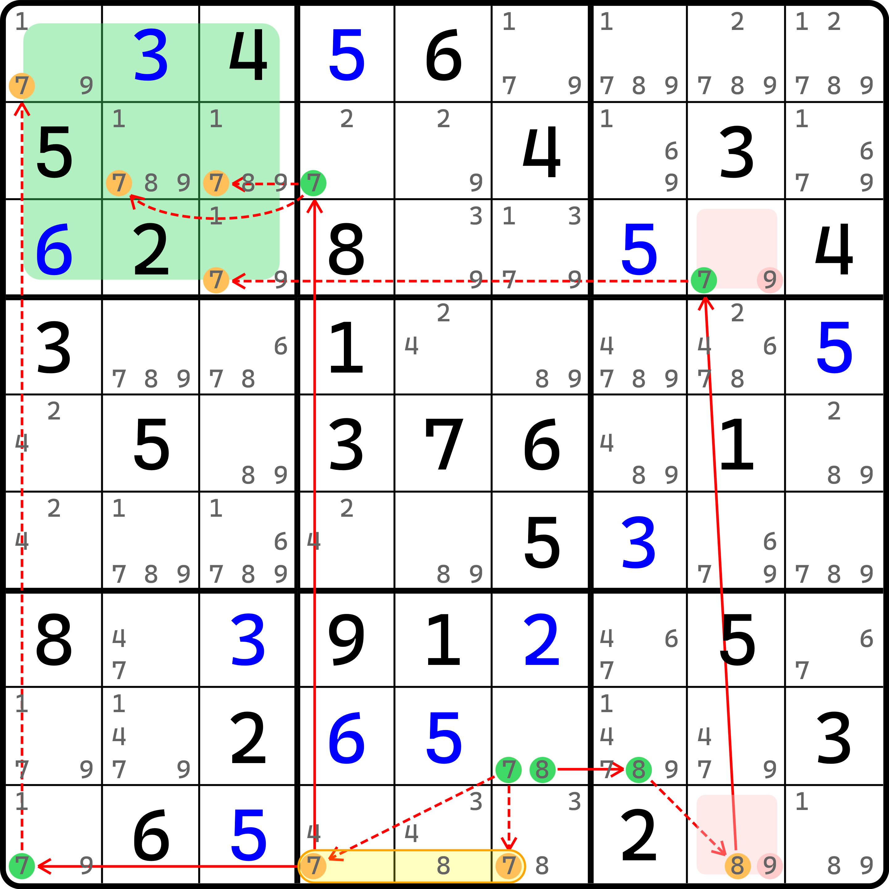

# 强制链的基本推理

## 区域强制链（Region Forcing Chains） <a href="#region-forcing-chains" id="region-forcing-chains"></a>

<figure><figcaption><p>区域强制链</p></figcaption></figure>

如图所示。先别急着发飙。这看着是有点难，而且链的画法也发生了变化。

我们使用简易视角去理解它。我们假设 `r1c7 = 6`，就可以发现这个链是可以运作的。因为从 `r1c7(6)` 这里延伸出去的是弱链关系。虽然我们暂时还看不太懂为什么是按两个方向独立延伸出去的，但是至少两端都是弱链出去的，为了方便我们假设，可以尝试用 `r1c7 = 6` 去推导。

当假设了这个条件后，链的推导开始运作起来。三个分支的走向如下：

* `(6-1)r1c7=(1-9)r1c2`，走到 `r1c2(9)` 为假；
* `6r1c7-6r4c7=9r4c4-9r5c5=9r2c5-9r2c2`，走到 `r2c2(9)` 为假；
* `6r1c7-(6=4)r4c7-4r4c1=(4-9)r5c2`，走到 `r5c2(9)` 为假。

虽然看图看起来有些乱，但是理顺了之后发现还是比较清晰的。

我们先别急着提问为什么这次的假设是设节点为真，而不是为假。当我们试着假设初始条件后，这三个分支的走向能带领我们走向三个不同的结局。虽然他们之间是“平行世界”，互不影响对方，但最终的结论是都可以实现的。

由于 `c2` 里所有的数字 9 的填数位置，都能因为同一个假设情况推导得到其为假，这也就是在说，`c2` 里所有 9 的位置都能通过在假设 `r1c7 = 6` 时全部被干掉，此时，`c2` 将不存在任何可以填入 9 的位置。因此造成了矛盾。

既然我们知道，假设 `r1c7 = 6` 会使得矛盾形成，所以初始假设就是错误的。因此，`r1c7 <> 6` 的结论成立。

可以看出，这个推理的过程只是从形式上依赖了链的真假讨论，但最终推导得出矛盾的过程并未使用链的头尾取交集的方式，因此从形式上来看，它并不算一个合格的链结构，我们把这种推理过程称为**强制链**（Forcing Chains，简称 FC），即强制性推导的链。

> 因为强制链推导的时候一般会依赖多个分支得到不同的走向，因此技巧的英文名自身会带有复数后缀 -s，即 Forcing Chains 而非 Forcing Chain，这并不是打错，也并非是技巧名的复数形式，而是这个技巧自身就带复数后缀 -s。

证明某个节点假设为假时，整个列里的某个数全为假。我们把这个论证用到行列宫的形式称为**区域强制链**（Region Forcing Chains）；这里是得到列上无位置可填的矛盾，因此也可以精确称呼为**列强制链**（Column Forcing Chains）；不过本教程就不再细分宫、行、列强制链了，因为逻辑都是一样的。

> 区域强制链的区域是用的 region 一词而不是 house。在整个教程里，区域一般会用 house 来指代一个行、列、宫。这个技巧名的区域的含义其实和一般我们认为的区域是完全一样的，之所以用的另外一个单词，仅仅是因为这个技巧的体系制定是一款叫 Sudoku Explainer 的数独分析软件所定义的。这个软件将所有的链都称为强制链（包括我们前面学到的一些链），以便难度定级等行为；而 region 是这款软件给的叫法，他们没有使用 house 来表示区域，所有的区域都用的是 region，因此这个技巧名称的英文名用的也是 region。
>
> 是的，所有的链都可以转换为强制链。不过这显然有悖于我们教程对链理论的教学主旨，所以我不打算针对这种“细枝末节”进行单独的介绍。
>
> 总之，区域强制链的区域一词是这款软件的取名，所以本教程沿用这个叫法。

## 强制链与尤里卡记号 <a href="#eureka-notation-on-forcing-chains" id="eureka-notation-on-forcing-chains"></a>

强制链也可以使用尤里卡记号表示，但这也没有一个严格的标准。本教程暂时将其定义为使用分支的书写格式。具体方式仍然参考前面例子里使用分支的表达，不过要整理到一起，所以这个例子的写法是这样的：

```
6r1c7:
  1r1c7=(1-9)r1c2
  6r4c7=9r4c4-9r5c5=9r2c5-9r2c2
  (6=4)r4c7-4r4c1=(4-9)r5c2
```

我们使用空两格的方式（**缩进**，Indenting）来控制分支的表示；然后在最上方给予起点 `r1c7(6)` 的标识，在每一个分支里就不用再书写一次。

另外，如果强制链的分支并不是严格意义独立的（如之前的例子里，`r4c7(6)` 这个节点是其中两个分支重复使用的节点），那么你也可以继续将分支抽取出来，并再次用缩进的行为来列举他们。比如前面的例子还可以继续写成这样：

```
6r1c7:
  1r1c7:
    (1-9)r1c2
  6r4c7:
    9r4c4-9r5c5=9r2c5-9r2c2
    4r4c7-4r4c1=(4-9)r5c2
```

这表示的意思是，从 `r1c7(6)` 开始有两个走向（`r1c7(1)` 和 `r4c7(6)`）。然后根据两个走向，继续往后延伸链的走向。大概是这个感觉。

因为强弱链关系是交替使用的，所以我们可以通过分支上开头文本的 `-` 和 `=` 记号反推得来前面 `r1c7(6)` 到下面两个分支 `r1c7(1)` 和到 `r4c7(6)` 都是什么记号，所以符号可以省略不写。要写的话是写在分支的开头上，比如这样：

```
6r1c7:
  -1r1c7:
    =(1-9)r1c2
  -6r4c7:
    =9r4c4-9r5c5=9r2c5-9r2c2
    =4r4c7-4r4c1=(4-9)r5c2
```

这样就是一个相对完备的表示方式了。注意 `6r1c7` 这里因为是起头，所以它的左边肯定不会有强弱链的记号，不要画蛇添足。

## 单元格强制链（Cell Forcing Chains） <a href="#cell-forcing-chains" id="cell-forcing-chains"></a>

看完了区域强制链，我们再来看单元格强制链的例子。

<figure><figcaption><p>单元格强制链</p></figcaption></figure>

如图所示。这个链的表示如下：

```
7r9c8:
  1r9c8=1r7c8-1r7c5=1r1c5-1r1c1
  (7=2)r5c8-2r5c7=2r1c7-2r1c1
  1r9c8=1r7c8-(1=8)r7c1-8r1c1
```

这个题和刚才非常类似，只不过把区域调为了单元格。证明方法完全一样：假设 `r9c8(7)` 为真，则我们会有三个不同的分支走向并得到三个不同的候选数为假的结论。但是，这三个候选数均在同一个单元格 `r1c1`，而 `r1c1` 也就只有这三个候选数。既然最初的假设为真会使得这三个候选数全都为假，那么 `r1c1` 必然会形成矛盾。所以最开始假设就是有问题的。因此，`r9c8 <> 7`。

## 设为假引发矛盾的强制链 <a href="#multiple-forcing-chains-with-false-assumption" id="multiple-forcing-chains-with-false-assumption"></a>

刚才我们都是通过假设为真得到矛盾的形态。那么假设为假是否也可以呢？答案肯定是可以的。下面我们就来看一个例子。

<figure><figcaption><p>设为假起头的强制链</p></figcaption></figure>

如图所示。这个链的写法如下：

```
8r8c6:
  7r8c6-7r9c46=7r9c1-7r1c1
  7r8c6-7r9c4=7r2c4-7r2c2
  7r8c6-7r9c4=7r2c4-7r2c3
  8r8c7-8r9c8=7r3c8-7r3c3
```

可以看出，这个链具有四个分支，走向了 `b1` 所有填 7 的四个位置，并全部得到为假的情况。所以，引发了矛盾。

因为最初我们假设的是 `r8c6(8)` 为假才能得到矛盾，所以 `r8c6(8)` 应该为真，因此这个题的结论是 `r8c6 = 8`。
