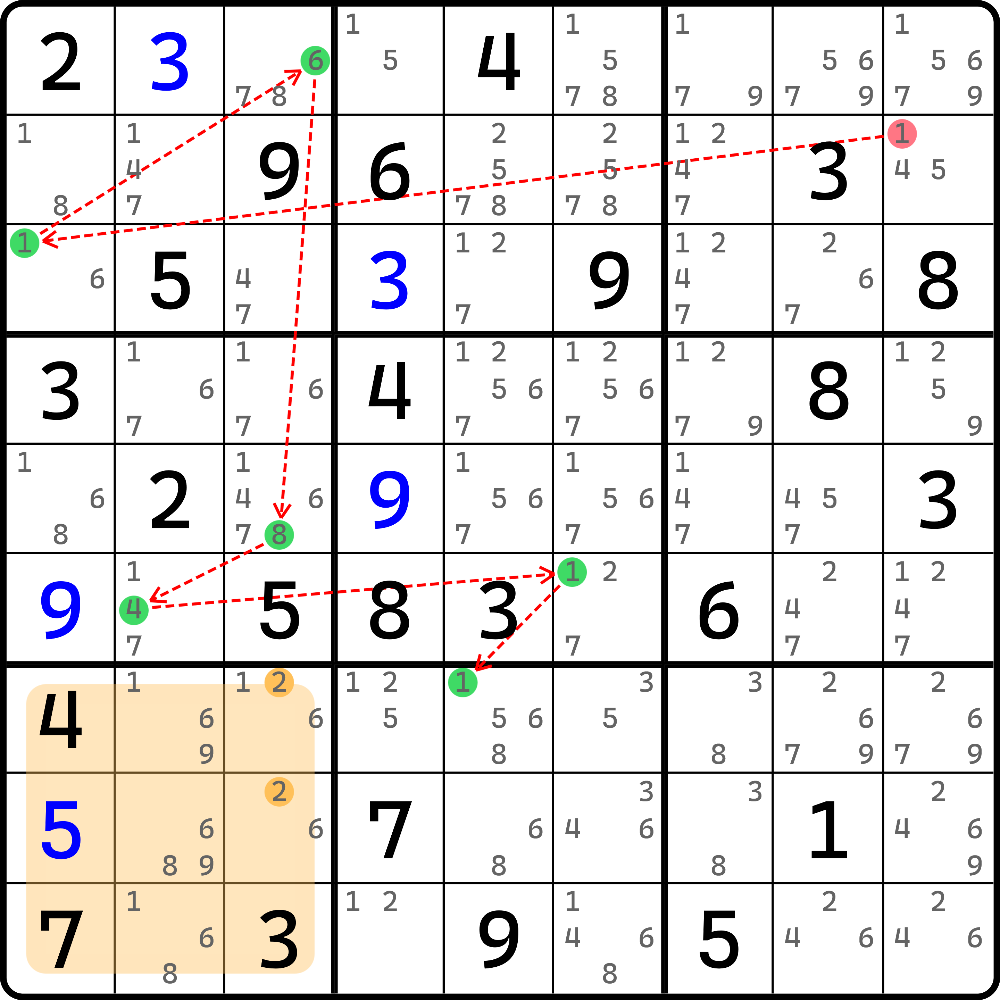
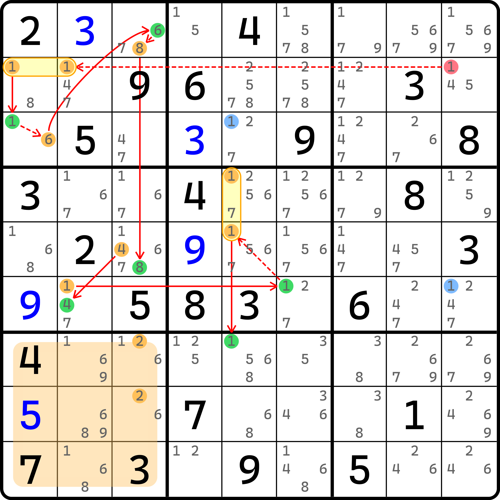
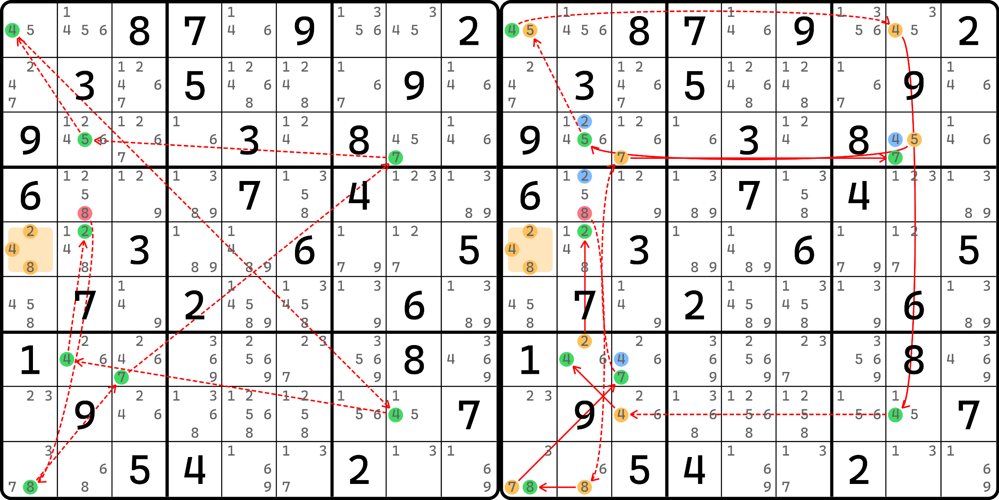
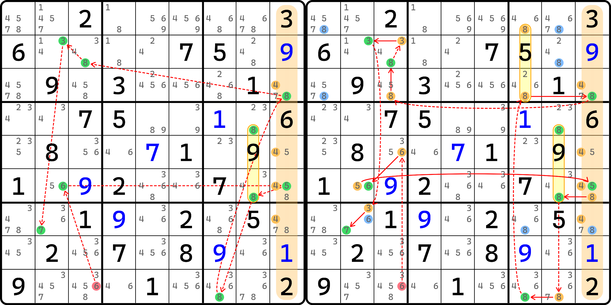
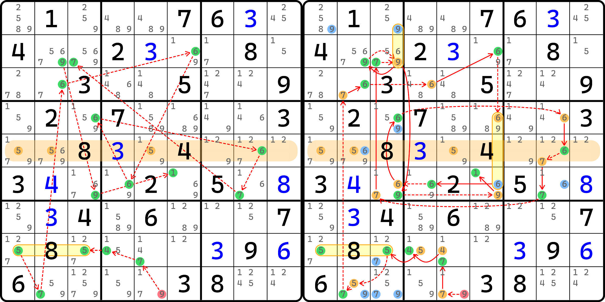
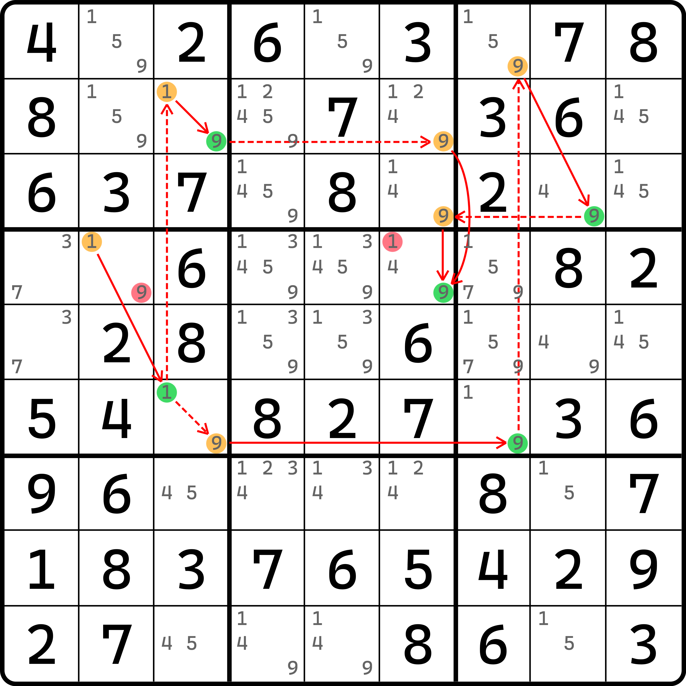
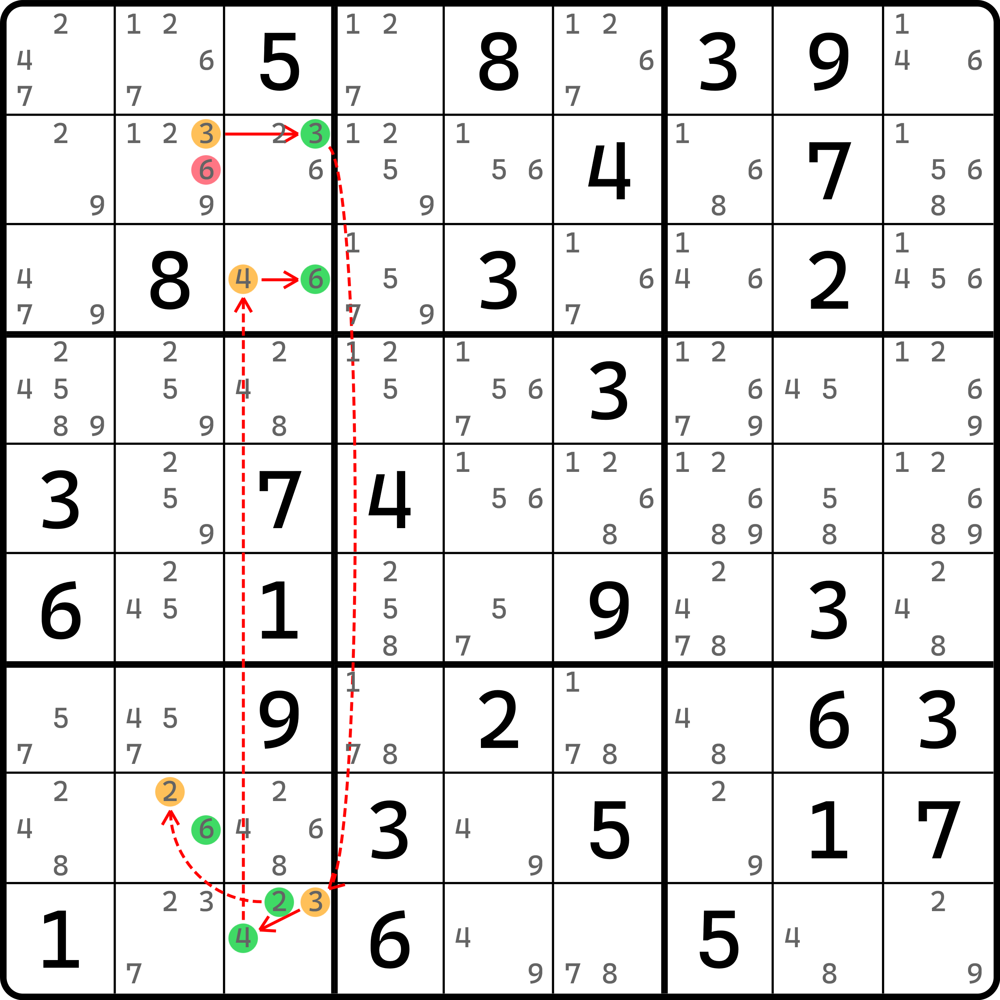

# 动态链的基本推理

## 试数与线性动态链（Whip） <a href="#try-and-error-and-whip" id="try-and-error-and-whip"></a>

<figure><figcaption><p>试数</p></figcaption></figure>

如图所示。这是一个**试数**（Try & Error，简称 T\&E）的路径。所谓试数，就是真正意义上无脑尝试填入一个数，然后根据基础的数独规则（排除和唯一余数技巧）然后直接填出下一个数，这么级联下去；直到发现矛盾（比如说某个格子没有可以填的数之类的矛盾），这样便让我们知道，初始假设是错误的。

对于这个题而言，我们尝试选取 `r2c9(1)` 作为我们的“幸运儿”。假设它为真，则可对 `b1` 造成宫排除得到 `r3c1 = 1`，然后因为 6 的宫排除得到 `r1c3 = 6`，接着是列排除得到 `r5c3 = 8`，然后是宫排除 `r6c2 = 4`，然后由于初始假设可以排除 `r6c9(1)` 的填数，所以还可以得到行排除 `r6c5 = 1`，最终对 `b8` 作宫排除得到 `r7c5 = 1` 这么个路径。

当我们在尝试假设这个路径时，我们会经过 `r1c3 = 6` 和 `r7c5 = 1` 这样两个关键节点。这两个节点会排除 `r78c3` 里的候选数 1 和 6，使得 `r78c3` 只剩下 2 唯一的候选数。显然这两个单元格是无法填入同样的数字的，毕竟他们在同一个宫，因此这样就造成了矛盾。

既然有了矛盾，因此我们也就知道，初始假设是错误的。故 `r2c9 <> 1`。

显然，对于这种赤裸裸地假设和推导矛盾，我们没有任何包装的措施和手段。换言之，这种无脑试 + 推矛盾的逻辑虽然也依赖数独的基础规则，但因为它本身的过程并不优雅，因此试数还是少用为妙。不过，我这里不是打算说这个的。

如果我们把这个技巧包装一番，将其改写为强制链的模式，我们就会有这样的画法：

<figure><figcaption><p>线性动态链</p></figcaption></figure>

如图所示。可以看到，我们尝试在推导时会用到图中两处蓝色的位置，而他们初始状态下候选数是存在的；但是他们在推导期间，因为其他一些节点为真的原因，这两处会直接为假。为假不要紧，主要是用到了他们为假的状态。这是我们最初学链的时候所没有遇到的情况：将一些节点中途为真/假的状态加以使用，然后构造出新的强弱链关系。我们就把这种行为称为**动态链**（Dynamic Chain）。而对于试数这个技巧，我们可以包装出来的动态链是直接上手推理的，因此没有所谓的分支状态；而分支全部当场就“夭折”了——比如这两个蓝色的 1，全部是走边上的 1 为真时产生的为假状态。而这个为假的状态并未继续延续下去分支的走向，而是直接结束在这里。

对于这样的动态链模式，我们给他取了个名，叫做**线性动态链**（Whip），即动态链的分支并未延展开来，而总体的链仍旧是一条主线路这么下去的。它的英文名叫做 whip，是鞭子的意思，从形状上讲也确实蛮像的。

我们再来看一个例子。

<figure><figcaption><p>线性动态链，另一个例子</p></figcaption></figure>

如图所示。这次也是尝试填一个数，推矛盾。不过这次的矛盾点是删空 `r5c1` 的所有候选数。对应的动态链是右边这一条。所有蓝色的位置都是中间产生的、节点为假的位置。

## 区块线性动态链（Grouped Whip） <a href="#grouped-whip" id="grouped-whip"></a>

刚刚说完了线性动态链，下面我们来看两个带有区块的线性动态链，即除了只使用排除和唯一余数外，还使用区块作为推导的中间件。

<figure><figcaption><p>区块线性动态链</p></figcaption></figure>

如图所示。对于试数角度而言，我们这里需要借助 `r46c8(8)` 区块作为辅助。它的前一步是得到 `r6c9 = 5` 的结论，于是，这个宫里填入 8 的位置就只剩下两处了。但这两处并未告知具体哪一个是正确的，因此只能用区块继续往下推理。我们利用这个区块，往下可以得到 `r9` 上 8 的行排除。注意这里不是宫排除，因为 `r7c7` 处有一个 8 的候选数位置，这里需要借助的是初始假设把 `r9c3` 占位，使得 8 只能在 `r9` 落在 `r9c7` 的这个逻辑。

总之我们可以得到矛盾点是 `c9` 的 4 直接矛盾。要注意 `c9` 虽然有 4 个可以填 4 的位置，但是其中两个会在推导的中间因为填入别的数（8 和 5）占位给去掉，所以实际上仍旧是两处位置重复填写的矛盾。

我们再来看一个例子。

<figure><figcaption><p>区块线性动态链，另一个例子</p></figcaption></figure>

如图所示。

## 带有实际分支的动态链

在我们接触了夭折的分支后，我们来看一种实际分支的动态链。

<figure><figcaption><p>动态链</p></figcaption></figure>

如图所示。链的写法如下：

```
1r4c2:
  =1r6c3-(1=9)r2c3-9r2c6
  =(1-9)r6c3=9r6c7-9r1c7=9r3c8-9r3c6
=9r4c6
```

先来说一下这是什么意思。先是从 `r4c2(1)` 这个节点设为假，作为链头。然后得到强链关系得到 `r6c3(1)` 为真。此时，因为 `r6c3(1)` 为真会同时造成两种不同的效果 `r2c3(1)` 为假和 `r6c3(9)` 为假，于是借助两个分支分别讨论。其中一个分支能走到 `r2c6(9)` 为假，另一个分支能走到 `r3c6(9)` 为假。因为两个分支的出发点是相同的（`r6c3(1)` 为真），因此这两个效果可以同时达成。于是，`c4` 就只剩下 `r4c6` 可以填 9 了，于是两个节点此时全部指向 `r4c6(9)` 分支汇集到一起，然后结束整个动态链。

像是这种链就是在普通的头尾异数链的基础上增加了分支。

我们再来看一个例子。

<figure><figcaption><p>动态链，另外一个例子</p></figcaption></figure>

如图所示。它的写法如下：

```
3r2c2=3r2c3-3r9c3:
  =2r9c3-(2=6)r8c2
  =4r9c3-(4=6)r3c3
```

当走到 `r9c3(3)` 节点为假时，因为还剩下两个走向 `r9c3(2)` 和 `r9c3(4)` 尚不知道具体哪一个节点为真，因此需要带上分支继续延续推理。然后一边走到了 `r3c3(6)` 为真，一边走到了 `r8c2(6)` 为真，这样就得到了两个没有汇入一起的分支，整个链就有了三个端点。

可以发现，这种动态链的结论肯定是要么链头 `r2c2(3)` 为真，要么两个链尾 `r8c2(6)` 和 `r3c3(6)` 的其中至少一个为真，所以总体说起来就是这三个端点里至少有一个为真。因此，删数就是取交集，即本题里的 `r2c2(6)`。

## 总结 <a href="#conclusion" id="conclusion"></a>

动态链的本质思路是让路径上带有分支，这种分支具有两种不同的情况：**分叉**（Branching）和**汇合**（Merging）。分叉细分的话也是两种情况，强链分叉和弱链分叉。这个具体随着例子里的推导进行到哪一步进行灵活调整即可；而对于汇合来说则略微复杂一些。当需要汇合时，汇合到同一个节点，它的前件分支（汇入到它的所有分支）需要保证是同一个真假性。比如说，两个分支最终都得到了为假，然后汇到同一个节点上时候，这个节点为真。这才是符合逻辑的；反过来说的话就是，这个汇总的节点为真，需要依赖于前面两个分支均为假才行（如果有一个为真就不可能和这里连得起来）。

当然，这种脑子够用的话，这种分支是可以继续进行下去的（我指的是分支上套分支）。但是，这显然难度偏高，我也没有合适的例子提供讲解，所以就不讲了。

下一节我们继续探讨动态链的分析。
