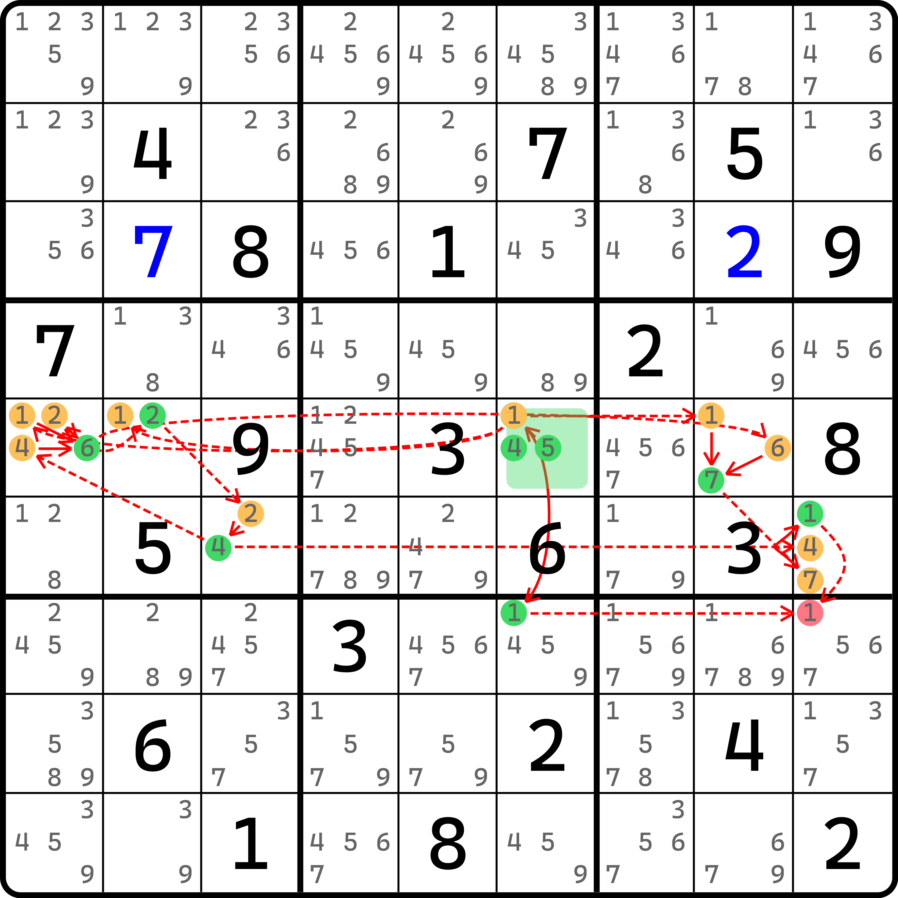
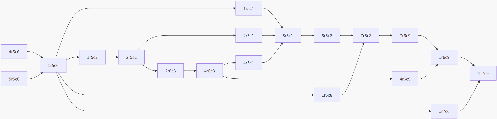
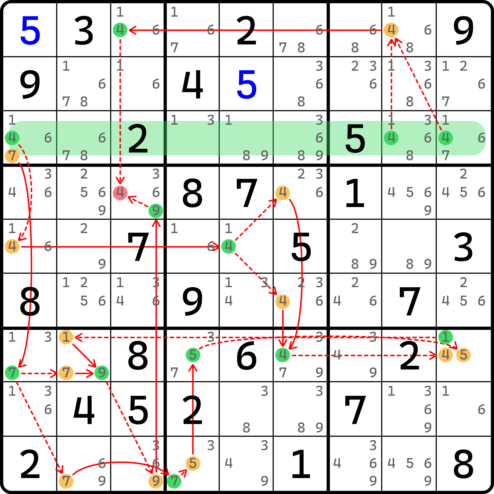
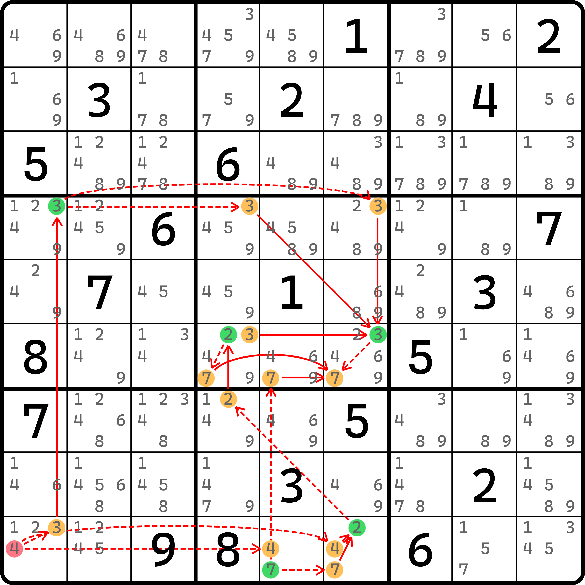
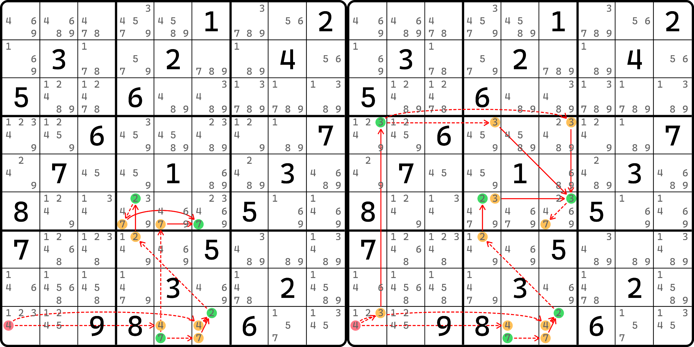
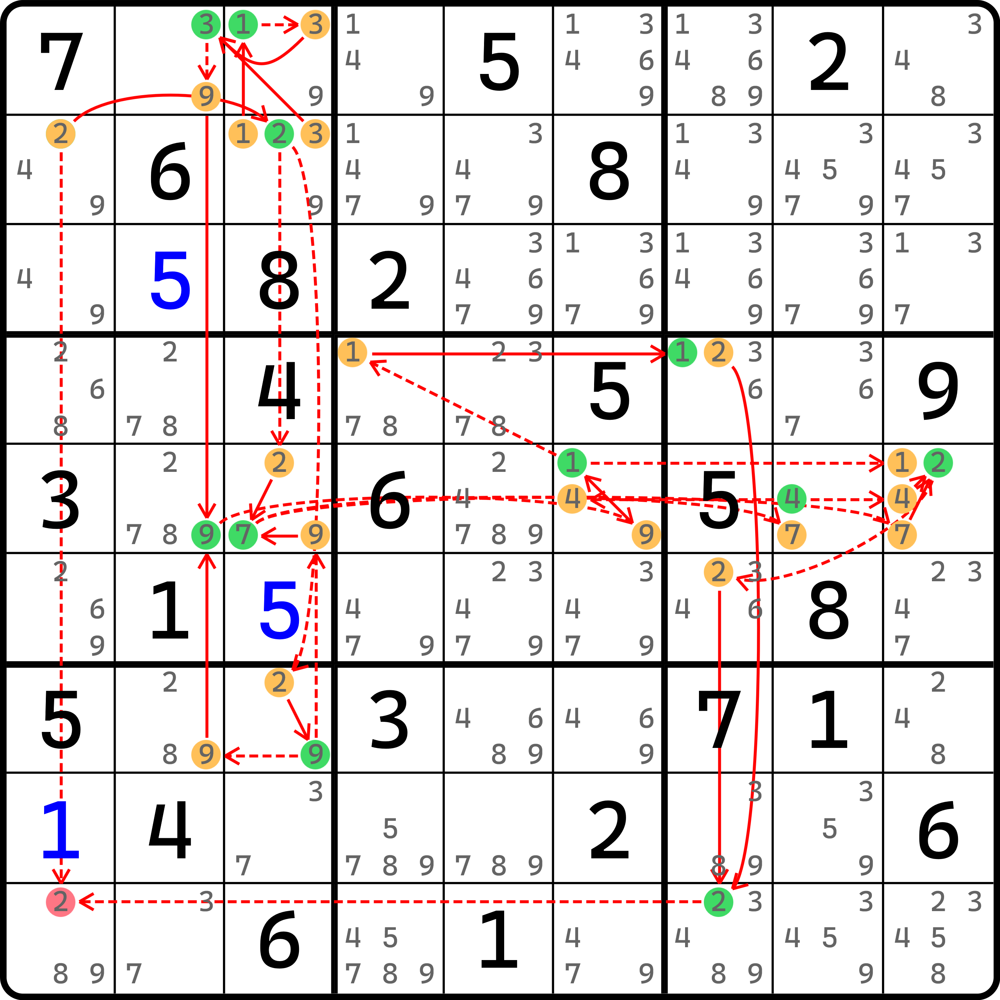
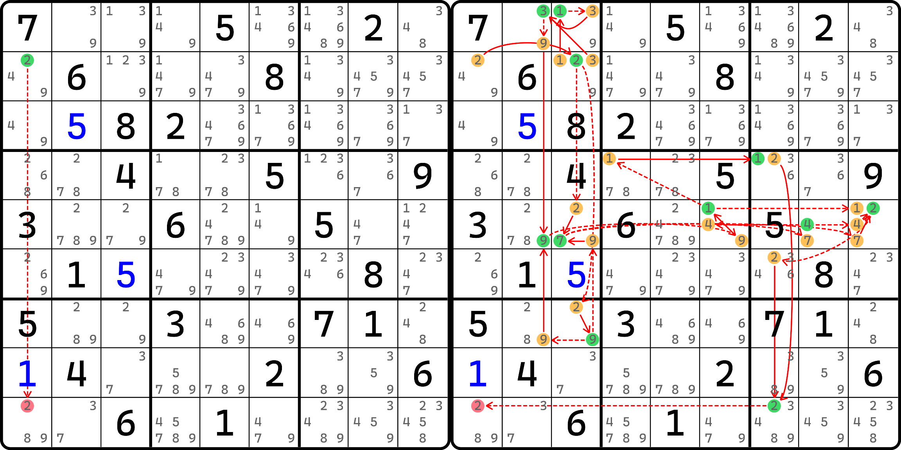

# 动态强制链

本文讨论强制链加上分支的情况。虽然说强制链自身带有分支，但这里说的是每一个分支上的子分支的情况。

请注意。本文的内容的复杂度过高，对于平时做题来说没有任何的帮助，只是为了给各位展示分支带分支的套娃逻辑，仅供观赏。

## 动态单元格强制链（Dynamic Cell Forcing Chains） <a href="#dynamic-cell-forcing-chains" id="dynamic-cell-forcing-chains"></a>

<figure><figcaption><p>动态单元格强制链</p></figcaption></figure>

如图所示。这还算比较短的，我实在是找不到合适的例子了……这个例子的写法如下：

```
    1r5c6:
      -1r5c1
      -(1=2)r5c2-2r5c1
      -(1=2)r5c2-(2=4)r6c3-4r5c1
    =6r5c1-6r5c8
    1r5c6-1r5c8
  =7r5c8-7r6c9
  1r5c6-(1=2)r5c2-(2=4)r6c3-4r6c9
=1r6c9-1r7c9
(4-1)r5c6=1r7c6-1r7c9
(5-1)r5c6=1r7c6-1r7c9
```

首先是从 `r5c6` 作为分支讨论，跟之前单元格强制链的方式完全相同。接着我们需要挨个讨论 1、4、5 三种数字填入后产生的效果。

其中数字 1 为真后，会同时引发同行其余位置的 1 全为假。但是每一个 1 的走向不同，所以这里会诞生新的若干分支。其中。其中 `r5c2(1)` 为假的这个分支会走向 `r5c2(2)` 并往下延伸；延伸到 `r6c3(4)` 则还有继续的分支。不过，这里其中一个分支的填数，算上 `r5c2(2)` 为真的状态，会使得 `r5c1` 的除了 6 外的数字全为假，然后就可以合并到 `r5c1(6)` 为真这个节点上；与此同时，另一边 `r5c8` 也可以得到汇总。

错综复杂的连接最终形成了这样的分支状态图：

<figure><figcaption><p>分支状态图（没有区分强弱链关系）</p></figcaption></figure>

这个图没有区分强弱链关系，只是单纯把节点的叠加操作和行为列举了一次。只要有强链或者弱链关系的都有箭头指向。可以看到，最终删数 `r7c9(1)` 的前件用的是 `r6c9(1)` 和 `r7c6(1)` 取交集得来的。

我们把单元格强制链带有动态分支的情况称为**动态单元格强制链**（Dynamic Cell Forcing Chains）。

## 动态区域强制链（Dynamic Region Forcing Chains） <a href="#dynamic-region-forcing-chains" id="dynamic-region-forcing-chains"></a>

<figure><figcaption><p>动态区域强制链</p></figcaption></figure>

如图所示。实在是有点复杂，我都懒得写文本描述了。总之就是分支讨论三个 4 的填数，最终都能删除同一个数。只是这个例子也具有分支的逻辑，因此看起来会复杂一些。

这个题就自己看了。

我们把这种区域强制链里带动态分支的情况称为**动态区域强制链**（Dynamic Region Forcing Chains）。

## 动态矛盾强制链（Dynamic Contradiction Forcing Chains） <a href="#dynamic-contradiction-forcing-chains" id="dynamic-contradiction-forcing-chains"></a>

### 基本推理 <a href="#basic-reasoning-of-dynamic-contradiction-forcing-chains" id="basic-reasoning-of-dynamic-contradiction-forcing-chains"></a>

由于动态链的关系，动态强制链会比之前普通强制链要多出两种类型。

<figure><figcaption><p>动态矛盾强制链</p></figcaption></figure>

如图所示。这种强制链的讨论方式是假设某一个节点为真（或者假设为假），如果能得到某一个节点既为真又为假的情况（换言之，就是推导走向两个完全独立的分支，分支最终汇聚到同一个节点上，但真假性完全互斥）。这个时候我们就认为，原始假设存在矛盾，因为原始假设会同时造成某一个节点既对又错的情况。

比如这个题，拆解为两个分支，就是这样的：

<figure><figcaption><p>形成矛盾的两个不同的分支</p></figcaption></figure>

如图所示。可以看出，左图里展示的是可以到达 `r6c6 = 7` 的情况，而右图展示的是 `r6c6 <> 7` 的情况。这便是形成矛盾了。

所以，最初的假设（`r9c1 = 4` 这个假设）是错误的，故删除这个候选数。

我们把这种论证某一个节点会导致某一个节点既真又假的矛盾状态的强制链类型称为**动态矛盾强制链**（Dynamic Contradiction Forcing Chains）。因为这种论证逻辑只依赖于真和假的矛盾，所以这个技巧出现就一定只有两个分支。只是说这两个分支里会带有子分支的情况。

### 为什么非动态强制链里不存在矛盾强制链这种类型？ <a href="#why-contradiction-forcing-chains-may-not-exist-in-non-dynamic-chaining" id="why-contradiction-forcing-chains-may-not-exist-in-non-dynamic-chaining"></a>

另外，之所以说普通强制链（没有动态分支的强制链）不存在矛盾强制链这种类型，是因为证明得到矛盾的节点，这个位置在两个视图下的分支是可以合并成一条普通链的。比如说 $$A \to B' \to C \to D'$$ 这个分支（带撇号的表示为假，不带的表示节点为真）和 $$A \to E' \to F \to G' \to D$$ 这个分支因为最终汇聚到 $$D$$ 节点，但真假性并不相同，于是我们就可以把他合并为 $$D \to G' \to F \to E' \to A \to B' \to C \to D'$$ 这一条链（把其中一个分支反向，并拼接到节点 $$A$$ 上去就可以完成合并）。把头尾重复的 $$D$$ 节点删去，这便是一条设 $$G$$ 节点为假的普通链，能推到 $$C$$ 节点结束。删数是这个 $$D$$ 节点了。这就是为什么说矛盾强制链是不存在于非动态的情况里的真正原因。

## 动态二值矛盾强制链（Dynamic Double Forcing Chains） <a href="#dynamic-double-forcing-chains" id="dynamic-double-forcing-chains"></a>

还剩下一种。这种也是矛盾强制链，不过稍微有点不一样。

<figure><figcaption><p>动态二值矛盾强制链</p></figcaption></figure>

如图所示。这是不是无从下手？我们反过来看。

<figure><figcaption><p>拆解开的两个视图</p></figcaption></figure>

如图所示。其左边的视图是假设 `r2c2 = 2` 的情况；右图则是假设 `r2c2 <> 2` 的情况。这个例子比较好的一点是，左图这个分支直接可以对应到删数上，所以完全不用费额外的工夫去理解它。

当两种情况同时考虑后，我们发现，删数是 `r9c1(2)`，它是两种情况下都能删除的数。所以，这个题的结论就是 `r9c1 <> 2`。

这个技巧叫做**动态二值矛盾强制链**（Dynamic Double Forcing Chains）。如果你忽略左图这个分支的话，其实可以看到，单独看右图这个分支其实就可以已经单独提出去当作一个动态链来看了（只是很复杂罢了）。之所以这也算一种技巧，是因为分析软件 Sudoku Explainer 不存在普通的动态链的逻辑，它的这个技巧用于完成普通动态链的删数工作。

至此就把四种动态链里的强制链部分说完了。

## 动态强制链的尤里卡记号 <a href="#eureka-notation-in-dynamic-forcing-chains" id="eureka-notation-in-dynamic-forcing-chains"></a>

一般来说，我们都不用怎么担心尤里卡记号写不了动态链。因为动态链实在是过于复杂，因此很多时候它的表述更加“主观”一些，写起来比较随意一些，毕竟这个记号模式确实在动态链里没有相关的严格标准规范。

我推荐的做法是，将分支逐条列出，然后根据列出的分支按照分叉和汇入的规则排好顺序。排序之后，然后按缩进的方式表达。比如说最开始的那个例子：


```
    1r5c6:
      -1r5c1
      -(1=2)r5c2-2r5c1
      -(1=2)r5c2-(2=4)r6c3-4r5c1
    =6r5c1-6r5c8
    1r5c6-1r5c8
  =7r5c8-7r6c9
  1r5c6-(1=2)r5c2-(2=4)r6c3-4r6c9
=1r6c9-1r7c9
(4-1)r5c6=1r7c6-1r7c9
(5-1)r5c6=1r7c6-1r7c9
```


在这个例子里，打头的是这个部分：


```
1r5c6:
  -1r5c1
  -(1=2)r5c2-2r5c1
  -(1=2)r5c2-(2=4)r6c3-4r5c1
=6r5c1-6r5c8
```


这一部分表示的是 `r5c6(1)` 作为起头，然后引出三个分支。这三个分支因为最终都走向了 `r5c1` 的候选数，所以引出了 `r5c1(6)` 为真的情况。然后继续。而外层的缩进：


```
  1r5c6:
    -1r5c1
    -(1=2)r5c2-2r5c1
    -(1=2)r5c2-(2=4)r6c3-4r5c1
  =6r5c1-6r5c8
  1r5c6-1r5c8
=7r5c8-7r6c9
```


则表示的是最上面整个一坨动态链分支（第 1 到 5 行），然后算上新的 `r5c6(1)` 到 `r5c8(1)` 这个分支（第 6 行）后，因为结尾都指向 `r5c8` 单元格，因此汇入到 `r5c8(7)` 为真的节点上。然后最外层：


```
    1r5c6:
      -1r5c1
      -(1=2)r5c2-2r5c1
      -(1=2)r5c2-(2=4)r6c3-4r5c1
    =6r5c1-6r5c8
    1r5c6-1r5c8
  =7r5c8-7r6c9
  1r5c6-(1=2)r5c2-(2=4)r6c3-4r6c9
=1r6c9-1r7c9
```


这一层则和刚才类似，先是上面一整坨内容（中间层分支那一坨内容，即这里最外层分支里第 1 到 7 行的部分）是一个分支，它汇入到了 `r6c9(7)` 上，然后和另外一个分支（第 8 行）的末尾 `r6c9(4)` 都指向 `r6c9`，于是他们一起汇入到 `r6c9(1)` 得到为真的结论，最终走到 `r7c9(1)`（删数）上来。

所以，我们通过缩进就可以控制同一层级的强弱链关系，这样不会造成歧义的同时还能严格表示出所有的动态强制链。

总结一下。使用尤里卡记号表示的时候，如果需要分叉，就用冒号来表示；冒号一般意义上来说也是可以省略的，缩进是可以表示出来分叉的含义的，但延续之前冒号表示每一个分支走向时的写法，所以这里才保留了冒号。另外，如果需要汇入分支，则需要确保分支是否全部列举完毕，他们必须在同一个缩进层级，然后退回一层缩进（**取消缩进**，Unindenting）来表示汇入后的分支是它上一级的情况。

下一节我们将开始探讨动态环的删数逻辑。
