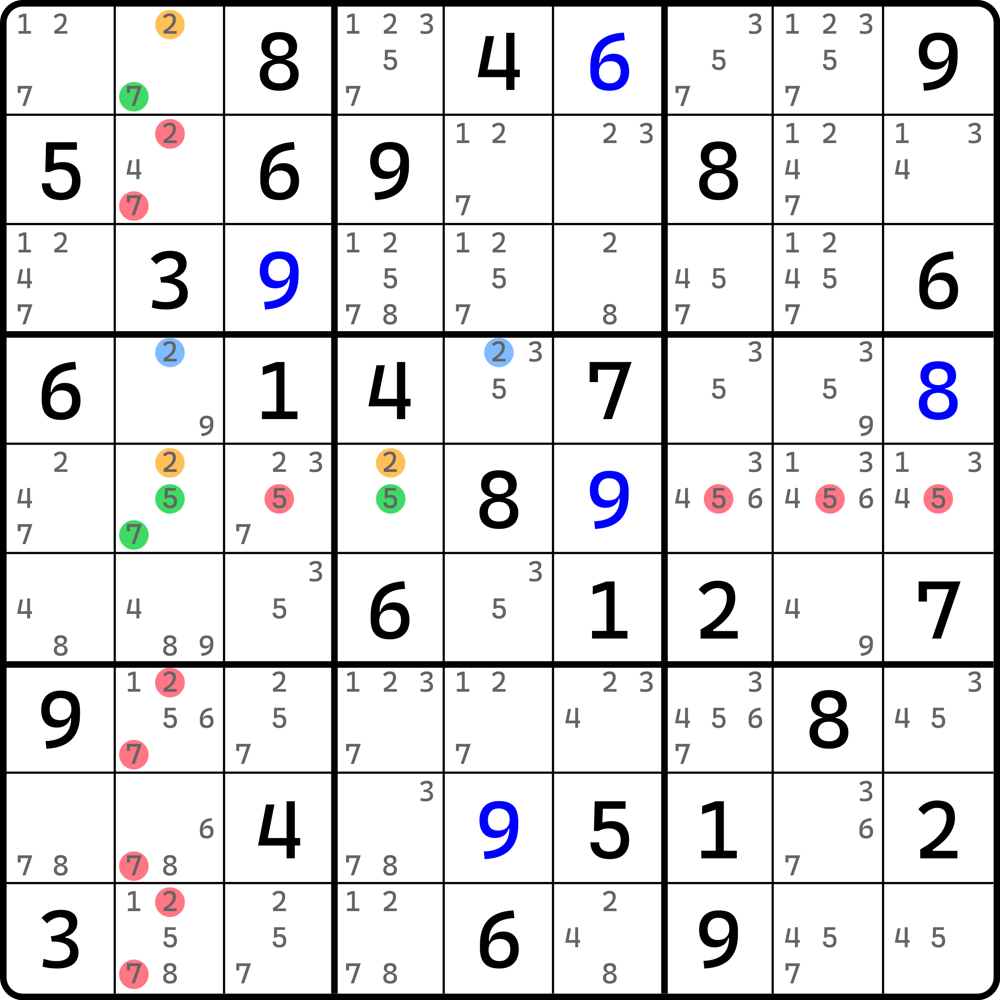

# 动态环的删数分析

本文将探讨动态分支逻辑下最难的一点：动态环的删数。

## 动态连续环（Dynamic Continuous Loop） <a href="#dynamic-continuous-loop" id="dynamic-continuous-loop"></a>

<figure><figcaption><p>动态连续环</p></figcaption></figure>

如图所示。之前就说环没有起点，现在倒好，还加入了分支的设定，这下彻底没办法看了。

别急。我们先找出这个环里的分支位置。可以看到，这个环的分支在 `r7c6` 这个单元格。进入这个单元格里的是弱链关系（`8r7c2-8r7c6` 这个弱链关系），所以下一个应该是强链关系。但很明显，这个单元格有三个候选数，根本就不存在强链关系，所以我们需要借助分支的方式进行讨论。

当分支走向 `r7c6(2)` 的时候，我们会绕到 `r5c8(2)` 为真，然后 `r5c8(1)` 为假；当分支走向 `r7c6(5)` 的时候，我们会走上面，带待定数组这个分支。然后照样会到 `r5c8(1)` 为假。此时汇入同一个候选数节点上，继续朝左，并最后又会回到 `r7c6` 这个分叉的单元格上。

这个环具有两个分支，并最终会汇入到同一个候选数上，因此就是很简单的动态的逻辑。不过，因为它收尾相连的时候不存在任何推导上的矛盾，所以这个环可以这么周而复始地无限进行下去。所以，它从定义上来看是符合环的特征的。但是，因为它有动态的因素在里面，所以删数都含有哪些呢？

从逻辑的角度来看，我们很清楚地知道，动态所产生的分支，他们各自是独立的状态；也就是说，他们两边是并列的关系，我们只能知道他们从形式上满足环的特征，但实际具体哪一个分支是这个题最终的选取结果，我们并不清楚。说人话就是，虽然我们知道 `r7c6` 这里有分支了，但是我们不清楚 `r7c6` 在答案上填的是哪个数字，也就意味着我们并不能判断这个链的分支走向具体是哪一边是成立的。这也告诉了我们，虽然环是可以全弱链删数的，但这一点被动态的分支所打破，所以我们不能盲目地使用之前的结论套用到动态环上去。

于是，我们整理了思路，我们发现，整个环里分叉出去的部分肯定是不能删数的，而只有汇入了之后，到分叉之前的这个部分里，所有弱链关系才能用于删数。对于这个题来说，只有 `1r5c8=1r5c2-(1=8)r7c2-8r7c6` 这一截的弱链关系可以用来删数。梳理出来，这个题的删数就只有 `r7c5 <> 8` 这一个结论。

我们把这个环称为**动态连续环**（Dynamic Continuous Loop）。

等会儿！你可能会问我，连续环的英文不是 continuous nice loop 么，这 nice 这个单词呢？别急。下面我们就来说说这个动态环的分类。

## 全环和半环 <a href="#nice-loop-and-non-nice-loop" id="nice-loop-and-non-nice-loop"></a>

对于动态环而言，因为动态分支的特征，所以环里可能弱链关系不全可以用于删数。所以，对于动态环来说，环是分为全弱链删数和非全弱链删数两种情况的。像是刚才讲解的例子里，它就属于非全部弱链都能删数的这种情况。我们把这种称为**半环**（Non-nice Loop）；相反地，我们把动态环里所有弱链都可以用于删数的环，称为**全环**（Nice Loop）。是的，这个 nice 用来表示的是环上是否全部弱链都可以参与删数。当为半环的时候，一般是用 non-nice 一词修饰，或者干脆就不写。比如刚才这个题，严格取名的话，应该是叫“动态连续半环”的，而半环的 non-nice 一般不写出来用来和 nice 区分，所以英文名的 nice 才会不见的。

我知道，你肯定会问我，既然是动态环，自然会产生分支。就刚才例子来看，这种分支显然是客观并列的形态，所以肯定不是所有弱链都可用于删数。但是也确实想不到有什么情况下，动态环还能是全环的情况。

如果我们从这个分支的视角去理解动态环删数的话，那么势必是想不通的，因为它没有触碰最为本质的逻辑。我们先了解一下，对于刚才这种环，删数并不是全部弱链关系的最底层、最本质的原因。当我们知道了这个原因后，我们就知道为什么动态分全环和半环，以及什么时候动态环是全环状态。

## 弱链删数分析 <a href="#elimination-analysis" id="elimination-analysis"></a>

抓住删数的本质，就是去找寻为什么弱链上的候选数有的可删，有的不可删。

我们回忆一下普通的连续环。非动态的连续环的所有弱链关系上均可引发删数，其本质原因是，我们清楚地知道，所有弱链都可以先拆开，然后形成普通的链后，按普通链删数；而其链的删数恰好就是弱链关系连接的这个走向上。换一种说法的话，我们可以知道的是，弱链两头的端点总会有其中一个节点是为真的，它可以保证我们这个弱链上必然存在可用于删数的节点信息。

记住这一点。**弱链两头的端点总会有其中一个节点是为真的**，所以这个弱链可以用作删数。我们将基于这个规则来看动态环的删数分析。

我们回到刚才的例子。这个动态环需要分析是否弱链两头的端点是否真的会有其中一个节点为真。

<figure><figcaption><p>还是那个动态环</p></figcaption></figure>

如图所示。现在我们需要分析它的填数状态，那么我们就需要排列出整个环里所有节点的真假状态。

<table><thead><tr><th width="99.86663818359375">情况编号</th><th>为真的节点</th></tr></thead><tbody><tr><td>1</td><td>r1c6 = 5、r2c5 = 1、r3c8 = 1、r5c2 = 1、r5c8 = 2、r7c2 = 8、r7c6 = 2</td></tr><tr><td>2</td><td>r1c6 = 5、r2c5 = 6、r3c8 = 1、r5c2 = 1、r5c8 = 2、r7c2 = 8、r7c6 = 2</td></tr><tr><td>3</td><td>r1c6 = 5、r2c5 = 6、r2c7 = 1、r5c2 = 1、r5c8 = 2、r7c2 = 8、r7c6 = 2</td></tr><tr><td>4</td><td>r1c6 = 5、r2c5 = 6、r2c7 = 1、r5c8 = 1、r7c2 = 1、r7c6 = 8、r7c8 = 2</td></tr><tr><td>5</td><td>r1c6 = 6、r2c5 = 1、r3c8 = 1、r5c2 = 1、r7c2 = 8、r7c6 = 5、r7c8 = 2</td></tr><tr><td>6</td><td>r1c6 = 6、r2c5 = 1、r3c8 = 1、r5c2 = 1、r7c2 = 8、r7c6 = 5、r5c8 = 2</td></tr><tr><td>7</td><td>r1c6 = 6、r2c5 = 1、r3c8 = 1、r5c2 = 1、r7c2 = 8、r7c6 = 2、r5c8 = 2</td></tr></tbody></table>

而这个环用到了如下的一些弱链：

<table><thead><tr><th width="200.13323974609375">弱链关系</th><th width="130.06671142578125">隶属</th><th>备注</th></tr></thead><tbody><tr><td><code>1r5c2-1r7c2</code></td><td>主线</td><td></td></tr><tr><td><code>8r7c2-8r7c6</code> </td><td>主线</td><td></td></tr><tr><td><code>5r7c6-5r1c6</code> </td><td>分支</td><td></td></tr><tr><td><code>1r3c8-1r5c8</code></td><td>分支</td><td></td></tr><tr><td><code>2r7c6-2r7c8</code> </td><td>分支</td><td></td></tr><tr><td><code>(2-1)r5c8</code> </td><td>分支</td><td></td></tr><tr><td><code>r1c6(6)</code> 和 <code>r2c5(6)</code></td><td>待定数组</td><td>如果待定数组要参与删数，这里俩 6 就会发挥删数的作用</td></tr></tbody></table>

> 这里带了个待定数组会无形之中增加分析的难度，但好在这个题删数用不上它。
>
> 假如哈，我是说假如，假如这个待定数组可以用作删数，那么这俩 6 就会被考虑在内。虽然它不算弱链关系，但因为待定数组被我们整体分析的，所以删数考虑起来会麻烦非常多。不过，对于这个题而言，因为待定数组的结构还算简单，所以其实可以转为普通的强弱链关系，如 `(5=6)r1c6-(6=1)r2c5` 这样迂回地走过去，这样的话 `6r1c6-6r2c5` 的弱链关系就会体现出来；那么删数分析的时候，这两处的 6 如果有删数就会被我们前面列举的弱链关系的这个表格所记录，就不会造成删数遗漏。

我们对比前面得到的 7 种不同的排列情况，然后强行去找是否弱链关系的其中一个端点在这个情况组合下为真的。于是我们又会得到这一张表：

<table><thead><tr><th width="150.33331298828125">弱链关系</th><th width="330">包含两端其中一端为真的情况编号</th><th>是否可以参与动态环删数</th></tr></thead><tbody><tr><td><code>1r5c2-1r7c2</code></td><td>1、2、3、5、6、7（r5c2 = 1）；4（r7c2 = 1）</td><td>⭕</td></tr><tr><td><code>8r7c2-8r7c6</code></td><td>1、2、3、5、6、7（r7c2 = 8）；4（r7c6 = 8）</td><td>⭕</td></tr><tr><td><code>5r7c6-5r1c6</code></td><td>1、2、3、4（r1c6 = 5）；5、6（r7c6 = 5）</td><td>❌（缺少情况 7）</td></tr><tr><td><code>1r3c8-1r5c8</code></td><td>1、2、5、6、7（r3c8 = 1）；4（r5c8 = 1）</td><td>❌（缺少情况 3）</td></tr><tr><td><code>2r7c6-2r7c8</code></td><td>1、2、3、7（r7c6 = 2）；4、5（r7c8 = 2）</td><td>❌（缺少情况 6）</td></tr><tr><td><code>(2-1)r5c8</code></td><td>1、2、3、6、7（r5c8 = 2）；4（r5c8 = 1）</td><td>❌（缺少情况 5）</td></tr><tr><td><code>6r1c6-6r2c5</code></td><td>2、3、4（r2c5 = 6）；5、6、7（r1c6 = 6）</td><td>❌（缺少情况 1）</td></tr></tbody></table>

在完整列举完毕后，我们可以清楚地知道，只有头两个弱链关系，在所有 7 种可能的排列下，全都存在两端至少有一端为真的情况。所以，这两个弱链关系可用于删数；但后面几种均不可用于删数，因为并非全部情况都存在两端至少有一端为真。

因为我们保证稳定删数是需要要求所有可能填数均需要让删数成立的，所以但凡其中有一种情况不成立，那么整个弱链关系就不能用作删数了。可以从表里看出，后续的弱链关系每一个都只存在一种情况不满足，但就正是因为这缺少的情况，导致整个弱链关系在这种情况下不构成至少一端为真，进而无法保证它能用作删数。

总之，要想让弱链关系用于删数层面，需要使得这个弱链关系能在所有可能的填数排列形态下（不违背数独规则的、能填写到节点上的所有填数可能），验证弱链两端是否在所有情况下均存在至少一端为真。我们把这种分析删数的行为称为**删数分析**（Elimination Analysis）。

## 绽放环（Blossom Loop） <a href="#blossom-loop" id="blossom-loop"></a>

有没有想过，当强制链形成回环后，会有什么样的效果呢？

<figure><figcaption></figcaption></figure>

如图所示。本题是强制链，并带有三个分支，从 `r1c7` 单元格出发，并回到 `r4` 的所有 6 的位置上。非常巧妙的是，这个题的分支有 3 个，他们完全不同；最终走到 `r4` 上时，每一个分支都会唯一对应到一个 6 的位置上去。所有强链关系引出，并用弱链关系引入。写法如下：

```
6r1c7=6r1c2-6r7c2=6r7c1-6r4c1
7r1c7=(7-1)r1c5=1r9c5-(1=6)r9c4-6r4c4
8r1c7=(8-6)r4c7
```

看起来这个似乎跟前面任何的强制链的思路都没有关联。这是怎么删数的呢？我们思考一个问题哈。本题的强链关系出去，弱链关系收回的逻辑会不会存在一些特殊效果？

我指的是什么效果呢？比如说，我们显然发现，弱链收回的 `r4` 实际上仅存在这三个可以放 6 的位置，不存在其他单元格可以填 6。这说明什么？这说明 6 必须落入其中一个分支上。而我们之前说过，链是可以逆向的，那么对于强弱链关系来说，我们就可以从终点往回看，这样就可以满足三个 6 的位置的其中一个分支起点假设为真的逻辑。

按照这个思路进行，我们最终会回到 `r1c7` 这个单元格。因为回去的三个分支全部是强链关系，所以也就意味着我们最终会得到 `r1c7` 里其中一个候选数为真。既然其中一个候选数为真，那么剩下的两个就会变为假的状态。于是？于是这个链的其余两个分支就可以顺推回到 `r4` 的另外两个 6 的填数位置上去，使得剩下两个分支的 6 为假。

这可能有些绕。我说细致一些。我想说的是，因为我们知道 `r4` 只有三处填 6 的位置。假设填入其中一个位置（假设此时是 $$A$$ 这个位置填），那么剩下的俩 $$B$$ 和 $$C$$ 就为假；但是，我们也可以通过先从 $$A$$ 这个位置反推回单元格 `r1c7` 的三个候选数上（暂且记作 $$A'$$、$$B'$$ 和 $$C'$$）。

在我们假设 $$A$$ 为真的时候会得到 $$A'$$ 为真（因为尾巴这里是强链关系，从假到真的是强链关系）；而 $$A'$$ 为真的同时又可以直接认定 $$B'$$ 和 $$C'$$ 是为假的，于是 $$B$$ 和 $$C$$ 按顺推就会为假（因为这次尾巴这里是弱链关系，从真到假的是弱链关系）。于是就构成了这么个链路关系：

$$
A \text{真} \to A' \text{真} \to B' \text{假}\ C' \text{假} \to B \text{假}\ C \text{假}
$$

我们再次假设 $$B$$ 和 $$C$$ 两边时也都可以分别得到类似的结论，且所有强弱链关系均不会造成推断矛盾（比如说“本来设为强链关系的，但是假设了其中一个数为真的时候这里不成立了”之类的问题）。这意味着它形成了完美的思路闭环。这里说的“思路闭环”是说它的推导过程是完全闭环的，不会通过任意的位置走出这个推导线路。总之就是，因为 $$A$$、$$B$$ 和 $$C$$ 的填数状态是互斥的（整个行只有一个可以填 6 的位置，也必须有一个填 6 的位置），所以三者不能共存。而我们任意保留其中一个，都能使得整个链路回环运作起来且不发生矛盾。

而对于我们刚才反推的“中转站”单元格 `r1c7` 而言，因为三个分支均会走这个单元格的其中一个候选数经过且均都是为真的状态经过的，所以 `r1c7` 里的三个候选数 6、7、8 必须有一个为真。当然，这个题的 `r1c7` 不存在其他的候选数；如果有的话，这个单元格的其余候选数是可以删除的；而对于其他分支上而言，我们也可以认为，本题所有用到弱链两端的节点，虽说弱链关系是不同真，但是原本弱链关系是可以同假的，但是这个闭环的话是不存在的，因为思路闭环上并未出现两端同假的状态。换言之，如果任意假设一个弱链关系的两端同为假的话，则一定会推得矛盾。为什么呢？因为能安排如此排布的数字都是一真一假这么交替摆放的（除了 `r1c7` 和 `r4` 这里开头和收尾的两个地方）；当你一旦设其中一个弱链关系两端为假的时候，这里就没办法正常推导，所以导致的矛盾就必然会是诸如 `r4` 三处 6 均无法填数这样的矛盾。

所以，这种思路闭环的删数分为两部分：

1. `r1c7` 这个中转站如果存在除了 6、7、8 外的别的候选数，就都可以删除；
2. 所有弱链关系必定一真一假（不可能同假），因此可以按环的类似形式删数。

这种强制链回环的技巧被我们称为**绽放环**（Blossom Loop）。因为这个删数逻辑（尤其是第二点）使得它在不使用删数分析之前就可以得到，而它可以被论证所有弱链均可删数，所以绽放环就是一种全环。如果使用删数分析也是可以得到全弱链均可用于删数的结论，不过这里就不再赘述了，画表确实也有些费劲。

我们再来看一个例子。

<figure><figcaption><p>绽放环，另一个例子</p></figcaption></figure>

如图所示。这个题也希望你自己推理。

## XYZ 环（XYZ-Loop） <a href="#xyz-loop" id="xyz-loop"></a>

接着我们来介绍一个有趣的技巧。

### 发现删数分析的瑕疵 <a href="#bug-in-analysis" id="bug-in-analysis"></a>

<figure><figcaption><p>XYZ 全环</p></figcaption></figure>

如图所示。这个环我们先从 `r5c2` 出发推理一下。

首先，`r5c2` 可以走出两个分支 2 和 7。对于 2 而言，我们会走到 `r4c2(2)` 这里为假。然后发现 `2r4c2=2r4c5` 的强链关系，于是走右边，然后到 `r5c4` 最后绕回 `r5c2(5)` 上面来（`r5c2(5)` 此时为假）。而对于走 7 这个分支的话，就会走到 `r1c2` 上，让 `r1c2(2)` 为真，然后绕到 `r4c2(2)` 上来为假，和前一个分支走到这里完全一样，于是归并到一起。

这个环看起来似乎和之前最普通的动态环的思路完全一样，也是起头分支，然后两个分支会汇入同一个节点上，然后往后推，又走回分支上，所以是一个很平凡的动态环。

看起来还挺像那么回事的，是吧？但是这可比之前那个例子强太多了。你可以看到，这个题删这么多的候选数，这可是最开始那个例子所不可企及的地方。但是你肯定会很诧异，同样是分支和汇合，为什么这个例子就能删这么多？

鉴于这个例子的强弱链关系较少（这可比刚才绽放少太多了），我们也来进行一轮弱链删数分析，看看它的删数是怎么来的。

先找出这个环里的所有弱链关系。

| 弱链关系           | 隶属 |
| -------------- | -- |
| `2r4c5-2r5c4`  | 主线 |
| `5r5c4-5r5c2`  | 主线 |
| `2r1c2-2r4c2`  | 分支 |
| `2r5c2-2r4c2`  | 分支 |
| `7r5c2-7r1c2`  | 分支 |

很好，这个环整体就四个弱链关系。接着，我们试着穷举一下这个题的所有填数情况。

| 情况编号 | 为真的节点                               |
| ---- | ----------------------------------- |
| 1    | r1c2 = 7、r4c2 = 2、r5c2 = 5、r5c4 = 2 |
| 2    | r1c2 = 7、r4c5 = 2、r5c2 = 2、r5c4 = 5 |
| 3    | r1c2 = 2、r4c5 = 2、r5c2 = 7、r5c4 = 5 |

然后看一下弱链两头是否有为真的情况都有哪些。

<table><thead><tr><th width="164.73333740234375">弱链关系</th><th>包含两端其中一端为真的情况编号</th><th>是否可以参与动态环删数</th></tr></thead><tbody><tr><td><code>2r4c5-2r5c4</code> </td><td>1（r5c4 = 2）；2、3（r4c5 = 2）</td><td>⭕</td></tr><tr><td><code>5r5c4-5r5c2</code> </td><td>1（r5c2 = 5）；2、3（r5c4 = 5）</td><td>⭕</td></tr><tr><td><code>2r1c2-2r4c2</code> </td><td>1（r4c2 = 2）；3（r1c2 = 2）</td><td>❌（缺少情况 2）</td></tr><tr><td><code>2r5c2-2r4c2</code></td><td>1（r4c2 = 2）；2（r5c2 = 2）</td><td>❌（缺少情况 3）</td></tr><tr><td><code>7r5c2-7r1c2</code> </td><td>1、2（r1c2 = 7）；3（r5c2 = 7）</td><td>⭕</td></tr></tbody></table>

好了，下面我们就得到了删数的弱链关系有这么 3 个（`2r4c5-2r5c4`、`5r5c4-5r5c2` 和 `7r5c2-7r1c2`），然后就可以开始删数了。

别急！对比例子给的删数，我们发现，似乎这个 `c2` 的所有 2 是可以删的，但在删数分析里我们明确得到了它因为缺少情况所以不能删。这里是我们的思路有哪里不严谨了吗？还是说，弱链删数分析的过程本身就存在瑕疵呢？

### 找出瑕疵的根本原因 <a href="#find-reason-causing-the-bug" id="find-reason-causing-the-bug"></a>

很显然，我们的删数是没有错误的，但是它没有删全，有漏掉的删数。我们可以看到，这两个分支上的、跟 2 有关的这两个弱链关系刚好都在 `c2` 上，而删数恰好也在 `c2` 上，说明这个 2 可能确实是可以用于删数的，但被我们意外地排除掉了。

这就要说一下问题的本质了。我们目的是为了去删这个数，而删这个数的本质是弱链关系肯定有一端为真，对吧？但是，我们似乎漏了一个情况，就是，弱链关系它可以两端都为假，但这一列仍然有 2 的出现，在别的位置上。这是什么意思呢？

我们整体来看 `c2`。我们可以看到，整个结构里是候选数 2，而且还在 `c2` 上的节点一共有 3 个：`r1c2(2)`、`r4c2(2)` 和 `r5c2(2)`，而这三个候选数节点引出了两个弱链关系 `2r1c2-2r4c2` 和 `2r5c2-2r4c2`。比如说，我们针对于来看 `2r1c2-2r4c2` 这个弱链关系。对于这个弱链关系而言，情况 2（填数组合为 `r1c2 = 7, r4c5 = 2, r5c2 = 2, r5c4 = 5` 的情况）会使得这个弱链关系两头都为假。可是，这个情况下的 2，其实是填在了 `r5c2` 上的，而 `r5c2(2)` 是 `c2` 里、整个动态环里用到的另外一个被我们刚好不在这个弱链关系上而忽略掉的位置。同理，对于 `2r5c2-2r4c2` 这个弱链关系而言，我们刚好有情况 3（组合为 `r1c2 = 2, r4c5 = 2, r5c2 = 7, r5c4 = 5`）覆盖不到。而在这个情况下，其实 2 又恰好填在了 `r1c2` 上。所以，总的来说，我们按弱链分析的方式本身会造成瑕疵的根本原因是，弱链关系并不能真正意义上获取到全部的填数状态。

而对于刚才这个题而言，我们要得到 `c2` 的删数，只需要修改一条删数分析的步骤就行：最后多看一下是否这个环里用到的弱链关系有存在同一种数字的弱链关系，且还在同一个区域下的。如果有的话，就还需要增加一步确保这个数字在这个区域是否所有情况都能填入的判断。

### 妥协与解决办法 <a href="#fix-the-analysis-bug" id="fix-the-analysis-bug"></a>

所以，我们找到了解决办法。下面我们针对于删数分析进行完整的步骤演示和描述：



### 找弱链关系 <a href="#find-for-weak-inferences" id="find-for-weak-inferences"></a>

观察整个环，找出这个环里全部的弱链关系，然后整理出一张表，用于稍后对照。



### 排列填数情况 <a href="#permutation-of-assignments" id="permutation-of-assignments"></a>

对整个环进行填数情况的排列，即为**所有候选数**安排真假性的填数（为真和为假的全部都安排一下，不要遗漏），并确定其中有哪些单元格填了数、填了什么数，最好总结为一张表，用来后续分析。



### 确定哪些弱链两端在全部情况下都有一端为真 <a href="#determine-states" id="determine-states"></a>

对每一个弱链关系，都对照第二步的填数组合情况表看一遍，看看是否所有情况下，这个弱链的两端的其中一端有填数。如果确实如此，这这个弱链可以用于删数。



### 最终确保数字是否真的能删 <a href="#evaluate-missing-cases" id="evaluate-missing-cases"></a>

当如果并非所有情况下，弱链的两头有一头为真，则不代表它不能用于删数。我们还需要确定这个弱链用到的数字和所在区域，是否还存在其他的弱链关系。如果有的话，我们还需要验证数字是否在这些缺失的情况下，是否是填在了这些地方上。如果能确保数字总能填入到这个区域里，则这个数仍旧可以用于删数；否则，就确实不能删。



通过这样的操作，我们就可以完整地完成动态环的删数分析。

哦对，刚才我们看到的这个技巧叫做 **XYZ 环**（XYZ-Loop 或 XYZ-Ring）。从名字里看出，它好像跟 XYZ-Wing 有着些许的关联。实际上确实如此。我们如果把他这么改一下结构的画风，就很像了：

<figure><figcaption><p>XYZ 环，结构画法</p></figcaption></figure>

如图所示。

另外，XYZ 环是全环还是半环呢？看起来似乎是全环。但是，XYZ 环如果按这种结构的画法来看的话，实际上它也可能是半环。我们来看一个 XYZ 半环的例子。

<figure><figcaption><p>XYZ 半环</p></figcaption></figure>

如图所示。这是一个 XYZ 半环的例子。这个半环的删数只有 `r3` 的数字 7 和 `c6` 的数字 1 可以用作删数，别的地方都删不了。如果你确定不了它为什么是半环，可以尝试使用前面提到的过程对这个技巧进行删数分析，不过这里就略了。

### 确定 XYZ 环是半环还是全环的办法 <a href="#determine-whether-an-xyz-loop-is-nice-or-not" id="determine-whether-an-xyz-loop-is-nice-or-not"></a>

我知道你很头疼。虽然看起来似乎都差不多，这不就是在 XYZ-Wing 上搭了一个强链关系么，怎么删数一个是全环一个是半环？

这里教大家一个非常简单的、判断 XYZ 环是半环还是全环的办法，你甚至都不用去画出完整的动态环的强弱链关系就可以直接确定。

XYZ 环从结构上讲，要能形成删数只需要有一个基础的 XYZ-Wing 的结构，然后在 XYZ-Wing 的两个分支（这里是真的分支，XYZ-Wing 讨论的那个分支）上为真的两个数，从外面找一个额外的强链关系，并使得这个强链关系的两头刚好能和这两个数同在一个区域里，就是说能把强链关系给强行连进结构里去。比如说这个半环的例子里 `r3c2(5)` 和 `r9c6(5)` 分别和强链关系的 `r8c2(5)` 和 `r9c1(5)` 相连，牵手成功。

这样的结构就可以直接称为 XYZ 环了。至于它是半环还是全环，先按半环进行删数即可（因为结构成立，所以它最次都是半环）。而半环的删数有两处，就是 XYZ 环里，这个基础 XYZ-Wing 里不是橘色的（分支上不为真的）那两个数的对应区域。

那么，判断全环的办法就是，看这个我们新加入的强链是否有一端甚至可以和 XYZ-Wing 的拐点（那个三值格）同在一个区域里。如果不在，就不是全环；如果在，就是全环。比如这个题里，强链在 `b7` 里，两个格子很遗憾都跟 `r3c6` 没有任何同行列宫的关联，所以它只能是半环；而对于前面那个全环，强链的其中一端 `r4c2` 就和拐点 `r5c2` 同在一个宫（或者说一个列）里，所以是全环。

全环的删数就厉害了。你能找出来的所有弱链关系全部都能删，所以就不用我重复怎么找这些删数了吧。

好了。至此我们就把动态环的删数逻辑全部介绍完毕了。我想我应该充分地表达了我想表达的内容。下面我们将会进入新的链理论内容的学习。
