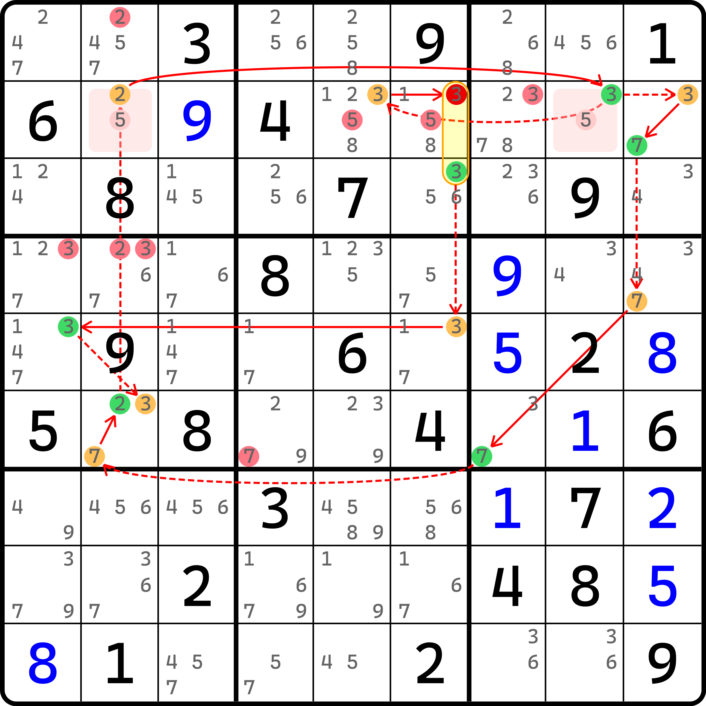
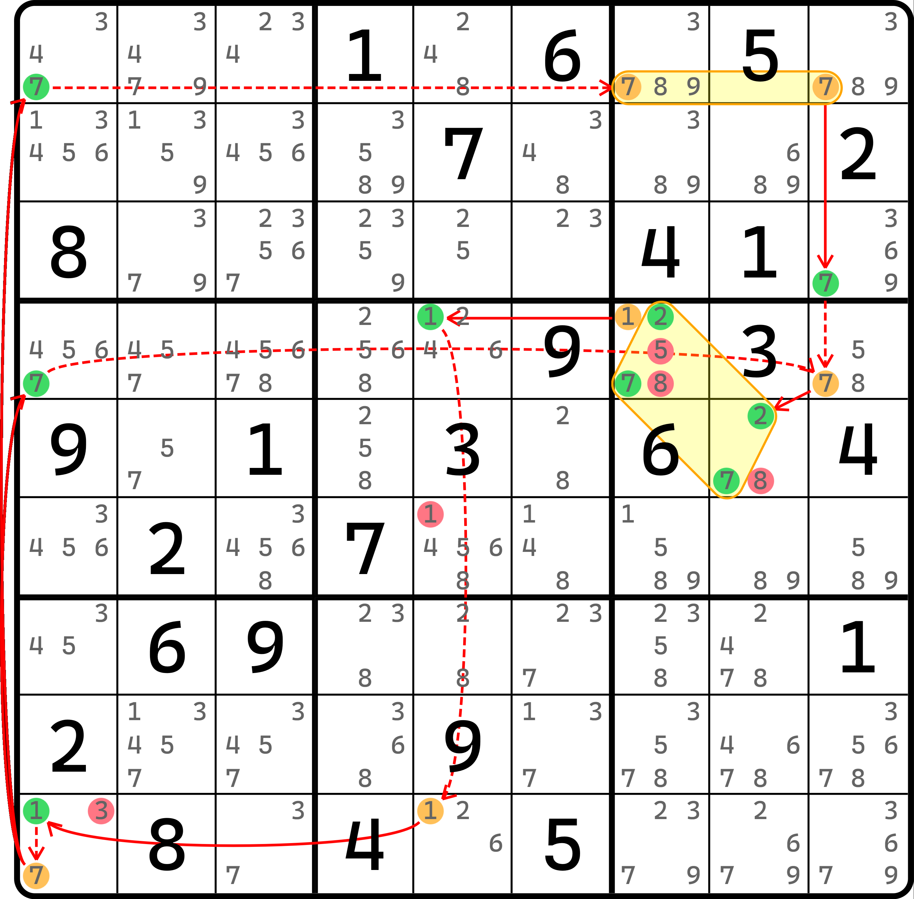
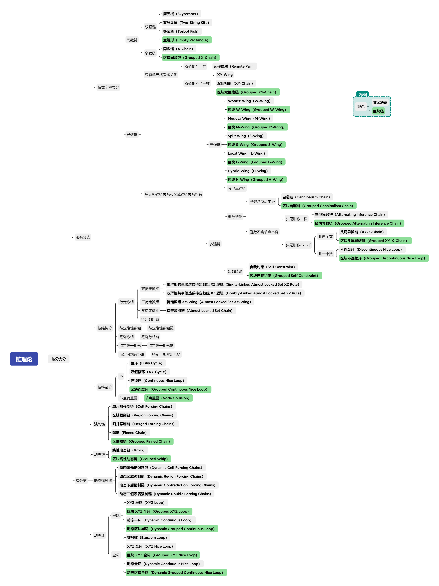

# 动态区块环的删数分析

前一节的内容带着各位简单了解了一下动态环的删数模式。本节的内容将继续来看动态环，不过是带有区块节点的，逻辑会更复杂一些。

## 动态区块全环（Dynamic Grouped Continuous Nice Loop） 

<figure><figcaption>
动态全环，带待定数组
</figcaption></figure>

如图所示。这是一个动态环，并使用了待定数组。这个动态环还有待定数组上的删数。

我们按照删数分析的方式走，这个题仍然可以分析。

<table><thead><tr><th width="115.86663818359375">情况编号</th><th>为真的填数</th></tr></thead><tbody><tr><td>1</td><td>r2c2 = 5、r2c8 = 3、r2c9 = 7、r3c6 = 3、r5c1 = 3、r6c2 = 2、r6c7 = 7</td></tr><tr><td>2</td><td>r2c2 = 2、r2c5 = 3、r2c8 = 5、r2c9 = 7、r5c6 = 3、r6c2 = 3、r6c7 = 7</td></tr><tr><td>3</td><td>r2c2 = 2、r2c8 = 5、r2c9 = 3、r3c6 = 3、r4c9 = 7、r5c1 = 3、r6c2 = 7</td></tr></tbody></table>

然后还是老样子，看看是否弱链满足条件。

| 弱链关系           | 两端有一端为真的情况                | 是否可以用于动态环删数 |
| -------------- | ------------------------- | ----------- |
| `3r2c8-3r2c5`  | 1（r2c8 = 3）；2（r2c5 = 3）   | ❓（还需要继续验证）  |
| `3r2c8-3r2c9`  | 1（r2c8 = 3）；3（r2c9 = 3）   | ❓（还需要继续验证）  |
| `3r23c6-3r5c6` | 1、3（r3c6 = 3）；2（r5c6 = 3） | ⭕           |
| `7r2c9-7r4c9`  | 1、2（r2c9 = 7）；3（r4c9 = 7） | ⭕           |
| `7r6c7-7r6c2`  | 1、2（r6c7 = 7）；3（r6c2 = 7） | ⭕           |
| `3r5c1-3r6c2`  | 1、3（r5c1 = 3）；2（r6c2 = 3） | ⭕           |

我们先忽略掉这个待定数组，删不删数都不重要，主要是怕弄混淆。先来看这部分的弱链关系。我们发现，只有前两个弱链关系似乎不能用于删数。但是别忘了，在上一节的内容我们提到，弱链删数分析时，如果遇到弱链在动态环里，出现同数同区的不同弱链时，需要讨论这个数是否真的不能保证里面会出现这个数的情况。刚好，这两个弱链关系均用的数字 3，而且都在 `r2`，所以满足这个讨论的规则。我们继续看。

我们发现，情况 1、情况 2 和情况 3 分别在 `r2c8`、`r2c5` 和 `r2c9` 填了数字 3。因为我们穷举了全部的情况（这个题一共就 3 个情况），我们都发现，似乎这三个情况总能保证 `r2` 里放 3 的需求。所以，3 是可以参与删数的。

另外我们要注意，区块弱链关系 `3r23c6-3r5c6` 在讨论是否两端有一端为真时（尤其说的是 `r23c6(3)` 这个区块节点），需要遵守区块节点为真的规则，即区块节点里的候选数至少有一个为真，那么区块节点为真。可以看出，情况 1 和 3 都能保证 `r3c6 = 3` 的规则。因为 `r3c6(3)` 是这个区块节点的一部分，所以它为真也就可以认为是这个区块节点为真的状态。

反正我们可以看到，所有 6 个弱链关系均可参与删数。

## 讨论结构的可删数性 

不过别忘了，我们还剩了一个待定数组没有参与讨论。动态环里它是否可以参与删数呢？

答案是肯定的，不过说起来就会显得很复杂。要想证明得到这个结构可以用于删数，我们需要对结构的本体真假性作出严格的讨论，即延伸结构可以用于删数的那些填数。

这个说起来有点绕，其实说的就是待定数组在环里会产生删数的那些额外数字。假设这是一个不带分支的普通的连续环，那你肯定知道，因为待定数组的规则，所有除了强链关系连接的两个数字外，所有其余剩下的无关数字均在这个结构所在的区域上可以删数。那么对于这个题而言，待定数组用到 2、3、5 三种数，其中 2 和 3 参与了强链连接，所以假设它是普通的连续环，那么删数的那个数肯定就是这里的 5 了。那么，我们就需要讨论这个 5 的真假性状态。

刚好，我们在刚才列举情况时，涵盖了 5 的假设填法。我们发现，数字 5 在待定数组里一共有两处位置：`r2c2(5)` 和 `r2c8(5)`。情况 1 是 `r2c2 = 5`，而情况 2 和 3 则是 `r2c8 = 5`。三种情况恰好可以保证 5 肯定可以出现在待定数组的结构之中。所以，5 是可以用于这个动态环的删数的。

也就是说，我们要讨论结构的**可删数性**（Eliminability）时，需要先看结构用于普通连续环时会造成删数的那些位置，进而拓展研究这些位置是否肯定可以占位（所有情况下均存在为真的状态）。如果是的话，那么就可以删；如果不是，则不能。

总之，这个题我们可以看到，普通的环的删数有 `r1c2 <> 2, r2c7 <> 3, r4c1 <> 3, r4c2 <> 23, r6c4 <> 7` 一共 6 个删数；而 `r2c56 <> 5` 则是待定数组在动态环里可删造成的额外删数。

不过，本题还有一个“硬核”删数：`r2c6 <> 3`。这是怎么来的呢？

## 讨论自噬删数 

我们发现，在讨论区块节点时，`r23c6(3)` 本身是含了 `r2c6(3)` 这个位置的。但是它可以用作删数，这是怎么来的呢？

还是刚才的那个表。我们发现，所有正常的填数模式下，压根就不涉及 `r2c6 = 3` 的这个填数情况。所有三种情况下，区块节点 `r23c6(3)` 都只填了 `r3c6(3)` 这一个位置。这肯定很奇怪。既然如此，`r2c6(3)` 摆在这里岂不是在“摸鱼”？

实际上我们在排列所有填数情况时早已知道 `r2c6 = 3` 是不存在的填法，不然表格里就肯定会有它的身影。对于不存在的填法，直接删除它是正确的，也是合理的做法。如果你理解不了这一点，我们就尝试故意填入 `r2c6 = 3` 然后看看是不是不可能。

当我们假设了之后会直接发现，按照动态环的路径进行的话，待定数组里 `r2c2 = 2`、分支上 `r5c1 = 3`、右下角的分支会得到 `r6c7 = 7`。这三个单元格会同时造成分支汇入的单元格 `r6c2` 直接无法填入任何数字，直接就矛盾了。因此，`r2c6 = 3` 根本就不可能存在。

是的，这还存在一个非常隐蔽的删数 `r2c6 <> 3`。

如果你觉得这还不够优雅，那么我们就回到弱链删数分析上来。我们可以看到，`r2c8(3)` 和 `r2c9(3)` 是有弱链关系的，而它可以用于删数（之前已经证明过了）。所以，`r2c6(3)` 是属于这个弱链可以删数的范畴的，因为这个弱链关系只用了 `r2c89` 这两个单元格，并未用到 `r2c6`，即使它是别的分支上的一个节点里的一部分。所以，从这个角度来说，它仍然可以用来删数。

总而言之，我们不论哪种理解角度，这个数都可以用于删数。所以，`r2c6(3)` 是这个结构里的一个删数。因此，本题的删数一共有 9 个。

## 留给各位一个题目 

最后给各位一个动态环的例子，它带有一个区块节点和一个毛刺数组。

<figure><figcaption>
动态区块半环
</figcaption></figure>

如图所示。这是一个**动态区块半环**（Dynamic Grouped Continuous Loop）。至于原因嘛，就自己分析了吧。这个题就相当于留个作业了。

至此，我们就完成了链理论的内容的学习。下一篇我们将进入到包装和构造类技巧的学习中来。下面为各位展示一下目前我们学到的链的全部分类。

<figure><figcaption>
链理论（截至动态链部分）
</figcaption></figure>

