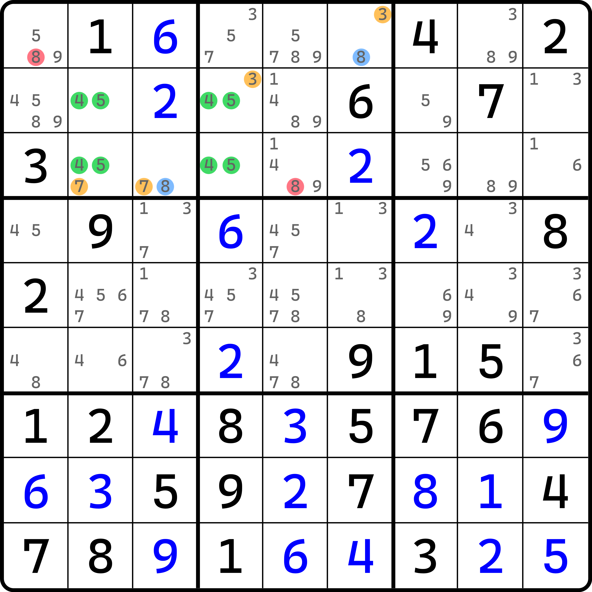
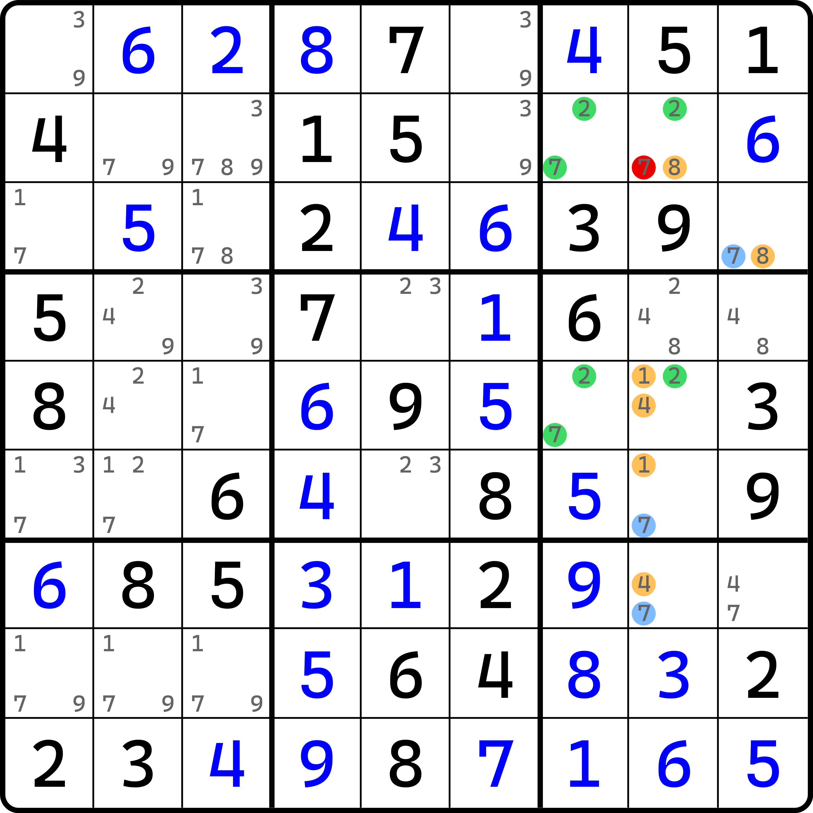
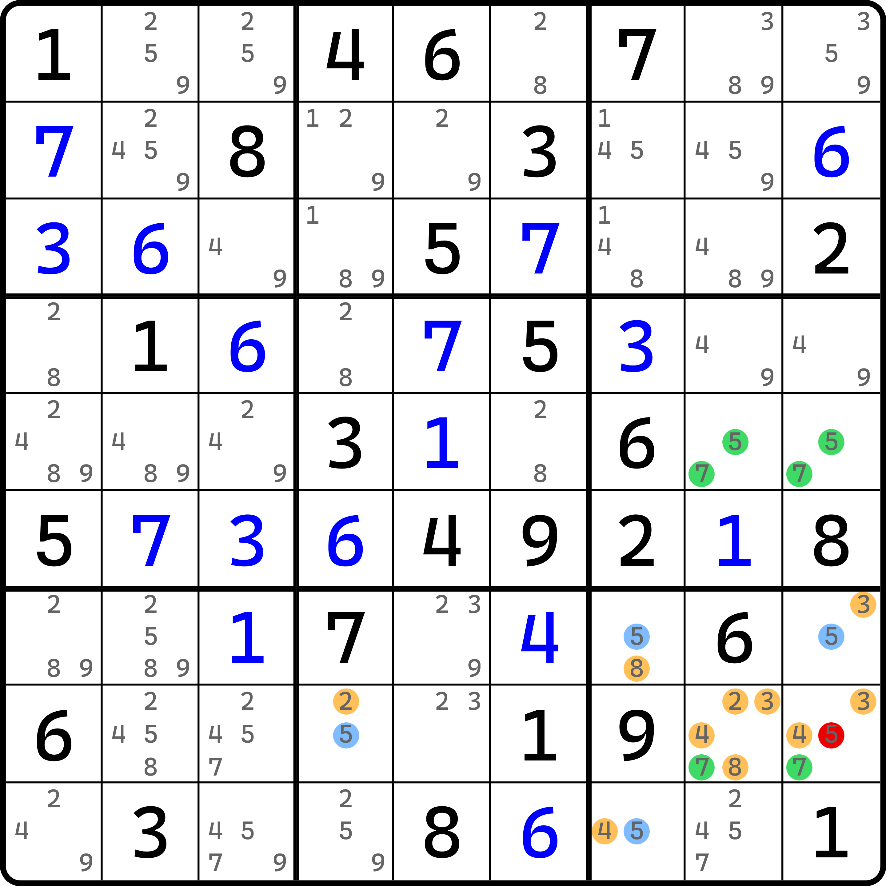
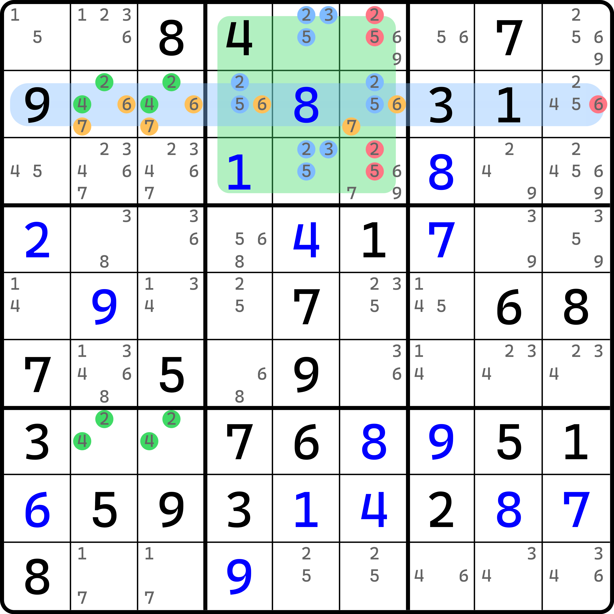
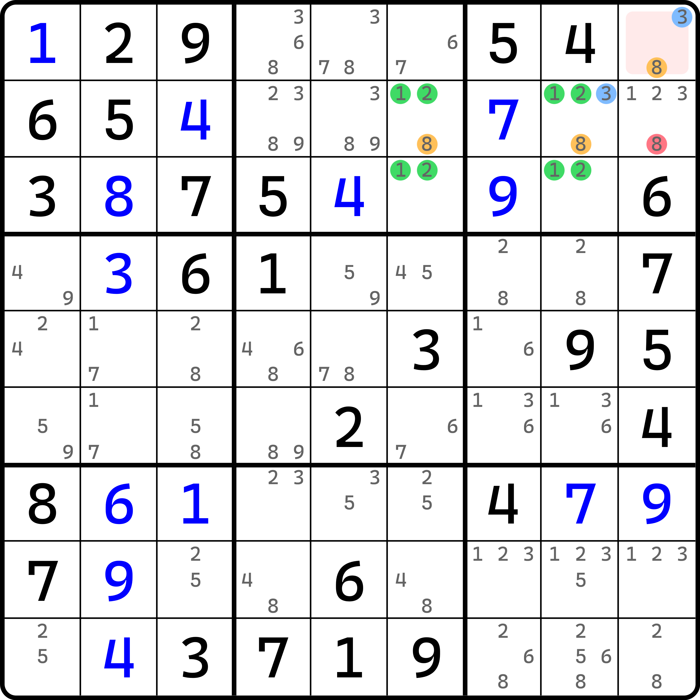
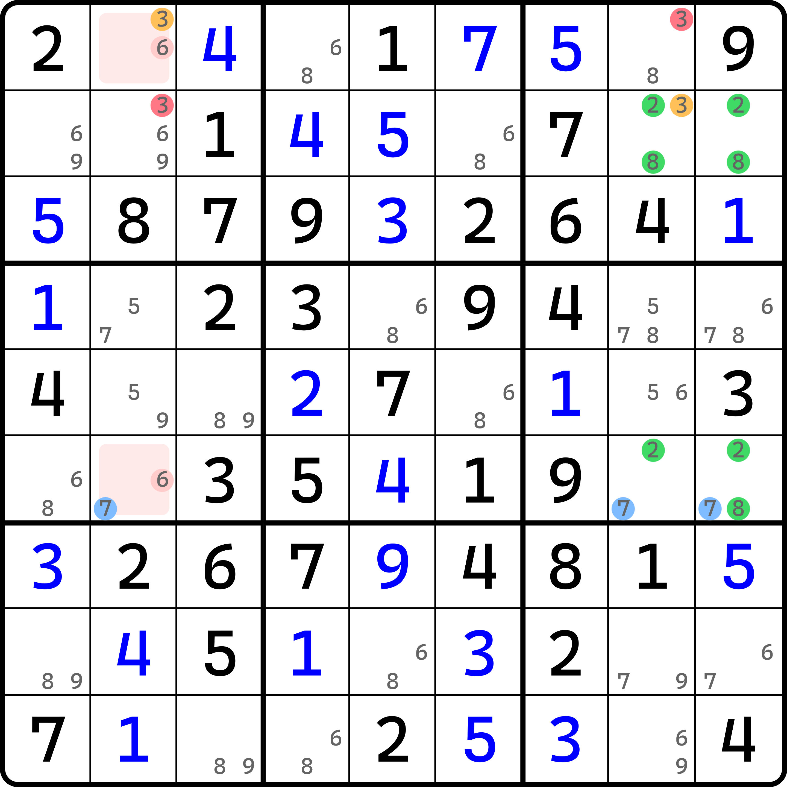
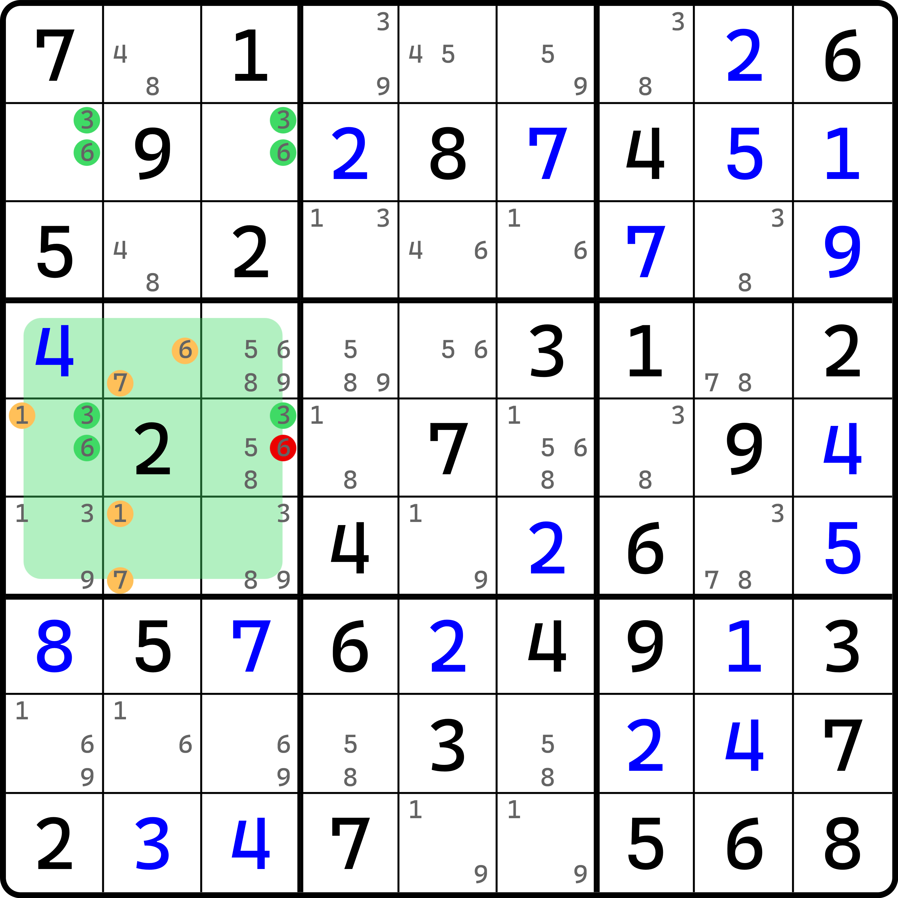
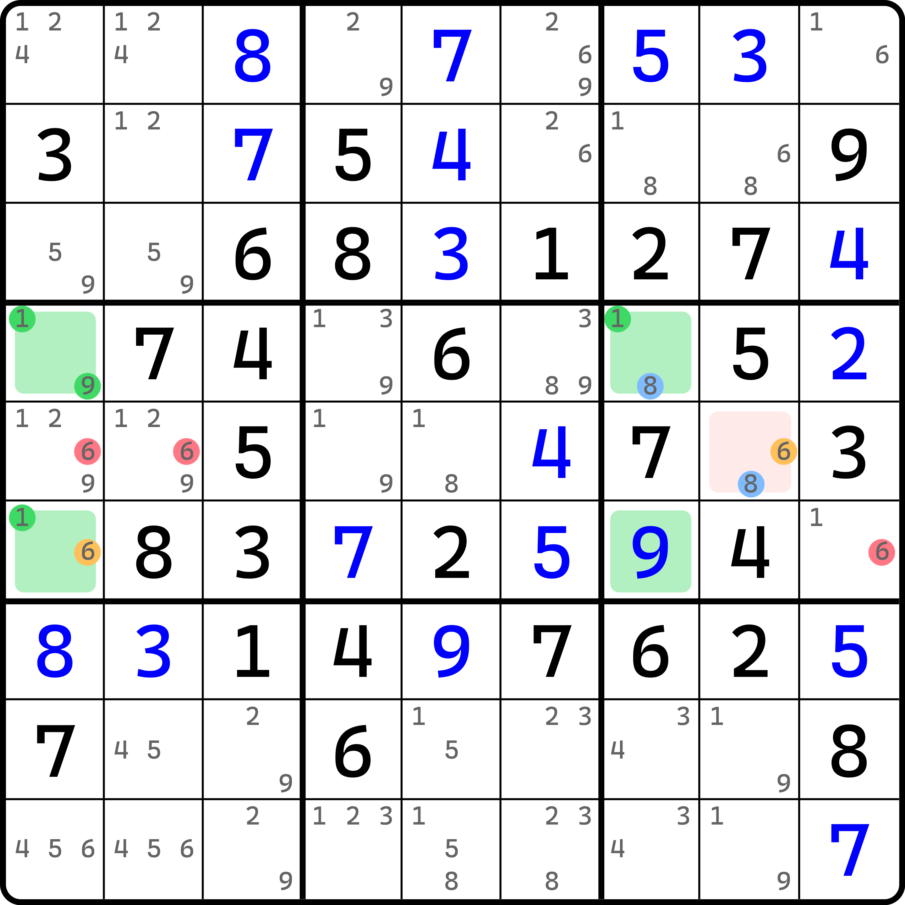
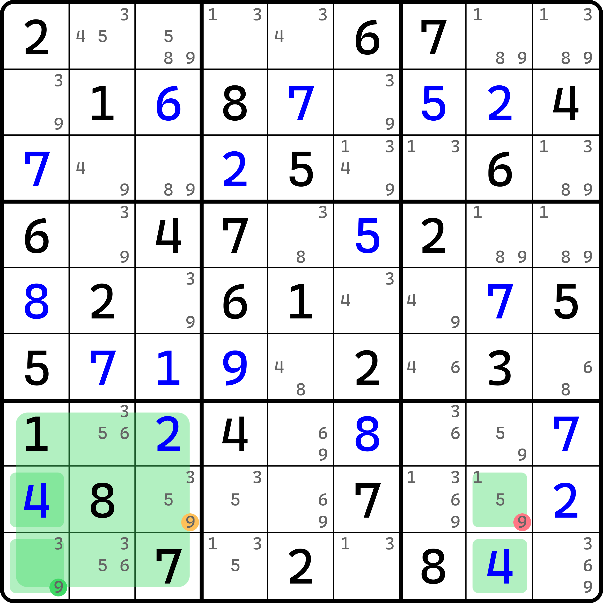

# 唯一矩形的结构构造

在之前的内容里，我们知道唯一矩形是第一个和普通数独技巧不同的候选数技巧，因为它利用了数独必须有唯一解的特殊规则。正是因为使用的规则和基础规则有所不同，所以天生造就了这个技巧可以搭配其他的用法。

## 唯一矩形 + XY-Wing <a href="#unique-rectangle-xy-wing" id="unique-rectangle-xy-wing"></a>

<figure><figcaption><p>唯一矩形 + XY-Wing</p></figcaption></figure>

如图所示。请关注 `r23c24` 四个单元格。显然，如果 `r2c4(3)` 和 `r3c2(7)` 同为假的话，四个单元格将只剩下 4 和 5，就会形成矛盾。因此，这两个数至少有一个为真。那么：

* 当 `r2c4 = 3` 时，`r1c6 = 8`；
* 当 `r3c2 = 7` 时，`r3c3 = 8`。

我们分析可得，`r1c6(8)` 和 `r3c3(8)` 至少有一个为真。所以，`r1c1` 和 `r3c5` 就没有机会填 8 了；否则它会同时使得 `r1c6` 和 `r3c3` 都无法填入 8 导致矛盾。

可以发现，这一次我们搭配了唯一矩形外部的两个额外的双值格。倘若我们将 `r2c4(3)` 和 `r3c2(7)` 看成是分支，那么它就是一个完美的 XY-Wing。这便是它的其中一种常见构造：搭配 XY-Wing。

> 在构造里，因为两个技巧可以搭配使用，所以它的组合方式是根本穷举不完的，太多了。所以，这样的组合技巧没有一个实质性的命名标准，就像是之前在直观技巧里使用的复杂出数技巧一样。那个也是构造，基于直观技巧的构造。这里非要给它定义一个名称的话，可以直接将其用加号相连，比如这里的“唯一矩形 + XY-Wing”。

## 唯一矩形 + XYZ-Wing <a href="#unique-rectangle-xyz-wing" id="unique-rectangle-xyz-wing"></a>

像是这样的技巧，其实并不少见。下面我们来看一个搭配 XYZ-Wing 的例子。

<figure><figcaption><p>唯一矩形 + XYZ-Wing</p></figcaption></figure>

如图所示。这次会存在三个分支：`r2c8(8)`、`r5c8(1)` 和 `r5c8(4)`。这里的过程就省略了，删数比较好推理，就自己看了。要注意本题其实缺少了一个候选数 2，但是残缺的唯一矩形是可以使用的，这一点早在之前就说过了，这里就不重复了。

## 唯一矩形 + WXYZ-Wing <a href="#unique-rectangle-wxyz-wing" id="unique-rectangle-wxyz-wing"></a>

<figure><figcaption><p>唯一矩形 + WXYZ-Wing</p></figcaption></figure>

如图所示。这个题虽然也不难，但候选数非常多，看起来很复杂，所以带着各位来看一下。

首先是关注于 `r58c89`。这四个单元格里如果没有橘色的 2、3、4、8 四种数字（一共有四种数，但有 6 个候选数的位置）的话，则数字 5 和 7 在这四个单元格将构成唯一矩形的矛盾。所以，这些候选数里至少有一个为真。

然后，我们需要将 2、3、4、8 按数字种类分组，即分为四组，并分组讨论填数模式：

* 如果 `r8c8(2)` 为真，则 `r8c4 = 5`；
* 如果 `r8c89(3)` 为真，则区块成立，可得 `r7c9 = 5`；
* 如果 `r8c89(4)` 为真，则区块成立，可得 `r9c7 = 5`；
* 如果 `r8c8(8)` 为真，则 `r7c7 = 5`。

可以看到，分组后，我们仍然可以得到填 5 的通用结论，不过这次有四个分支。所以我们只能保证这四个分支的末端其中至少有一个填 5。

所以，这个题的结论就是删四个 5 的交集的删数，即本题的 `r8c9 <> 5`。

## 唯一矩形 + 融合待定数组 <a href="#unique-rectangle-sue-de-coq" id="unique-rectangle-sue-de-coq"></a>

<figure><figcaption><p>唯一矩形 + 融合待定数组</p></figcaption></figure>

如图所示。这次我们搭配融合待定数组，看看有什么特殊效果。

请关注 `r27c23` 四个单元格。这四个单元格如果没有 `r2c23(67)` 的话，四个单元格将构成关于 2 和 3 的唯一矩形的矛盾形式，所以这四个候选数里肯定至少有一个为真。

既然如此，我们就可以搭配 `b2` 的一些单元格构成融合待定数组。这怎么构成呢？我们选取 `r13c5` 和 `r2c46` 四个单元格。这四个单元格里有 2、3、5、6、7 五种数字，其中 6 和 7 可以和唯一矩形用到的格子 `r2c23` 搭配，而剩下的数字 2、3、5 则不用管，他们自己成一组。

可以看到，结构里 2、3、5 确实只出现在 `b2` 里，这意味着 2、3、5 是不可能填两次的，结构里最多只能填一次；而对于数字 6 和 7 而言，因为他们也只能填在 `r2` 上，所以也都只能填最多一次。

数一下单元格的数量。算上 `r2c23`，整个融合待定数组用了 6 个单元格；数一下数字种类数，用到的数字有 2、3、5 和 6、7，一共有 5 种数字。不对啊。这不是不相等么？

是的，但是别忘了唯一矩形的效果。`r2c23` 里实际上只能最多有一个单元格填 6 或者 7，否则 `r2c46` 就只剩 2 和 5 了，再看 `b2` 里的这四个单元格，全都只剩 2、3、5，这肯定填不下的。

与其说最多有一个格子填，不如说恰好有一个格子填。因为 `r2c23` 也都不能都不是 6 和 7，否则唯一矩形矛盾了不是。所以，这两个单元格数量上虽然是两个，但是算只能算一个到结构里，所以结构里仍旧只有 5 个单元格。因此，融合待定数组是成立的。

结论呢？结论自然就是 `r2` 其余单元格不能填 6 和 7，而 `b2` 的其余单元格不能填 2、3、5 嘛。所以本题的删数有 `r13c6 <> 25, r2c9 <> 6`，共有 5 个删数。

## 唯一矩形 + ALS-XZ <a href="#unique-rectangle-als-xz" id="unique-rectangle-als-xz"></a>

唯一矩形除了可以搭配基础的技巧外，还可以根据需要搭配一些非常离谱的东西。这是整个教程里我唯一一个不想反复重复它中文名的技巧，太他么长了……

<figure><figcaption><p>唯一矩形 + ALS-XZ</p></figcaption></figure>

如图所示。先来看一个简单的。

因为 `r1c9(3)` 和 `r2c8(3)` 同一个宫，所以不可能重复填；而 `r2c68(8)` 和 `r2c8(3)` 又必须不同假，所以构成强链；于是整个链就串起来了：

```
8r2c68=3r2c8-(3=8)r1c9
```

看起来还蛮简单的，是吧？

下面我们再来看一个。

<figure><figcaption><p>唯一矩形 + ALS-XZ，另一个例子</p></figcaption></figure>

如图所示。我们把双值格进行推广，使用一个实际的待定数组结构，搭配唯一矩形。

## 唯一矩形 + 毛刺数组 <a href="#unique-rectangle-burred-subset" id="unique-rectangle-burred-subset"></a>

<figure><figcaption><p>唯一矩形 + 毛刺数组</p></figcaption></figure>

如图所示。这次我们反着来。我们先假设 `r7c2 = 4` 看看会如何。

如果 `r7c2` 填 4，则 `r789c1` 只剩下 7、8、9 三种数字，于是形成显性三数组，然后 `r8c2 <> 7`。得到这一点我相信你肯定就能看明白了：因为 `r8c2` 只能填 4 或 5，而假设的 `r7c2` 填的又是 4，所以搭配右边 `r78c6(45)` 就会构成关于 4 和 5 的唯一矩形的矛盾。

这个用法类似于强制链证明矛盾的效果，不过这个例子似乎没那个必要以强制链形式呈现，毕竟就一个分支。我们把 `r789c1(4789)` 称为**毛刺数组**（Burred Subset），这是一种特殊用法。

我们再来看一个例子。

<figure><figcaption><p>唯一矩形 + 毛刺数组，另一个例子</p></figcaption></figure>

如图所示。这个例子就自己推理了，它甚至比刚才那个例子还简单一些。

## 基于可规避矩形的一些构造 <a href="#avoidable-rectangle-pattern-based-construction" id="avoidable-rectangle-pattern-based-construction"></a>

前面我们看到了唯一矩形的构造形式，因为可规避矩形和唯一矩形类似，所以我们这里也顺带看一下可规避矩形的一些构造模式，就不单独列举页面了。

<figure><figcaption><p>可规避矩形 + ALS-XZ</p></figcaption></figure>

如图所示。这是一个可规避矩形搭配 ALS-XZ 的用法，不过这个题的待定数组是一个双值格 `r5c8`。

<figure><figcaption><p>可规避矩形 + ALS-XZ，另一个例子</p></figcaption></figure>

这也是可规避矩形搭配 ALS-XZ 的例子，不过这次又稍微不一样，多了一个单元格是已经填了数字的状态。

<figure><figcaption><p>可规避矩形 + 宫排除</p></figcaption></figure>

如图所示。这是一个可规避矩形，但是要想删除 `r8c8(9)` 需要一点小技巧。

这次我们也利用一下毛刺数组那个例子里的强制链的思维方式。假设 `r8c8 = 9`，则 `b7` 填 9 的位置将只能放在 `r9c1` 上。

因为四个单元格均填上了 4 和 9，而都是自己填的数，所以仍然可以形成矛盾。所以，初始假设的 `r8c8(9)` 就是错误的，故结论就是 `r8c8 <> 9`。

好了，至此我们就把基础的构造模式介绍完了。下一节我们继续来看唯一矩形的一些更加离谱的构造模式。
