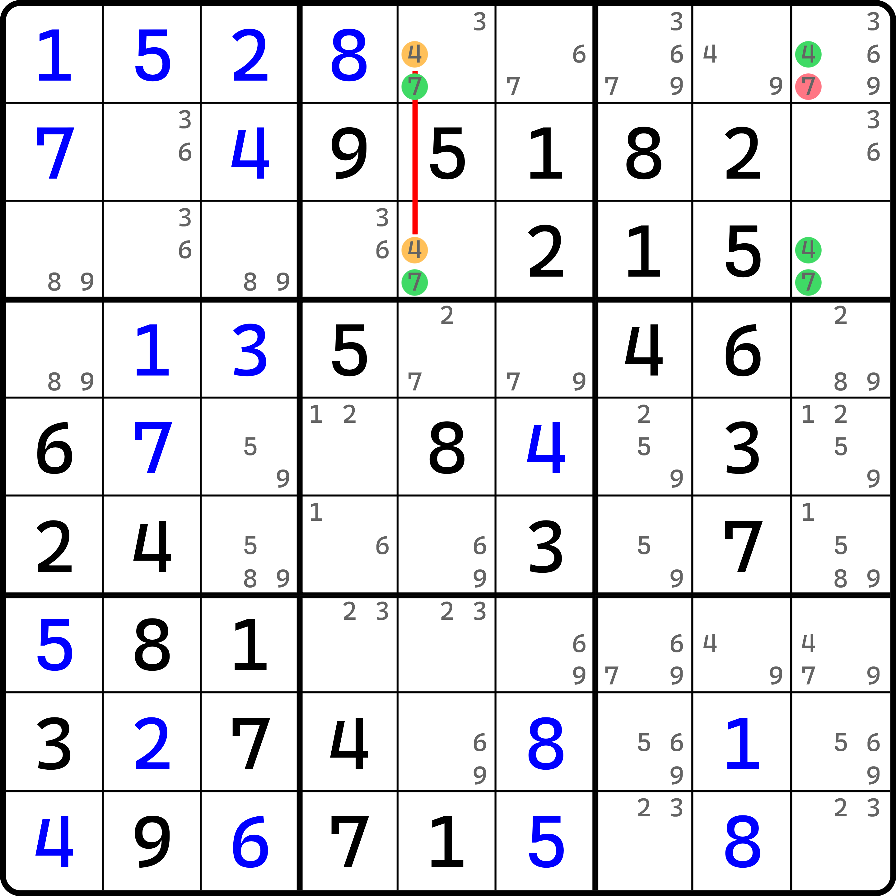
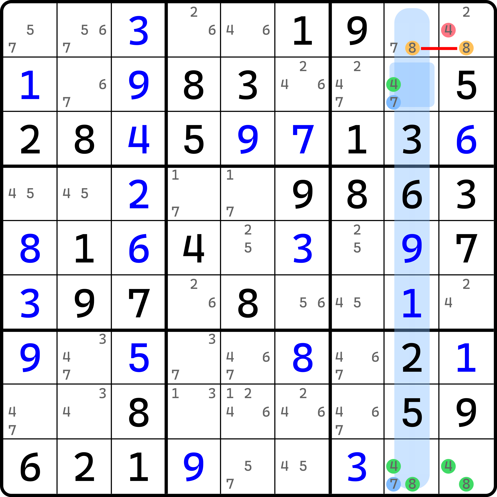

# 代入唯一矩形

在上一节的内容里，我们简要地提到了利用强制链的类似思维去证明某个数矛盾，进而删除原本假设填数的逻辑。实际上这样的唯一矩形用法非常繁多，所以本文将衔接这个内容单独讲解一下唯一矩形的这种用法。

## 什么是代入唯一矩形？ 

我们先来看一个例子。

<figure><figcaption>
唯一矩形 + 2B/1SL
</figcaption></figure>

如图所示。我们尝试假设 `r1c9 = 7`，因为右下角 `r3c9` 是双值格，而 `r3c5` 也是双值格，于是 `r3c9` 和 `r3c5` 会分别填上 4 和 7。接着，因为 `c5` 存在关于 4 的共轭对，所以 4 必须填入一个；刚才我们得到 `r3c5 = 7` 了，所以只好让 `r1c5 = 4`。

但是，这么填入了之后会发现，四个单元格只填了 4 和 7，于是构成了唯一矩形的矛盾形态。所以，最初的假设 `r1c9 = 7` 是不合理的。所以这个题的结论就是 `r1c9 <> 7`。

我们把这种需要先假设后按结构绕一圈填数最终得到矛盾的唯一矩形类型统称为**代入唯一矩形**（Unique Rectangle + $$n$$，简称 UR + $$n$$）。显然，统称意味着这个结构的不简单。下面我们带着大家看看这种唯一矩形都有哪些情况。

> 顺带一提。这种唯一矩形的英文名和全双值格致死解法的一个类型的名称类似，也用的是“+ $$n$$”来表示，但是在唯一矩形里，$$n$$ 更多指代的是单元格的数量，即唯一矩形四个单元格里有多少个单元格除了含有除了唯一矩形的数字以外的别的数字。比如这个例子里，`r1c59` 都含有非 4 和 7 的数字，所以这个结构称为“唯一矩形 + 2”，英文名则为 Unique Rectangle +  2。至于图片下方给的名称，这个分类我们将放在本文的末尾，因为分类实在过于复杂，所以这里我单说也说不清楚。
>
> 另外，很显然，代入唯一矩形的初始状态就必须是 + 2 的形态，因为 + 1 对应的只有一种类型，即唯一矩形的类型 1（标准类型）；而那个类型又不需要这么看。

## 唯一矩形 + 2 

<figure><figcaption>
UR + 2B/1SL，另外一个例子
</figcaption></figure>

如图所示。这个例子和刚才完全一样，就不解释了。

<figure><figcaption>
UR + 2D/1SL
</figcaption></figure>

如图所示。这个例子和刚才的稍微有点不一样，但是万变不离其宗。假设方式也差不多。

假设 `r9c2 = 9`，则右侧的单元格 `r9c5 = 3`，上方的单元格 `r7c2 = 9`，因为他们都是双值格。

然后，因为 `r7` 上有关于 9 的共轭对，所以 `r7c2 = 3` 了，只好让此时 `r7c4 = 9` 了。但是这么填完四个单元格后会发现，里面只填了数字 3 和 9，于是四个单元格就矛盾了。

这次也是唯一矩形 + 2，只是双值格的位置从同一侧变为了对角线两个单元格上，别的完全没怎么变，假设还是那种假设。

## 唯一矩形 + 3 

只有两个单元格包含额外数字的情况就全部说完了（本来也就这两种）。下面我们来看一下有 3 个单元格带有非唯一矩形使用的数字的情况。

<figure><figcaption>
UR + 3N/2SL
</figcaption></figure>

如图所示。这次我们要用两组共轭对。

假设 `r1c2 = 3`，则由于 `r3` 存在关于 3 的共轭对，而 `r3c2` 是双值格的关系，此时可以直接得到 `r3c2 = 5` 和 `r3c4 = 3` 的结论。

刚好，`c4` 有 5 的共轭对，思路直接串起来，我们又可以得到 `r1c4 = 5` 的结论。于是，四个单元格就只有 3 和 5 了，于是四个单元格构成了矛盾。

所以，`r1c2 <> 3` 是这个题的结论。

<figure><figcaption>
UR + 3U/2SL
</figcaption></figure>

如图所示。假设 `r8c7 = 3`，则因为 5 的共轭对可得 `r7c7 = 5`。而与此同时，因为 `r8c7 = 3`，左侧有个双值格也可以得到 `r7c3 = 5` 的结论。不过，此时由于 `c3` 有 3 的共轭对，所以 `r7c3 = 3` 又可以得到。此时形成了矛盾。

<figure><figcaption>
UR + 3X/2SL
</figcaption></figure>

如图所示。这次可以连删两个数字，不过因为删数逻辑是对称的，所以说一个就行。

假设 `r5c7 = 5`，则因为 `c7` 的共轭对可得 `r6c7 = 7`；与此同时，`r5c4 = 7`。然后因为 `r6` 又有共轭对，直接串联起来，可以得到 `r6c4 = 5` 的结论，此时形成矛盾。

<figure><figcaption>
UR + 3E/2SL
</figcaption></figure>

如图所示。如果 `r1c8 = 9` 的话，则由于 `r1` 的共轭对的关系，`r1c3 = 1`。然后，因为下方的双值格的原因，`r3c3 = 9`。然后，又是 1 的共轭对，可以得到 `r3c8 = 1`，于是形成矛盾。

## 唯一矩形 + 4 

下面来看一个坑爹一点的，四个格子全都含有额外的数字。

<figure><figcaption>
UR + 4C/3SL
</figcaption></figure>

如图所示。假设 `r2c5 = 7` 的话，则可以得到 `r2c4 = 8` 和 `r9c5 = 8` 的结论，因为这个单元格派生出了两个共轭对。

接着，因为 `r9` 包含 7 的共轭对，于是又可以得到 `r9c4 = 7`，于是形成矛盾。

## 唯一矩形 + 3 + 数组 

前面的例子我们都可以理解为纯正的若干共轭对的类型，他们非常像是之前早在唯一矩形里介绍过的类型 4、6 和隐性唯一矩形，只是把他结构推广了一下之后用了代入的视角。

不过，有没有想过，要想得出矛盾，那么共轭对和单元格的数量就一定有一个“减 1”的关系：要想矛盾，那么 $$n$$ 个共轭对可适用于 $$n + 1$$ 个包含其他非唯一矩形使用数字的单元格。比如刚才的 UR + 4 需要依赖 3 个共轭对；UR + 3 需要依赖于 2 个共轭对，之类的。

那么，如果无法找到适合数量的共轭对，比如 UR + 4 但只有 1、2 个共轭对的话，怎么办呢？我们也有办法。下面我们来看一下 UR + 3、UR + 4 里带有数组的情况。

<figure><figcaption>
UR + 3x/1SL
</figcaption></figure>

如图所示。如果 `r1c9 = 4` 的话，显然因为 `r1` 的共轭对可以得到 `r1c8 = 8`，以及 `r9c9` 双值格导致的 `r9c9 = 8`。不过这样之后好像我们就无法继续了，因为共轭对数量不够，所以我们无法得到 `r9c8 = 4` 引起的矛盾。

不过，双值格 `r2c8` 帮了我们忙。因为 `r29c8` 只有 4、7、8，而 `r1c8 = 8`（此时），所以 `r29c8` 此时相当于是没有 8 的状态的，也就是只有 4 和 7。但是，别忘了 `r2c8` 同时还和 `r1c9` 同一个宫。这两个单元格一个 4 一个 8 就会使得 `r2c8` 只能填 7。那么，`r9c8` 也不能填 7 了，所以 `r9c8 = 4`，然后就矛盾了。

<figure><figcaption>
UR + 3X/1SL
</figcaption></figure>

如图所示。这次我们将单元格推广一下，推广到两个格子。如果 `r6c8 = 9`，则同宫的 `r45c7` 只剩下 4 和 5，于是形成数组，于是 `r7c7` 就不能填 4 和 5 了，于是 `r7c7` 此时只剩下 8 和 9。配合上右边 `r7c8` 只剩下的候选数 8 和 9，搭配刚才初始假设的 `r6c8(9)` 以及共轭对造成的 `r6c7(8)`，四个单元格就构成了矛盾。

## 唯一矩形 + 4 + 数组 

<figure><figcaption>
UR + 4x/1SL
</figcaption></figure>

如图所示。这次我们推广到四个单元格均包含额外的数字。假设 `r1c4 = 3`，则共轭对可以引起 `r6c4 = 2` 的结论。不过接下来就推不动了。

我们来看共轭对的两头。一头填的 3，另一头填的 2。填 3 的这头和 `r2c5` 同在一个宫里，而填 2 的这一头和 `r5c5` 在一个宫里，最终会造成这两个单元格一个剩下 6 和 9，一个只剩下 9，于是形成显性数对。然后呢？然后 `r6c9 <> 6` 就引发了矛盾。

<figure><figcaption>
UR + 4X/1SL
</figcaption></figure>

如图所示。如果 `r8c5 = 2` 的话，则因为共轭对的关系，`r5c5 = 6` 可以得到。不过就这样似乎就已经进行不下去了。因为 4 个单元格都有额外的数字，只有一个共轭对。

不过没关系。我们来看 `r79c6`。这两个单元格因为都和 `r8c5` 同在一个宫，所以显然他们都不能填 2，于是形成 1 和 7 的显性数对。这一形成，`r5c6` 首先就只能剩下 2 和 6 了，而 `r8c6` 呢？这个单元格此时是只能是 2 或 6 的，因为 `r79c6` 是 1 和 7 的显性数对，所以能填 2 和 6 的地方就必须算上 `r8c6` 才能填够两个单元格，所以此时 `r58c6` 则会形成 2 和 6 的隐性数对。

是的，我想你肯定发现到了问题。因为假设 `r8c5 = 2`，而可以得到 `r5c5 = 6`，这说明左边两个单元格是 2 和 6；而右边因为我们利用了两个格子 `r79c6`，可以得到 `r58c6` 也是 2 和 6，因此就形成了矛盾。

<figure><figcaption>
UR + 4x/2SL
</figcaption></figure>

如图所示。这次我们稍微再多用一个共轭对，减轻一些压力。

假设 `r7c4 = 7`，则我们可以得到 `r1c4` 和 `r7c6` 同时填 4 的结论。因为此时 `r4c6` 是双值格，所以只剩下蓝色数字 9，因此 `r4c6 = 9`。而刚才我们知道，`r1c4 = 4`，所以 `r1c6` 既不能填 4 也不能填 9，只好填 7。于是，四个单元格只剩下 4 和 7 的填数，于是就形成了矛盾。

是不是比刚才那个简单一些？

<figure><figcaption>
UR + 4X/2SL
</figcaption></figure>

如图所示。如果 `r9c6 = 7` 的话，因为共轭对的关系，会引起 `r3c6` 和 `r9c5` 同时填 8。因为此时 `r8c5` 和 `r9c56` 两个已经填上数字的单元格同在一个宫里，所以此时 `r8c5` 只剩下 1 和 4。而 `r5c5` 又和 `r9c5`（填 8）同在一个列上，于是它又剩下 1，此时 `r58c5` 构成了关于 1 和 4 的显性数对，使得 `r3c5` 只能是 7 和 8，于是形成了只有 7 和 8 的矛盾。

## 代入唯一矩形的命名 

好了。我想我已经充分说到了应该说的内容。下面我们来提一下它的命名。

> 不过，命名规则算是比较麻烦的地方，因为我们这里并不是考试，所以不需要你记住它，我自己也记不住，但是可以用于拓展阅读。搞清楚怎么推理的就行。

### 标准命名规则 

它的完整命名是使用单元格数量和共轭对数量搭配的，即“唯一矩形 + <单元格数>/<共轭对数>SL”。其中 SL 是 Strong Link 的缩写，即强链。

然后，透过现象看本质。数一数结构有多少个单元格可以含有唯一矩形用不到的数字，比如说有一个唯一矩形用 2 和 5 形成矛盾，但是有其中三个单元格含有别的数字（不是 2 或 5 的数），那么我们就可以称为 UR + 3。不过这里要注意一点的是，这个含有非 2 和 5 的数字不一定需要满足。比如有个单元格它因为一些原因没有其他的数字，但它原本是可以有的（就算有也不影响推理），那么它也可以纳入这里的计算。

就比如上面 UR + 4x/2SL 的例子里，假设 `r7c6` 没有 1、8、9，也不影响推理，因为推理过程压根用不上这些数字。但是算的时候是要算在其中的，所以仍然是有 4 个单元格，故归类的时候仍然算为 UR + 4。

### 额外规则 

可以看到，在每一个例子的图片下方，我都写上了它的归类名称，其中名称的数字后面还跟了一个字母，有大写也有小写。这个规则会稍显复杂一些，所以就不用死记硬背了。这里列举一下他们。

* UR + 2
  * B：双值格位于同一侧；
  * D：双值格位于对角线上；
* UR + 3
  * 1 个共轭对
    * x：搭配的数组形成只需要依赖于共轭对的一头；
    * X：搭配的数组形成需要共轭对两头要同时作用；
  * 2 个共轭对
    * N：共轭对垂直，起始假设的单元格和双值格同侧，和两个共轭对汇集的单元格同侧（互相看得见）；
    * U：共轭对平行，起始假设的单元格和双值格同侧（互相看得见）；
    * X：共轭对垂直，起始假设的单元格和两个共轭对汇集的单元格处于对角线关系（看不见）；
    * E：共轭对平行，起始假设的单元格和双值格处于对角线关系（看不见）；
* UR + 4
  * 1、2 个共轭对
    * x：搭配的数组形成只需要依赖于共轭对的一头；
    * X：搭配的数组形成需要共轭对两头要同时作用；
  * 3 个共轭对
    * C：三个共轭对里其中数字相同的两个共轭对垂直；
    * X：三个共轭对里其中数字相同的两个共轭对平行。

终于解释完了。
