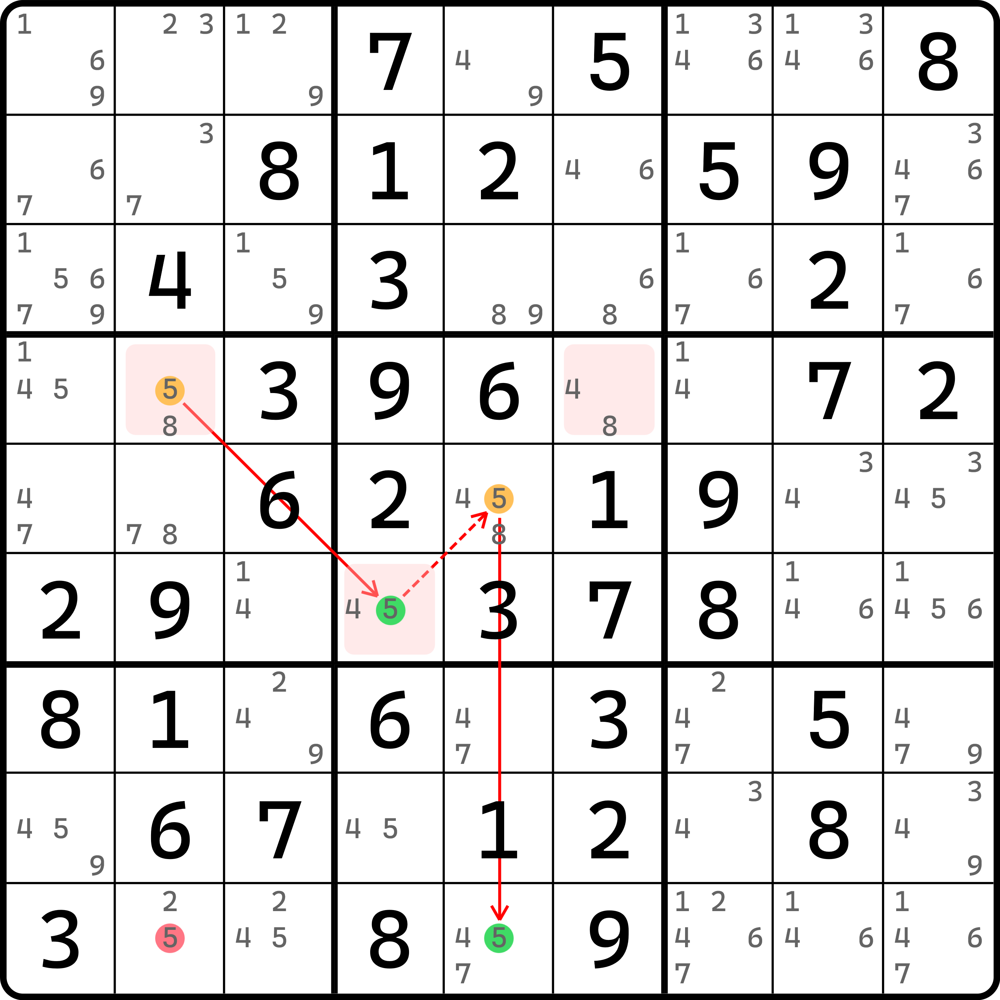

# Wing 构造

在前面学到了基础技巧的构造后，我们对构造的模式有了一个初步的了解。下面我们来学习链的构造。

链的构造相对困难一些，所以内容会比较多一些。我们先从简单的入手。

## XY-Wing 构造链 <a href="#xy-wing-constructed-chain" id="xy-wing-constructed-chain"></a>

在之前的内容里，我们知道，XY-Wing 和 XYZ-Wing 这两种 wing 类型的技巧是伪数组的一种特殊摆放形式；而伪数组又是待定数组的一种特殊形式；甚至 XY-Wing 还能是链的特殊形式，所以这两个技巧从技巧分类的角度来看，具有非常多样化的理解视角，这便是这两个技巧适合用于构造的本质原因。

我们先来看一个例子。

<figure><figcaption><p>一个再平常不过的 XY-Wing</p></figcaption></figure>

如图所示。这是一个再普通不过的 XY-Wing 技巧了。不过很遗憾的是，这个 XY-Wing 似乎并不存在删数。不过不要紧，我们来了解一下 XY-Wing 的推断，看看能否将 XY-Wing 的过程稍加延续一下。万一后续有结论呢？

XY-Wing 的推理方式是，从拐点 `r4c6` 开始分支讨论，并得到两个分支上的终点 `r4c2(5)` 和 `r6c4(5)` 里至少有一个 5 为真。

发现什么问题没有？这两个 5 至少有一个为真。换一句话说就是，这两个 5 不同假。不同假在链里是描述为强链关系的，所以，我们可以将其作为强链关系，仅连接这两个 5，于是我们就能找到这么一条利用这个特殊强链关系搭建起来的多宝鱼：

<figure><figcaption><p>利用特殊强链关系搭建的多宝鱼</p></figcaption></figure>

如图所示。我们可以看到，我们利用上 `c5` 的数字 5 的强链就可以得到这么一个多宝鱼技巧。表示如下：

```
5r4c2=5r6c4-5r5c5=5r9c5
```

这便得到了一条可以删数的链，链的长度也不长，但提供了一个良好的、找寻删数的视角。我们把这个链里使用 XY-Wing 的手段就称为**链构造**或**构造链**（Constructed Chain）。

## 构造的主次关系 <a href="#primary-and-secondary-relations-of-constructed-chain" id="primary-and-secondary-relations-of-constructed-chain"></a>

可以看出，构造的逻辑确实结合了两种技巧，但是技巧之间是分主次关系的。比如之前的唯一矩形构造，唯一矩形是导致删数的根本核心技巧，而它的推理过程之中会依赖其他的技巧（如待定数组等），所以我们将唯一矩形作为构造技巧的技巧名，称为唯一矩形的构造；而这里也是一样，这个技巧本质是一个链，只是链里用上了 XY-Wing 产生的特殊强链关系；正是因为链是这个技巧的主要推理过程，所以我们把这个称为链的构造而不是 XY-Wing 的构造。

这种用法往往都有合理的主次关系，但也存在一些特殊情况使得我们无法清晰辨认主次，不过目前我们还遇不到，所以我们先记住，**占主导地位（即核心推理）的技巧作为这个构造技巧的技巧名**即可。

## XYZ-Wing 构造链 <a href="#xyz-wing-constructed-chain" id="xyz-wing-constructed-chain"></a>

XY-Wing 的用法如果你觉得还不够高级，那么我们不妨来看看 XYZ-Wing 的构造链。

### XYZ-Wing 构造强链 <a href="#how-to-construct-strong-inference-in-an-xyz-wing" id="how-to-construct-strong-inference-in-an-xyz-wing"></a>

为了确保后续的内容能看明白，我们先来看一个标准的 XYZ-Wing。

<figure><figcaption><p>一个标准的 XYZ-Wing</p></figcaption></figure>

如图所示。XYZ-Wing 技巧的本质用法和 XY-Wing 非常相似，只不过比 XY-Wing 又多了一个候选数。讨论的时候我们需要按拐点 `r5c5` 进行讨论，最终得到橘色的三处候选数 3 里至少有一个为真。

显然，这种表述方式下我们就可以很明显地知道，三个 3 之间是有强链关系的。比如这个题里，我们可以认为是 `3r5c2=3r45c5` 这个强链关系成立，也可以认为是 `3r4c5=3r5c25` 这个强链关系成立，即使看起来这个跨了宫的 `r5c25(3)` 这个节点好像不会发挥啥作用。但是，你就说它能不能构成强链关系就完事了。

因为强链关系本质是证明两个节点不同假，或者说证明同假时矛盾。对于这三个 3 而言，只要将节点分为两组，一组有一个 3，另一组有两个 3，然后讨论它们不同假就行。而对于链节点而言，`r45c5(3)` 这种区块节点，或者 `r5c25(3)` 这种同在一个行里的两个格子的节点，认定它同假就意味着里面没有任何一个位置可以填这个 3。显然，这个推理适用于上述提到的这两种特殊节点的情况，所以道理是合适的。

既然合适，那我们就可以将其派上用场。

### XYZ-Wing 构造链的例子 <a href="#example-of-xyz-wing-constructed-chain" id="example-of-xyz-wing-constructed-chain"></a>

<figure><figcaption><p>XYZ-Wing 结构</p></figcaption></figure>

如图所示。这是一个 XYZ-Wing。不过很遗憾的是，这个 XYZ-Wing 似乎也没有删数，因为删的是三个 7 的交集，但交集 `r6c13` 都不是空格，也更不可能存在 7 的候选数作为删数。那么我们只能延伸推理。

<figure><figcaption><p>XYZ-Wing 构造链</p></figcaption></figure>

如图所示。利用 7 的强链，我们可以构造出这样的链：

```
7r6c4=7r4c46-7r4c2=7r6c26
```

非常神奇的例子。我们利用了 `7r4c2=7r6c26` 这样的强链关系就可以得到这么一个多宝鱼技巧，然后就有了删数。

不过要注意的是，这个例子里的链头是 `r6c4(7)`，而链尾是 `r6c26(7)`，它们恰好位于同一行，所以删数是这行的其余位置的 7。之前的链技巧里很少遇到有这种情况的例子，这里便是一个。

下面我们再来看一个例子。

### 利用斜边的特殊强链构造 <a href="#a-special-node-using-both-leaf-cells" id="a-special-node-using-both-leaf-cells"></a>

<figure><figcaption><p>斜边节点构造强链</p></figcaption></figure>

如图所示。这个初次看的时候肯定一头雾水。这个的写法如下：

```
7r5c2=7r5c7|r6c2-7r6c9=7r5c7
```

非常离奇，是不是。XYZ-Wing 构造的强链还能是斜边作为一个整体节点来用。我们来细说一下这个的推理。

先是 XYZ-Wing 构造这个强链可不可以用的问题。我们把三个 7 分为两组，形成两个节点，一个是 `r5c2(7)`，而另一个是 `{r5c7, r6c2}(7)`。而我们要证明的是这两个节点不同假。

其中 `r5c2(7)` 倒好说，但是后面这个斜着的两个位置表示的节点，它为假代表什么意思呢？先我们来定义一下这玩意儿啥时候应该为真。要让这个节点为真，我们只需要让它只要有其中一边为真即可。而所谓“至少有一边为真”，从数学的角度上来说就是 $$\ge 1$$ 个位置为真。那么为假自然就是它的相反情况，即 $$< 1$$ 个位置，即 $$=0$$ 个位置，也就是两处单元格均不能填 7 的意思了。所以，节点 `{r5c7, r6c2}(7)` 为假就是说这两个单元格都不填 7。而这符合我们这个链的推理过程，也没有不严谨的地方，所以可以这么用。

那么，这个强链合理之后，我们来看节点 `{r5c7, r6c2}(7)` 和 `r6c9(7)` 是否可以构成弱链关系。答案是肯定的，因为它们确实不能同真：当 `{r5c7, r6c2}(7)` 为真的时候，`r6c9(7)` 刚好在这两个位置的交集上，不论 `r5c7` 填 7 还是 `r6c2` 填 7，这个 `r6c9` 都是不能填 7 的。于是这个弱链关系也成立，于是搭配后面宫内的强链关系，这个链就构成了。删数自然就是头尾 `r5c27` 的交集了。这个例子也是同一行的头尾。

所以，我们可以从前面两个例子里知道，**XYZ-Wing 构造的强链用到的三个候选数，任意划分为两组都能形成强链关系**。

## W-Wing 构造链 <a href="#w-wing-constructed-chain" id="w-wing-constructed-chain"></a>

下面我们来看 W-Wing 的构造链。

<figure><figcaption><p>W-Wing 结构</p></figcaption></figure>

如图所示。这是一个普通的 W-Wing 技巧，不过也没有删数。不过也没事，因为我们知道 W-Wing 的结论是 `r1c2(6)` 和 `r5c5(6)` 里至少有一处为真，所以，这也是一个强链关系。

我们搭建起强链关系后，连接其他的弱链和强链关系也可以用于一些链之中。比如我们可以这么连：

<figure><figcaption><p>W-Wing 构造强链</p></figcaption></figure>

如图所示。可以看到，这仍然是一个多宝鱼，（怎么全部例子都是多宝鱼构造？！）删数是图中的 `r13c1(6)`。链写法如下：

```
6r1c2=6r5c5-6r7c5=6r7c1
```

好了，至此我们就把基础的三种 wing 技巧的构造方式介绍完了。虽然看起来内容不多，但更多的还是在做题上。所以希望各位下来多做题，练一下手。这些找起来都不困难。
