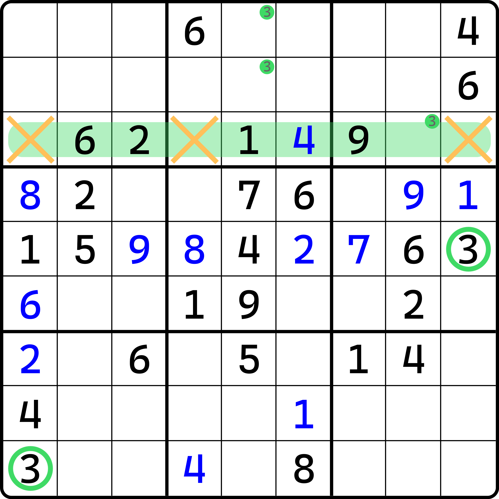
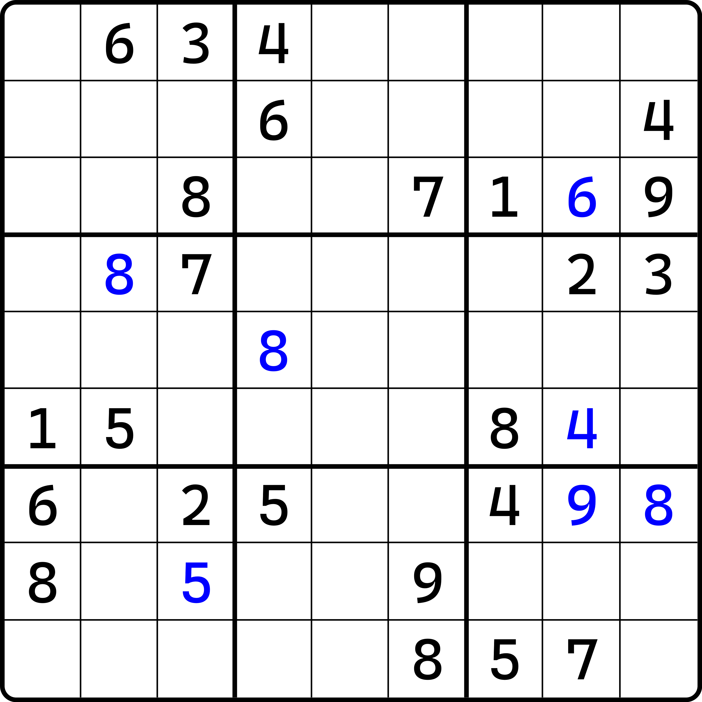

# 直观复杂出数

前面我们学习了区块和数组的使用，我们发现它是用于辅助排除和唯一余数技巧出数得到结论的技巧。它们自身由于无法出数，所以使用上会出现复杂的用法。

前面我们接触到的都是只需要一个的情况。但是这样的出数显然比较简单，下面我们来看一些复杂的出数逻辑，需要依赖更多的区块和数组在同一个步骤之中。

## 串行使用 

我们先来看思维比较清晰的串行用法。

### 例子 1：宫区块 + 隐性数对 

<figure><figcaption>
宫区块 + 隐性数对 + 宫排除
</figcaption></figure>

如图所示，我们先看左边的图，然后再看右边的图。左图里展示的是一个宫区块，得到的是 `b5` 的 6 区块结构。于是，我们可以得到 `r4c2 <> 6` 的结论。

然后利用这一点，我们可以得到右图“隐性数对 + 宫排除”的结论：因为 `r4c2 <> 6`，所以 `c2` 的 6 就只能卡在 `r35c2`，于是这两个单元格就只能是 4 和 6，构成隐性数对。

接着，得到结论之后，`r3c2 <> 5` 的结论就有了。于是我们根据宫排除得到 `b1` 内填入 5 的位置只能是 `r3c3`。所以 `r3c3 = 5`。

接着我们再看一个例子。

### 例子 2：宫区块 + 列区块 

<figure><figcaption>
宫区块出列区块
</figcaption></figure>

如图所示。这个题先看这一部分的推导。先是左图。

可以看出，因为数字 3 对 `b9` 的排除效果，我们可以得到 3 只能填在 `r8c7` 和 `r8c8` 的其中一个单元格里，使之形成关于 3 的区块。在有了这个区块之后，我们可以知道，同一行上别的地方都不能填 3，于是就有了右图 `r8c5` 和 `r9c5` 都不能填 3 的结果。

接着，我们再把视角转向 `c5` 上。我们可以看到，列上 3 只能填在 `r1c5` 和 `r2c5` 之中，因此，列区块就形成了。

<figure><figcaption>
最终得到了行排除结果
</figcaption></figure>

如图所示。这样我们再次使用关于数字 3 的行排除，就可以得到 `r3c8 = 3` 的结果了，因为此时 `r3c4` 是不能填 3 的，于是 3 就只剩下一处可填位置了（其他两处是由圈起来的数字 3 可以直接排除掉的）。

## 并行使用 

前面的例子是一步一步这么下来的。下面我们来看一个出数需要同时直接依赖两个区块的例子。

### 例子 3：两个宫区块 

<figure><figcaption>
两个宫区块 + 唯一余数
</figcaption></figure>

如图所示。`b7` 有个 5 的宫排除。我们先忽略它（实际上也帮不上什么忙）。

我们先对 `b2` 和 `b8` 分别作排除，可以得到这两个宫具有 1 和 2 的宫区块结果。然后我们发现，它们刚好都是竖着长的，所以 `r5c5` 刚好位于它俩的“作用域”上，所以 `r5c5 <> 1` 和 `r5c5 <> 2` 可以同时得到。

然后，我们针对于 `r5c5` 使用唯一余数，可以得到 `r5c5 = 9` 的结论。

## 练习 

下面给各位预留一个题目。这个题的结论出在 `r5c5`。

<figure><figcaption>
一个比较难的练习题
</figcaption></figure>

这个题在知道答案之前确实挺难，所以我打算给各位再多一个提示。请注意盘面的数字摆放，可以看出，如果把蓝色的数字抠掉，可以看出数字的摆放是中心对称的。这可能意味着一些比较神奇的特征。
