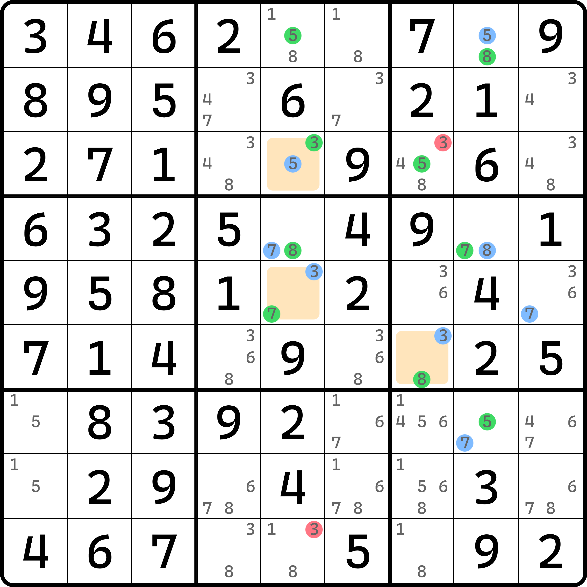
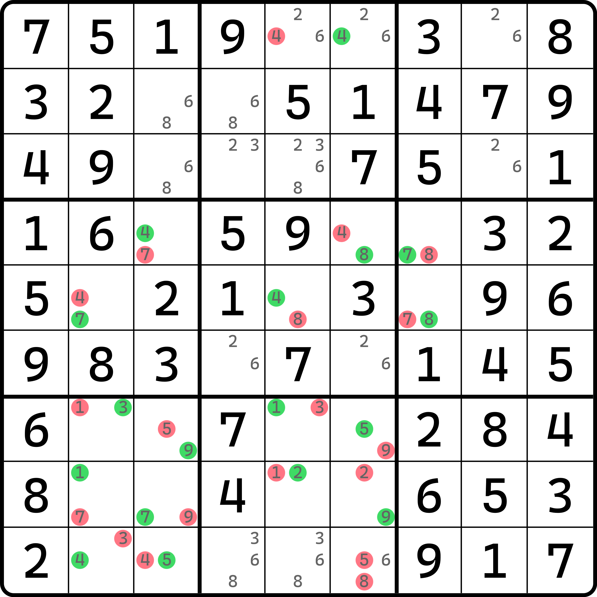

# 异数涂色

之前我们学到了染色法的基本推理过程。下面我们来看，将共轭对继续推广到异数之间的强链关系（双值格），看看是否可以得到一些新东西呢？

## 异数涂色 Trap 模式 

<figure><figcaption>
同数，不同颜色
</figcaption></figure>

如图所示。因为套路和之前找共轭对的方式一样，所以共轭对的线条就不画了。只是这次会多出双值格的延伸方向，不单单是看共轭对了。比如说 `r1c5` 和 `r1c8` 的数字 5 是共轭对，然后 `r1c8` 是双值格，于是延伸方向还可以从 5 转到 8，然后 8 在 `c8` 又有共轭对，于是继续延伸。

可以看到，这么延伸可以拓展出来这样的结构。我们不难发现，`r3c5` 和 `r5c5` 都涂了 3，但是颜色不同，一个是绿色的一个是蓝色的。因为延伸方向代表了真假性的交替，所以不同颜色仍然表示的是不同的真假性。因此，`r9c5` 是不能填 3 的，参考 Color Trap 的逻辑可以知道，填了会造成不同染色的数字具有相同的真假性，就矛盾了。同理，`r3c5` 和 `r6c7` 的数字 3 也具有不同的染色，所以 `r3c7 <> 3`。

这次我们延伸了双值格的方向，产生了不同颜色的涂色，我们把这种涂色统称为**异数涂色**（3D Medusa）。这是第一种用法，即利用同数字的不同染色的删数模式，跟 Color Trap 的思路一样。

异数涂色的英文名 3D Medusa 直译过来是三维的美杜莎的意思。想象一下，美杜莎的头发上的蛇就是一个一个的这样的分支。这技巧也长这样，是不是怪可怕的？

## 异数涂色 Wrap 模式 

下面我们来看异数的情况。

<figure><figcaption>
异数，相同颜色
</figcaption></figure>

如图所示。我们也按照刚才的方式进行染色。然后我们会发现异常情况：染色是红的这一边，会在同一个单元格有相同的染色。因为同一个颜色是相同的真假性，而同一个单元格显然不能同为真，因此只能同为假。所以，所有红色的这一组是这个题目的删数。

这个类似于之前学到的 Color Wrap 的删数模式。

这样我们就完成了异数染色的内容的介绍。看完了这两篇内容，是不是觉得这个技巧也蛮简单的？
