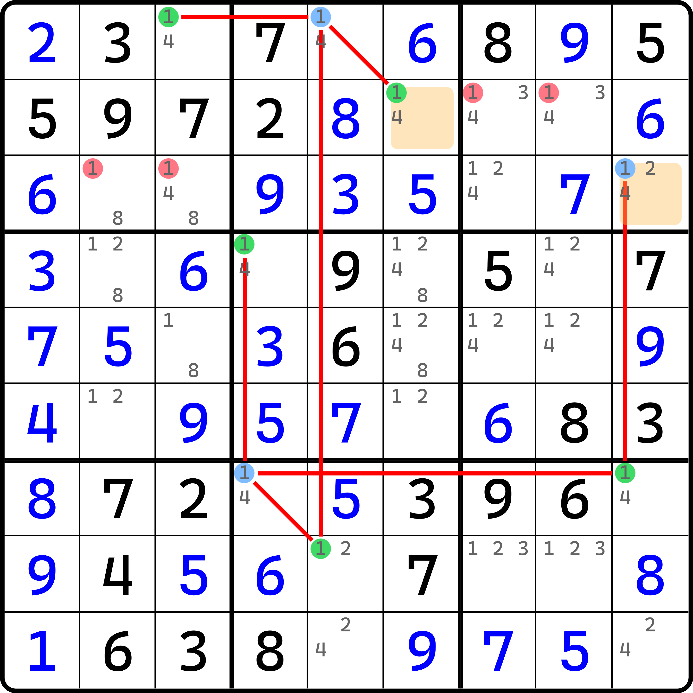
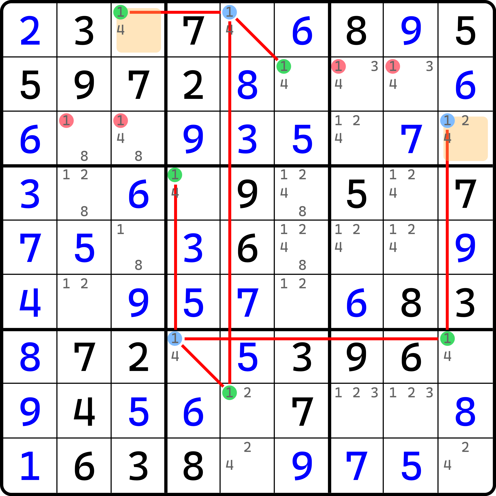
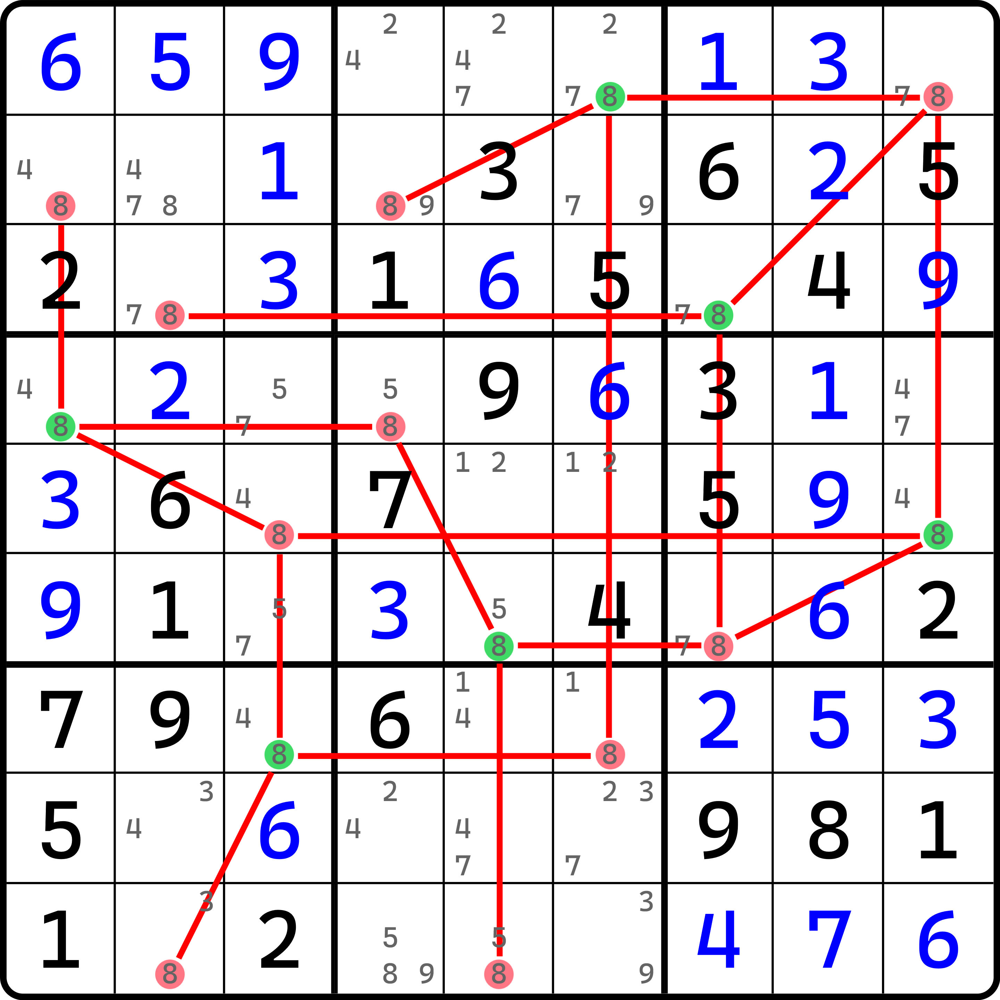
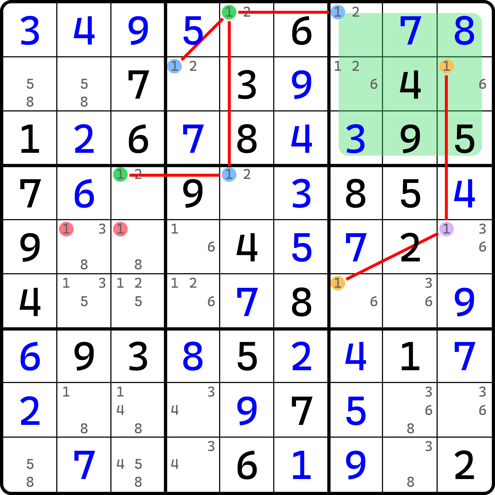

# 同数染色

我们先来学习第一个技巧：**染色法**（Coloring）。染色法也叫**涂色法**，指的是将盘面一些候选数按照规范进行不同配色的染色，然后通过颜色的填充来证明矛盾状态的一种数独技巧。

这种技巧的本质是利用图论知识点的染色法派生得来的数独技巧，它的学习难度不高，也不需要专业的图论知识点来解释它，而且它只会依赖一个概念就可以运作起来。这个概念早在之前唯一矩形里就提到过，那便是共轭对。

这种染色技巧和链理论比较类似，也分为同数的和异数的版本。同数的版本称为**同数染色**（X-Coloring）。我们先来看这个部分的内容。

## 同数染色 Trap 模式 

<figure><figcaption>
Color Trap
</figcaption></figure>

如图所示。我们找出这个盘面关于数字 1 的所有共轭对，然后将它们串起来。这个题里还有一些别的位置可能也存在共轭对（如 `r6` 的数字 1 也可以构成共轭对），但我们只保留了图中这一部分，这一部分可以只使用共轭对就可以串起来；而 `r6` 这一行上两个单元格需要串起来到图中的结构里是不行的，因为 `r4c4` 和 `r6c6` 不是共轭对，无法按共轭对串起来。

我们串起来的共轭对序列因为任意相邻的两个节点一定是互斥的填数状态（一边真，另一边就是假），于是我们尝试给他们用两种不同的颜色区分开来，我们就会得到图中这两种配色。其中，所有绿色的候选数同真假性，所有蓝色的同真假性，绿色和蓝色的真假性相反。

然后，我们就会发现矛盾的点，我们可以看到，因为 `r2c6` 是绿色，`r3c9` 是蓝色，所以 `r2c78` 就无法填 1 了。如果这两个单元格的其中一个位置填了 1，就会同时造成 `r2c6` 和 `r3c9` 都无法填 1。因为共轭对的关系，一边不填就会造成另外一边填入。而 `r2c6` 所在的共轭对连接的是蓝色，`r3c9` 所在的共轭对连接的是绿色，这两种颜色不同，也就意味着他们的真假性不一样。真假性不一样是不可能同真的，所以就矛盾了。

当然，你也可以尝试确凿地往 `r2c78` 的其中一个格子里填入 1，然后你就会得到矛盾——`c5` 会填两个 1，但是这两个单元格在同一个列是不能填两个 1 的。同理，`r3c23` 也不能填 1，因为他们处于 `r1c3` 和 `r3c9` 的交集上：

<figure><figcaption>
Color Trap，另外一边
</figcaption></figure>

如图所示。

我们把这个技巧称为 **Color Trap**。这个技巧暂时没有中文名，早期翻译为“色链法”。

## 同数染色 Wrap 模式 

下面我们再来看一个用法。

<figure><figcaption>
Color Wrap
</figcaption></figure>

如图所示。我们这次也一样地找出所有共轭对，然后按共轭对把他们全部串起来。同一种颜色真假性一样，不同的颜色真假性不同。

可以看到，在共轭对全部找出之后，红色这一组显然存在矛盾：红色这一组 `r2c1` 和 `r3c2` 染色一样，但在同一个宫。因为真假性相同，但在同一个宫里本身也不能填入重复数字，所以同真假性的红色只能是同假的状态，而不能是同真的状态，所以，所有红色的全部同假，也就意味着本题所有红色的候选数均可删除。

我们把这个技巧称为 **Color Wrap**。这个技巧也没有中文名，早期翻译为“色分法”。

## 同数复染色 

前面介绍的是，将全部共轭对串起来成一个大结构的用法。下面我们来看共轭对无法串起来成一个结构，而需要至少两个结构的时候，是怎么推理的。

<figure><figcaption>
Multiple Coloring
</figcaption></figure>

如图所示。本题有两组共轭对可以串起来，但是因为 `b3` 这里并不是共轭对，所以不能串成一组大的结构，只能暂时这样了。

既然不能串起来，我们就只好分情况进行讨论。

* 如果绿色的 1 为真，则 `r5c23 <> 1` 可以得到，因为此时 `r4c3(1)` 为真；
* 如果蓝色的 1 为真，则橘色的 1 为假，于是只有可能紫色的 1 为真，这样也可以得到 `r5c23 <> 1` 的结论。

因为排除的关系，当蓝色为真时，很容易通过 `b3` 得到 `r2c9(1)` 为假的结论。而 `c9` 恰好又有共轭对用了 `r2c9(1)`，进而可以将“蓝色的真假性和紫色的真假性相同”绑定起来。

我们把这种无法并起来，但可以通过简易关联的方式也可以得到删数的逻辑称为**同数复染色**（简称**复染色**，Multiple Coloring 或 Multi-Coloring）。

## 染色法和链理论 

染色法是早期尚未体系化链理论之前就有的一种数独技巧，因为它方便快捷，只用到共轭对就可以找到删数，所以非常好用。

不过可以看出，其实染色法在一定程度上是跟链（尤其是同数链）非常类似。我们只需要把前面的这些画法稍加改动，就可以得到链的等价画法，照样可以删除这些删数。因为共轭对在链理论里一般用于表达强链关系，所以这个技巧都可以转为链的画法。
