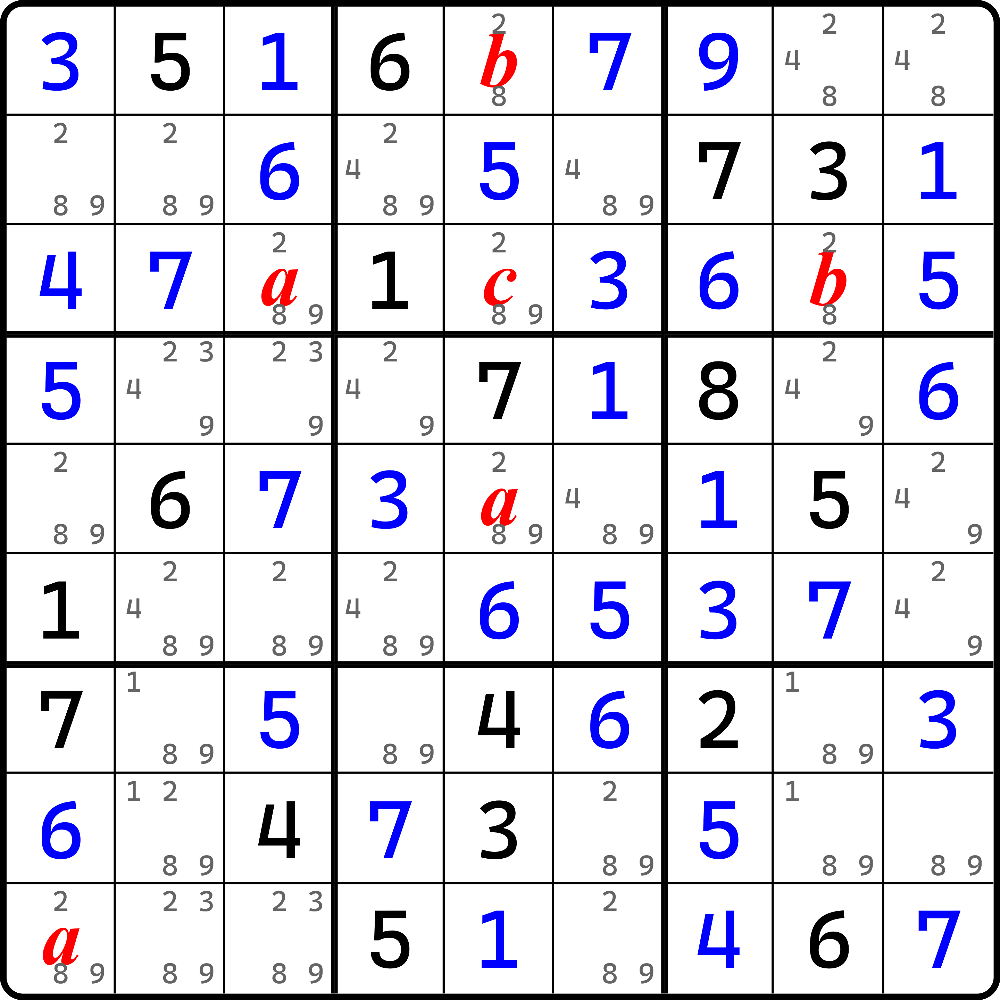
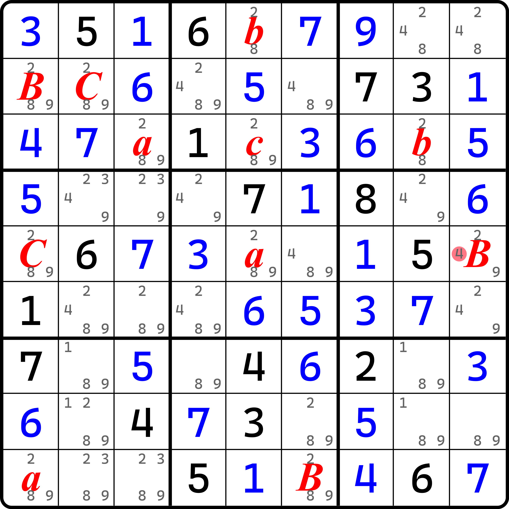
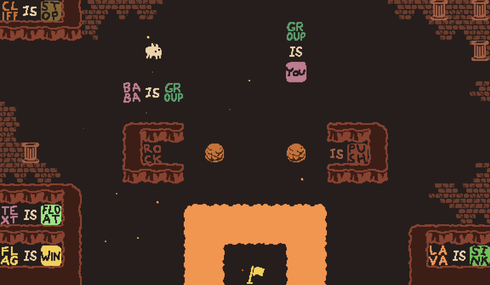
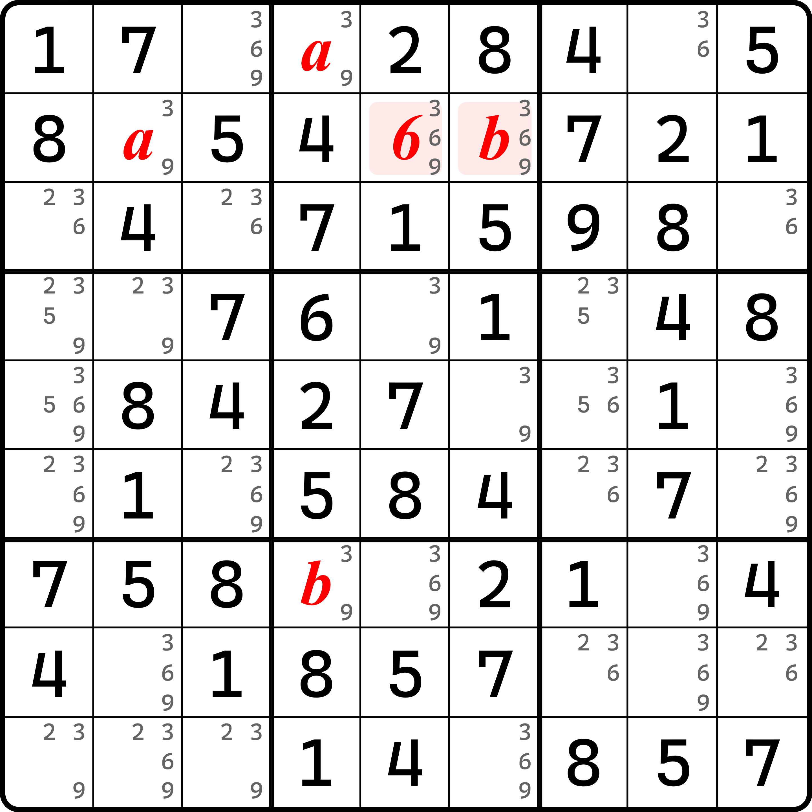
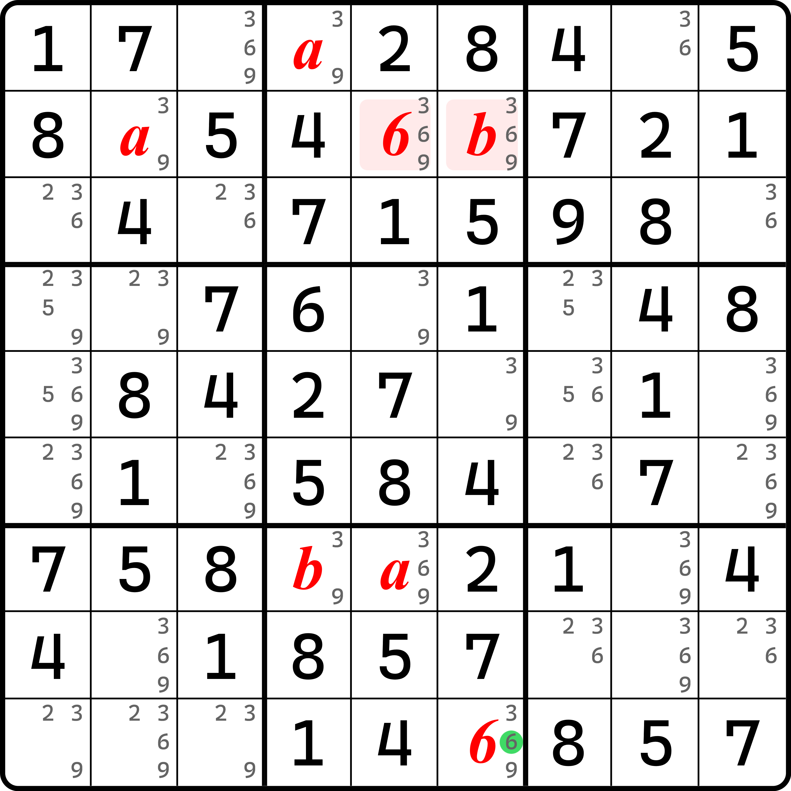
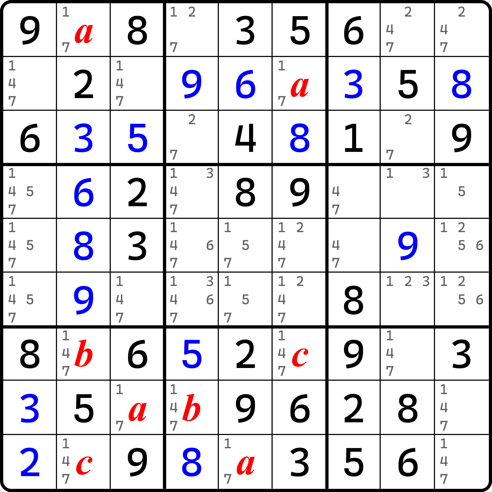
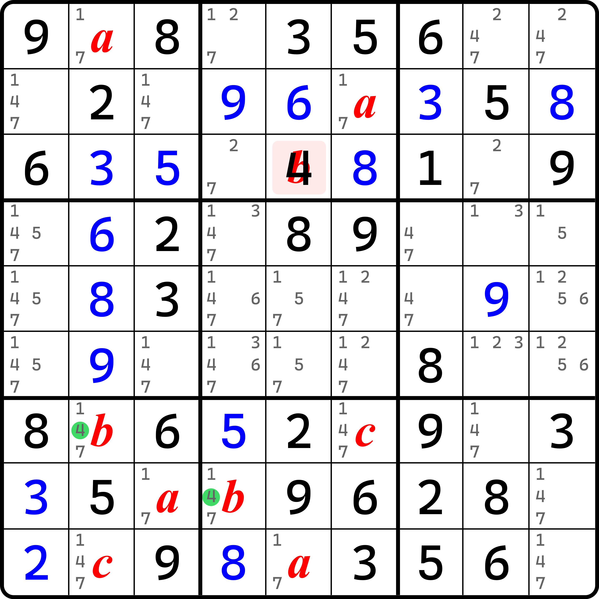
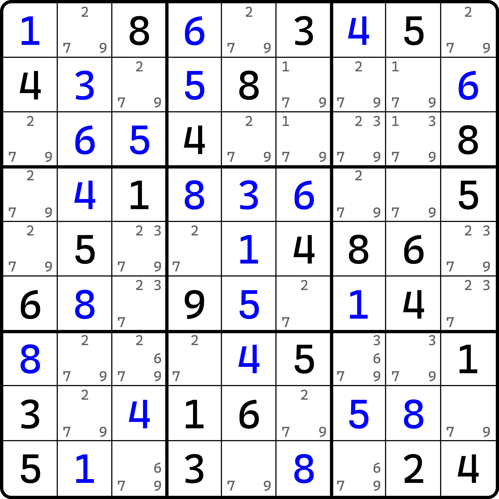
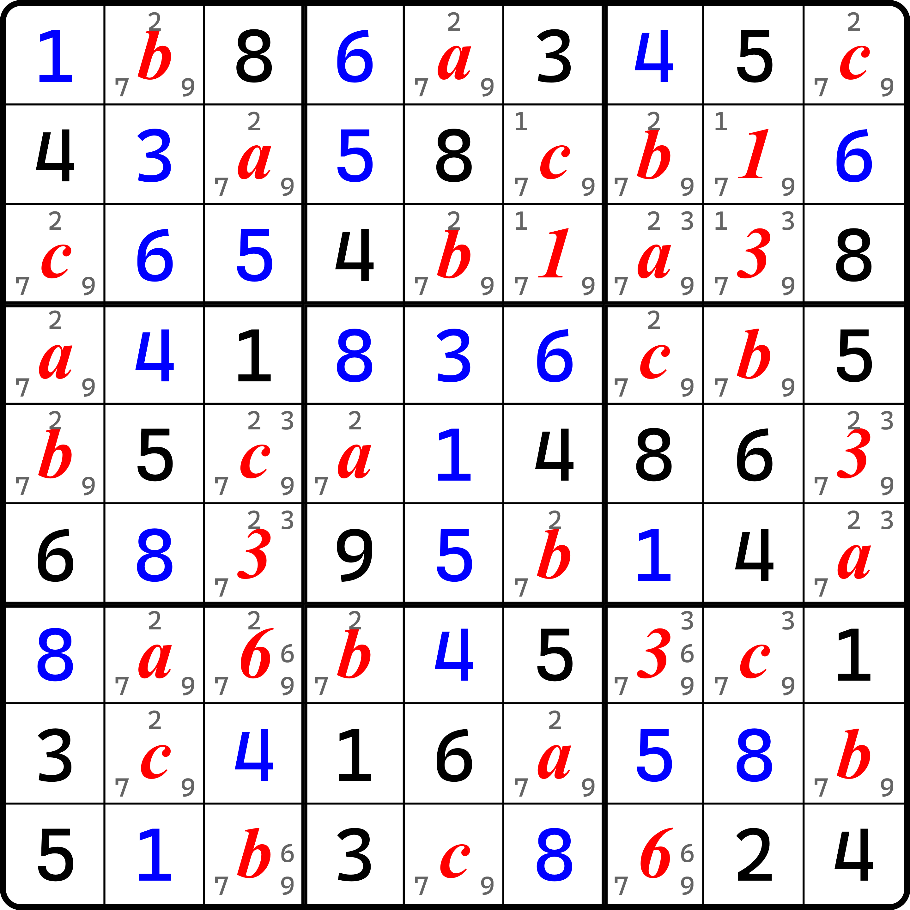

# 代数法

欢迎来到新的技巧。这个技巧其实早在之前欠一数组、烟花数组等技巧里有所使用，不过并未将它的一些本质处理纳入介绍，这里开始介绍这个技巧的实际用法。

## 代数同步（Baba Grouping Sync） 

<figure><figcaption>
代数法，第一轮假设
</figcaption></figure>

如图所示。当我们无从下手时，我们不妨先假设一个填数。但是这次，我们代入变量求解。

假设 `r5c5` 填 $$a$$，并假设 `r1c5` 和 `r3c5` 分别填 $$b$$ 和 $$c$$，我们就可以根据 `b3` 的宫排除得到 `r3c8` 填 $$b$$（用 `r1c5` 排除就行）。此时 $$abc$$ 三个字母均不相同，但一定都是 2、8、9 里的数字。

当我们得到 `r3c8` 填 $$b$$ 之后，我们就可以在行里得到剩下的那个位置 `r3c3` 只可能填 $$a$$。此时结合最初假设 `r5c5` 填的 $$a$$，对 `b4` 作宫排除可以得到，`r46c2` 的其中一个单元格肯定会填 $$a$$。再次结合 `r3c8` 的 $$a$$，我们可以得到 `b7` 的宫排除，得到 `r9c1` 此时填 $$a$$ 的结论。

<figure><figcaption>
代数法，第二轮假设
</figcaption></figure>

如图所示。在我们得到前面 `r9c1` 填 $$a$$ 的结果后，我们无法继续了。此时我们需要第二轮的假设。

我们发现 `r9c6` 此时也只有 2、8、9，那么我们继续复用字母进行假设。但是为了确保这一轮的假设和前一轮没有直接关联，我们换成大写以区分。这次假设 `r9c6` 填 $$B$$，于是我们对 `b7` 作宫排除，可以得到 $$B$$ 只能填在 `r78c2` 里，于是构成区块。得到区块后，我们可以知道 `b1` 里 $$B$$ 只能填在 `r2c1`。可能你会问我，这不是可以填在 $$a$$ 所在的 `r3c3` 么？其实不行。因为我们可以从 `r9` 看出，在假设 `r9c6` 填 $$B$$ 的时候，我们已经知道已经有 $$B \neq a$$ 了。所以，`r3c3` 此时是勺填 $$B$$ 的。

接着，既然 $$B$$ 知道填在 `r2c1` 里，那么剩下一个格子就填 $$C$$ 吧；同时，观察 `c1` 我们可以得到 $$C$$ 可以填在剩下的 `r5c1` 上。这样整个 `c1` 的空格填数就假设全了。

借用 `r5c1` 来看 `r5` 这一行。可以看到，此时 `r9c6` 填的是 $$B$$，它会使得 `r5c6` 不填 $$B$$。而 $$B \neq a$$ 而且  $$B \neq C$$，所以 $$B$$ 只能“被迫”填在最后剩下的空格 `r5c9` 上。这便是这个题的结论：因为 `r5c9` 还含有候选数 4，所以 `r5c9` 肯定不能填 4，因为最终我们确定了它填的是 $$B$$，而 $$B$$ 在最初第二轮假设的起始就知道它只能是 2、8、9 的其一，所以 4 肯定不可能。因此，本题的结论就是 `r5c9 <> 4` 了；当然，你也可以认为本题的结论是 `r5c6 = 4`，因为这个单元格不能填 $$aBC$$ 三种数，而他们之间互不相同，又刚好是 2、8、9 三种数字里的数，所以 `r5c6 <> 289`。

我们把这种利用假设字母的方式推演得到删数或出数结论的技巧称为**代数法**（Baba Grouping）；而因为它的名称和“袋鼠”谐音，所以这个技巧也经常被戏称为“袋鼠法”。而本题的推演过程是代数法的其中一种用法：通过假设字母来直接得到某个单元格也填字母里的数，但它因为包含别的候选数，所以应该删除他们。这种用法被称为**代数同步**（Baba Grouping Sync）。

## 代数法的技巧名的由来 

这个技巧早在二十年前的二零零几年，在外国论坛里就已经出现，不过最早的出处确实记不得从哪里发出的了，是谁发的也无从知晓，甚至当时的包装也很简陋，说它不是代数思想都行。但是在中国，这个技巧在几年后被一位年轻人独立发现和挖掘出来。这个人叫邱言哲。

这个人就厉害了，他是国家队级别的人物，参加过许多国际数独相关的赛事，也拿到了不少奖；同时，他本人也对一些难度较高的数独技巧有兴趣，也经常做研究。对于大赛而言，其实比赛的难度并不算高，主要还是考虑比赛时长的关系，主要考验的还是玩家选手的能力和掌握的扎实功底和灵活运用。

不过，这个人将这个技巧取名为“代数”，不过没有给予这个技巧一个合适的英文名。因为在英语里，和代数这个说法最接近的是 algebra。不过，这个单词是数学上的代数科目，是一门课程。从课程研究的内容和学习的知识点来看，algebra 和这里数独技巧里的代数并不是同一个东西，也确实相差甚远。所以，英文名取名上就比较犯难了。我也有咨询过邱言哲本人，不过他的意见是“不好说”。从恰当的翻译来看，algebra 确实差得很远，因此本教程不采用这个翻译。

你可以从技巧名称里看到，我把这个技巧称为 baba grouping。看起来这似乎跟技巧的翻译压根不沾边，grouping 是分组的意思，但 baba 这个单词就显得更加不知所云。

实际上，baba 来自于一款推箱子类型的解谜游戏。原游戏的名称叫 Baba Is You。这个游戏的内容界面长这样：

<figure><figcaption>
Baba Is You 游戏界面（其中一个关卡）
</figcaption></figure>

如图所示。玩家需要操控图中白色的角色（这角色就叫 baba）进行上下左右移动。通过推动字母块来控制单词序列的组合、顺序或内容，以直接纂改游戏规则的关卡制解谜游戏。

> 在游戏里，单词 group 具有的特性是，控制一组游戏里的物件（包括角色本体）在激活了“<物件> is group”状态的角色全部启用指定的特征。其特征采用“group is <特征>”的方式激活。如本游戏里的单词 you 表示玩家可以操控的角色。如果是 baba is you，那么操控的角色就是 baba，你可以通过键盘上下左右移动 baba 角色；如果是 flower is you，那么你可以控制的物件就从 baba 改为花朵；其他同理。本图里 baba is group 指的是 baba 属于 group 小组里的内容；而 group is you 表示所有用 is group 组合过的物件都可以受玩家控制移动。

可以看出，游戏里采用 group 来表示角色分组状态，这和代数法将选取的数字按字母分组进行推理的过程如出一辙，所以最终我把这个技巧称为 baba grouping，即按候选数为物件分组推理的逻辑。

## 代数数组（Baba Grouping Subset） 

<figure><figcaption>
代数数组，前半部分
</figcaption></figure>

如图所示。我们先假设 `c4` 的两个空格分别填 $$a$$ 和 $$b$$，然后观察 `b2` 可以得到剩下两个单元格的填数是 $$b$$ 和 $$c$$。不过，这里显然不需要把 6 用字母进行假设，所以不妨就用 6 表示实际填数，即 `r2c56` 是关于 6 和 $$b$$ 的数组，于是可得 `r2c2` 填 $$a$$。

<figure><figcaption>
代数数组，后半部分
</figcaption></figure>

如图所示。可以看到，当我假设了 `r2c2` 填 $$a$$ 之后，事情变得了有趣了起来：此时 `b7` 里 $$a$$ 只能填在 `r9c13` 之中，所以构成区块。然后，我们可以得到 `b8` 里填 $$a$$ 的位置只能在 `r7c5` 上。

不过，因为 `r7c4` 是 $$b$$，所以这三个单元格里还剩下一个填的数字是什么呢？6。因为我们故意把 6 拿出来不参与字母的假设，就是为了这里使用。我们知道 $$a$$ 和 $$b$$ 此时是 3、6、9 的其二，且不相同，但这么做我们无法继续推理。所以把 6 搁出去，本质目的是为了让 $$a$$ 和 $$b$$ 此时不能是 6，而只能是 3 或 9。所以，6 理所应当填在 `r9c6` 里。这便是这个题的结论。

把这个地方把 6 搁出去的行为并不算是罕见；不过这种用法往往会搭配例如图中这种数组的形式。我们把这种用法称为**代数数组**（Baba Grouping Subset）。

## 代数占位（Baba Grouping Occupancy） 

<figure><figcaption>
代数占位，前半部分
</figcaption></figure>

如图所示。假设 `r1c2` 填 $$a$$、`r7c2` 填 $$b$$ 以及 `r9c2` 填 $$c$$，于是 `r8c3` 填 $$a$$。与此同时，观察 `r2` 可以发现，此时 $$a$$ 只能填在 `r2c6`，因为剩下两个单元格 `r2c13` 都和初始假设了 $$a$$ 的单元格 `r1c2` 在同一个宫里，不能重复填了。

既然如此，我们就可以利用 `r2c6` 和 `r8c3` 假设的 $$a$$，对 `b8` 作宫排除，就可以得到 `r9c5` 填 $$a$$。于是，根据假设的字母，我们可以得到 $$b$$ 在 `b8` 里只能填在 `r8c4` 里，而 $$c$$ 就只能在 `r7c6` 里了。

<figure><figcaption>
代数占位，后半部分
</figcaption></figure>

如图所示。这里有一个非常神奇的地方。因为我们知道 `r8c4` 填 $$b$$，所以根据排除我们可以得到 $$b$$ 的位置在 `b2` 里填在……等会儿？！没空位了！是不是题做错了？

别紧张。这里没有问题。我们发现似乎 $$b$$ 排除掉 `r13c4` 之后，没有任何空格可以填 $$b$$。但是，别忘了 $$b$$ 应该可填的数字种类。在假设 $$abc$$ 的时候，他们均为 1、4、7 里的数字。而 `b2` 里并未直接给出空位填 1、4、7，但它却有一个破题点，`r3c5` 这个提示数 4。

因为 $$b$$ 在 `b2` 里显然不填在 `r13c4` 之中，而剩余的空格 `r2c6` 也填的不是 $$b$$，所以 $$b$$ 此时落在哪里似乎都不可取。但是别忘了它是 1、4、7 的其中一个数。在 `b2` 里，1、4、7 里就只有 4 以提示数形式存在。但凡它不给提示数是 1、4、7 里的数，都不会有合理的结论形成；但是有一个 4，反而给我们了一个推出结论的机会，即 $$b = 4$$，因为此时 $$b$$ 要填在 `b2` 里，这是唯一合理的填数位置。

既然我们知道 $$b=4$$ 了，那么我们自然就知道本题里所有假设位置上是 $$b$$ 的单元格都应该填上 4，这便是这个题的结论。我们把这个用法称为**代数占位**（Baba Grouping Occupancy），表明最终得到的结论是让其中一个字母等于明数里的一个数，即非空格里的一个数字。另外，这题 `r9c9` 如果填了 $$b$$ 的字母假设的话，它也可以得到结论，不过本题没标注是因为推理过程上用不到这个格子。如果你标了 $$b$$  的话，其实也可以得到 4 的出数。

这便是代数，一种非常神奇的假设推理模式。它不同于链，它的假设更为模糊地使用了字母表示了一种填数模式，但它仍然可以得到一些非常合理的结论。

## 为什么这个技巧能奏效？ 

如果你初学这种思路，可能很想想明白为什么用代数的方式可以得到合理的结论，并且还是正确的。

从底层角度来说，假设字母其实等效于将多种填数模式归类为同一个。我们拿最开始那个题举例说明。

<figure><figcaption>
还是之前那个代数同步的题
</figcaption></figure>

如图所示。这是之前那个代数同步的题。

从本质来看，我们在假设的过程之中并未使用数字的真假性在讨论填数。但如果非要讨论的话，我们也有办法，不过得分两种情况：排除模式和唯一余数模式。

我们前面的三种代数思路里，使用了众多不同的推导过程，但是万变不离其宗，总体还是各种行列宫排除，以及唯一余数在对格子填数下结论。之所以按排除和唯一余数来分，是因为他们的假设方式不同。

从排除来看，比如这个题里初始假设的是 `c5` 的三个单元格。而其中假设了 `r1c5` 填 $$b$$ 则可得到 `r3c8` 填 $$b$$，这一步是宫排除得到的。但如果你要看真假性的话，我们不妨来看看这个单元格都有什么数。`r1c5` 只有两个候选数：2 和 8。当 $$b = 2$$ 时，数字 2 可以通过宫排除，得到 `b3` 填入 2 的位置只能落在 `r3c8` 里；同理，我们再次假设 $$b = 8$$ 的时候，也同样有 8 只能填在 `r3c8` 的结论。

因为初始假设的 $$b$$ 仅有这两种填数情况，而最终 `r3c8` 也只会有映射过来的两种填数结论，并且是一一对应的，所以我们也可以认为，`r3c8` 和 `r1c5` 从答案来看，他们俩应该就是填的一样的数字。

再来看唯一余数。唯一余数借助的是行列宫里完整的一组字母假设。因为我们初始假设字母的使用时默认了不同字母表示不同数字的方式，因此小写的 $$abc$$ 摆在 `r3` 同一行上显然不可能填有完全一样的数字。比如我们假设了 $$b$$ 和 $$c$$ 分别在 `r13c5` 里的时候，就默认了 $$b \neq c$$ 的信息是成立的；而刚才我们知道 `r3c8` 是 $$b$$，刚好 `r3` 也就三个空格位置，其中俩都安排了 $$b$$ 和 $$c$$ 了，那还剩下一个字母没用，自然就是 $$a$$ 了。而 `c5` 里我们知道，`r5c5` 是假设为 $$a$$ 的，所以此时我们可以认定 `r3c3` 和 `r5c5` 也是完全相同的填数。这样就把两个完全不相关的单元格用等式关联起来了。

所以本质上来看，其实这个技巧就只有排除和唯一余数两种操作在被反复利用。它当然可以很复杂，比如这个例子后续还有大写字母假设加入其中，但我们知道两个阶段的推理只有 $$a$$ 是关联的，其他字母已经毫不相干了，但最终我们也可以得到合理的结论，正是因为排除和唯一余数在替我们“砥砺前行”。

当然，我们这里要说清楚一个点。

<figure><figcaption>
还是之前代数同步的例子，不过是第二轮假设字母
</figcaption></figure>

如图所示。这一轮的假设我们用到了大写字母，主要目的是为了和小写字母区分开来，但是实际上他们也都填的还是 2、8、9 里的数字。之所以没有换成 $$x$$、$$y$$ 这种小写字母，主要是觉得不同的小写字母会起到一个他们之间互不相同的效果，但这里大写字母的 $$B$$ 和 $$C$$ 仍然填的是 2、8、9 里的数字，只是和原始小写字母的假设关系不大。

正是因为关系不大，所以就不要贸然去认为 $$b=B$$ 或者 $$c=C$$ 这样的结论。实际上是不成立的，因为本题仅凭这样的推理，是得不到这样的结论的。

## 全盘代数 

最后我想给各位展示一个炫技一般的操作：全盘代数。鉴于它的长相比较恐怖，所以先给各位看下原题的候选数分布。

<figure><figcaption>
全盘代数，原题
</figcaption></figure>

然后是这个题的代数法技巧的使用。

<figure><figcaption>
全盘代数
</figcaption></figure>

如图所示。这个我实在是不打算解释了。总之就是先假设一连三个空位的字母分别是 $$abc$$，然后根据前面描述的一些技巧推演可以得到整个盘面的出数。然后因为出数信息里含有额外的数字，所以可以得到一些位置的出数一定的某个数字，进而将全盘推算出来的“神技”。

虽然这看起来非常离谱，但是这更类似于在广义层面地试数，所以最好还是不要这么用。

## 总结 

代数的思想确实非常巧妙，但它也有一定的局限性。比如它过多依赖候选数非常相似的题目，比如这样图中 2、8、9 众多还不含其他候选数的情况。比如说这个题里，如果 `r1c5` 不止有 2、8、9，那么假设可能就无法继续了。所以它对候选数要求比较高，在一些题作为收尾和卡点破题的地方会非常好用，但在难题里一般只会提供用于证明一些结论，很难发挥出不错的效果，因此不要过度依赖这个技巧的推理过程。

至此我们就把代数和染色这两种包装技巧介绍完了。下一节的内容将会讲解构造的相关内容。
